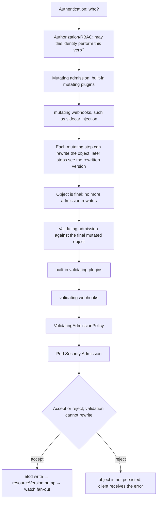

Authentication answers who; authorization answers whether that identity may perform an API verb; admission can mutate or validate the object after authorization and before persistence. Pod Security Admission enforces Pod Security Standards at namespace boundaries. ValidatingAdmissionPolicy provides in-process CEL policy and is a strong choice for deterministic validation without webhook availability risk. Webhooks remain useful for integrations and mutations but they extend the control-plane failure path.

**Policy evidence**

```bash
# Can this identity perform the action?
kubectl auth can-i create pods --as=system:serviceaccount:team-a:builder -n team-a

# Namespace Pod Security Admission example
kubectl label ns team-a pod-security.kubernetes.io/enforce=restricted

# Inspect admission webhooks and policies
kubectl get validatingwebhookconfigurations,mutatingwebhookconfigurations
kubectl get validatingadmissionpolicies,validatingadmissionpolicybindings
```

```text
$ kubectl auth can-i create pods --as=system:serviceaccount:team-a:builder -n team-a
yes

$ kubectl get validatingwebhookconfigurations,mutatingwebhookconfigurations
NAME                                            WEBHOOKS   AGE
validatingwebhookconfiguration.../vap-guard     1          40d
mutatingwebhookconfiguration.../sidecar-inject  1          40d
```

`kubectl auth can-i` runs the same RBAC decision the API server would make, without actually attempting the action — `--as=system:serviceaccount:team-a:builder` impersonates that ServiceAccount specifically, which is how you audit "what can this workload identity do" without needing its token. A `yes`/`no` answer here is authoritative for RBAC only — a `yes` doesn't mean the request will succeed, because admission (mutating/validating webhooks, PSA, ValidatingAdmissionPolicy) still runs afterward and can still reject it; this command answers "may this identity attempt the verb," not "will the object be accepted." `kubectl label ns ... pod-security.kubernetes.io/enforce=restricted` sets the namespace-level Pod Security Standard that PSA checks every Pod create/update against, with no separate policy object required. The two `kubectl get` commands enumerate every webhook and every ValidatingAdmissionPolicy/binding active on the cluster — worth running before debugging a mysterious rejection, since the actual reason is often an object here rather than RBAC.

## Senior addendum

### Deep Dive 6 — Admission, policy and multi-tenant guardrails
*(RBAC's who-can-do-what is covered in Chapter 6. This is admission specifically — the stage that runs AFTER authorization, which Chapter 6 doesn't detail.)*

➕ **Ordering within admission itself, worth being precise about since "admission" is often treated as one step:** all applicable **mutating** admission (webhooks + built-in mutating plugins) run first, in a defined order, and each can rewrite the object — then all applicable **validating** admission (webhooks + built-in validating plugins + ValidatingAdmissionPolicy) run against the *final, already-mutated* object and can only accept or reject, never rewrite further. This ordering is why a sidecar-injection mutating webhook (adding a container to a Pod spec) can run, and then Pod Security Admission (validating) evaluates the *Pod-plus-injected-sidecar* as a whole — a workload that looks compliant before mutation can fail PSA after an injected sidecar with looser settings.

➕ **Diagram: the full admission chain in order, and exactly where a mutation can flip a validation result:**

The sidecar-injection trap lives exactly at the mutating→validating boundary: a Pod spec that would pass PSA on its own can fail *after* a mutating webhook injects a sidecar container with looser settings — PSA is evaluating the Pod-plus-sidecar, not the Pod the developer wrote.

➕ **ValidatingAdmissionPolicy vs webhook, the tradeoff table worth having verbatim:**
| | Webhook | ValidatingAdmissionPolicy (CEL, in-process) |
|---|---|---|
| Runs | out-of-process, network call to a webhook server | in-process in the apiserver, no network hop |
| Availability risk | extends the control-plane failure path — if the webhook server is down/slow, `failurePolicy` decides whether requests fail-open or fail-closed | none — no external dependency to be unavailable |
| Expressiveness | arbitrary code, any logic | CEL expressions — powerful but bounded, no arbitrary external calls |
| Best fit | integrations needing external state/systems, complex mutation | deterministic, self-contained validation — exactly the source's stated recommendation |

➕ **Sample annotated output — proving a namespace's actual enforced Pod Security Standard, not just what's assumed:**
```bash
$ kubectl get ns team-a -o jsonpath='{.metadata.labels}' | jq
{
  "pod-security.kubernetes.io/enforce": "restricted",
  "pod-security.kubernetes.io/audit": "restricted",
  "pod-security.kubernetes.io/warn": "restricted"
}
```
`enforce` is the only one that actually blocks anything; `audit`/`warn` are visibility-only — a namespace with only `audit`/`warn` set and no `enforce` label is not actually protected, a distinction worth checking explicitly rather than assuming any PSA label means enforcement.
