Several microservice patterns in your Staff Engineer guide become platform requirements when operated at scale. Circuit breakers protect dependencies but can hide sustained failure if telemetry is weak. Bulkheads isolate queues, worker pools or tenants. Sidecars move cross-cutting behavior next to the workload at the cost of resource and lifecycle complexity. Externalized configuration enables safe promotion. Event-driven systems decouple producers but introduce ordering, lag and replay semantics.

<!-- source-table:1 -->

| Pattern | Platform implementation question | Failure to design for |
| --- | --- | --- |
| Gateway | Where are auth, rate limit, retries and routing owned? | duplicate policy, retry storms |
| Circuit breaker | Who emits breaker state and dependency health? | silent partial outage |
| Bulkhead | What is the isolation unit: tenant, queue, node pool, GPU pool? | one workload exhausts shared capacity |
| Sidecar | Does helper lifecycle match the app and resource budget? | proxy/log agent breaks readiness or capacity |
| Event-driven | What are ordering, idempotency and replay contracts? | duplicate effects, unbounded consumer lag |

## Build from the normal path

### Deep Dive 7 — Platform patterns from the Staff Engineer guide
The pattern-to-platform-question table in the core explanation (Gateway, circuit breaker, bulkhead, sidecar, event-driven) is already the valuable content here and doesn't need re-deriving — it's a direct, reusable interview answer format as-is. Cross-reference: Chapter 8 (Operators/GitOps/platform engineering) is the mechanism these patterns get implemented through — a "paved road" is, concretely, an operator or GitOps-managed default that encodes one row of that table (e.g. a service-mesh operator owning the sidecar lifecycle question) so individual app teams don't re-answer it per workload.

**Diagram: the bulkhead isolation-unit spectrum, cost vs blast radius, for GPU pools specifically:**

```mermaid
flowchart TD
  %% Converted from the original ASCII diagram; source wording is preserved.
  n0["SHARED (cheapest, widest blast radius)"]
  n1["one GPU pool, all tenants, time-sliced or MIG-shared per device"]
  n2["a noisy/misbehaving tenant can starve others sharing the"]
  n3["same physical GPU — isolation is only as strong as MIG/"]
  n4["time-slicing enforcement, not a hard boundary"]
  n5["SHARED POOL, MIG-PARTITIONED"]
  n6["one GPU pool, tenants get dedicated MIG slices (hard memory/SM"]
  n7["partition) — blast radius shrinks to 'this MIG slice' not 'this GPU'"]
  n8["DEDICATED NODE POOL PER TENANT/TIER"]
  n9["separate node pools (e.g. a dedicated pool per model-serving tier)"]
  n10["blast radius = one tenant's own pool; cost = idle capacity"]
  n11["per pool if utilization isn't shared"]
  n12["DEDICATED GPU POOL PER MODEL/TENANT (most expensive, narrowest blast radius)"]
  n13["full physical isolation — a bad deploy or driver issue in one pool"]
  n14["cannot affect any other tenant's capacity at all"]
```

This is the concrete tradeoff a Solutions Architect states out loud in a customer conversation: moving down this list buys isolation and predictability at the direct cost of idle-capacity spend, and the right answer depends on whether the customer's actual risk is "noisy neighbor" or "budget."

**One addition worth naming: the bulkhead question ("what is the isolation unit: tenant, queue, node pool, GPU pool?") is the single most load-bearing row of that table for this specific job** — in GPU/AI infra, the isolation unit decision (dedicated node pools per tenant vs. shared pools with MIG/time-slicing, dedicated GPU pools per model-serving tier vs. shared) is a capacity-cost-vs-blast-radius tradeoff a Solutions Architect will be asked to make recommendations on directly, more often than any of the other four patterns in that table.
