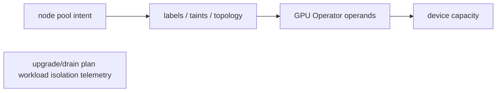

GPU Kubernetes clusters require a node lifecycle that coordinates host drivers, container runtime integration, device discovery, metrics, MIG configuration and workload disruption. The NVIDIA GPU Operator automates much of that dependency graph, but an operator is not magic: inspect its ClusterPolicy, operands, DaemonSets, node labels and reconciliation status when devices disappear.

Treat GPU pools as scarce stateful capacity even when applications are stateless. Rollouts, node upgrades, MIG reconfiguration and driver changes can drain many expensive jobs. Plan disruption budgets at workload and capacity level, stage upgrades on representative hardware, and validate a known-good CUDA workload plus telemetry before returning a node to service.

## Targeted references and reinforcement

**NVIDIA Solutions Architect, DevOps job listing — Germany:** [https://de.linkedin.com/jobs/view/solutions-architect-devops-at-nvidia-4424636420](https://de.linkedin.com/jobs/view/solutions-architect-devops-at-nvidia-4424636420) — Role signal: Kubernetes AI/ML workloads, Linux/storage, Python/Bash, IaC, observability and customer architecture.

**Kubernetes DRA:** [https://kubernetes.io/blog/2025/09/01/kubernetes-v1-34-dra-updates/](https://kubernetes.io/blog/2025/09/01/kubernetes-v1-34-dra-updates/) — Core Dynamic Resource Allocation APIs graduated to GA in Kubernetes 1.34.

**Udemy — Kubernetes Troubleshooting: Real-World Production Fixes:** [https://www.udemy.com/course/kubernetes-troubleshooting](https://www.udemy.com/course/kubernetes-troubleshooting) — Target lectures: CrashLoopBackOff (~12m31s), Pending Pods (~8m05s), DNS failures (~7m19s), NetworkPolicy (~6m47s), eviction (~7m41s), HPA troubleshooting (~18m18s), RBAC (~11m32s).

**Vishakha Sadhwani — Kubernetes networking:** [https://www.linkedin.com/in/vsadhwani](https://www.linkedin.com/in/vsadhwani) — Practitioner signal: understand traffic flow, CNI, Services, CoreDNS and Linux dataplane instead of treating networking as abstraction magic.

## Build from the normal path

### Deep Dive 8 — GPU platform operations
The GPU node-upgrade validation sequence is: kubelet Ready → driver DaemonSet Ready → device plugin registered → allocatable resource confirmed → smoke test completed. The commands below prove each boundary instead of treating operator readiness as end-to-end validation.

**"An operator is not magic" — the specific commands the core explanation's warning implies but doesn't list:**
```bash
kubectl get clusterpolicy -o yaml | yq '.status'          # the operator's own reconciliation report
kubectl -n gpu-operator get pods -o wide | grep -v Running  # which operand DaemonSet, which node
kubectl -n gpu-operator logs -l app=nvidia-driver-daemonset --tail=50
kubectl get node <node> -o json | jq '.metadata.labels' | grep -i nvidia   # GPU Operator's own node labels — feature-detection state
```
Cross-reference: this is the identical sequence used in Chapter 8's GPU Operator worked scenario (`Volume_03_Chapter_08_Operators_GitOps_Enhanced.md`) — one mechanism, applied identically whether the trigger is a routine upgrade (Ch9) or an unexplained device disappearance (Ch8/this DD).

**Why this reference set is worth actually working through, not just skimming:** the Udemy lecture list above doubles as a self-check — for each named failure mode (CrashLoopBackOff, Pending Pods, DNS, NetworkPolicy, eviction, HPA, RBAC), confirm you can reproduce this volume's own diagnostic sequence for it from memory before treating the topic as done.

### Self-check: original subtopics accounted for
All eight Deep Dive titles, their core mechanisms (finalizers/ownerReferences, quorum/failure boundaries, Filter-Score/preemption/DRA, kubelet-CRI/node-pressure, Service/CNI/DNS/Gateway API, admission chain/PSA/VAP, the five-pattern table, GPU operator/node-pool operations), every original command block, and every original table row appear verbatim above or in the corresponding chapter file cross-referenced by name.

**Visual model — GPU nodes are a separate operational product inside the cluster:**

**Key takeaway:** *"Pool, prepare, prove, place."* A schedulable GPU resource is the end result of a lifecycle, not a property that appears when hardware is racked.
