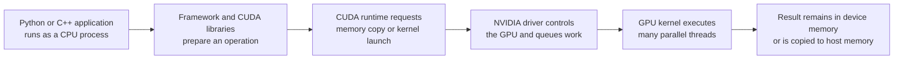
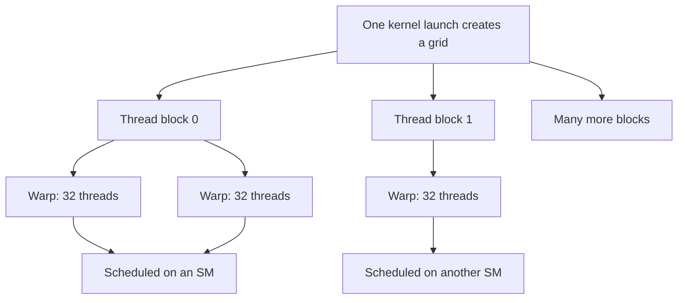
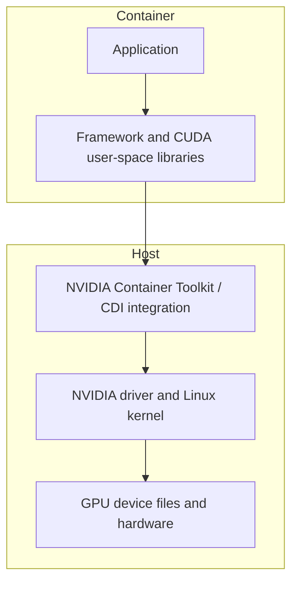
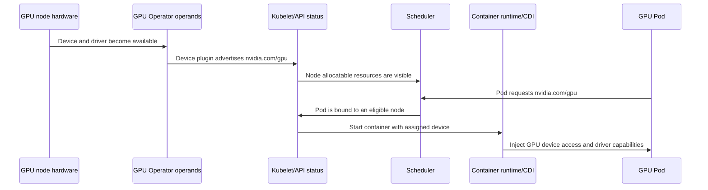

# Foundation — GPU computing and the NVIDIA stack from first principles

## Your learning contract

This chapter assumes you have operated systems but have never studied GPU computing. It will not ask you to memorize product names before you know which problem they solve.

By the end, you should be able to:

1. explain why a CPU and GPU cooperate rather than replace one another;
2. trace a framework operation from a Python process to GPU execution;
3. distinguish host memory, device memory, capacity and bandwidth;
4. place the NVIDIA driver, CUDA Toolkit, libraries and container tooling correctly;
5. explain how Kubernetes discovers and assigns a GPU;
6. use `nvidia-smi` and DCGM evidence without overclaiming what it proves;
7. identify which later chapter answers your next question.

## 1. Begin with a workload, not a GPU model

Suppose a Python program multiplies two very large matrices. A CPU can do this, but a large portion of the work consists of applying the same arithmetic pattern to many independent elements. A GPU contains many parallel execution resources designed to keep a large number of such operations in flight.

That does not mean "GPU equals a faster CPU." The CPU remains responsible for the operating system, process control, much application logic, I/O and launching accelerator work. NVIDIA's CUDA programming model calls the CPU side the **host** and the GPU side the **device**.



The important operational consequence is that performance can be limited before, inside or after the GPU: CPU preprocessing, host-to-device transfer, GPU computation, device-memory traffic, synchronization, peer-GPU communication, storage or network.

## 2. What a GPU kernel actually is

The word **kernel** is overloaded:

- The **Linux kernel** is the privileged core of the operating system.
- A **GPU kernel** is a function launched for execution on the GPU.

CUDA launches many GPU threads executing a kernel. Threads are grouped into **thread blocks**, and blocks form a **grid**. On current CUDA hardware, threads within a block are organized into groups of 32 called **warps**. A block runs on one **Streaming Multiprocessor (SM)**, allowing its threads to cooperate through synchronization and fast shared memory.



You do not need to program kernels for this role, but this model explains several facts:

- "GPU utilization" is not the percentage of advertised FLOPs achieved. It is an activity-oriented signal.
- Branch-heavy or poorly sized work may leave execution lanes underused.
- A large GPU needs enough parallel work to occupy its execution resources.
- Threads in different blocks do not have the same cheap synchronization model as threads within one block.
- Frameworks and optimized libraries hide most kernel details, but their workload shape still matters.

## 3. Memory: capacity is not bandwidth

The CPU normally uses **host memory** (system RAM). A discrete GPU has **device memory**, commonly HBM on data-center accelerators. Data needed by a GPU kernel must be accessible to the device, and movement across PCIe or another supported interconnect has cost.

Inside the GPU, memory is hierarchical:

| Memory area | Scope | Relative role |
|---|---|---|
| Registers | individual thread | smallest and fastest working values |
| Shared memory/L1 | thread block/SM | fast cooperation and data reuse |
| L2 cache | GPU-wide | shared cache before device memory |
| HBM/device memory | GPU-wide | large model, tensor and cache storage |
| Host memory | CPU system | larger system memory reached through an interconnect |

Three different questions are often confused:

1. **Capacity:** Does the model, activation data, temporary workspace and cache fit?
2. **Bandwidth:** How quickly can data be supplied to execution units?
3. **Allocation:** How much memory has software reserved or currently reports as used?

`nvidia-smi` memory-used output primarily helps with allocation/capacity. It does not by itself measure HBM bandwidth or prove a memory-bound kernel.

### A concrete capacity calculation

A model with 7 billion parameters stored at 16 bits per parameter needs approximately:

```text
7,000,000,000 parameters × 2 bytes ≈ 14 GB for weights
```

That is not the complete runtime requirement. Add framework/runtime overhead, temporary workspaces, activations for training, optimizer state during training, and KV cache during language-model inference. The calculation is a lower-bound orientation, not a sizing result.

## 4. The NVIDIA software stack, layer by layer

Many beginners hear "CUDA" used for the entire stack. Separate the layers:

| Layer | What it provides | Typical question |
|---|---|---|
| Application | Your training, inference or scientific program | Is the workload correct and configured properly? |
| Framework/engine | PyTorch, TensorFlow, TensorRT, serving engine | Which operations, precision, batching and parallelism are used? |
| CUDA-X libraries | Optimized building blocks such as cuBLAS, cuDNN and NCCL | Is the expected optimized library and communication path active? |
| CUDA runtime | User-space API used to allocate, copy and launch work | Can the process initialize and execute CUDA work? |
| CUDA Toolkit | Development tools, compiler, headers, runtime and utilities | Is this a build environment or only a runtime environment? |
| NVIDIA driver | Kernel and user components controlling the GPU | Does the OS recognize and communicate with the device? |
| Firmware/hardware | Low-level device behavior and physical accelerator | Is the device healthy and compatible with the platform? |

**cuBLAS** supplies optimized basic linear-algebra operations. **cuDNN** supplies tuned deep-neural-network primitives. **NCCL** provides topology-aware collective communication across GPUs. NCCL is not a scheduler or a full parallel programming framework.

### Driver versus Toolkit versus runtime

The driver is installed for the host and must support the GPU and the CUDA user-space requirements. The Toolkit is needed to compile CUDA applications and includes development tools; a production container may need only runtime libraries and the application.

When `nvidia-smi` displays a "CUDA Version," do not automatically interpret it as the exact Toolkit installed in the container. It represents driver capability information. Check the actual user-space environment separately.

## 5. Why containers still depend on the host

A container image packages user-space files: application, Python packages, framework and often CUDA libraries. It does not bring its own host Linux kernel or magically contain a working physical GPU.



NVIDIA Container Toolkit integrates GPU devices and required host-side driver capabilities with supported container runtimes. Current GPU Operator releases use the Container Device Interface (CDI) as the default device-injection mechanism, so version-specific procedures matter.

The useful troubleshooting boundary is:

- GPU absent from `lspci`: hardware/firmware/PCIe discovery boundary.
- GPU in `lspci` but `nvidia-smi` fails: driver/device initialization boundary.
- Host `nvidia-smi` works but container cannot see the GPU: allocation/runtime/CDI/container-toolkit boundary.
- Container sees the GPU but framework reports unavailable: framework/user-space compatibility or environment boundary.
- Framework works on one GPU but distributed job fails: topology, launcher, NCCL or network boundary.

## 6. How Kubernetes gets from a physical GPU to a Pod

Kubernetes schedules named resources; it does not understand GPU hardware by itself. NVIDIA GPU Operator automates the lifecycle of several components needed on GPU nodes, including drivers where configured, NVIDIA Container Toolkit, device discovery/advertisement, feature labels, MIG management and DCGM monitoring.



This separates common failures:

- no `nvidia.com/gpu` allocatable resource: discovery/device-plugin/operator/driver issue;
- Pod Pending with resource visible: capacity, taints, affinity, policy or topology;
- Pod Running but no GPU inside: runtime/CDI/toolkit injection issue;
- GPU visible but application fails: application/framework/library compatibility;
- application runs but is slow: workload, topology, clocks, data, communication or scheduling efficiency.

## 7. First lab: build an evidence ladder

Run only on an authorized GPU host. These commands are read-only orientation commands.

### Step 1 — does PCIe enumerate an NVIDIA device?

```bash
lspci -nn | grep -i nvidia
```

Representative output:

```text
17:00.0 3D controller [0302]: NVIDIA Corporation Device [10de:2330]
```

This proves PCIe enumeration. It does not prove the driver loaded or the GPU can execute work.

### Step 2 — can the NVIDIA management stack talk to it?

```bash
nvidia-smi --query-gpu=index,name,uuid,driver_version,memory.total --format=csv
```

Representative output:

```text
index, name, uuid, driver_version, memory.total [MiB]
0, NVIDIA H100 80GB HBM3, GPU-..., 580.XX, 81559 MiB
```

Interpretation:

- device identity and memory capacity are visible;
- driver/user management communication works;
- this still does not prove a framework, container, multi-GPU link or workload result.

### Step 3 — what is the local topology?

```bash
nvidia-smi topo -m
```

Read the legend printed by your installed version. Compare GPU-to-GPU and GPU-to-NIC paths. Do not assume labels or topology are identical across systems.

### Step 4 — can a framework allocate and execute a tiny operation?

```python
import torch

print("torch:", torch.__version__)
print("cuda available:", torch.cuda.is_available())
print("device count:", torch.cuda.device_count())

if torch.cuda.is_available():
    x = torch.tensor([1.0, 2.0, 3.0], device="cuda")
    y = x * 2
    print("device:", y.device)
    print("result:", y.cpu().tolist())
```

Representative result:

```text
cuda available: True
device count: 1
device: cuda:0
result: [2.0, 4.0, 6.0]
```

This proves a small framework operation. It is not a benchmark or hardware diagnostic.

## 8. Monitoring, health and diagnostics are different

NVIDIA Data Center GPU Manager (DCGM) provides inventory, telemetry, health, policy, diagnostics, profiling and workload accounting capabilities for supported NVIDIA data-center hardware.

- **Telemetry/field watches** collect measurements and events.
- **Passive health monitoring** evaluates retained telemetry for configured health conditions while ordinary work may continue.
- **Active diagnostics** execute tests and may consume GPU, memory, PCIe/NVLink, CPU, power and cooling resources. Coordinate with the scheduler and isolate resources first.

A passive result of Healthy means enabled rules found no incident in retained samples. It is not equivalent to passing every active test. An active diagnostic failure also needs interpretation: setup problems, skipped tests and per-entity errors differ from a confirmed hardware defect.

## 9. A worked incident without shortcut conclusions

**Symptom:** A Pod is Running but reports `torch.cuda.is_available() == False`.

1. Confirm the Pod actually requests a GPU; Running alone does not imply allocation.
2. Inspect Pod resource requests/limits and assigned node.
3. Check the node's advertised `nvidia.com/gpu` capacity and allocatable values.
4. Check GPU Operator/device-plugin/toolkit operand status on that node.
5. Verify host `nvidia-smi`; preserve driver and kernel logs if it fails.
6. Inspect device/CDI/runtime configuration inside the container boundary.
7. Compare the image's framework/CUDA user-space requirements with the supported host stack.
8. Run the smallest framework allocation test before the real application.

The order moves from allocation to host to injection to user space. Reinstalling drivers first would cross several unproven boundaries and increase blast radius.

## 10. Common misconceptions

| Misconception | Better model |
|---|---|
| A GPU is simply a faster CPU | It is a parallel accelerator cooperating with a CPU host |
| CUDA means the driver | CUDA includes a programming platform/runtime/toolkit ecosystem; the driver is a separate host layer |
| The container includes everything | It shares the host kernel and depends on host driver/device integration |
| 100% utilization means peak useful compute | It is an activity clue; correlate workload results and profiler evidence |
| Memory used means memory bandwidth used | Allocation/capacity and bandwidth are different measurements |
| Pod Running proves GPU health | It proves only limited orchestration/container state |
| DCGM Healthy proves hardware is perfect | It means configured health rules found no incident in retained evidence |

## 11. Where to go next

- Execution and memory: Chapter 1.
- PCIe, NVLink, NVSwitch and NUMA: Chapter 2.
- Driver, CUDA and containers: Chapter 3.
- Kubernetes device integration and GPU Operator: Chapter 4.
- MIG and sharing: Chapter 5.
- DCGM, Xid, ECC and health: Chapter 6.
- Capacity and failure domains: Chapter 7.

## Official references

- [CUDA Programming Guide — programming model](https://docs.nvidia.com/cuda/cuda-programming-guide/01-introduction/programming-model.html)
- [CUDA Programming Guide](https://docs.nvidia.com/cuda/cuda-programming-guide/)
- [NVIDIA framework containers and deep-learning software stack](https://docs.nvidia.com/deeplearning/frameworks/user-guide/)
- [NVIDIA NCCL documentation](https://docs.nvidia.com/deeplearning/nccl/)
- [NVIDIA GPU Operator documentation](https://docs.nvidia.com/datacenter/cloud-native/gpu-operator/latest/)
- [GPU Operator CDI integration](https://docs.nvidia.com/datacenter/cloud-native/gpu-operator/latest/cdi.html)
- [NVIDIA DCGM learning documentation](https://docs.nvidia.com/datacenter/dcgm/latest/learn/)
- [DCGM health monitoring](https://docs.nvidia.com/datacenter/dcgm/latest/learn/modules/health-monitoring.html)
- [DCGM diagnostics](https://docs.nvidia.com/datacenter/dcgm/latest/learn/modules/dcgm-diagnostics.html)

## Final readiness check

Without looking back, draw application → framework/library → CUDA runtime → driver → GPU. Then explain one failure and one observation at each boundary. If you can do that, the rest of Volume 4 now has a stable place to attach.

