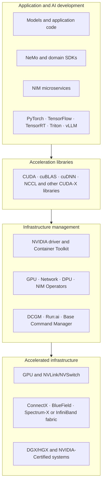
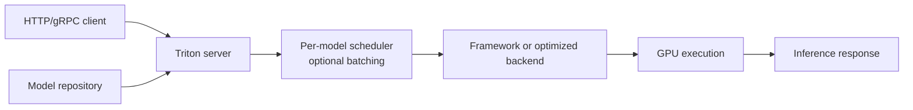

# Foundation — NVIDIA ecosystem map for a beginner

The NVIDIA documentation is vast because it covers different users and layers: chip programmers, model developers, inference engineers, Kubernetes administrators, HPC operators, data-center architects and enterprise support teams. Product names become manageable when you route them by the problem they solve.

## 1. The two large halves

NVIDIA AI Enterprise documents a composable stack with an **application-development layer** and an **infrastructure-management layer**. Their releases can have different lifecycles. This matters operationally: application teams may adopt new model/engine features faster than a platform team upgrades validated drivers and operators.

The diagram is a learning map, not a rule that every deployment includes every product.

## 2. Hardware and system terms

| Name | Category | Problem it addresses |
|---|---|---|
| GPU accelerator | compute hardware | parallel compute and high-bandwidth device memory |
| DGX | integrated NVIDIA system | validated GPU server/system platform with an integrated stack |
| HGX | server platform/baseboard architecture | lets system manufacturers build multi-GPU servers around NVIDIA GPU interconnect platforms |
| NVLink | high-speed interconnect | direct high-bandwidth GPU communication on supported systems |
| NVSwitch | switching fabric | connects multiple NVLink-capable GPUs with broader high-bandwidth reach |
| ConnectX | network adapter/HCA family | high-performance Ethernet or InfiniBand connectivity depending on product/configuration |
| BlueField DPU | infrastructure processing unit | offloads and isolates networking, storage and security functions |
| Spectrum-X | accelerated Ethernet platform | Ethernet fabric components and software aimed at AI workloads |
| Quantum | InfiniBand switch platform | high-performance InfiniBand fabric |

Do not infer topology from a GPU count. Two eight-GPU servers can have different CPU sockets, PCIe trees, NVLink/NVSwitch layouts and NIC locality.

## 3. CUDA and CUDA-X

**CUDA** is NVIDIA's parallel-computing platform and programming model. The CUDA Toolkit includes a compiler and development tools as well as runtime components. Most infrastructure engineers interact with applications that use CUDA through frameworks rather than writing kernels directly.

**CUDA-X** is the broader family of accelerated libraries, tools and technologies built on CUDA. Important examples include:

| Component | Role |
|---|---|
| cuBLAS | GPU-accelerated basic linear algebra |
| cuDNN | optimized deep-neural-network primitives |
| NCCL | topology-aware multi-GPU collectives |
| TensorRT | optimizer/runtime for high-performance inference |
| TensorRT-LLM | inference stack focused on large language models |
| RAPIDS | GPU-accelerated data-science ecosystem |
| CUDA-GDB / Nsight tools | debugging and performance analysis |

The infrastructure question is rarely "is CUDA installed?" Ask which application, framework, user-space library versions, driver branch, GPU architecture and container image must work together.

## 4. NGC: distribution, not an execution layer

NVIDIA NGC is a catalog/registry used to distribute containers, models, SDKs and related artifacts. Pulling an NGC container gives you packaged user space. It does not allocate a GPU, install a compatible host driver, configure Kubernetes, supply production secrets, or validate your workload.

Treat artifact identity as part of reproducibility:

- use an explicit supported tag or digest;
- record model and container versions together;
- scan and govern images according to your organization;
- validate against the target driver/platform support matrix;
- promote the same tested artifact rather than rebuilding for production.

## 5. Training and model-development software

**PyTorch** and **TensorFlow** are frameworks commonly used to define and train models. NVIDIA publishes optimized framework containers incorporating tested accelerator libraries.

**NeMo** is an NVIDIA framework/ecosystem for building, customizing and deploying generative-AI models and applications. It belongs closer to AI development than to low-level cluster provisioning.

Frameworks call optimized libraries; libraries call CUDA/driver interfaces; the cluster platform supplies devices, network, storage and scheduling. These ownership boundaries help incident routing.

## 6. Inference products: TensorRT, Triton and NIM are not synonyms

### TensorRT

TensorRT optimizes and executes trained neural networks for inference on NVIDIA GPUs. Think **model optimization and runtime execution**.

### Triton Inference Server

Triton is an inference server supporting multiple model backends. Its documented architecture includes a model repository, per-model scheduling, optional batching, backend execution, health endpoints and metrics. Think **multi-model serving server and scheduling surface**.

### NVIDIA NIM

NIM packages production-oriented inference microservices with standardized APIs and management behavior. Current NIM LLM documentation describes an orchestration layer, profile/model management and an inference engine. Hardware-aware profiles can encode backend, precision and parallelism choices.

Think **packaged, supported inference microservice**, not "a new GPU scheduler." A NIM still requires compatible infrastructure, model access, storage/cache, network, security, capacity and monitoring.

### NIM Operator

NIM Operator manages deployment and lifecycle of NIM-based applications on Kubernetes. It belongs to the Kubernetes control plane and does not replace the inference engine inside the NIM container.

## 7. Kubernetes infrastructure operators

| Operator/component | Scope |
|---|---|
| GPU Operator | GPU driver/toolkit/device discovery, feature labeling, MIG management and monitoring operands |
| Network Operator | lifecycle of NVIDIA networking software/components for accelerated networking |
| DPU Operator / DPF | lifecycle and services for supported BlueField/DPU environments |
| NIM Operator | Kubernetes lifecycle for NIM deployments |

An Operator is a Kubernetes controller pattern: it watches desired state in custom resources and reconciles supporting objects. It is not simply an installer script. Troubleshoot the declared custom resource, controller decisions, generated operands and node/application outcome separately.

## 8. DCGM and `nvidia-smi`

`nvidia-smi` is a host CLI built on NVIDIA management capabilities and is excellent for first orientation. **DCGM** is a data-center management framework for fleet telemetry, groups, health, policy, diagnostics, accounting and related functions.

Use the right claim:

- `nvidia-smi` lists the GPU: management stack sees a device.
- DCGM field has a value: a particular measurement was collected.
- passive health is clean: enabled health rules found no incident in retained evidence.
- active diagnostic passes: selected test executed successfully in that environment.
- representative workload passes: the application path worked under those test conditions.

These statements get progressively closer to user success but never become universal proof.

## 9. Cluster and workload management

### Base Command Manager (BCM)

BCM addresses cluster provisioning, workload-management integration and infrastructure monitoring for AI/HPC clusters. It manages head/regular-node lifecycle, images and node categories. It does not replace the workload's MPI/NCCL communication or every external IaC tool.

### Run:ai

Run:ai is an AI workload-management/orchestration platform in NVIDIA's infrastructure layer. Study its current documentation and support matrix before comparing it with native Kubernetes scheduling or Slurm; avoid reducing the decision to a product-name table.

### Slurm

Slurm is an open-source workload manager commonly used in HPC and AI batch environments. NVIDIA products integrate with it, but Slurm is not itself an NVIDIA product.

## 10. A complete request mapped to products

Consider an online LLM request on Kubernetes:

1. A client reaches an application gateway.
2. A NIM or custom Triton/vLLM/TensorRT-LLM service receives the request.
3. The engine tokenizes/queues/batches work and invokes model execution.
4. Framework/runtime components use CUDA and optimized libraries.
5. Kubernetes previously scheduled the Pod using GPU resources advertised by the device integration.
6. Container Toolkit/CDI exposed the assigned device through the host driver.
7. The GPU executes kernels and stores weights/KV cache in device memory.
8. DCGM/engine/application metrics describe different parts of the outcome.
9. GPU Operator maintains supporting node components; the cluster platform manages replicas, network, storage and policy.

When the request is slow, product names are not hypotheses. Queue delay, model execution, cache behavior, device saturation, CPU preprocessing, network and dependencies are hypotheses. Use product-specific evidence only after locating the boundary.

## 11. Choose documentation by your current question

| Your question | Start with |
|---|---|
| How does GPU code execute? | CUDA Programming Guide |
| Which driver/toolkit combination is supported? | CUDA compatibility and product support matrices |
| How do GPUs communicate? | NCCL documentation and topology material |
| How do containers access GPUs? | NVIDIA Container Toolkit and CDI docs |
| How does Kubernetes manage GPU nodes? | GPU Operator documentation |
| What do GPU health results mean? | Current DCGM Learn and reference docs |
| How does Triton route and batch inference? | Triton architecture/scheduler/metrics docs |
| How is a NIM LLM container organized? | Current NIM LLM overview, profiles and API docs |
| How does NVIDIA package the enterprise stack? | NVIDIA AI Enterprise overview/support matrices |
| How are bare-metal cluster images/nodes managed? | BCM version-matched administrator manual |

## Official references

- [NVIDIA AI Enterprise overview](https://docs.nvidia.com/ai-enterprise/software/latest/overview.html)
- [NVIDIA AI Enterprise software reference architecture](https://docs.nvidia.com/ai-enterprise/reference-architecture/latest/software-stack.html)
- [CUDA Programming Guide](https://docs.nvidia.com/cuda/cuda-programming-guide/)
- [NVIDIA deep-learning framework container guide](https://docs.nvidia.com/deeplearning/frameworks/user-guide/)
- [NCCL documentation](https://docs.nvidia.com/deeplearning/nccl/)
- [Triton architecture](https://docs.nvidia.com/deeplearning/triton-inference-server/user-guide/docs/user_guide/architecture.html)
- [Triton metrics](https://docs.nvidia.com/deeplearning/triton-inference-server/user-guide/docs/user_guide/metrics.html)
- [NIM for LLMs overview](https://docs.nvidia.com/nim/large-language-models/latest/about-nim-llm/overview.html)
- [NIM model profiles and selection](https://docs.nvidia.com/nim/large-language-models/latest/deployment/model-profiles-and-selection.html)
- [GPU Operator](https://docs.nvidia.com/datacenter/cloud-native/gpu-operator/latest/)
- [DCGM](https://docs.nvidia.com/datacenter/dcgm/latest/learn/)
- [Base Command Manager](https://docs.nvidia.com/base-command-manager/)

