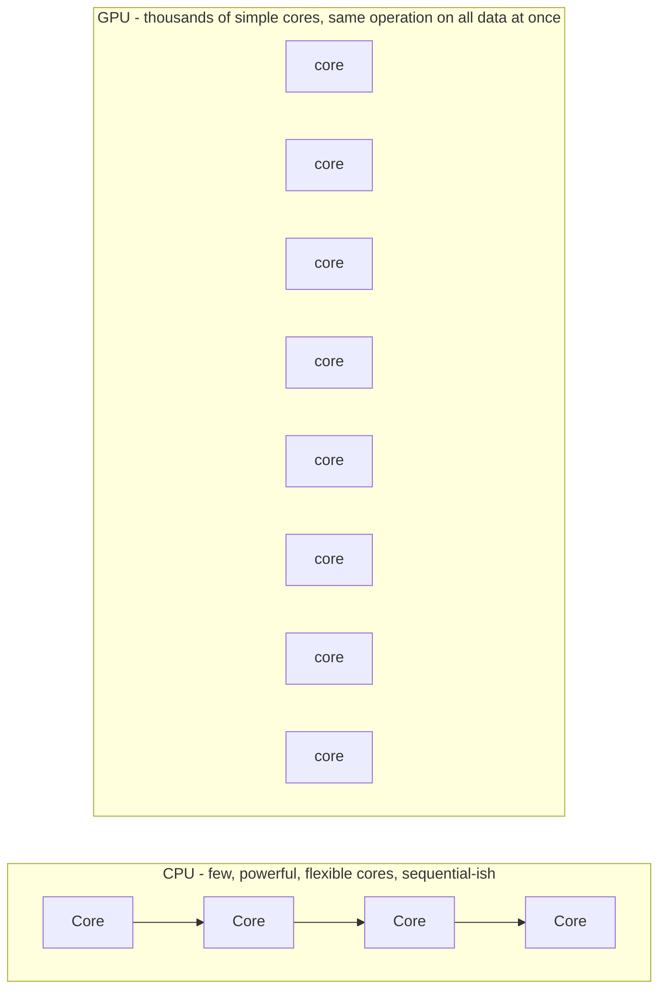
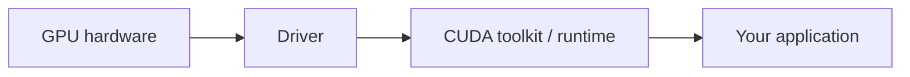
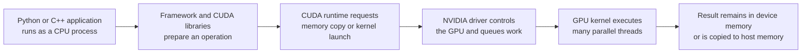
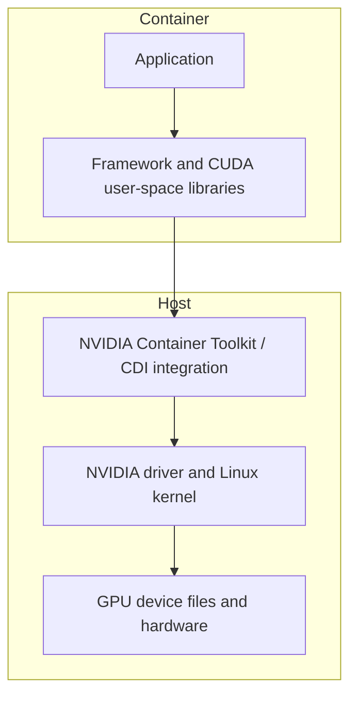
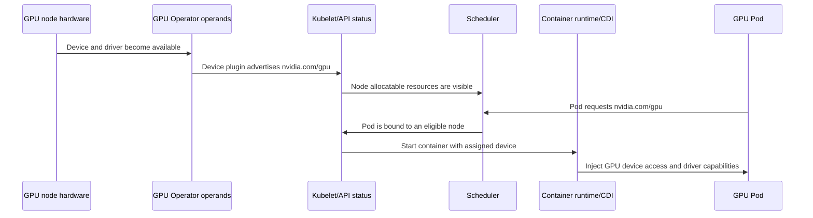
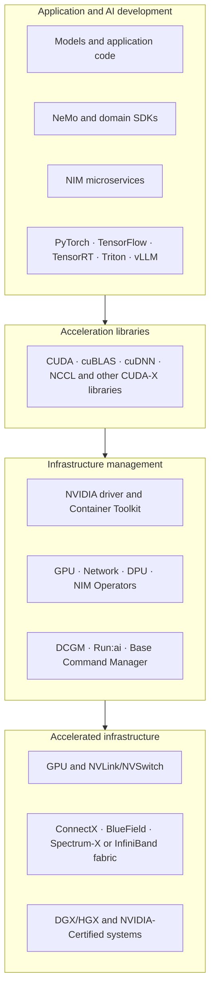
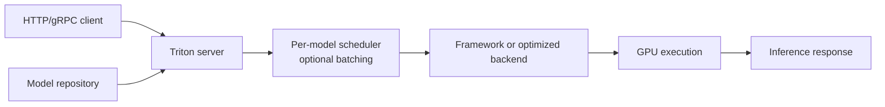
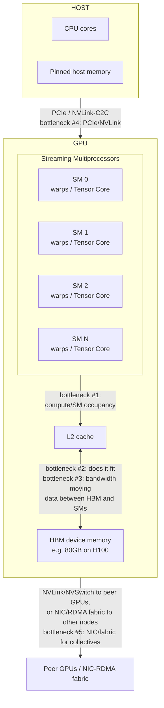
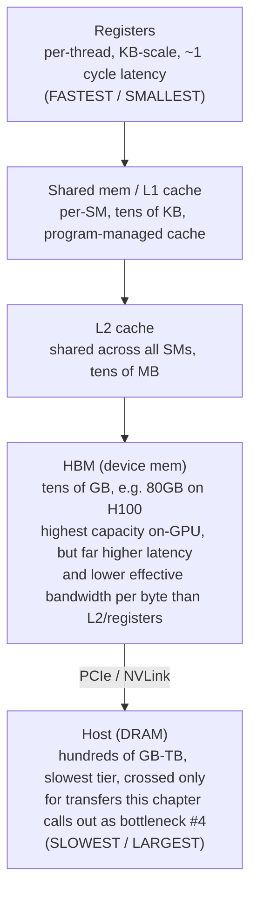

## Foundations: start here if GPU/CUDA concepts are new to you

### What this chapter is, and what it isn't

This section will not make you a CUDA programmer or a GPU performance-tuning expert — the rest of this chapter covers that ground, and does so assuming you already know what a GPU fundamentally is and why it exists. What this section gives you is that "why" and "what," at a conceptual level, plus the driver/toolkit layering that trips up a lot of otherwise-experienced engineers. If you finish this section able to explain, in your own words, why a CPU isn't the right tool for certain jobs and what a GPU is doing instead, you're ready for the rest of this chapter.

You already know how CPUs work at a systems level. What's new here is a different kind of hardware, built for a different shape of problem.

### Why a CPU alone isn't enough for some workloads

A CPU (central processing unit — the general-purpose "brain" of a computer) is designed to do a small number of things very fast, one after another, with some ability to juggle multiple tasks. It's extremely good at that: branching logic, running an operating system, executing arbitrary sequential instructions, making quick decisions where each step depends on the last. Most software you've written runs this way.

But consider a different kind of task: you have ten million numbers, and you need to multiply every single one of them by the same value. Each of those ten million multiplications is completely independent of the others — number 1 doesn't need to wait for number 2's result. A CPU, with a handful of cores, does this reasonably well but is fundamentally limited: it only has so many independent execution units, so it works through the ten million numbers in large sequential batches.

This is a fundamentally different shape of problem than "run a web server" or "parse a config file." It's not "do one complex thing fast" — it's "do the same simple thing, independently, an enormous number of times." That shape of problem needs a fundamentally different hardware design, not just a faster CPU.

### What a GPU actually is: the spreadsheet analogy

A **GPU** (graphics processing unit — a chip built with thousands of simpler processing cores, designed for doing the same operation across huge amounts of data at once) exists to serve exactly that second shape of problem. Where a CPU has a handful of powerful, flexible cores, a GPU has thousands of much simpler cores that are less flexible individually but can all execute the same instruction on different pieces of data simultaneously.

The clearest analogy, if you've ever used a spreadsheet: imagine applying one formula to every cell in a column of ten million rows. You could do it one cell at a time, sequentially — that's the CPU approach. Or you could imagine applying that same formula to all ten million cells at the same instant, in parallel — that's conceptually what a GPU is built to do. It was originally built for exactly this kind of math applied to millions of pixels at once (hence "graphics"), and it turns out an enormous amount of other work — physics simulation, and later, machine learning math — has the exact same shape: the same operation, repeated across huge amounts of independent data.



**Check your understanding**
- Q: Why doesn't "just add more CPU cores" solve the ten-million-multiplications problem as well as a GPU does? A: A CPU's cores are individually powerful but few in number and built for flexible sequential work; a GPU trades individual core power for having thousands of simpler cores that all execute the same operation on different data at once — a better match for this specific problem shape.
- Q: In the spreadsheet analogy, what does "applying a formula to every cell at once" represent? A: The GPU's approach of doing the same operation across massive amounts of data in parallel, versus a CPU going cell by cell.

### What CUDA actually is (and the three things beginners conflate)

Here's where a lot of otherwise-experienced engineers get confused, because three distinct things get casually called "CUDA" in conversation. Let's separate them.

**The GPU (hardware)** is the physical chip described above — thousands of cores, sitting on a card, capable of doing massively parallel math. On its own, hardware doesn't know how to be told what to compute.

**CUDA** (NVIDIA's programming platform and language extensions that let a programmer describe parallel work and hand it to the GPU) is a way of writing code that says, in effect, "run this exact operation, in parallel, across this data." It is not the GPU itself, and it is not the driver — it's the programming layer a developer actually writes against, roughly analogous to a programming language plus a library of functions.

**The driver** (the low-level software that lets the operating system and any application talk to the GPU hardware at all) is a different thing entirely — it's the same category of thing as any device driver: the piece that lets software address the physical hardware, present regardless of whether CUDA is involved. Without the driver, the OS can't even see the GPU as a usable device.

**The CUDA toolkit** (the set of developer tools — compiler, libraries, debugger — built on top of CUDA and the driver, that a developer installs to actually build CUDA programs) is the third layer: the practical toolbox a developer installs locally to compile and run CUDA code.

Put together as a simple stack, bottom to top:



Each layer depends on the one below it being present and compatible. This is worth sitting with because the rest of this chapter spends real time on exactly this stack — specifically on why a driver version, a CUDA toolkit version, and an application's expectations all have to line up, and what goes wrong (and how you'd diagnose it) when they don't. If you go into the rest of this chapter already knowing these are four separate, stacked things rather than three names for the same thing, its version-compatibility material will make sense on the first read.

**Check your understanding**
- Q: Is CUDA the same thing as the GPU? A: No — the GPU is the physical hardware; CUDA is the programming platform used to describe parallel work to run on that hardware.
- Q: What's the difference between the driver and the CUDA toolkit? A: The driver is what lets the OS and any software talk to the GPU hardware at all (needed regardless of CUDA); the CUDA toolkit is the developer tooling (compiler, libraries) built on top, used specifically to write and build CUDA programs.
- Q: Why does the order in the four-box diagram matter? A: Because each layer depends on the one beneath it being present and version-compatible — an application needs a compatible toolkit, which needs a compatible driver, which needs the actual hardware.

### A first real example: reading `nvidia-smi`, and why one number isn't proof of anything

`nvidia-smi` (NVIDIA System Management Interface — a command-line tool that reports the current status of NVIDIA GPUs on a machine) is usually the first tool anyone runs to check on a GPU. A trimmed, representative line of its output might show something like:

```
GPU  Name        Temp   Util   Memory-Usage
0    A100         62C    80%    38000MiB / 40000MiB
```

It's tempting to read "Util: 80%" and conclude "this GPU is being used efficiently, and it's the busy one." This is exactly the "command output as proof" trap this primer keeps warning about. Let's apply the evidence-vs-proof habit properly:

**What "80% utilization" actually proves:** that some CUDA kernel (a unit of GPU work) was actively running on that GPU for roughly 80% of the last sampling window. That's it.

**What it does NOT prove:** it doesn't tell you whether that running kernel is doing useful work or is, say, stuck spinning inefficiently on badly-shaped data. It doesn't tell you whether the *real* bottleneck is actually memory bandwidth rather than compute — a GPU can show high utilization while still being starved for data. It says nothing about a different GPU on the same box, or about whether the memory figure (38000MiB used of 40000MiB) is dangerously close to an out-of-memory failure that's about to happen on the next request. A single snapshot also tells you nothing about trend — is utilization climbing, falling, or oscillating?

**What additional evidence you'd want** before concluding "this workload is running well": utilization and memory sampled over time (not one snapshot), application-level metrics (is it actually producing correct output at expected throughput), and ideally a proper profiler that shows *what kind* of work is filling that 80% — compute-bound, memory-bound, or waiting. The rest of this chapter's telemetry material goes deep on exactly these tools and this reasoning; this section exists so that when you get there, you already have the "one number is a clue, not a verdict" habit, rather than needing to unlearn treating `nvidia-smi` as a final answer.

**Check your understanding**
- Q: If `nvidia-smi` shows 80% utilization, does that prove the GPU is being used efficiently? A: No — it only proves a kernel was running on the GPU for roughly 80% of the sampled window; it says nothing about whether that work is useful, or whether the real bottleneck is memory bandwidth rather than compute.
- Q: What would you want in addition to one `nvidia-smi` snapshot to actually assess GPU health? A: Utilization/memory trends over time, application-level correctness and throughput metrics, and ideally profiler data showing what kind of work is filling that utilization.

### 1. Begin with a workload, not a GPU model

Suppose a Python program multiplies two very large matrices. A CPU can do this, but a large portion of the work consists of applying the same arithmetic pattern to many independent elements. A GPU contains many parallel execution resources designed to keep a large number of such operations in flight.

That does not mean "GPU equals a faster CPU." The CPU remains responsible for the operating system, process control, much application logic, I/O and launching accelerator work. NVIDIA's CUDA programming model calls the CPU side the **host** and the GPU side the **device**.



The important operational consequence is that performance can be limited before, inside or after the GPU: CPU preprocessing, host-to-device transfer, GPU computation, device-memory traffic, synchronization, peer-GPU communication, storage or network.

### 3. Memory: capacity is not bandwidth

The CPU normally uses **host memory** (system RAM). A discrete GPU has **device memory**, commonly HBM on data-center accelerators. Data needed by a GPU kernel must be accessible to the device, and movement across PCIe or another supported interconnect has cost.

Inside the GPU, memory is hierarchical:

| Memory area | Scope | Relative role |
|---|---|---|
| Registers | individual thread | smallest and fastest working values |
| Shared memory/L1 | thread block/SM | fast cooperation and data reuse |
| L2 cache | GPU-wide | shared cache before device memory |
| HBM/device memory | GPU-wide | large model, tensor and cache storage |
| Host memory | CPU system | larger system memory reached through an interconnect |

Three different questions are often confused:

1. **Capacity:** Does the model, activation data, temporary workspace and cache fit?
2. **Bandwidth:** How quickly can data be supplied to execution units?
3. **Allocation:** How much memory has software reserved or currently reports as used?

`nvidia-smi` memory-used output primarily helps with allocation/capacity. It does not by itself measure HBM bandwidth or prove a memory-bound kernel.

#### A concrete capacity calculation

A model with 7 billion parameters stored at 16 bits per parameter needs approximately:

```text
7,000,000,000 parameters × 2 bytes ≈ 14 GB for weights
```

That is not the complete runtime requirement. Add framework/runtime overhead, temporary workspaces, activations for training, optimizer state during training, and KV cache during language-model inference. The calculation is a lower-bound orientation, not a sizing result.

### 4. The NVIDIA software stack, layer by layer

Many beginners hear "CUDA" used for the entire stack. Separate the layers:

| Layer | What it provides | Typical question |
|---|---|---|
| Application | Your training, inference or scientific program | Is the workload correct and configured properly? |
| Framework/engine | PyTorch, TensorFlow, TensorRT, serving engine | Which operations, precision, batching and parallelism are used? |
| CUDA-X libraries | Optimized building blocks such as cuBLAS, cuDNN and NCCL | Is the expected optimized library and communication path active? |
| CUDA runtime | User-space API used to allocate, copy and launch work | Can the process initialize and execute CUDA work? |
| CUDA Toolkit | Development tools, compiler, headers, runtime and utilities | Is this a build environment or only a runtime environment? |
| NVIDIA driver | Kernel and user components controlling the GPU | Does the OS recognize and communicate with the device? |
| Firmware/hardware | Low-level device behavior and physical accelerator | Is the device healthy and compatible with the platform? |

**cuBLAS** supplies optimized basic linear-algebra operations. **cuDNN** supplies tuned deep-neural-network primitives. **NCCL** provides topology-aware collective communication across GPUs. NCCL is not a scheduler or a full parallel programming framework.

#### Driver versus Toolkit versus runtime

The driver is installed for the host and must support the GPU and the CUDA user-space requirements. The Toolkit is needed to compile CUDA applications and includes development tools; a production container may need only runtime libraries and the application.

When `nvidia-smi` displays a "CUDA Version," do not automatically interpret it as the exact Toolkit installed in the container. It represents driver capability information. Check the actual user-space environment separately.

### 5. Why containers still depend on the host

A container image packages user-space files: application, Python packages, framework and often CUDA libraries. It does not bring its own host Linux kernel or magically contain a working physical GPU.



NVIDIA Container Toolkit integrates GPU devices and required host-side driver capabilities with supported container runtimes. Current GPU Operator releases use the Container Device Interface (CDI) as the default device-injection mechanism, so version-specific procedures matter.

The useful troubleshooting boundary is:

- GPU absent from `lspci`: hardware/firmware/PCIe discovery boundary.
- GPU in `lspci` but `nvidia-smi` fails: driver/device initialization boundary.
- Host `nvidia-smi` works but container cannot see the GPU: allocation/runtime/CDI/container-toolkit boundary.
- Container sees the GPU but framework reports unavailable: framework/user-space compatibility or environment boundary.
- Framework works on one GPU but distributed job fails: topology, launcher, NCCL or network boundary.

### 6. How Kubernetes gets from a physical GPU to a Pod

Kubernetes schedules named resources; it does not understand GPU hardware by itself. NVIDIA GPU Operator automates the lifecycle of several components needed on GPU nodes, including drivers where configured, NVIDIA Container Toolkit, device discovery/advertisement, feature labels, MIG management and DCGM monitoring.



This separates common failures:

- no `nvidia.com/gpu` allocatable resource: discovery/device-plugin/operator/driver issue;
- Pod Pending with resource visible: capacity, taints, affinity, policy or topology;
- Pod Running but no GPU inside: runtime/CDI/toolkit injection issue;
- GPU visible but application fails: application/framework/library compatibility;
- application runs but is slow: workload, topology, clocks, data, communication or scheduling efficiency.

### 7. First lab: build an evidence ladder

Run only on an authorized GPU host. These commands are read-only orientation commands.

#### Step 1 — does PCIe enumerate an NVIDIA device?

```bash
lspci -nn | grep -i nvidia
```

Representative output:

```text
17:00.0 3D controller [0302]: NVIDIA Corporation Device [10de:2330]
```

This proves PCIe enumeration. It does not prove the driver loaded or the GPU can execute work.

#### Step 2 — can the NVIDIA management stack talk to it?

```bash
nvidia-smi --query-gpu=index,name,uuid,driver_version,memory.total --format=csv
```

Representative output:

```text
index, name, uuid, driver_version, memory.total [MiB]
0, NVIDIA H100 80GB HBM3, GPU-..., 580.XX, 81559 MiB
```

Interpretation:

- device identity and memory capacity are visible;
- driver/user management communication works;
- this still does not prove a framework, container, multi-GPU link or workload result.

#### Step 3 — what is the local topology?

```bash
nvidia-smi topo -m
```

Read the legend printed by your installed version. Compare GPU-to-GPU and GPU-to-NIC paths. Do not assume labels or topology are identical across systems.

#### Step 4 — can a framework allocate and execute a tiny operation?

```python
import torch

print("torch:", torch.__version__)
print("cuda available:", torch.cuda.is_available())
print("device count:", torch.cuda.device_count())

if torch.cuda.is_available():
    x = torch.tensor([1.0, 2.0, 3.0], device="cuda")
    y = x * 2
    print("device:", y.device)
    print("result:", y.cpu().tolist())
```

Representative result:

```text
cuda available: True
device count: 1
device: cuda:0
result: [2.0, 4.0, 6.0]
```

This proves a small framework operation. It is not a benchmark or hardware diagnostic.

### 8. Monitoring, health and diagnostics are different

NVIDIA Data Center GPU Manager (DCGM) provides inventory, telemetry, health, policy, diagnostics, profiling and workload accounting capabilities for supported NVIDIA data-center hardware.

- **Telemetry/field watches** collect measurements and events.
- **Passive health monitoring** evaluates retained telemetry for configured health conditions while ordinary work may continue.
- **Active diagnostics** execute tests and may consume GPU, memory, PCIe/NVLink, CPU, power and cooling resources. Coordinate with the scheduler and isolate resources first.

A passive result of Healthy means enabled rules found no incident in retained samples. It is not equivalent to passing every active test. An active diagnostic failure also needs interpretation: setup problems, skipped tests and per-entity errors differ from a confirmed hardware defect.

### 9. A worked incident without shortcut conclusions

**Symptom:** A Pod is Running but reports `torch.cuda.is_available() == False`.

1. Confirm the Pod actually requests a GPU; Running alone does not imply allocation.
2. Inspect Pod resource requests/limits and assigned node.
3. Check the node's advertised `nvidia.com/gpu` capacity and allocatable values.
4. Check GPU Operator/device-plugin/toolkit operand status on that node.
5. Verify host `nvidia-smi`; preserve driver and kernel logs if it fails.
6. Inspect device/CDI/runtime configuration inside the container boundary.
7. Compare the image's framework/CUDA user-space requirements with the supported host stack.
8. Run the smallest framework allocation test before the real application.

The order moves from allocation to host to injection to user space. Reinstalling drivers first would cross several unproven boundaries and increase blast radius.

### 10. Common misconceptions

| Misconception | Better model |
|---|---|
| A GPU is simply a faster CPU | It is a parallel accelerator cooperating with a CPU host |
| CUDA means the driver | CUDA includes a programming platform/runtime/toolkit ecosystem; the driver is a separate host layer |
| The container includes everything | It shares the host kernel and depends on host driver/device integration |
| 100% utilization means peak useful compute | It is an activity clue; correlate workload results and profiler evidence |
| Memory used means memory bandwidth used | Allocation/capacity and bandwidth are different measurements |
| Pod Running proves GPU health | It proves only limited orchestration/container state |
| DCGM Healthy proves hardware is perfect | It means configured health rules found no incident in retained evidence |

### 11. Where to go next

- Execution and memory: Chapter 1.
- PCIe, NVLink, NVSwitch and NUMA: Chapter 2.
- Driver, CUDA and containers: Chapter 3.
- Kubernetes device integration and GPU Operator: Chapter 4.
- MIG and sharing: Chapter 5.
- DCGM, Xid, ECC and health: Chapter 6.
- Capacity and failure domains: Chapter 7.

### Official references

- [CUDA Programming Guide — programming model](https://docs.nvidia.com/cuda/cuda-programming-guide/01-introduction/programming-model.html)
- [CUDA Programming Guide](https://docs.nvidia.com/cuda/cuda-programming-guide/)
- [NVIDIA framework containers and deep-learning software stack](https://docs.nvidia.com/deeplearning/frameworks/user-guide/)
- [NVIDIA NCCL documentation](https://docs.nvidia.com/deeplearning/nccl/)
- [NVIDIA GPU Operator documentation](https://docs.nvidia.com/datacenter/cloud-native/gpu-operator/latest/)
- [GPU Operator CDI integration](https://docs.nvidia.com/datacenter/cloud-native/gpu-operator/latest/cdi.html)
- [NVIDIA DCGM learning documentation](https://docs.nvidia.com/datacenter/dcgm/latest/learn/)
- [DCGM health monitoring](https://docs.nvidia.com/datacenter/dcgm/latest/learn/modules/health-monitoring.html)
- [DCGM diagnostics](https://docs.nvidia.com/datacenter/dcgm/latest/learn/modules/dcgm-diagnostics.html)

### Check your understanding: separate the GPU stack

**Q1: What does GPU memory-used evidence tell you, and what does it not tell you?**
A: It helps establish allocation and capacity pressure. It does not measure HBM bandwidth, useful FLOPs, application correctness, or end-user performance.

**Q2: Host `nvidia-smi` works but a container cannot see a GPU. Where is the likely boundary?**
A: Device allocation and container runtime/CDI/Container Toolkit integration, not initial PCIe enumeration. Confirm the actual assignment and injection path before changing the driver.

**Q3: Why is a tiny PyTorch CUDA operation evidence rather than a benchmark?**
A: It proves that one framework could allocate and execute a small operation in that environment. It says nothing about sustained performance, multi-GPU communication, or representative workload behavior.

### NVIDIA ecosystem map: choose products by responsibility

#### 1. The two large halves

NVIDIA AI Enterprise documents a composable stack with an **application-development layer** and an **infrastructure-management layer**. Their releases can have different lifecycles. This matters operationally: application teams may adopt new model/engine features faster than a platform team upgrades validated drivers and operators.



The diagram is a learning map, not a rule that every deployment includes every product.

#### 2. Hardware and system terms

| Name | Category | Problem it addresses |
|---|---|---|
| GPU accelerator | compute hardware | parallel compute and high-bandwidth device memory |
| DGX | integrated NVIDIA system | validated GPU server/system platform with an integrated stack |
| HGX | server platform/baseboard architecture | lets system manufacturers build multi-GPU servers around NVIDIA GPU interconnect platforms |
| NVLink | high-speed interconnect | direct high-bandwidth GPU communication on supported systems |
| NVSwitch | switching fabric | connects multiple NVLink-capable GPUs with broader high-bandwidth reach |
| ConnectX | network adapter/HCA family | high-performance Ethernet or InfiniBand connectivity depending on product/configuration |
| BlueField DPU | infrastructure processing unit | offloads and isolates networking, storage and security functions |
| Spectrum-X | accelerated Ethernet platform | Ethernet fabric components and software aimed at AI workloads |
| Quantum | InfiniBand switch platform | high-performance InfiniBand fabric |

Do not infer topology from a GPU count. Two eight-GPU servers can have different CPU sockets, PCIe trees, NVLink/NVSwitch layouts and NIC locality.

#### 4. NGC: distribution, not an execution layer

NVIDIA NGC is a catalog/registry used to distribute containers, models, SDKs and related artifacts. Pulling an NGC container gives you packaged user space. It does not allocate a GPU, install a compatible host driver, configure Kubernetes, supply production secrets, or validate your workload.

Treat artifact identity as part of reproducibility:

- use an explicit supported tag or digest;
- record model and container versions together;
- scan and govern images according to your organization;
- validate against the target driver/platform support matrix;
- promote the same tested artifact rather than rebuilding for production.

#### 5. Training and model-development software

**PyTorch** and **TensorFlow** are frameworks commonly used to define and train models. NVIDIA publishes optimized framework containers incorporating tested accelerator libraries.

**NeMo** is an NVIDIA framework/ecosystem for building, customizing and deploying generative-AI models and applications. It belongs closer to AI development than to low-level cluster provisioning.

Frameworks call optimized libraries; libraries call CUDA/driver interfaces; the cluster platform supplies devices, network, storage and scheduling. These ownership boundaries help incident routing.

#### 6. Inference products: TensorRT, Triton and NIM are not synonyms

##### TensorRT

TensorRT optimizes and executes trained neural networks for inference on NVIDIA GPUs. Think **model optimization and runtime execution**.

##### Triton Inference Server

Triton is an inference server supporting multiple model backends. Its documented architecture includes a model repository, per-model scheduling, optional batching, backend execution, health endpoints and metrics. Think **multi-model serving server and scheduling surface**.



##### NVIDIA NIM

NIM packages production-oriented inference microservices with standardized APIs and management behavior. Current NIM LLM documentation describes an orchestration layer, profile/model management and an inference engine. Hardware-aware profiles can encode backend, precision and parallelism choices.

Think **packaged, supported inference microservice**, not "a new GPU scheduler." A NIM still requires compatible infrastructure, model access, storage/cache, network, security, capacity and monitoring.

##### NIM Operator

NIM Operator manages deployment and lifecycle of NIM-based applications on Kubernetes. It belongs to the Kubernetes control plane and does not replace the inference engine inside the NIM container.

#### 7. Kubernetes infrastructure operators

| Operator/component | Scope |
|---|---|
| GPU Operator | GPU driver/toolkit/device discovery, feature labeling, MIG management and monitoring operands |
| Network Operator | lifecycle of NVIDIA networking software/components for accelerated networking |
| DPU Operator / DPF | lifecycle and services for supported BlueField/DPU environments |
| NIM Operator | Kubernetes lifecycle for NIM deployments |

An Operator is a Kubernetes controller pattern: it watches desired state in custom resources and reconciles supporting objects. It is not simply an installer script. Troubleshoot the declared custom resource, controller decisions, generated operands and node/application outcome separately.

#### 9. Cluster and workload management

##### Base Command Manager (BCM)

BCM addresses cluster provisioning, workload-management integration and infrastructure monitoring for AI/HPC clusters. It manages head/regular-node lifecycle, images and node categories. It does not replace the workload's MPI/NCCL communication or every external IaC tool.

##### Run:ai

Run:ai is an AI workload-management/orchestration platform in NVIDIA's infrastructure layer. Study its current documentation and support matrix before comparing it with native Kubernetes scheduling or Slurm; avoid reducing the decision to a product-name table.

##### Slurm

Slurm is an open-source workload manager commonly used in HPC and AI batch environments. NVIDIA products integrate with it, but Slurm is not itself an NVIDIA product.

#### 10. A complete request mapped to products

Consider an online LLM request on Kubernetes:

1. A client reaches an application gateway.
2. A NIM or custom Triton/vLLM/TensorRT-LLM service receives the request.
3. The engine tokenizes/queues/batches work and invokes model execution.
4. Framework/runtime components use CUDA and optimized libraries.
5. Kubernetes previously scheduled the Pod using GPU resources advertised by the device integration.
6. Container Toolkit/CDI exposed the assigned device through the host driver.
7. The GPU executes kernels and stores weights/KV cache in device memory.
8. DCGM/engine/application metrics describe different parts of the outcome.
9. GPU Operator maintains supporting node components; the cluster platform manages replicas, network, storage and policy.

When the request is slow, product names are not hypotheses. Queue delay, model execution, cache behavior, device saturation, CPU preprocessing, network and dependencies are hypotheses. Use product-specific evidence only after locating the boundary.

#### 11. Choose documentation by your current question

| Your question | Start with |
|---|---|
| How does GPU code execute? | CUDA Programming Guide |
| Which driver/toolkit combination is supported? | CUDA compatibility and product support matrices |
| How do GPUs communicate? | NCCL documentation and topology material |
| How do containers access GPUs? | NVIDIA Container Toolkit and CDI docs |
| How does Kubernetes manage GPU nodes? | GPU Operator documentation |
| What do GPU health results mean? | Current DCGM Learn and reference docs |
| How does Triton route and batch inference? | Triton architecture/scheduler/metrics docs |
| How is a NIM LLM container organized? | Current NIM LLM overview, profiles and API docs |
| How does NVIDIA package the enterprise stack? | NVIDIA AI Enterprise overview/support matrices |
| How are bare-metal cluster images/nodes managed? | BCM version-matched administrator manual |

#### Official references

- [NVIDIA AI Enterprise overview](https://docs.nvidia.com/ai-enterprise/software/latest/overview.html)
- [NVIDIA AI Enterprise software reference architecture](https://docs.nvidia.com/ai-enterprise/reference-architecture/latest/software-stack.html)
- [CUDA Programming Guide](https://docs.nvidia.com/cuda/cuda-programming-guide/)
- [NVIDIA deep-learning framework container guide](https://docs.nvidia.com/deeplearning/frameworks/user-guide/)
- [NCCL documentation](https://docs.nvidia.com/deeplearning/nccl/)
- [Triton architecture](https://docs.nvidia.com/deeplearning/triton-inference-server/user-guide/docs/user_guide/architecture.html)
- [Triton metrics](https://docs.nvidia.com/deeplearning/triton-inference-server/user-guide/docs/user_guide/metrics.html)
- [NIM for LLMs overview](https://docs.nvidia.com/nim/large-language-models/latest/about-nim-llm/overview.html)
- [NIM model profiles and selection](https://docs.nvidia.com/nim/large-language-models/latest/deployment/model-profiles-and-selection.html)
- [GPU Operator](https://docs.nvidia.com/datacenter/cloud-native/gpu-operator/latest/)
- [DCGM](https://docs.nvidia.com/datacenter/dcgm/latest/learn/)
- [Base Command Manager](https://docs.nvidia.com/base-command-manager/)

### Glossary

- **CPU** — a general-purpose processor with a small number of powerful, flexible cores, good at fast sequential and branching work.
- **GPU** — a chip with thousands of simpler cores designed to perform the same operation across huge amounts of data simultaneously.
- **CUDA** — NVIDIA's programming platform and language extensions for describing parallel work to run on a GPU.
- **Driver** — the low-level software that lets the operating system and applications communicate with GPU hardware at all.
- **CUDA toolkit** — the developer tools (compiler, libraries, debugger) built on top of CUDA and the driver, used to build CUDA programs.
- **`nvidia-smi`** — a command-line tool that reports the current status (utilization, memory, temperature, etc.) of NVIDIA GPUs.
- **Kernel (GPU sense)** — a unit of work submitted to run on the GPU's cores; unrelated to an OS kernel.
- **Host / device** — CUDA terms for the CPU-side system and the GPU accelerator.
- **HBM** — high-bandwidth device memory used by data-center GPUs.
- **SM (Streaming Multiprocessor)** — a GPU execution unit that schedules thread blocks and warps.
- **Warp** — a group of 32 CUDA threads scheduled together on current CUDA hardware.
- **NGC** — NVIDIA's catalog and registry for containers, models, SDKs, and related artifacts.
- **Triton** — an inference server with model backends, scheduling, optional batching, and metrics.
- **NIM** — a packaged NVIDIA inference microservice; it still depends on compatible platform capacity and services.
- **DCGM** — NVIDIA's data-center framework for GPU telemetry, health, diagnostics, and accounting.
- **BCM** — NVIDIA Base Command Manager for bare-metal AI/HPC cluster provisioning and lifecycle.

### Before you go deeper, make sure you can...

- Explain, in your own words, why certain workloads need "many things done at once" rather than "one thing done fast," and why that's a hardware design question, not just a speed question.
- Use the spreadsheet analogy to describe what a GPU's thousands of cores are doing differently from a CPU's cores.
- Name the GPU hardware, the driver, CUDA, and the CUDA toolkit as four distinct, stacked layers — and say what each one is responsible for.
- Explain why version compatibility between the driver, toolkit, and application matters, in terms of that stack.
- Look at a `GPU Util` number from `nvidia-smi` and state what it does and doesn't prove, without treating it as a final verdict.
- Trace application → framework/library → CUDA runtime → driver → physical GPU without treating those names as synonyms.
- Distinguish memory capacity, allocation, and bandwidth, including the omitted runtime memory in a weight-only estimate.
- Place NGC, Triton, NIM, GPU Operator, DCGM, BCM, and Slurm by the problem each solves.

With that model in place, here's the full execution and memory picture.

**VOLUME 4**

**GPU and Accelerated Computing Foundations**

Hardware, memory paths, drivers, CUDA, operators, sharing and operational health

> Fourth Edition - Teaching text with mechanisms, examples, visuals, scenarios and exercises

Independent study guide based on public documentation and public practitioner material. Not an NVIDIA publication.

**Learning outcome:** Explain why GPUs favor throughput parallelism and how compute, HBM bandwidth and data movement become separate bottlenecks.

CPUs optimize low-latency general-purpose execution with sophisticated control flow and relatively few powerful cores. GPUs dedicate much more silicon to parallel execution and memory throughput. For infrastructure work, you do not need to write CUDA kernels to reason about the system, but you must distinguish compute occupancy from memory bandwidth, device memory capacity and host/device transfer costs.

| Resource | Question |
|---|---|
| Compute/SMs | Are execution units busy doing useful kernels? |
| HBM capacity | Does the model/batch/KV cache fit? |
| HBM bandwidth | Is performance limited by moving data inside device memory? |
| PCIe/NVLink | Is inter-device/host-device transfer the bottleneck? |
| NIC/fabric | Are distributed collectives/network transfers limiting scale? |

## 1.1 Utilization is not a complete performance model

A GPU can report high utilization while throughput is poor because the active kernel is inefficient, memory-bound, serialized by communication, or serving tiny batches with poor economics. Conversely, an interactive low-latency service may intentionally keep headroom. Always pair device metrics with workload outcomes such as samples/s, tokens/s, TTFT, step time or queue delay.

**First host-level orientation**
```
nvidia-smi
nvidia-smi dmon -s pucvmet
nvidia-smi topo -m
```

---

➕ **Mental-model diagram — where each of the five resources in the table above actually sits:**

Every "GPU is slow" ticket in this role reduces to figuring out which of these five arrows is saturated — the rest of this volume is instrumentation for exactly that question.

➕ **Diagram: on-GPU memory hierarchy — capacity down, bandwidth/latency the opposite way**

Each step down this pyramid trades capacity against latency and available bandwidth. Frequent HBM traffic can contribute to a memory-bound workload, but `dmon` alone cannot prove that diagnosis. Confirm it with workload throughput/latency and a profiler such as Nsight Systems or Nsight Compute, using metrics appropriate to the actual kernel.

➕ **Annotated real `nvidia-smi` output (single-GPU node, field by field):**
```
$ nvidia-smi
+-----------------------------------------------------------------------------------------+
| NVIDIA-SMI 550.90.07              Driver Version: 550.90.07      CUDA Version: 12.4      |
|-----------------------------------------+------------------------+----------------------+
| GPU  Name                 Persistence-M | Bus-Id          Disp.A | Volatile Uncorr. ECC |
| Fan  Temp   Perf          Pwr:Usage/Cap |           Memory-Usage | GPU-Util  Compute M. |
|                                          |                        |               MIG M. |
|===========================================+========================+======================|
|   0  NVIDIA H100 80GB HBM3          On  | 00000000:1B:00.0 Off  |                    0 |
| N/A   52C    P0            312W / 700W |  71232MiB / 81559MiB |      97%      Default |
|                                          |                        |             Disabled |
+-----------------------------------------------------------------------------------------+
```
Reading order that matters in an incident: **`GPU-Util 97%`** only says the sampling window observed GPU activity. **`Memory-Usage 71232/81559MiB`** describes allocated capacity, not memory bandwidth, and **`Pwr:Usage/Cap 312W/700W`** is another clue rather than a verdict. This combination justifies investigating memory traffic, workload starvation, clocks, power policy, and kernel behavior; it does not distinguish them by itself. `Perf P0` is a performance-state clue, but it also does not prove the absence of every throttle. Correlate application outcomes and profiler evidence before naming the bottleneck.

➕ **Annotated `nvidia-smi dmon -s pucvmet` output (the flag string is not arbitrary — `p`=power, `u`=utilization, `c`=clocks, `v`=violations/voltage, `m`=memory, `e`=ECC, `t`=temperature):**
```
$ nvidia-smi dmon -s pucvmet -c 3
# gpu    pwr  gtemp  mtemp    sm   mem   enc   dec   jpg   ofa  mclk  pclk
# Idx      W      C      C     %     %     %     %     %     %   MHz   MHz
    0    312     52     48    97    64     0     0     0     0  2619  1980
    0    308     52     48    96    61     0     0     0     0  2619  1980
    0    118     46     41    22     8     0     0     0     0  2619   990
```
The third sample is the interesting one: **`sm=22%`, `mem=8%`, `pclk` (SM clock) dropped from 1980→990MHz** while `mclk` (memory clock) held steady — this is a launch-bound / small-batch gap (the GPU ran out of queued work and clocked down), not thermal or power throttling (temps and power both dropped in step with utilization, not the other way around). Cross-reference: if `pclk` drops while `gtemp`/`mtemp` stay flat but power stays *high*, suspect thermal/power throttling instead — the *order* in which metrics move is the diagnostic signal, not any single column.

➕ **Extra worked scenario — prefill vs decode, the AI-infra consequence of "compute-bound vs memory-bound" that the JD expects you to know cold:**
> **Situation:** An LLM inference service reports 95% GPU utilization during prefill (processing the prompt) and also 95% during decode (generating tokens one at a time), yet decode throughput per GPU-second is far lower and TTFT-adjacent metrics look fine while tokens/s during generation is disappointing relative to the GPU's advertised FLOPs.
> 1. Prefill processes the whole prompt as one large matrix multiply — high arithmetic intensity, SMs stay fed from HBM efficiently, utilization number reflects real compute work. This is compute-bound.
> 2. Decode generates one token at a time — each step re-reads the full KV cache and model weights from HBM for comparatively little new compute. Arithmetic intensity collapses. SMs still show high "utilization" because they're issuing memory requests almost continuously, but they're stalled waiting on HBM bandwidth, not doing FLOPs. This is memory-bandwidth-bound.
> 3. `nvidia-smi dmon` distinguishes them: watch `mclk`/`mem%` (memory subsystem busy) versus effective FLOPs achieved (tokens/s × known FLOPs/token) — decode will show HBM traffic saturated relative to the tiny compute per step.
> 4. Operational consequence: batching more concurrent decode requests (continuous batching) raises arithmetic intensity per HBM fetch — same KV cache/weight read serves more sequences — which is *why* vLLM/TensorRT-LLM-style continuous batching exists, not just "for throughput" abstractly.
> **Interview-ready line:** "100% utilization tells you the SMs are busy, not what they're busy doing — prefill and decode can both show 95% util while one is compute-bound and the other is HBM-bandwidth-bound, and the fix for the second is batching, not more FLOPs."

➕ **Shortcut — one-liner to catch "high util, low power, high memory" (the memory-bound signature) without reading a dashboard:**
```bash
nvidia-smi --query-gpu=utilization.gpu,power.draw,power.limit,memory.used,memory.total --format=csv,noheader,nounits | \
  awk -F',' '{util=$1; pw=$2/$3*100; mem=$4/$5*100; printf "util=%s%% power=%.0f%% mem=%.0f%%", util, pw, mem;
  if (util+0>85 && pw<60) print "  <- investigate: this pattern is a clue, not a bottleneck diagnosis"; else print ""}'
```

➕ **Practice (added — original chapter had no dedicated Practice section; this one anchors the chapter's core distinction):**
1. Given only `nvidia-smi dmon -s pucvmet` output with `sm=98%`, `pclk` at max, and `power.draw` near `power.limit`, explain why you cannot yet decide whether the kernel is compute-bound or memory-bound. Name the workload metric and profiler evidence you would collect next.
2. Explain to an interviewer why "GPU utilization" as reported by `nvidia-smi` is a *busy/idle* signal, not a FLOPs-achieved signal, using the prefill/decode scenario above without reciting it verbatim.
3. ➕ Write the one-line `awk` triage above from memory during a mock interview; explain why `power.draw/power.limit` is a better throttling proxy than `temperature.gpu` alone (power caps trigger before thermal caps on most data-center GPUs under sustained load).
