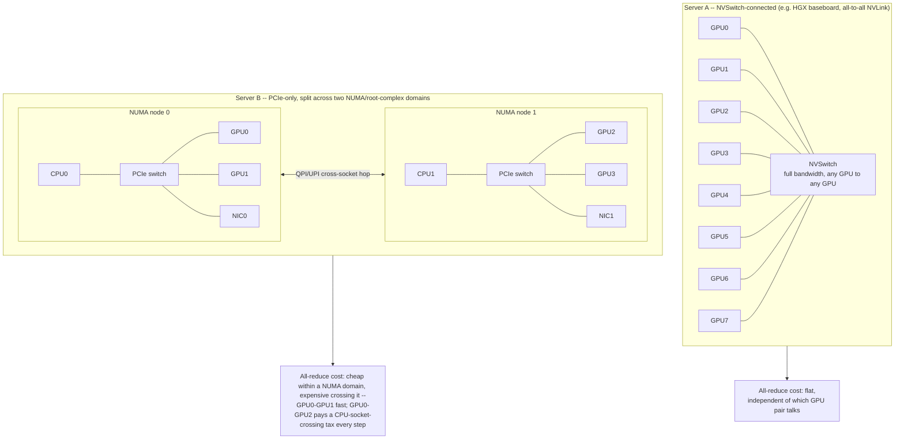
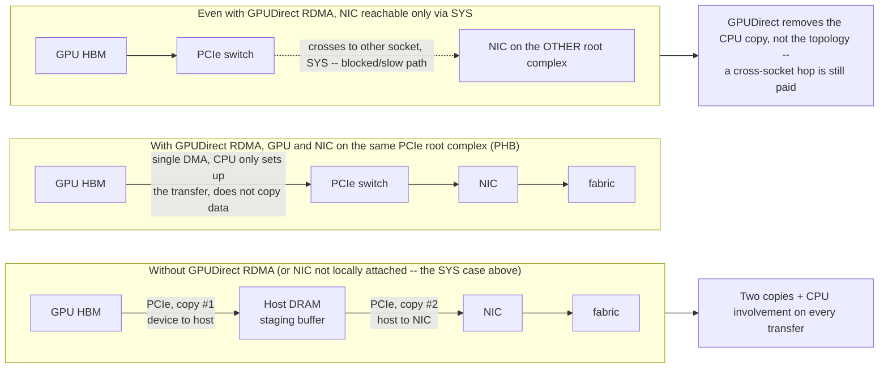

**Learning outcome:** Understand why "same number of GPUs" can produce different performance depending on physical connectivity and NUMA placement.

GPUs connect to CPUs and sometimes to peer GPUs through PCIe and higher-bandwidth links such as NVLink/NVSwitch on supported systems. NICs also attach through PCIe topology. Distributed and multi-GPU performance can depend on whether GPU-GPU or GPU-NIC traffic traverses favorable paths or crosses CPU/NUMA boundaries.

```
nvidia-smi topo -m
lspci -tv
numactl --hardware
```

## Worked scenario
**Situation:** Two 8-GPU servers have identical GPU models, but one is consistently slower for multi-GPU training.

1. Compare nvidia-smi topo -m and NIC/GPU placement rather than assuming equivalent topology.
2. Check CPU NUMA binding and whether workers/communication threads align with local GPUs/NICs.
3. Check link width/speed/errors and firmware/driver consistency.
4. Benchmark peer-to-peer and collective performance before blaming the framework.

**Conclusion:** GPU count is a capacity number; topology is a performance property.

---

➕ **ASCII topology diagram — the two server layouts the worked scenario is actually comparing:**

Same GPU count and model, structurally different worst-case collective latency — this diagram *is* the answer to "why would two identical-spec servers train differently."

➕ **Annotated real `nvidia-smi topo -m` output (the matrix everyone name-drops but few can actually read cold):**
```
$ nvidia-smi topo -m
       GPU0  GPU1  GPU2  GPU3  NIC0  CPU Affinity  NUMA Affinity
GPU0    X    NV12  SYS   SYS   PHB      0-31            0
GPU1  NV12    X    SYS   SYS   SYS      0-31            0
GPU2   SYS   SYS    X    NV12  SYS     32-63            1
GPU3   SYS   SYS  NV12    X    PHB     32-63            1
NIC0   PHB   SYS   SYS   PHB    X        --             --

Legend:
  NV#  = NVLink with # links (higher = more bandwidth; NV12 = fast GPU-GPU peer)
  PHB  = connection traverses a PCIe Host Bridge (single CPU root complex — good)
  SYS  = connection traverses SMP/cross-socket interconnect (worst case — crosses CPUs)
```
Start with one GPU-to-GPU pair. **GPU0↔GPU1 = NV12** means those GPUs are direct NVLink peers with twelve links, so they have a high-bandwidth path. **GPU0↔GPU2 = SYS** means traffic must cross the system interconnect between CPU/NUMA domains because that pair has no direct NVLink path. `SYS` is therefore the more expensive route.

This affects rank placement. A **rank** is one process participating in a distributed job. If a round-robin mapping makes rank 0 and rank 2 communicate heavily, every all-reduce step pays for the `SYS` route. A topology-aware mapping can instead pair GPU0↔GPU1 and GPU2↔GPU3 so the busiest communication uses NVLink.

Now read the GPU-to-NIC entries. **NIC0 is `PHB` to GPU0/GPU3 but `SYS` to GPU1/GPU2.** `PHB` stays under one PCIe host bridge; `SYS` crosses CPU/NUMA domains. For GPUDirect RDMA, NCCL should prefer the NIC that is local to each GPU. Otherwise, data takes a longer host path even though the application sees the same GPUs and NICs.

➕ **`numactl --hardware` — the other half of the same evidence, annotated:**
```bash
$ numactl --hardware
available: 2 nodes (0-1)
node 0 cpus: 0 1 2 3 4 5 6 7 8 9 10 11 12 13 14 15 16 ... 31
node 0 size: 515928 MB
node 1 cpus: 32 33 34 35 ... 63
node 1 size: 515928 MB
node distances
node 0 1
0: 10 21 ← '21' (roughly 2x local) is the cross-node access-latency penalty
1: 21 10
```
`node distances` is the number that turns "NUMA-aware placement" from folklore into arithmetic: a memory access to the remote node costs ~2.1x a local one on this system. Combine with the topo matrix above — a data-loader thread pinned to node-0 CPUs feeding GPU2 (node-1) pays this distance penalty on every host-side batch prep, on top of the `SYS` PCIe path.

➕ **Diagram: GPUDirect RDMA path vs the host-bounce fallback**

This is the mechanism behind the `NIC0 PHB vs SYS` distinction called out in the `topo -m` reading above: GPUDirect RDMA eliminates the double-copy through host memory, but only when the GPU and NIC already share a favorable PCIe path — placement still has to be right first.

➕ **Extra worked scenario — NCCL failure caused by exactly this topology mismatch, the concrete AI-infra consequence:**
> **Situation:** A distributed training job on Server B (the PCIe-only, dual-NUMA server above) shows all-reduce step time 3x slower than the identical job on Server A, and occasionally NCCL logs `NCCL WARN Timeout` or falls back with a "using non-optimal path" style debug message under `NCCL_DEBUG=INFO`.
> 1. `NCCL_DEBUG=INFO NCCL_DEBUG_SUBSYS=GRAPH` on job launch prints NCCL's own topology detection and the ring/tree it chose — compare against the `nvidia-smi topo -m` matrix above; if NCCL's chosen ring puts GPU0 next to GPU2 in the ring order, every hop pays the `SYS` cost.
> 2. Check `NCCL_IB_HCA` / `NCCL_SOCKET_IFNAME` env vars are pointing at the NIC actually local (`PHB`) to the ranks using it — a wrong or unset value can force NCCL onto a slower discovered path, or onto TCP sockets instead of RDMA entirely.
> 3. Check process-to-GPU-to-NIC affinity: if the launcher (e.g. `mpirun`, `torchrun`) doesn't pin each rank's CPU affinity to match its GPU's NUMA node, host-side collective staging (pinned memory copies) also crosses the NUMA boundary — doubling the penalty (compute topology *and* memory topology both wrong).
> 4. Fix: use `nvidia-smi topo -m` to build an explicit rank→GPU→NIC→CPU affinity map before launch, or rely on `NCCL_TOPO_FILE`/automatic topology detection plus correct `taskset`/`numactl --cpunodebind` per rank.
> **Interview-ready line:** "NCCL timeouts and slow all-reduce on identical hardware are almost always a topology-detection or affinity-pinning problem, not a NCCL bug — `nvidia-smi topo -m` plus `NCCL_DEBUG=INFO` is the first and second command, before touching NCCL configuration."

➕ **Shortcut — mnemonic for the topo -m legend, and a one-liner to flag any GPU pair that falls back to the worst path:**
*"NV beats PHB beats SYS — NVLink beats one-bridge beats system-crossing."*
```bash
nvidia-smi topo -m | grep -E 'GPU[0-9]' | awk '{for(i=2;i<=NF;i++) if($i=="SYS") print "row "$1" col "i": SYS path — cross-NUMA, worst case"}'
```

➕ **Practice (continuation — original chapter had a worked scenario but no numbered Practice list; these are new):**
1. Given a `topo -m` matrix, identify the best 4-GPU subset for a tightly-coupled collective job on an 8-GPU PCIe-only (no NVSwitch) server, and justify the choice using only NV/PHB/SYS values.
2. ➕ Explain why `node distances` of "10/21" matters more for a CPU-bound data-loader than for the GPU compute itself, and name the Kubernetes-level lever (Topology Manager policy) that prevents the scheduler from placing a Pod's CPUs and GPUs on mismatched NUMA nodes.
