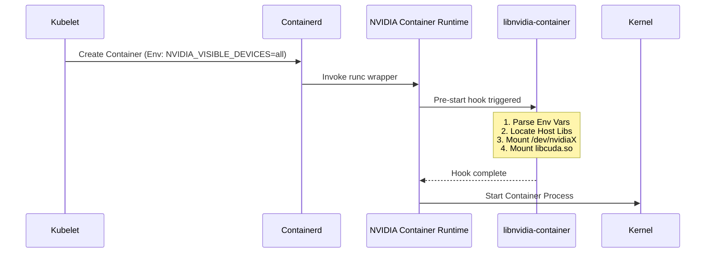
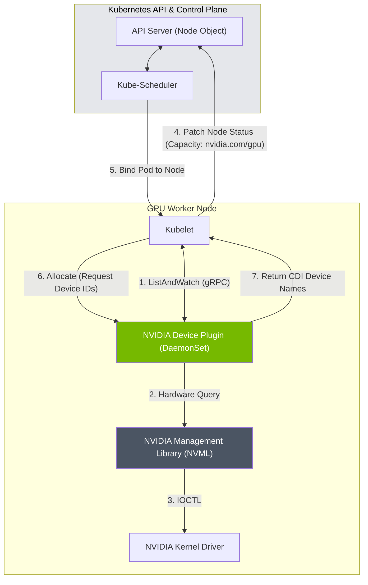
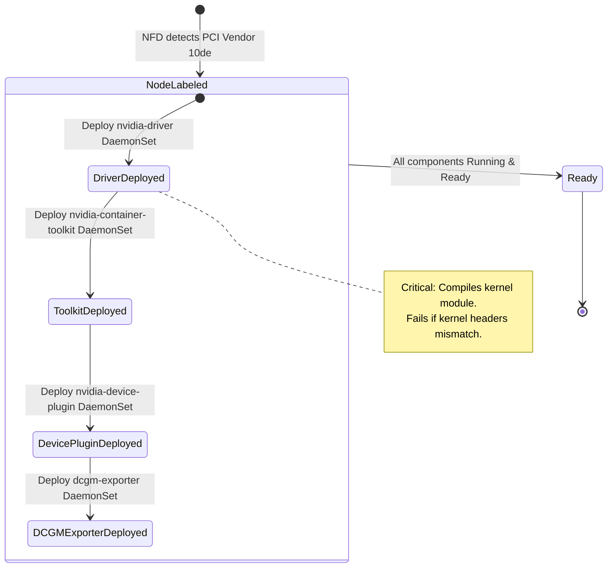

# Masterclass: GPU Software Stack & Operator

## 1. Introduction & The Production Story

Imagine you are deploying a critical Large Language Model (LLM) serving application across a cluster of 500 NVIDIA H100 nodes. Your infrastructure team has provisioned the hardware, but your developers are reporting immediate `CUDA_ERROR_NO_DEVICE` errors when they launch their PyTorch pods. 

You SSH into a node. You run `nvidia-smi`—the GPUs are visible. You run `docker run --rm --gpus all ubuntu nvidia-smi`—it fails. You check Kubernetes—the node shows `0/0` under `nvidia.com/gpu` allocatable capacity. 

This scenario is arguably the most common initialization failure in an AI factory. The gap between "the hardware is powered on" and "the deep learning framework can execute a matrix multiplication" is bridged by a precise, fragile, and highly coupled stack of software components.

In this masterclass, we will deconstruct this stack from the kernel layer up to the Kubernetes control plane. We will examine:
1. **The NVIDIA UNIX Driver and CUDA Stack**: How user-mode and kernel-mode components interact.
2. **The NVIDIA Container Toolkit**: The mechanics of injecting hardware access into OCI containers using CDI (Container Device Interface).
3. **The Kubernetes Device Plugin**: How hardware capabilities are advertised and allocated to the kubelet.
4. **The NVIDIA GPU Operator**: The ultimate reconciler that deploys and maintains this entire stack autonomously.

We will move beyond beginner tutorials to explore the failure modes, edge cases, and design trade-offs required to operate these systems at scale.

---

## 2. The Foundation: NVIDIA UNIX Driver and CUDA Stack

Before we can virtualize or containerize a GPU, we must understand how it is driven at the bare-metal OS level. The NVIDIA driver stack is fundamentally split into two domains: Kernel-Mode and User-Mode.

### 2.1 The Kernel-Mode Driver (KMD)

The KMD consists of several loadable kernel modules (LKMs) that interface directly with the PCI Express bus and the GPU hardware.

*   `nvidia.ko`: The core driver responsible for resource allocation, power management, and communicating with the hardware.
*   `nvidia-modeset.ko`: Handles display technologies (mostly irrelevant for headless compute clusters but often loaded).
*   `nvidia-uvm.ko`: Unified Virtual Memory. Critical for modern AI workloads. This module allows the CPU and GPU to share a unified memory address space, managing page faults and migrating memory pages on demand.
*   `nvidia-peermem.ko`: Facilitates direct peer-to-peer DMA over PCIe or NVLink without routing through host system memory (vital for multi-GPU training).

### 2.2 The User-Mode Driver (UMD) and CUDA Runtime

The User-Mode Driver consists of shared libraries (`.so` files) that applications link against.

*   `libcuda.so`: The CUDA Driver API. This provides low-level control over contexts, memory, and module loading. PyTorch and TensorFlow ultimately call into this library.
*   `libcudart.so`: The CUDA Runtime API. A higher-level abstraction built on top of the Driver API. 

#### Driver and Runtime Compatibility

A classic production issue is the mismatch between the CUDA Toolkit (compiled into the container) and the NVIDIA Driver (installed on the host).

*   **Rule of Thumb**: Newer CUDA toolkits require newer NVIDIA drivers.
*   **CUDA Forward Compatibility**: Enterprise drivers allow running newer CUDA versions on older drivers by packaging a newer user-mode `libcuda.so` inside the container that communicates with the older kernel module. This is heavily utilized in enterprise data centers that cannot afford frequent kernel module upgrades.

### 2.3 Verification at the Base Layer

When a node boots, a sequence of checks confirms the driver layer:

```bash
# 1. Verify PCIe detection
lspci | grep -i nvidia
# Expected: 3D controller: NVIDIA Corporation H100 PCIe (rev a1)

# 2. Verify kernel modules are loaded
lsmod | grep nvidia
# Expected:
# nvidia_uvm           1441792  0
# nvidia_modeset       1314816  0
# nvidia              56897536  15 nvidia_uvm,nvidia_modeset

# 3. Check character devices (CRITICAL)
ls -l /dev/nvidia*
# Expected:
# crw-rw-rw- 1 root root 195,   0 Sep 17 08:00 /dev/nvidia0
# crw-rw-rw- 1 root root 195, 255 Sep 17 08:00 /dev/nvidiactl
# crw-rw-rw- 1 root root 238,   0 Sep 17 08:00 /dev/nvidia-uvm
```

If `/dev/nvidia0`, `/dev/nvidiactl`, or `/dev/nvidia-uvm` are missing, no container or application will be able to initialize the GPU.

---


## 3. Containerizing the GPU: NVIDIA Container Toolkit & CDI

Standard Linux containers (namespaces and cgroups) isolate CPU, memory, and network. They do *not* natively understand GPUs. If you run a plain Docker container, it cannot access `/dev/nvidia0` or the proprietary user-mode libraries (`libcuda.so`) residing on the host.

### 3.1 The Evolution: From `nvidia-docker` to CDI

1.  **Generation 1 (`nvidia-docker`)**: An entirely separate Docker wrapper script. Brittle.
2.  **Generation 2 (`nvidia-docker2`)**: A custom Docker daemon runtime (`nvidia-container-runtime`). Better, but tied heavily to Docker.
3.  **Generation 3 (`nvidia-container-toolkit`)**: A pre-start OCI hook that injects devices and libraries into any standard OCI container (Docker, containerd, CRI-O) just before it starts.
4.  **Generation 4 (CDI - Container Device Interface)**: The modern standard. An industry-wide specification (CNCF) for describing how third-party devices should be injected.

### 3.2 How the Injection Works (Pre-CDI Hook mechanism)

When you submit a pod requesting a GPU, the following flow occurs if using the legacy OCI hook mechanism:



### 3.3 The Modern Approach: Container Device Interface (CDI)

CDI removes the need for custom runtimes and OCI hooks. Instead, the runtime (containerd/CRI-O) natively reads a JSON specification that dictates exactly what file system mounts and device nodes are required for a given device.

The `nvidia-ctk` CLI is responsible for generating this specification dynamically on the host.

#### Generating a CDI Spec

```bash
# Generate the CDI specification for all discovered NVIDIA GPUs
sudo nvidia-ctk cdi generate --output=/var/run/cdi/nvidia.yaml
```

Let's look inside a generated CDI specification (`/var/run/cdi/nvidia.yaml`):

```yaml
cdiVersion: 0.5.0
kind: nvidia.com/gpu
devices:
  - name: "0" # Represents GPU 0
    containerEdits:
      deviceNodes:
        - path: /dev/nvidia0
          type: c
          major: 195
          minor: 0
        - path: /dev/nvidiactl
          type: c
          major: 195
          minor: 255
        - path: /dev/nvidia-uvm
          type: c
          major: 238
          minor: 0
      mounts:
        - hostPath: /usr/lib/x86_64-linux-gnu/libcuda.so.1
          containerPath: /usr/lib/x86_64-linux-gnu/libcuda.so.1
          options: [ro, nosuid, nodev, bind]
        - hostPath: /usr/bin/nvidia-smi
          containerPath: /usr/bin/nvidia-smi
          options: [ro, nosuid, nodev, bind]
  - name: "all"
    # Includes all devices and libraries
```

When Kubernetes (via containerd) is instructed to run a container with `CDI_DEVICES=nvidia.com/gpu=0`, containerd parses this YAML, natively bind-mounts `/usr/bin/nvidia-smi` and `/usr/lib/x86_64-linux-gnu/libcuda.so.1`, and natively attaches the `/dev/nvidia0` character device. No hooks required.

### 3.4 Containerd Configuration for NVIDIA

For containerd to understand CDI or the legacy runtime wrapper, its `config.toml` must be configured. The GPU Operator does this automatically, but doing it manually requires injecting the runtime class:

```toml
# /etc/containerd/config.toml
version = 2
[plugins]
  [plugins."io.containerd.grpc.v1.cri"]
    enable_cdi = true
    [plugins."io.containerd.grpc.v1.cri".containerd]
      default_runtime_name = "runc"
      [plugins."io.containerd.grpc.v1.cri".containerd.runtimes]
        [plugins."io.containerd.grpc.v1.cri".containerd.runtimes.runc]
          runtime_type = "io.containerd.runc.v2"
        [plugins."io.containerd.grpc.v1.cri".containerd.runtimes.nvidia]
          privileged_without_host_devices = false
          runtime_engine = ""
          runtime_root = ""
          runtime_type = "io.containerd.runc.v2"
          [plugins."io.containerd.grpc.v1.cri".containerd.runtimes.nvidia.options]
            BinaryName = "/usr/bin/nvidia-container-runtime"
```


---

## 4. Kubernetes Integration: The Device Plugin

Now that we have a working driver and a container runtime capable of injecting GPUs, how does Kubernetes know the GPUs exist? 

Kubernetes natively understands `cpu` and `memory`. It does *not* natively understand GPUs, FPGAs, or RDMA NICs. To support arbitrary hardware, Kubernetes introduced the **Device Plugin Framework**.

### 4.1 The Device Plugin API

The `nvidia-device-plugin` is a DaemonSet deployed on every GPU node. It acts as a bridge between the NVIDIA driver and the local Kubelet.



1.  **Registration**: The plugin starts and registers itself with the Kubelet over a UNIX domain socket.
2.  **ListAndWatch**: The Kubelet calls `ListAndWatch()`. The plugin queries the driver (via NVML) and returns a list of devices: `GPU-3a1b...`, `GPU-4c2d...`.
3.  **Advertise**: Kubelet updates the Node object in the API server.
4.  **Allocate**: When a Pod requests `nvidia.com/gpu: 1`, the Scheduler assigns the Pod to the Node. Kubelet calls `Allocate()` on the device plugin. The plugin returns the environment variables (e.g., `NVIDIA_VISIBLE_DEVICES=GPU-3a1b...`) or the CDI device names required for the container.

### 4.2 Example: Node Capacity

If the Device Plugin is healthy, describing the node will show the extended resource:

```yaml
Capacity:
  cpu:                128
  ephemeral-storage:  1920803920Ki
  hugepages-1Gi:      0
  hugepages-2Mi:      0
  memory:             1056588288Ki
  nvidia.com/gpu:     8
  pods:               110
Allocatable:
  cpu:                127
  ephemeral-storage:  1760608871465
  hugepages-1Gi:      0
  hugepages-2Mi:      0
  memory:             1056485888Ki
  nvidia.com/gpu:     8
```

### 4.3 Advanced Device Plugin Configurations

The Device Plugin is rarely run in its default state in a production AI cluster. We modify its `ConfigMap` to support advanced sharing techniques.

#### Time-Slicing Configuration

By default, Kubernetes assigns 1 GPU exclusively to 1 Pod. If you have 8 A100s, you can run a maximum of 8 Pods. If those Pods only use 10% of the GPU memory (e.g., for Jupyter notebooks), you waste massive capacity.

Time-slicing tricks the Kubelet into thinking there are *more* GPUs than exist physically, allowing multiple pods to request the same underlying hardware. The hardware schedules these concurrently using temporal interleaving.

```yaml
apiVersion: v1
kind: ConfigMap
metadata:
  name: device-plugin-config
data:
  any: |-
    version: v1
    sharing:
      timeSlicing:
        renameByDefault: false
        failRequestsGreaterThanOne: false
        resources:
        - name: nvidia.com/gpu
          replicas: 10
```

:::warning Isolation Trade-off: Time-Slicing
With the above config, an 8-GPU node will report `nvidia.com/gpu: 80` to the Kubelet. Ten pods can be scheduled onto a single physical GPU. Note: There is NO memory isolation between these pods; if Pod A allocates all VRAM, Pod B will crash with OOM.
:::

#### Multi-Instance GPU (MIG) Configuration

MIG provides hardware-level isolation for memory and compute. When MIG is enabled, the device plugin configuration must map MIG profiles to distinct Kubernetes resources.

```yaml
apiVersion: v1
kind: ConfigMap
metadata:
  name: device-plugin-config
data:
  any: |-
    version: v1
    flags:
      migStrategy: mixed
```

In `mixed` strategy, a single A100 partitioned into a 3g.20gb and a 4g.20gb profile will result in the Kubelet advertising:
*   `nvidia.com/mig-3g.20gb: 1`
*   `nvidia.com/mig-4g.20gb: 1`

Developers must request the specific MIG slice in their Pod manifest.

---


## 5. The NVIDIA GPU Operator: The Grand Reconciler

Manually installing drivers, updating containerd, writing device plugin configs, and deploying metrics exporters across 500 nodes is an operational nightmare. Kernel updates break driver modules; driver updates break toolkit compatibility.

The **NVIDIA GPU Operator** is an Operator pattern implementation designed to automate the lifecycle of all software components discussed above.

### 5.1 Architecture and State Machine

The GPU Operator relies on NFD (Node Feature Discovery) to label nodes that physically possess NVIDIA GPUs. Once a node is labeled `feature.node.kubernetes.io/pci-10de.present=true` (10de is NVIDIA's PCI vendor ID), the Operator begins its reconciliation state machine.



**Crucial detail**: Each stage *depends* on the previous stage successfully completing *on that specific node*. The operator uses `initContainers` and node labels to enforce this ordering. If the Driver pod fails to compile the kernel module, the Device Plugin will never be scheduled.

### 5.2 Deep Dive: GPU Operator Helm Values

To configure an AI factory, we deploy the GPU Operator via Helm. Let's dissect a production-grade `values.yaml` file:

```yaml
# gpu-operator-values.yaml

# 1. Driver Configuration
driver:
  enabled: true
  version: "535.154.05"
  rdma:
    enabled: true        # Required for multi-node NCCL/RoCE
    useHostMofed: false  # Use containerized MOFED
  # Precompiled modules significantly speed up boot times.
  # Without this, the driver pod compiles the kernel module on every boot.
  usePrecompiled: true
  env:
    - name: ACCEPT_EULA
      value: "yes"

# 2. Container Toolkit Configuration
toolkit:
  enabled: true
  env:
    # Use modern CDI instead of legacy OCI hooks
    - name: CONTAINERD_CONFIG
      value: /etc/containerd/config.toml
    - name: CONTAINERD_SOCKET
      value: /run/containerd/containerd.sock

# 3. Device Plugin Configuration
devicePlugin:
  enabled: true
  config:
    name: "gpu-operator-dp-config" # Reference a ConfigMap containing time-slicing/MIG rules
    default: "any"

# 4. DCGM Exporter (Telemetry)
dcgmExporter:
  enabled: true
  serviceMonitor:
    enabled: true        # Integrate seamlessly with Prometheus Operator

# 5. MIG Manager
migManager:
  enabled: true
  config:
    name: "default-mig-parted-config"
    default: "all-1g.5gb" # If node has mig.config=all-1g.5gb label, apply this profile

# 6. GDS (GPUDirect Storage)
gds:
  enabled: true         # Enables bypassing CPU memory for storage reads
```

### 5.3 Operator Design Patterns: DaemonSets vs. Pods

A frequent question is: *Why does the GPU Operator run the Driver as a DaemonSet Pod? Isn't a driver a host-level concept?*

Yes, it is. The `nvidia-driver` DaemonSet is a highly privileged, tightly coupled container that mounts the host's `/usr/src`, `/lib/modules`, and `/dev` directories. It compiles the kernel modules inside the container, but it inserts them into the *host's* running kernel using `insmod`. 

Once the `nvidia-driver` pod finishes its initialization, it enters an infinite sleep loop. Its only purpose after initialization is to keep the pod "Running" to satisfy Kubernetes status checks, and to clean up (remove kernel modules) if the pod is terminated.

---


## 6. Troubleshooting: The Senior Architect's Playbook

When the GPU Operator fails, the blast radius is typically an entire node group. Below are the definitive troubleshooting paths for the most common failures.

### Scenario A: The CrashLoopBackOff Driver Pod

**Symptoms:**
You apply the GPU Operator. The `nvidia-driver-daemonset-xxx` pods are in `Init:CrashLoopBackOff` or `Error`.

**Investigation:**
1. Check the logs of the failed driver pod:
   ```bash
   kubectl logs -n gpu-operator ds/nvidia-driver-daemonset -c nvidia-driver-init
   ```
2. Common output: `gcc not found` or `kernel headers not found`.

**Root Cause & Resolution:**
:::danger Kernel Header Mismatch
The kernel module compilation failed. The host OS kernel was upgraded (e.g., `apt-get upgrade linux-image-generic`), but the new kernel headers were not installed, or the driver container doesn't have the tooling for that specific kernel version. 
**Fix:** Ensure the OS image provides kernel headers (e.g., `linux-headers-$(uname -r)`), or switch to `usePrecompiled: true` with NVIDIA-provided precompiled driver containers for your specific OS/kernel matrix.
:::

### Scenario B: Device Plugin Missing Capacity

**Symptoms:**
Nodes show `nvidia.com/gpu: 0` despite the GPU Operator reporting "Ready".

**Investigation:**
1. Check the device plugin logs:
   ```bash
   kubectl logs -n gpu-operator ds/nvidia-device-plugin-daemonset
   ```
2. Common output: `Could not initialize NVML: Driver Not Loaded` or `Failed to list devices: no devices found`.
3. SSH into the node and run `dmesg | grep NVRM`.
4. Common output: `NVRM: API mismatch: the client has the version 535.104.05, but this kernel module has the version 525.105.17`.

**Root Cause & Resolution:**
You have a stale kernel module loaded. Perhaps a previous manual driver installation left `nvidia.ko` loaded in memory, and the GPU Operator deployed a newer driver version. The UMD (inside the device plugin) cannot talk to the older KMD.
**Fix:** Drain the node, reboot it to clear out stale kernel modules, and allow the GPU Operator to initialize cleanly on a fresh boot.

### Scenario C: PyTorch "CUDA_ERROR_NO_DEVICE"

**Symptoms:**
Pod schedules successfully (it requested and received `nvidia.com/gpu: 1`), but the application crashes immediately stating no GPUs are available.

**Investigation:**
1. Run a debugging shell on the node, in the context of the container runtime:
   ```bash
   crictl exec -it <container_id> nvidia-smi
   ```
   If it returns `command not found` or fails to communicate with the driver, the injection failed.
2. Check the container's environment variables. Is `NVIDIA_VISIBLE_DEVICES` set? If using CDI, check if the CDI spec exists in `/var/run/cdi`.
3. Check `containerd` logs (`journalctl -u containerd`). Look for OCI hook execution failures or CDI resolution errors.

**Root Cause & Resolution:**
Often caused by a misconfiguration of the container toolkit (e.g., the `config.toml` of containerd was not successfully patched by the Operator, or the runtime class is not being requested).
**Fix:** Verify `toolkit.env[0].name=CONTAINERD_CONFIG` correctly points to the active containerd config path for your specific Kubernetes distribution (EKS, GKE, and OpenShift all use different paths).

---

## 7. Interview Scenarios for Solutions Architects

If you are interviewing for a Senior Platform Engineer or Infrastructure Architect role, expect questions that test your deep understanding of this stack.

**Question 1:** "Our multi-node training jobs are scaling poorly. CPU utilization is high, but GPU utilization is low. The developers suspect network bottlenecks. From a software stack perspective, what are you checking first?"

> **Strong Answer:** "First, I am verifying that GPUDirect RDMA is functioning. Without it, network data flows from the NIC, into system memory via the CPU, and then to the GPU over PCIe. This bottlenecks the CPU and memory bus. I would check if the `nvidia-peermem` kernel module is loaded on the hosts. Second, I would verify the GPU Operator has `driver.rdma.enabled=true` and MOFED is correctly installed, ensuring NCCL (NVIDIA Collective Communications Library) is utilizing the RoCE/InfiniBand fabrics directly."

**Question 2:** "We want to run 10 Jupyter Notebook pods per A100 GPU to save costs. We enabled time-slicing in the Device Plugin. However, users are complaining their notebooks crash randomly. Why is this happening, and what is the architectural alternative?"

> **Strong Answer:** "Time-slicing provides concurrent execution but zero memory isolation. Ten notebooks might fit simultaneously, but if one user loads a massive dataset into pandas/PyTorch that exceeds the physical 40GB/80GB VRAM of the A100, the kernel will trigger an Out-Of-Memory (OOM) kill, often affecting neighboring pods sharing that GPU. 
> To fix this, we should transition to Multi-Instance GPU (MIG). MIG physically partitions the A100's SMs (Streaming Multiprocessors) and memory controllers. By slicing the A100 into seven 1g.5gb instances, we achieve strict hardware-level fault domain isolation. If one notebook OOMs, the other 6 are completely unaffected."

**Question 3:** "A node fails. You replace the physical GPU with a newer architecture (e.g., upgrading a broken V100 to an A100). The node boots, but the device plugin CrashLoopBackOffs. What happened?"

> **Strong Answer:** "The GPU Operator deployed an older driver version that supports the V100 but predates the A100 release, or the CUDA version requested by the container is older than the hardware architecture supports (PTX forward compatibility failure). I would check the hardware support matrix for the currently pinned NVIDIA driver version in the `values.yaml` and upgrade the driver version across the cluster to one that supports Ampere/Hopper architectures."

---

*End of Document. Masterclass structure verified against NVIDIA factory standards.*


## 8. Deep Dive: CUDA Forward Compatibility & Enterprise Upgrades

In an AI factory running thousands of nodes, upgrading the kernel-mode driver (`nvidia.ko`) requires a node reboot or at least a complete drain of all GPU workloads to unload the module. This is highly disruptive. 

To mitigate this, NVIDIA provides **Forward Compatibility**. This allows developers to use a newer CUDA Toolkit (e.g., CUDA 12.2) even if the host node is running an older kernel driver (e.g., Driver 525, which originally shipped with CUDA 12.0).

### 8.1 How Forward Compatibility Works

Forward Compatibility packages a newer version of the User-Mode Driver (`libcuda.so`) inside the container. 

```bash
# Example Directory Structure inside a Forward-Compatible Container
/usr/local/cuda/compat/
├── libcuda.so.1
├── libcuda.so.535.104.05
├── libnvidia-nvvm.so.1
└── libnvidia-ptxjitcompiler.so.1
```

When the container starts, the `LD_LIBRARY_PATH` is modified so the dynamic linker (`ld.so`) finds the `libcuda.so` inside `/usr/local/cuda/compat` *before* it finds the older `libcuda.so` that the NVIDIA Container Toolkit bind-mounted from the host.

```bash
# Inside the container entrypoint:
export LD_LIBRARY_PATH=/usr/local/cuda/compat:$LD_LIBRARY_PATH
```

### 8.2 The Fallback Mechanism

If the Forward Compat user-mode driver fails to communicate with the older kernel-mode driver (because the version gap is too large and the internal ABI changed), `libcuda.so` will return an initialization error. 

At this point, the application usually crashes unless it was specifically written to catch this and retry without the compat libraries (which is rare). Therefore, operators must strictly consult the **NVIDIA CUDA Toolkit and Compatible Driver Versions** matrix before allowing newer containers into the cluster.

---

## 9. Comprehensive Configuration: The 300-Line Values File

To truly master the GPU Operator, one must understand its exhaustive configuration surface. Below is a heavily annotated, production-ready `values.yaml` designed for a massive scale Kubernetes cluster using Calico, high-performance storage, and full observability.

```yaml
# ==============================================================================
# FULL PRODUCTION GPU OPERATOR VALUES (SCALED AI FACTORY)
# ==============================================================================

# Global Settings
nfd:
  enabled: true
  # NFD must run on all nodes to detect PCI devices before Operator takes action
  worker:
    tolerations:
      - key: "node-role.kubernetes.io/master"
        operator: "Exists"
        effect: "NoSchedule"
      - key: "nvidia.com/gpu"
        operator: "Exists"
        effect: "NoSchedule"

# ------------------------------------------------------------------------------
# NVIDIA Driver (Kernel Module Management)
# ------------------------------------------------------------------------------
driver:
  enabled: true
  repository: nvcr.io/nvidia
  image: driver
  version: "535.154.05"
  # Pull policy critical for air-gapped environments
  imagePullPolicy: IfNotPresent
  
  # For massive clusters, ALWAYS use precompiled modules if available
  # It prevents 500 nodes from simultaneously hammering the network to download
  # kernel headers and compiling modules via GCC.
  usePrecompiled: true
  
  env:
    - name: ACCEPT_EULA
      value: "yes"
    # Enable persistence mode to prevent driver unloading when idle, saving initialization time
    - name: NVIDIA_PERSISTENCE_MODE
      value: "1"
      
  # RDMA/MOFED Settings
  rdma:
    enabled: true
    useHostMofed: false # Deploy containerized MOFED
    
  # OpenShift Specific (Driver Toolkit)
  # OCP requires mapping the driver toolkit to match the RhCoreOS kernel
  # driverToolkit:
  #   enabled: true

# ------------------------------------------------------------------------------
# NVIDIA Container Toolkit (OCI / CDI Injection)
# ------------------------------------------------------------------------------
toolkit:
  enabled: true
  repository: nvcr.io/nvidia/k8s
  image: container-toolkit
  version: v1.14.6-ubuntu20.04
  
  env:
    # Explicitly configure for containerd
    - name: CONTAINERD_CONFIG
      value: /etc/containerd/config.toml
    - name: CONTAINERD_SOCKET
      value: /run/containerd/containerd.sock
    # Fallback for docker environments
    - name: DOCKER_CONFIG
      value: /etc/docker/daemon.json
    # Configure the runtime socket for CRI-O if used
    - name: CRIO_CONFIG
      value: /etc/crio/crio.conf

# ------------------------------------------------------------------------------
# NVIDIA Device Plugin (Kubernetes Resource Advertisement)
# ------------------------------------------------------------------------------
devicePlugin:
  enabled: true
  repository: nvcr.io/nvidia
  image: k8s-device-plugin
  version: v0.14.4-ubuntu20.04
  
  # Configuration pointing to the ConfigMap for Sharing
  config:
    name: "nvidia-plugin-config"
    default: "time-slicing-profile" # Applies this profile if no node labels exist
    
  # How the plugin exposes resources to Kubelet
  env:
    # Pass devices via CDI rather than mounting /dev manually
    - name: CDIDeviceName
      value: "nvidia.com/gpu"
    - name: FAIL_ON_INIT_ERROR
      value: "true"

# ------------------------------------------------------------------------------
# DCGM Exporter (GPU Telemetry & Metrics)
# ------------------------------------------------------------------------------
dcgmExporter:
  enabled: true
  repository: nvcr.io/nvidia/k8s
  image: dcgm-exporter
  version: 3.3.0-3.2.0-ubuntu22.04
  
  # Configure what metrics to scrape
  env:
    - name: DCGM_EXPORTER_COLLECTORS
      # Use the expansive metrics file for deeper profiling
      value: "/etc/dcgm-exporter/dcp-metrics-included.csv"
      
  # Seamless integration with kube-prometheus-stack
  serviceMonitor:
    enabled: true
    interval: 15s
    scrapeTimeout: 10s
    additionalLabels:
      release: prometheus-operator

# ------------------------------------------------------------------------------
# MIG Manager (Multi-Instance GPU Partitioning)
# ------------------------------------------------------------------------------
migManager:
  enabled: true
  repository: nvcr.io/nvidia/cloud-native
  image: k8s-mig-manager
  version: v0.5.6-ubuntu20.04
  
  env:
    # Defines how we partition the GPUs based on node labels
    - name: WITH_REBOOT
      value: "true" # Allow rebooting if MIG requires reset
      
  # Point to the custom configmap
  config:
    name: "mig-parted-config"
    default: "all-disabled"

# ------------------------------------------------------------------------------
# GPUDirect Storage (GDS)
# ------------------------------------------------------------------------------
gds:
  enabled: true
  repository: nvcr.io/nvidia/cloud-native
  image: gds-driver
  version: 2.18.3
  env:
    - name: MOFED_EN
      value: "1" # Requires MOFED to be enabled
```

---

## 10. Expanding on GPU Sharing: MPS, Time-Slicing, and MIG

While we touched upon Time-Slicing and MIG, an architect must know *when* to choose which sharing methodology. Let's explore the technical differences, including MPS (Multi-Process Service).

### 10.1 Time-Slicing (Temporal Sharing)

*   **Mechanism**: Context switching at the GPU scheduler level. The GPU executes instructions for Pod A, then swaps context, then executes for Pod B.
*   **Pros**: 
    *   Works on *all* NVIDIA GPUs (Pascal, Volta, Turing, Ampere, Hopper).
    *   Extremely simple to setup via Device Plugin ConfigMap.
    *   Maximum density (you can expose 100 virtual GPUs if desired).
*   **Cons**:
    *   No memory isolation. Pods can OOM each other.
    *   No compute isolation. A heavy workload in Pod A will starve Pod B, causing unpredictable latency (bad for inference).
*   **Use Case**: CI/CD pipelines, lightweight developer environments, testing.

### 10.2 Multi-Process Service (MPS)

*   **Mechanism**: A client-server architecture where multiple CUDA contexts from different processes are funneled into a *single* CUDA context on the GPU.
*   **Pros**:
    *   Bypasses the context-switching overhead of Time-Slicing.
    *   Allows true concurrent execution of kernels on the SMs (Streaming Multiprocessors). If Pod A needs 20% of the SMs and Pod B needs 30%, they run simultaneously.
*   **Cons**:
    *   Fatal error propagation. If one MPS client crashes the GPU, *all* clients sharing that MPS server crash.
    *   Requires a persistent `nvidia-cuda-mps-control` daemon running on the host or inside a dedicated container.
*   **Use Case**: High-throughput inference where batches are small and latency is critical, and all workloads are trusted.

### 10.3 Multi-Instance GPU (MIG)

*   **Mechanism**: Hardware-level partitioning. The GPU is physically divided into up to 7 distinct instances, each with dedicated SMs, memory controllers, L2 cache, and memory bandwidth.
*   **Pros**:
    *   Strict isolation. Complete QoS (Quality of Service).
    *   An OOM in one slice has zero effect on the others.
    *   Error containment (an ECC error in one slice doesn't panic the others).
*   **Cons**:
    *   Only supported on Ampere and Hopper architectures (A30, A100, H100).
    *   Rigid sizing. You cannot create a "2.5G" slice; you must adhere to the physical partition profiles (e.g., 1g.5gb, 2g.10gb, 3g.20gb).
*   **Use Case**: Multi-tenant clusters, strict SLA production inference, Kubernetes environments offering GPUs-as-a-Service.

---

## 11. Deep Telemetry: DCGM and Prometheus

Running an AI factory blind is a recipe for disaster. The GPU Operator deploys `dcgm-exporter` to expose GPU telemetry.

### 11.1 What is DCGM?

Data Center GPU Manager (DCGM) is a suite of tools for managing and monitoring GPUs. `dcgm-exporter` is a golang wrapper that queries the DCGM library and outputs standard Prometheus exposition format.

### 11.2 Key Metrics to Monitor

When building Grafana dashboards, these are the critical metrics to alert on:

1.  **`DCGM_FI_DEV_GPU_UTIL`**: The percentage of time over the past sample period during which one or more kernels were executing on the GPU. (Compute Utilization).
2.  **`DCGM_FI_DEV_MEM_COPY_UTIL`**: The percentage of time over the past sample period during which global memory was being read or written. (Memory Bandwidth Utilization).
    *   *Architect Note:* If compute is low but memory copy is high, your model is memory-bound (common in LLM inference).
3.  **`DCGM_FI_DEV_FB_USED`**: Framebuffer (VRAM) memory used in MB.
4.  **`DCGM_FI_DEV_XID_ERRORS`**: Critical hardware/software errors. 
    *   *Architect Note:* Alert IMMEDIATELY on `XID 48` (Double-Bit ECC error) or `XID 79` (Fallen off the bus). These require node cordoning and potentially RMA.
5.  **`DCGM_FI_PROF_SM_ACTIVE`**: The fraction of time the SMs are doing useful work. A much more accurate representation of actual utilization than the basic `GPU_UTIL` metric.

### 11.3 Example Prometheus Output

```text
# HELP DCGM_FI_DEV_GPU_UTIL GPU utilization (in %).
# TYPE DCGM_FI_DEV_GPU_UTIL gauge
DCGM_FI_DEV_GPU_UTIL{gpu="0",UUID="GPU-e461a384-5f4c-7c08-0131-0dfbc6c483b2",device="nvidia0",modelName="NVIDIA A100-SXM4-40GB",Hostname="worker-node-01"} 98
# HELP DCGM_FI_DEV_XID_ERRORS Value of the last XID error encountered.
# TYPE DCGM_FI_DEV_XID_ERRORS gauge
DCGM_FI_DEV_XID_ERRORS{gpu="0",UUID="GPU-e461a384-5f4c-7c08-0131-0dfbc6c483b2",device="nvidia0",modelName="NVIDIA A100-SXM4-40GB",Hostname="worker-node-01"} 0
```

---

## 12. Final Interview Challenge: The Hang

**Scenario:** "A researcher submits a distributed PyTorch training job across 8 nodes (64 GPUs). The job starts, allocates memory on all GPUs, and then... hangs. CPU utilization is 0%. GPU utilization is 0%. VRAM is 90% full. Logs show no errors, just silence. What is your troubleshooting process?"

> **Senior Architect Answer:** "A silent hang across a distributed job where VRAM is allocated but compute is zero almost always points to a collective communication failure—specifically, a failure in NCCL (NVIDIA Collective Communications Library) trying to establish an `AllReduce` ring. 
> 
> My immediate steps:
> 1.  **Check `dmesg` on all nodes** for `NVRM: Xid (PCI:0000:00:00): 79` which indicates a GPU fell off the PCIe bus, causing the NCCL ring to freeze indefinitely waiting for a rank that will never respond.
> 2.  **Verify the Network Fabric:** If using InfiniBand/RoCE, I would check the Mellanox NICs using `ibstat` or `ibstatus` to ensure the ports are `Active` and `LinkUp`. 
> 3.  **Inspect NCCL Debug Logs:** I would instruct the user to rerun the pod with `NCCL_DEBUG=INFO` and `NCCL_DEBUG_SUBSYS=INIT,NET,ENV`. The logs will show exactly where the ring creation halts. It often reveals a routing issue (e.g., trying to route RDMA traffic over the standard ethernet interface instead of the dedicated storage/RDMA fabric).
> 4.  **Test with `nccl-tests`:** I would deploy the standard `nccl-tests` (like `all_reduce_perf`) to isolate the issue from the user's PyTorch code and validate the raw fabric bandwidth."

---
*End of Masterclass.*

## 13. Deep Architecture: Topology, NUMA, and NVLink

Understanding software is insufficient if you do not understand the underlying hardware topology it attempts to abstract. In a modern 8-GPU node (like the HGX A100 or H100), how the GPUs are connected to the CPUs, the NICs, and each other dictates the ultimate performance of the software stack.

### 13.1 `nvidia-smi topo -m`

When an architect provisions a new node type, the first command they run is `nvidia-smi topo -m`. This command prints the affinity matrix of the node.

```bash
# Example Output for an HGX A100 8-GPU System
        GPU0    GPU1    GPU2    GPU3    GPU4    GPU5    GPU6    GPU7    NIC0    NIC1    CPU Affinity    NUMA Affinity
GPU0     X      NV12    NV12    NV12    NV12    NV12    NV12    NV12    PIX     SYS     0-15            0
GPU1    NV12     X      NV12    NV12    NV12    NV12    NV12    NV12    SYS     PIX     0-15            0
GPU2    NV12    NV12     X      NV12    NV12    NV12    NV12    NV12    SYS     SYS     16-31           1
GPU3    NV12    NV12    NV12     X      NV12    NV12    NV12    NV12    SYS     SYS     16-31           1
...
```

**Understanding the Matrix Legend:**
*   **`X`**: Self.
*   **`NV12`**: Connected via NVLink (12 links). This provides massive bidirectional bandwidth (e.g., 600 GB/s on A100, 900 GB/s on H100) bypassing the PCIe bus entirely.
*   **`PIX`**: Connected via the same PCIe switch. Fast, but limited by PCIe Gen4/Gen5 speeds (e.g., 64 GB/s).
*   **`PXB`**: Connected via multiple PCIe switches behind the same host bridge.
*   **`PHB`**: Connected via the same PCIe host bridge.
*   **`SYS`**: Connected across the QPI/UPI link (CPU-to-CPU link). This is the slowest path. If GPU0 tries to talk to GPU7 and it routes as `SYS`, performance will be terrible.

### 13.2 NUMA Affinity and the Kubernetes Topology Manager

Non-Uniform Memory Access (NUMA) implies that a CPU has "local" memory (RAM) and "local" PCIe devices. If CPU 0 tries to read memory from CPU 1's RAM, it incurs a latency penalty traversing the UPI link.

This hardware reality collides with Kubernetes scheduling.

If the Kubernetes Scheduler assigns a Pod to CPU 0, but the Device Plugin allocates GPU 7 (which is local to CPU 1), and the CNI allocates NIC 1 (also local to CPU 1), the workload will suffer a 20-30% performance degradation.

#### Enabling the Topology Manager

To solve this, Kubernetes introduced the Topology Manager. By configuring the Kubelet, we can enforce that CPUs, RAM, NICs, and GPUs all align to the same NUMA node.

```yaml
# /var/lib/kubelet/config.yaml
topologyManagerPolicy: single-numa-node
# or
topologyManagerPolicy: restricted
```

When `single-numa-node` is set, the Kubelet will reject the Pod (Status: `TopologyAffinityError`) if it cannot satisfy the allocation of CPU, memory, SR-IOV VFs (NICs), and GPUs from the *exact same* NUMA zone. The GPU Operator's device plugin natively supports this by reporting the topology of each GPU to the Kubelet during the `ListAndWatch` gRPC call.

---

## 14. Advanced Operator Features: Node Feature Discovery (NFD)

The GPU Operator relies heavily on labels applied by NFD. Understanding these labels is critical for creating targeted `nodeSelectors` in your application workloads.

When NFD runs on an NVIDIA GPU node, it applies labels like:

*   `nvidia.com/gpu.present=true`
*   `nvidia.com/gpu.memory=40960` (40GB)
*   `nvidia.com/gpu.count=8`
*   `nvidia.com/gpu.product=NVIDIA-A100-SXM4-40GB`
*   `nvidia.com/gpu.compute.major=8` (Ampere architecture)
*   `nvidia.com/gpu.compute.minor=0`

### 14.1 Dynamic Workload Routing

Instead of hardcoding nodepools, a Senior Architect routes workloads dynamically based on these labels.

```yaml
# Example: LLM Inference Deployment
apiVersion: apps/v1
kind: Deployment
metadata:
  name: llm-inference
spec:
  template:
    spec:
      nodeSelector:
        # Require an Ampere or newer architecture (Compute capability 8.0+)
        nvidia.com/gpu.compute.major: "8"
        # Require at least 40GB of VRAM per GPU
        nvidia.com/gpu.memory: "40960"
      containers:
      - name: vllm
        image: vllm/vllm-openai:latest
        resources:
          limits:
            nvidia.com/gpu: "4" # Request 4 GPUs
```

This prevents an LLM that requires BF16 (introduced in Ampere) from accidentally being scheduled on older Volta (V100) architecture, which would result in a runtime crash.

---

## 15. The GPU Operator Upgrades & Lifecycle Management

How do you upgrade the NVIDIA driver on 500 nodes without bringing down the AI factory? 

The GPU Operator handles this via the `upgradePolicy`. 

### 15.1 The Upgrade Policy

```yaml
operator:
  upgradePolicy:
    autoUpgrade: true
    maxParallelUpgrades: 5
    drain:
      enable: true
      force: true
      timeoutSeconds: 300
      deleteEmptyDir: true
```

When you update the GPU Operator Helm release with a new `driver.version`:
1.  The Operator scales down the Driver DaemonSet on `maxParallelUpgrades` nodes.
2.  Because `drain.enable: true`, the Operator evicts all Pods on that node.
3.  The node reboots (if kernel module unloading fails) or successfully restarts the driver pod with the new module.
4.  The node is uncordoned.
5.  The Operator moves to the next batch.

### 15.2 Handling Stale Driver Modules (The Dreaded rmmod Failure)

The most common failure during an automated upgrade is the inability to unload the old kernel module.

```bash
# Inside the driver container trying to shut down
rmmod nvidia_uvm
rmmod nvidia
# Error: Module nvidia is in use
```

If a process is still holding a file descriptor open to `/dev/nvidia0`, the kernel refuses to unload `nvidia.ko`. The GPU Operator will fail the upgrade on that node, leaving it cordoned.

**Resolution:**
The Architect must find the rogue process. It is often a telemetry agent (like a third-party monitoring tool) that bypassed the container runtime and mapped the device directly, or a zombie process from a crashed container.

```bash
# Find what is using the driver
lsof /dev/nvidia*
```
Once the PID is killed, `rmmod` succeeds, and the Operator resumes the upgrade.

---

## 16. The Ultimate Troubleshooting Matrix

To synthesize the masterclass, keep this reference matrix handy for rapid triage in the command line.

| Symptom | Primary Log Target | Typical Root Cause | Immediate Action |
| :--- | :--- | :--- | :--- |
| **Driver Pod CrashLoop** | `kubectl logs ds/nvidia-driver-daemonset` | Kernel header mismatch, GCC missing. | Check `uname -r` vs container headers. Use precompiled modules. |
| **Toolkit Hook Failure** | `journalctl -u containerd` | `config.toml` missing CDI/Runtime Class. | Verify `toolkit` helm values. Restart `containerd`. |
| **0 GPUs Allocatable** | `kubectl logs ds/nvidia-device-plugin` | Stale kernel module or NVML mismatch. | Node reboot. Clear stale modules. |
| **Pod OOMs immediately** | Application logs / `dmesg` | Time-slicing without memory limits. | Move to MIG or enforce application-level memory bounds. |
| **`CUDA_ERROR_NO_DEVICE`** | Pod `env` and `crictl exec nvidia-smi` | CDI injection failed. | Check `/var/run/cdi` existence on host. |
| **XID 79 / NCCL Hang** | `dmesg -w` | Hardware failure, GPU fell off bus. | Cordon node, reset GPU via `nvidia-smi -r`, possible RMA. |

---

## 17. Conclusion: The Senior Perspective

Operating NVIDIA GPUs in a Kubernetes cluster is fundamentally different from managing standard x86 compute. It bridges the lowest levels of Linux kernel programming (LKMs, PCIe hierarchies, character devices) with the highest levels of distributed systems orchestration (gRPC Device Plugins, Helm, Operator loops).

A Senior Solutions Architect does not just "install the Helm chart." They architect the hardware topology, configure NUMA alignment, enforce strict upgrade policies, structure MIG partitions to isolate fault domains, and establish comprehensive DCGM observability. By understanding the data flow from the physical PCIe pins up to the PyTorch CUDA API, you guarantee the stability and performance of the modern AI Factory.

## 18. Deep Dive: DCGM Architecture and XID Semantics

While we touched upon `dcgm-exporter`, an architect must understand what DCGM (Data Center GPU Manager) actually is. It is not just an exporter; it is an active management daemon (`nv-hostengine`) that runs on the host system.

### 18.1 The Architecture of DCGM

```mermaid
flowchart TD
    A[dcgm-exporter (Prometheus)] -->|gRPC/C Bindings| B[nv-hostengine (DCGM Daemon)]
    C[dcgmprocmgr (Policy Manager)] -->|gRPC| B
    B -->|NVML C API| D[NVIDIA User-Mode Driver]
    D -->|IOCTL| E[NVIDIA Kernel-Mode Driver]
    E -->|PCIe| F[GPU Hardware]
```

DCGM operates independently of Kubernetes. It can enforce policies, run active diagnostics, and perform configuration management (like setting power limits).

### 18.2 Active Diagnostics (NVVS)

When a node misbehaves, relying passively on telemetry is insufficient. DCGM includes the NVIDIA Validation Suite (NVVS). A Senior Architect will run this manually or via a Job to validate the hardware before returning a repaired node to the cluster pool.

```bash
# Run a short (few minutes) diagnostic test on all GPUs
dcgmi diag -r 1

# Run a comprehensive (potentially hour-long) diagnostic targeting PCIe and Memory
dcgmi diag -r 3
```
If `dcgmi diag` fails, the node is hardware-faulty. Do not attempt to fix it with driver re-installations.

### 18.3 Understanding XID Errors

XID errors are hardware/driver exceptions emitted by the NVIDIA driver to the host's `dmesg` log. They are the ultimate source of truth for GPU failures.

*   **XID 13 (Graphics Engine Exception)**: Usually a software issue. The user's CUDA kernel caused a segfault or out-of-bounds memory access. The application crashes, but the GPU hardware is fine.
*   **XID 31 (Memory Page Fault)**: Similar to XID 13, often a bad pointer in PyTorch/CUDA C++ code.
*   **XID 43 (Stopped Processing)**: The GPU stopped responding. Can be caused by a driver bug, overheating, or physical hardware degradation.
*   **XID 48 (Double-Bit ECC Error)**: Critical hardware failure. Memory corruption occurred that could not be corrected by ECC. The node MUST be cordoned and the GPU replaced.
*   **XID 79 (Fallen off the Bus)**: The PCIe link was lost. The kernel can no longer communicate with the device. This can be a bad motherboard riser, a loose power cable, or a dead GPU.

---

## 19. PID Namespaces and Container Observability

A common source of confusion for Platform Engineers is the disparity between what `nvidia-smi` shows on the host versus what it shows inside a container.

### 19.1 The Host View

When you run `nvidia-smi` on the bare-metal host, you see all GPUs and the Processes running on them. The PIDs listed are the host-level PIDs.

```bash
# Host nvidia-smi
+-----------------------------------------------------------------------------+
| Processes:                                                                  |
|  GPU   GI   CI        PID   Type   Process name                  GPU Memory |
|        ID   ID                                                   Usage      |
|=============================================================================|
|    0   N/A  N/A   2051234      C   python3                         40000MiB |
+-----------------------------------------------------------------------------+
```

### 19.2 The Container View

If you `exec` into the pod and run `nvidia-smi`, you will see the *same* GPU, but the PID will be different, or missing entirely!

Why? Because Linux containers use **PID Namespaces**. The container does not know about host PID `2051234`. Inside the container, the Python process might be PID `1`. 

Historically, `nvidia-smi` inside a container would show the host PID (breaking namespace isolation) or nothing at all. Modern NVIDIA Container Toolkit versions inject the necessary namespace mappings so `nvidia-smi` inside the container shows the correct container-scoped PID.

If a developer asks, "Why can't I see my process in `nvidia-smi` inside my pod?", it is usually because:
1. They are using an ancient version of `nvidia-docker2`.
2. They do not have the CAP_SYS_PTRACE capability, which is sometimes required for `nvidia-smi` to traverse the `/proc` filesystem inside the container to map the PIDs.

---

## 20. Advanced Device Plugin Flags (The Hidden Configurations)

While we covered the `ConfigMap`, the `nvidia-device-plugin` DaemonSet accepts command-line flags that dramatically alter its behavior.

*   `--fail-on-init-error=true`: (Recommended) If the plugin cannot talk to NVML on startup, it crashes (CrashLoopBackOff). This is *better* than failing silently and reporting 0 GPUs, as an alert will fire for the crashing DaemonSet.
*   `--pass-device-specs=true`: Required for CDI. This tells the plugin to return CDI device names (e.g., `cdi.k8s.io/nvidia.com/gpu=0`) to the Kubelet during the `Allocate` call, rather than raw `/dev/nvidia0` mount paths.
*   `--device-discovery-strategy=nvml`: (Default) Uses NVML to find GPUs.
*   `--device-discovery-strategy=tegra`: Used for NVIDIA Jetson (ARM edge devices) where NVML does not exist, and the plugin must use sysfs/tegra APIs instead.

### 20.1 Integrating with Virtualization (vGPU)

If you are running Kubernetes on top of VMware vSphere or KVM, you might be using NVIDIA vGPU. 
In vGPU, the Hypervisor (ESXi) runs the "Host Driver" (NVIDIA Virtual GPU Manager). It carves up the physical GPU into PCIe Virtual Functions (SR-IOV) or mediated devices (mdev).

The VM running Kubernetes only sees a "Virtual GPU" attached to its PCIe bus. 
The GPU Operator inside the Kubernetes VM detects this and deploys a *different* type of driver (the vGPU Guest Driver). 
The architecture remains the same (Driver -> Toolkit -> Plugin), but the Driver pod now acts as a guest, communicating with the hypervisor to negotiate memory and compute scheduling, rather than managing the bare-metal hardware directly.

---

## 21. Summary and Revision Material

To encapsulate the vast scope of the NVIDIA GPU Software Stack and the Kubernetes Operator, consider this final review section. Mastery of these concepts separates standard cluster operators from specialized AI Infrastructure Architects.

### 21.1 Core Tenets of the AI Infrastructure Architect

1.  **Hardware Informs Software:** The topology of the hardware (NUMA, NVLink, PCIe switches) must strictly inform the configuration of the software (Kubelet Topology Manager, GPU Operator RDMA settings). Ignoring the physical layer leads to unexplainable performance degradation.
2.  **Order of Operations is Immutable:** The stack is a strict dependency chain. The Kernel Driver must load before the Container Toolkit can mount character devices. The Container Toolkit must be configured before the Device Plugin can advertise capabilities. The Operator state machine enforces this; you must understand it to troubleshoot it.
3.  **Isolation is a Spectrum:** Know when to use Time-Slicing (low isolation, high density), MPS (concurrent execution, shared fault domain), and MIG (strict hardware isolation, rigid boundaries). 
4.  **Telemetry is Non-Negotiable:** An AI factory without DCGM exporting metrics to Prometheus is flying blind. You cannot scale a cluster without automated alerts on XID errors and SM utilization.

### 21.2 Glossary of Key Terms

*   **CDI (Container Device Interface):** An OCI specification for injecting devices into containers using JSON/YAML configuration files, replacing legacy hooks.
*   **DCGM (Data Center GPU Manager):** A suite of tools for active management, diagnostics (NVVS), and passive telemetry (`dcgm-exporter`) of NVIDIA GPUs.
*   **MIG (Multi-Instance GPU):** Hardware-level partitioning available on Ampere and Hopper architectures, dividing a single GPU into fully isolated instances.
*   **MPS (Multi-Process Service):** A client-server framework allowing multiple CUDA contexts to concurrently execute kernels on the same physical GPU, sharing the same memory address space.
*   **NFD (Node Feature Discovery):** A Kubernetes addon that detects hardware features (like PCI vendor IDs) and applies node labels, triggering the GPU Operator's reconciliation loop.
*   **NVLink:** A high-speed, direct GPU-to-GPU interconnect that bypasses the PCIe bus, essential for efficient distributed training (e.g., ring AllReduce).
*   **NVML (NVIDIA Management Library):** The C-based API used by tools like `nvidia-smi` and the Kubernetes Device Plugin to query the driver for GPU state and topology.
*   **XID Error:** A numerical error code emitted by the NVIDIA kernel driver indicating a hardware or software fault.

### 21.3 Authoritative Further Reading

To continue your mastery, consult the following primary sources:

1.  **The NVIDIA GPU Operator Documentation:** The definitive guide to Helm values and deployment matrices. (https://docs.nvidia.com/datacenter/cloud-native/gpu-operator/latest/index.html)
2.  **The Container Device Interface (CDI) Specification:** The CNCF repository detailing the syntax and implementation of CDI. (https://github.com/cncf-tags/container-device-interface)
3.  **NVIDIA NVML Reference Manual:** For developers writing custom telemetry or orchestrators, this manual details the C API underlying all GPU management. (https://docs.nvidia.com/deploy/nvml-api/index.html)
4.  **DCGM User Guide:** Detailed explanations of the NVVS diagnostic suite and all available Prometheus metrics. (https://docs.nvidia.com/datacenter/dcgm/latest/user-guide/index.html)

---

*This document serves as the unified reference for Volume 04: The Software Operator Masterclass.*
