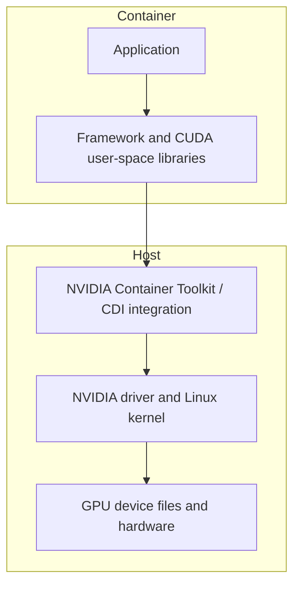
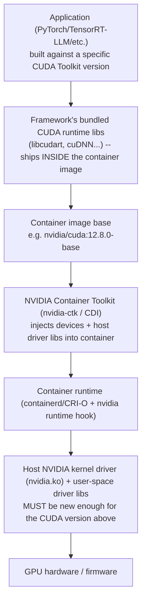

## The NVIDIA software stack, layer by layer

Many beginners hear "CUDA" used for the entire stack. Separate the layers:

| Layer | What it provides | Typical question |
|---|---|---|
| Application | Your training, inference or scientific program | Is the workload correct and configured properly? |
| Framework/engine | PyTorch, TensorFlow, TensorRT, serving engine | Which operations, precision, batching and parallelism are used? |
| CUDA-X libraries | Optimized building blocks such as cuBLAS, cuDNN and NCCL | Is the expected optimized library and communication path active? |
| CUDA runtime | User-space API used to allocate, copy and launch work | Can the process initialize and execute CUDA work? |
| CUDA Toolkit | Development tools, compiler, headers, runtime and utilities | Is this a build environment or only a runtime environment? |
| NVIDIA driver | Kernel and user components controlling the GPU | Does the OS recognize and communicate with the device? |
| Firmware/hardware | Low-level device behavior and physical accelerator | Is the device healthy and compatible with the platform? |

**cuBLAS** supplies optimized basic linear-algebra operations. **cuDNN** supplies tuned deep-neural-network primitives. **NCCL** provides topology-aware collective communication across GPUs. NCCL is not a scheduler or a full parallel programming framework.

### Driver versus Toolkit versus runtime

The driver is installed for the host and must support the GPU and the CUDA user-space requirements. The Toolkit is needed to compile CUDA applications and includes development tools; a production container may need only runtime libraries and the application.

When `nvidia-smi` displays a "CUDA Version," do not automatically interpret it as the exact Toolkit installed in the container. It represents driver capability information. Check the actual user-space environment separately.

## Why containers still depend on the host

A container image packages user-space files: application, Python packages, framework and often CUDA libraries. It does not bring its own host Linux kernel or magically contain a working physical GPU.



NVIDIA Container Toolkit integrates GPU devices and required host-side driver capabilities with supported container runtimes. Current GPU Operator releases use the Container Device Interface (CDI) as the default device-injection mechanism, so version-specific procedures matter.

The useful troubleshooting boundary is:

- GPU absent from `lspci`: hardware/firmware/PCIe discovery boundary.
- GPU in `lspci` but `nvidia-smi` fails: driver/device initialization boundary.
- Host `nvidia-smi` works but container cannot see the GPU: allocation/runtime/CDI/container-toolkit boundary.
- Container sees the GPU but framework reports unavailable: framework/user-space compatibility or environment boundary.
- Framework works on one GPU but distributed job fails: topology, launcher, NCCL or network boundary.

## CUDA and CUDA-X

**CUDA** is NVIDIA's parallel-computing platform and programming model. The CUDA Toolkit includes a compiler and development tools as well as runtime components. Most infrastructure engineers interact with applications that use CUDA through frameworks rather than writing kernels directly.

**CUDA-X** is the broader family of accelerated libraries, tools and technologies built on CUDA. Important examples include:

| Component | Role |
|---|---|
| cuBLAS | GPU-accelerated basic linear algebra |
| cuDNN | optimized deep-neural-network primitives |
| NCCL | topology-aware multi-GPU collectives |
| TensorRT | optimizer/runtime for high-performance inference |
| TensorRT-LLM | inference stack focused on large language models |
| RAPIDS | GPU-accelerated data-science ecosystem |
| CUDA-GDB / Nsight tools | debugging and performance analysis |

The infrastructure question is rarely "is CUDA installed?" Ask which application, framework, user-space library versions, driver branch, GPU architecture and container image must work together.

## NGC: distribution, not an execution layer

NVIDIA NGC is a catalog/registry used to distribute containers, models, SDKs and related artifacts. Pulling an NGC container gives you packaged user space. It does not allocate a GPU, install a compatible host driver, configure Kubernetes, supply production secrets, or validate your workload.

Treat artifact identity as part of reproducibility:

- use an explicit supported tag or digest;
- record model and container versions together;
- scan and govern images according to your organization;
- validate against the target driver/platform support matrix;
- promote the same tested artifact rather than rebuilding for production.

**Learning outcome:** Know which layer must be compatible and which parts are host versus container responsibility.


Figure 1. Debug bottom-up: hardware/driver before container runtime, operator, model server and application.

The kernel/user-space NVIDIA driver enables device access. CUDA provides a programming/runtime ecosystem and accelerated libraries. Application containers typically carry compatible user-space libraries while relying on the host driver. NVIDIA Container Toolkit configures container runtime integration so containers receive GPU devices and driver libraries.

```
nvidia-smi
cat /proc/driver/nvidia/version
docker run --rm --gpus all nvidia/cuda:12.8.0-base-ubuntu24.04 nvidia-smi
```

Do not diagnose "CUDA mismatch" from one version string alone. Compatibility has direction and constraints: application/runtime libraries, container image, host driver, framework build and GPU architecture all participate. Use the compatibility matrix/documentation for the versions in question.

---

**ASCII diagram — the "bottom-up" debugging figure from Figure 1, made explicit as a layered stack with the actual compatibility direction:**

Compatibility direction: driver version sets a MAXIMUM supported CUDA version (backward compatible), not the reverse — an old host driver cannot run a container built against a newer CUDA than it supports.
This is the mechanical reason "check one version string" fails: a passing `nvidia-smi` on the host only proves the driver loaded and can enumerate the GPU — it says nothing about whether *this specific container's* bundled CUDA runtime is within that driver's supported range.

**Annotated real output proving each layer separately (the exact commands from the chapter, with what a pass/fail actually looks like):**

```mermaid
flowchart TD
  %% Converted from the original ASCII diagram; source wording is preserved.
  n0["$ nvidia-smi"]
  n1["Driver Version: 550.90.07 CUDA Version: 12.4 ← 'CUDA Version' here is the MAX CUDA the driver supports, not what's installed"]
  n2["$ cat /proc/driver/nvidia/version"]
  n3["NVRM version: NVIDIA UNIX x86_64 Kernel Module 550.90.07 Wed Feb 21 ..."]
  n4["GCC version: gcc version 11.4.0 ..."]
  n5["← proves the kernel module loaded; independent of any container"]
  n6["$ docker run --rm --gpus all nvidia/cuda:12.8.0-base-ubuntu24.04 nvidia-smi"]
  n7["docker: Error response from daemon: OCI runtime create failed: ..."]
  n8["unsatisfied condition: cuda>=12.8, please update your driver to a newer version"]
  n9["← THIS is the failure the chapter warns about: driver (max"]
  n10["CUDA 12.4) cannot satisfy an image requiring CUDA>=12.8."]
  n11["'nvidia-smi works on host' said nothing about this."]
```

That last error message is the single most common real-world Xid-adjacent support ticket in GPU fleets: the host driver is fine, the GPU is fine, and the failure is purely a version-skew boundary between driver and container image — exactly what the chapter's closing paragraph is warning you not to shortcut.

**Extra worked scenario — driver/CUDA skew across a fleet, the operational consequence at scale:**
> **Situation:** A 200-node GPU fleet was provisioned over 18 months. 60 nodes have driver 535.x (older), 140 have driver 550.x (newer). A new inference image built against CUDA 12.6 is rolled out fleet-wide via a single Deployment.
> 1. Pods scheduled onto the 140 newer-driver nodes start fine. Pods scheduled onto the 60 older-driver nodes fail at container start with the "please update your driver" error above, or — worse — start but fail *inside* a specific kernel call at runtime (partial compatibility) rather than failing cleanly at launch.
> 2. Kubernetes has no native concept of "driver version compatible with this image" — the scheduler only sees `nvidia.com/gpu: 1` as a fungible resource count, so it happily schedules the incompatible Pod onto an old-driver node and lets it crash-loop.
> 3. Fix at the platform layer: GPU Operator/GFD-driven **node labels** for driver version (e.g. `nvidia.com/cuda.driver-version`), combined with a `nodeSelector`/`nodeAffinity` on the Deployment restricting it to nodes whose label satisfies the image's minimum driver requirement — turning an invisible runtime failure into a scheduling constraint the cluster enforces.
> 4. Longer-term fix: standardize driver version fleet-wide via GPU Operator's managed driver (rather than host-installed drivers per node), so "which driver is on this node" stops being a per-node accident of provisioning history.
> **Interview-ready line:** "Kubernetes schedules on GPU *count*, not GPU *software compatibility* — closing that gap is exactly what GPU Operator node labels plus nodeAffinity are for, and it's the first thing I'd check in a fleet with mixed driver versions."

**Shortcut — one-liner to fleet-scan for driver/CUDA-capability skew before it becomes a scheduling incident:**
```bash
for node in $(kubectl get nodes -l nvidia.com/gpu.present=true -o name); do
  n=${node#node/}
  echo "$n: $(kubectl get node $n -o jsonpath='{.metadata.labels.nvidia\.com/cuda\.driver-version\.full}')"
done | sort -t: -k2
```
Sorting by driver version surfaces outlier nodes (the stragglers from an incomplete rollout) in one glance — this is the exact triage step before rolling out any image with a raised CUDA minimum.

**Practice (continuation — original chapter had no numbered Practice list; these are new):**
1. Explain, without saying "version mismatch," the specific direction of the compatibility constraint between host driver and container CUDA version (which one sets the ceiling for the other).
2. A container fails with a CUDA error only after running for several minutes under load, not at startup — argue why this is *more* consistent with a partial/edge-case compatibility gap (e.g. a newer kernel API path only hit under specific conditions) than with the clean "please update your driver" failure shown above, and what evidence you'd gather to confirm it (`dmesg -T | grep -i nvrm`, exact driver/CUDA/framework version triad).
