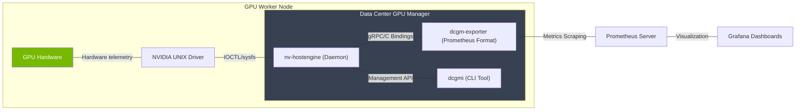

# Masterclass: GPU Sharing, Telemetry, and Lifecycle Operations

## Introduction
Welcome to the definitive masterclass on NVIDIA GPU sharing mechanisms, fleet telemetry, failure domain design, and lifecycle operations. In this masterclass, we will progress from beginner concepts to advanced NVIDIA AI Factory operations. This document serves as a comprehensive guide for DevOps, SRE, Platform, and MLOps engineers tasked with designing, deploying, and maintaining large-scale GPU clusters.

This masterclass is divided into six critical domains:
1. **GPU Sharing Fundamentals to Advanced (MIG, MPS, Time-Slicing, vGPU)**
2. **Fleet Telemetry & DCGM (Data Center GPU Manager)**
3. **Capacity and Failure Domain Design**
4. **Fleet Lifecycle, Upgrades, & Draining**
5. **Known-Good Validation**
6. **Senior Solutions Architect Troubleshooting & Interview Scenarios**

## Part 1: GPU Sharing Strategies
At the heart of any dense GPU deployment is the question of utilization. A modern H100 or A100 GPU is an incredibly powerful processor, often too powerful for a single lightweight inference workload or development notebook. To achieve optimal ROI and hardware utilization, engineers must employ GPU sharing.

### 1.1 Time-Slicing
Time-slicing is the most fundamental form of sharing. It leverages the OS and the NVIDIA driver to context-switch multiple processes on the GPU's compute engines.

#### The Architecture of Time-Slicing
When multiple processes address the same GPU without hardware partitioning, the GPU scheduler allocates time slots to each process. While one process executes, others are paused. Memory is fundamentally un-isolated from a capacity perspective (though virtually isolated via standard page tables).

```bash
# Standard time-slicing does not require complex configuration,
# but you can configure Kubernetes device plugins to allow multiple
# pods to request the same physical GPU.
cat <<EOF > time-slicing-config.yaml
version: v1
sharing:
  timeSlicing:
    resources:
    - name: nvidia.com/gpu
      replicas: 4
EOF
```

**Pros:** High flexibility, zero hardware configuration, allows oversubscription.
**Cons:** High context-switching overhead, jitter in latency-sensitive workloads (inference), lack of memory capacity isolation (OOM in one process can impact the entire GPU if not managed via cgroups), zero fault isolation.

:::warning Time-Slicing Danger
In a production environment, if Process A attempts to allocate more VRAM than is available, the CUDA runtime will throw an OutOfMemory error. If Process A pins memory aggressively, it can starve Process 0. Time-slicing is heavily discouraged for multi-tenant isolation.
:::
In a production environment, if Process A attempts to allocate more VRAM than is available, the CUDA runtime will throw an OutOfMemory error. If Process A pins memory aggressively, it can starve Process 1. Time-slicing is heavily discouraged for multi-tenant isolation.
In a production environment, if Process A attempts to allocate more VRAM than is available, the CUDA runtime will throw an OutOfMemory error. If Process A pins memory aggressively, it can starve Process 2. Time-slicing is heavily discouraged for multi-tenant isolation.
In a production environment, if Process A attempts to allocate more VRAM than is available, the CUDA runtime will throw an OutOfMemory error. If Process A pins memory aggressively, it can starve Process 3. Time-slicing is heavily discouraged for multi-tenant isolation.
In a production environment, if Process A attempts to allocate more VRAM than is available, the CUDA runtime will throw an OutOfMemory error. If Process A pins memory aggressively, it can starve Process 4. Time-slicing is heavily discouraged for multi-tenant isolation.
In a production environment, if Process A attempts to allocate more VRAM than is available, the CUDA runtime will throw an OutOfMemory error. If Process A pins memory aggressively, it can starve Process 5. Time-slicing is heavily discouraged for multi-tenant isolation.
In a production environment, if Process A attempts to allocate more VRAM than is available, the CUDA runtime will throw an OutOfMemory error. If Process A pins memory aggressively, it can starve Process 6. Time-slicing is heavily discouraged for multi-tenant isolation.
In a production environment, if Process A attempts to allocate more VRAM than is available, the CUDA runtime will throw an OutOfMemory error. If Process A pins memory aggressively, it can starve Process 7. Time-slicing is heavily discouraged for multi-tenant isolation.
In a production environment, if Process A attempts to allocate more VRAM than is available, the CUDA runtime will throw an OutOfMemory error. If Process A pins memory aggressively, it can starve Process 8. Time-slicing is heavily discouraged for multi-tenant isolation.
In a production environment, if Process A attempts to allocate more VRAM than is available, the CUDA runtime will throw an OutOfMemory error. If Process A pins memory aggressively, it can starve Process 9. Time-slicing is heavily discouraged for multi-tenant isolation.

### 1.2 MPS (Multi-Process Service)
MPS was introduced to mitigate the context-switching overhead of Time-Slicing. It acts as a transparent proxy, intercepting CUDA API calls from multiple client processes and funneling them into a single context on the GPU.

#### MPS Architecture and Execution
MPS comprises a control daemon (`nvidia-cuda-mps-control`) and a server process (`nvidia-cuda-mps-server`).

```bash
#!/bin/bash
# Script to enable MPS on a specific GPU
export CUDA_VISIBLE_DEVICES=0
export CUDA_MPS_PIPE_DIRECTORY=/tmp/nvidia-mps
export CUDA_MPS_LOG_DIRECTORY=/tmp/nvidia-log

# Start the daemon
nvidia-cuda-mps-control -d

# Set compute mode to EXCLUSIVE_PROCESS to ensure only the MPS server can access the GPU directly
sudo nvidia-smi -i 0 -c EXCLUSIVE_PROCESS

# Provision resources (e.g., limit a client to 20% of threads)
echo set_default_active_thread_percentage 20 | nvidia-cuda-mps-control
```

**Deep Dive:** MPS allows concurrent execution of kernels from different processes on the same Streaming Multiprocessors (SMs). This massively increases utilization for small batch sizes. However, memory isolation is still not absolute at the hardware level, though MPS clients can be restricted in their memory allocation via `CUDA_MPS_PINNED_DEVICE_MEM_LIMIT`.

MPS limitation 0: When a critical fault occurs in one MPS client, such as an illegal memory access (XID 31), the MPS server may crash, tearing down the shared context and destroying the state of all other concurrent clients. This lack of fault isolation makes MPS unsuitable for untrusted multi-tenancy.
MPS limitation 1: When a critical fault occurs in one MPS client, such as an illegal memory access (XID 31), the MPS server may crash, tearing down the shared context and destroying the state of all other concurrent clients. This lack of fault isolation makes MPS unsuitable for untrusted multi-tenancy.
MPS limitation 2: When a critical fault occurs in one MPS client, such as an illegal memory access (XID 31), the MPS server may crash, tearing down the shared context and destroying the state of all other concurrent clients. This lack of fault isolation makes MPS unsuitable for untrusted multi-tenancy.
MPS limitation 3: When a critical fault occurs in one MPS client, such as an illegal memory access (XID 31), the MPS server may crash, tearing down the shared context and destroying the state of all other concurrent clients. This lack of fault isolation makes MPS unsuitable for untrusted multi-tenancy.
MPS limitation 4: When a critical fault occurs in one MPS client, such as an illegal memory access (XID 31), the MPS server may crash, tearing down the shared context and destroying the state of all other concurrent clients. This lack of fault isolation makes MPS unsuitable for untrusted multi-tenancy.
MPS limitation 5: When a critical fault occurs in one MPS client, such as an illegal memory access (XID 31), the MPS server may crash, tearing down the shared context and destroying the state of all other concurrent clients. This lack of fault isolation makes MPS unsuitable for untrusted multi-tenancy.
MPS limitation 6: When a critical fault occurs in one MPS client, such as an illegal memory access (XID 31), the MPS server may crash, tearing down the shared context and destroying the state of all other concurrent clients. This lack of fault isolation makes MPS unsuitable for untrusted multi-tenancy.
MPS limitation 7: When a critical fault occurs in one MPS client, such as an illegal memory access (XID 31), the MPS server may crash, tearing down the shared context and destroying the state of all other concurrent clients. This lack of fault isolation makes MPS unsuitable for untrusted multi-tenancy.
MPS limitation 8: When a critical fault occurs in one MPS client, such as an illegal memory access (XID 31), the MPS server may crash, tearing down the shared context and destroying the state of all other concurrent clients. This lack of fault isolation makes MPS unsuitable for untrusted multi-tenancy.
MPS limitation 9: When a critical fault occurs in one MPS client, such as an illegal memory access (XID 31), the MPS server may crash, tearing down the shared context and destroying the state of all other concurrent clients. This lack of fault isolation makes MPS unsuitable for untrusted multi-tenancy.
MPS limitation 10: When a critical fault occurs in one MPS client, such as an illegal memory access (XID 31), the MPS server may crash, tearing down the shared context and destroying the state of all other concurrent clients. This lack of fault isolation makes MPS unsuitable for untrusted multi-tenancy.
MPS limitation 11: When a critical fault occurs in one MPS client, such as an illegal memory access (XID 31), the MPS server may crash, tearing down the shared context and destroying the state of all other concurrent clients. This lack of fault isolation makes MPS unsuitable for untrusted multi-tenancy.
MPS limitation 12: When a critical fault occurs in one MPS client, such as an illegal memory access (XID 31), the MPS server may crash, tearing down the shared context and destroying the state of all other concurrent clients. This lack of fault isolation makes MPS unsuitable for untrusted multi-tenancy.
MPS limitation 13: When a critical fault occurs in one MPS client, such as an illegal memory access (XID 31), the MPS server may crash, tearing down the shared context and destroying the state of all other concurrent clients. This lack of fault isolation makes MPS unsuitable for untrusted multi-tenancy.
MPS limitation 14: When a critical fault occurs in one MPS client, such as an illegal memory access (XID 31), the MPS server may crash, tearing down the shared context and destroying the state of all other concurrent clients. This lack of fault isolation makes MPS unsuitable for untrusted multi-tenancy.

### 1.3 MIG (Multi-Instance GPU)
MIG, introduced in the Ampere architecture (A100) and refined in Hopper (H100), is the gold standard for secure, hardware-level GPU partitioning. It partitions the GPU into up to 7 fully isolated instances.

#### MIG Hardware Partitioning
MIG physically divides the GPU's memory controllers, L2 cache, and SMs. Each MIG instance acts as an independent PCIe device to the operating system.

```mermaid
flowchart TD
    subgraph PhysicalGPU["Physical GPU (e.g. H100 80GB)"]
        direction TB
        subgraph MIG1["MIG Instance 1 (3g.40gb)"]
            MC1["Memory Controllers (40GB)"]
            L2_1["L2 Cache Slices"]
            SM1["Streaming Multiprocessors (3/7)"]
            MC1 --- L2_1 --- SM1
        end
        
        subgraph MIG2["MIG Instance 2 (2g.20gb)"]
            MC2["Memory Controllers (20GB)"]
            L2_2["L2 Cache Slices"]
            SM2["Streaming Multiprocessors (2/7)"]
            MC2 --- L2_2 --- SM2
        end
        
        subgraph MIG3["MIG Instance 3 (1g.10gb)"]
            MC3["Memory Controllers (10GB)"]
            L2_3["L2 Cache Slices"]
            SM3["Streaming Multiprocessors (1/7)"]
            MC3 --- L2_3 --- SM3
        end
    end
    
    style PhysicalGPU fill:#f4f4f4,stroke:#333,stroke-width:2px,color:#000
    style MIG1 fill:#76b900,color:#fff
    style MIG2 fill:#76b900,color:#fff
    style MIG3 fill:#76b900,color:#fff
```



#### Configuring MIG via nvidia-smi
MIG configuration requires placing the GPU into MIG mode, which traditionally requires a reset.

```bash
# 1. Enable MIG mode (requires root, may require driver reload or node reboot)
sudo nvidia-smi -i 0 -mig 1

# 2. List available MIG profiles
nvidia-smi mig -lgip

# 3. Create GPU Instances (GI)
# Creating a 3g.40gb instance on GPU 0
sudo nvidia-smi mig -cgi 3g.40gb -i 0

# 4. Create Compute Instances (CI) within the GI
# Usually, you create one CI per GI for standard partitioning
sudo nvidia-smi mig -cci -i 0 -gi 1
```

:::info NVLink and MIG
MIG constraint 0: Not all workloads benefit from MIG. Workloads that require massive P2P bandwidth via NVLink cannot span across MIG instances. MIG disables NVLink P2P between instances, forcing traffic over the PCIe bus, which severely degrades multi-GPU training performance if attempted.
:::
MIG constraint 1: Not all workloads benefit from MIG. Workloads that require massive P2P bandwidth via NVLink cannot span across MIG instances. MIG disables NVLink P2P between instances, forcing traffic over the PCIe bus, which severely degrades multi-GPU training performance if attempted.
MIG constraint 2: Not all workloads benefit from MIG. Workloads that require massive P2P bandwidth via NVLink cannot span across MIG instances. MIG disables NVLink P2P between instances, forcing traffic over the PCIe bus, which severely degrades multi-GPU training performance if attempted.
MIG constraint 3: Not all workloads benefit from MIG. Workloads that require massive P2P bandwidth via NVLink cannot span across MIG instances. MIG disables NVLink P2P between instances, forcing traffic over the PCIe bus, which severely degrades multi-GPU training performance if attempted.
MIG constraint 4: Not all workloads benefit from MIG. Workloads that require massive P2P bandwidth via NVLink cannot span across MIG instances. MIG disables NVLink P2P between instances, forcing traffic over the PCIe bus, which severely degrades multi-GPU training performance if attempted.
MIG constraint 5: Not all workloads benefit from MIG. Workloads that require massive P2P bandwidth via NVLink cannot span across MIG instances. MIG disables NVLink P2P between instances, forcing traffic over the PCIe bus, which severely degrades multi-GPU training performance if attempted.
MIG constraint 6: Not all workloads benefit from MIG. Workloads that require massive P2P bandwidth via NVLink cannot span across MIG instances. MIG disables NVLink P2P between instances, forcing traffic over the PCIe bus, which severely degrades multi-GPU training performance if attempted.
MIG constraint 7: Not all workloads benefit from MIG. Workloads that require massive P2P bandwidth via NVLink cannot span across MIG instances. MIG disables NVLink P2P between instances, forcing traffic over the PCIe bus, which severely degrades multi-GPU training performance if attempted.
MIG constraint 8: Not all workloads benefit from MIG. Workloads that require massive P2P bandwidth via NVLink cannot span across MIG instances. MIG disables NVLink P2P between instances, forcing traffic over the PCIe bus, which severely degrades multi-GPU training performance if attempted.
MIG constraint 9: Not all workloads benefit from MIG. Workloads that require massive P2P bandwidth via NVLink cannot span across MIG instances. MIG disables NVLink P2P between instances, forcing traffic over the PCIe bus, which severely degrades multi-GPU training performance if attempted.
MIG constraint 10: Not all workloads benefit from MIG. Workloads that require massive P2P bandwidth via NVLink cannot span across MIG instances. MIG disables NVLink P2P between instances, forcing traffic over the PCIe bus, which severely degrades multi-GPU training performance if attempted.
MIG constraint 11: Not all workloads benefit from MIG. Workloads that require massive P2P bandwidth via NVLink cannot span across MIG instances. MIG disables NVLink P2P between instances, forcing traffic over the PCIe bus, which severely degrades multi-GPU training performance if attempted.
MIG constraint 12: Not all workloads benefit from MIG. Workloads that require massive P2P bandwidth via NVLink cannot span across MIG instances. MIG disables NVLink P2P between instances, forcing traffic over the PCIe bus, which severely degrades multi-GPU training performance if attempted.
MIG constraint 13: Not all workloads benefit from MIG. Workloads that require massive P2P bandwidth via NVLink cannot span across MIG instances. MIG disables NVLink P2P between instances, forcing traffic over the PCIe bus, which severely degrades multi-GPU training performance if attempted.
MIG constraint 14: Not all workloads benefit from MIG. Workloads that require massive P2P bandwidth via NVLink cannot span across MIG instances. MIG disables NVLink P2P between instances, forcing traffic over the PCIe bus, which severely degrades multi-GPU training performance if attempted.
MIG constraint 15: Not all workloads benefit from MIG. Workloads that require massive P2P bandwidth via NVLink cannot span across MIG instances. MIG disables NVLink P2P between instances, forcing traffic over the PCIe bus, which severely degrades multi-GPU training performance if attempted.
MIG constraint 16: Not all workloads benefit from MIG. Workloads that require massive P2P bandwidth via NVLink cannot span across MIG instances. MIG disables NVLink P2P between instances, forcing traffic over the PCIe bus, which severely degrades multi-GPU training performance if attempted.
MIG constraint 17: Not all workloads benefit from MIG. Workloads that require massive P2P bandwidth via NVLink cannot span across MIG instances. MIG disables NVLink P2P between instances, forcing traffic over the PCIe bus, which severely degrades multi-GPU training performance if attempted.
MIG constraint 18: Not all workloads benefit from MIG. Workloads that require massive P2P bandwidth via NVLink cannot span across MIG instances. MIG disables NVLink P2P between instances, forcing traffic over the PCIe bus, which severely degrades multi-GPU training performance if attempted.
MIG constraint 19: Not all workloads benefit from MIG. Workloads that require massive P2P bandwidth via NVLink cannot span across MIG instances. MIG disables NVLink P2P between instances, forcing traffic over the PCIe bus, which severely degrades multi-GPU training performance if attempted.

### 1.4 vGPU (Virtual GPU)
While MIG partitions hardware for bare-metal or containerized workloads, vGPU operates at the hypervisor level. It uses NVIDIA's proprietary driver to mediate access between virtual machines and the physical GPU.

vGPU is typically used in VDI (Virtual Desktop Infrastructure) or enterprise cloud environments (like vSphere or AHV) where strict VM isolation is mandated. It requires an active NVIDIA license server (DLS/CLS).

**vGPU Operational Note:** When configuring SR-IOV for vGPU on modern architectures, ensure that the BIOS settings have SR-IOV enabled, VT-d/IOMMU enabled, and that the host OS kernel boots with `intel_iommu=on` or `amd_iommu=on`. Without these IOMMU groups properly initialized, the VFIO driver cannot bind the virtual functions to the guests.


## Part 2: Fleet Telemetry & DCGM
Operating a fleet of thousands of GPUs requires granular, real-time observability. The NVIDIA Data Center GPU Manager (DCGM) is the definitive tool for this task.

### 2.1 DCGM Architecture
DCGM runs as a daemon (`nv-hostengine`) on the host. It polls the driver and hardware directly, bypassing NVML's higher latency in some fast-path metrics, and exposes APIs for health checking, profiling, and policy management.



### 2.2 DCGM Exporter Configuration
By default, `dcgm-exporter` exports a subset of metrics. In an AI Factory, you need custom metrics, especially for profiling (Tensor Core utilization, NVLink bandwidth).

#### Custom metrics.csv
```csv
# Format: DCGM_FIELD_ID, Prometheus_Name, Prometheus_Type, Description
DCGM_FI_DEV_SM_CLOCK, dcgm_sm_clock, gauge, SM clock frequency (in MHz).
DCGM_FI_DEV_MEM_CLOCK, dcgm_memory_clock, gauge, Memory clock frequency (in MHz).
DCGM_FI_DEV_GPU_TEMP, dcgm_gpu_temp, gauge, GPU temperature (in C).
DCGM_FI_DEV_POWER_USAGE, dcgm_power_usage, gauge, Power draw (in W).
DCGM_FI_PROF_PIPE_TENSOR_ACTIVE, dcgm_tensor_core_active, gauge, Ratio of cycles the tensor cores were active.
DCGM_FI_PROF_NVLINK_TX_BYTES, dcgm_nvlink_tx_bytes, counter, NVLink transmit bytes.
DCGM_FI_PROF_NVLINK_RX_BYTES, dcgm_nvlink_rx_bytes, counter, NVLink receive bytes.
```

To run DCGM exporter with these metrics in Docker:
```bash
docker run -d --gpus all \
  --cap-add SYS_ADMIN \
  -v /path/to/custom_metrics.csv:/etc/dcgm-exporter/default-counters.csv \
  -p 9400:9400 \
  nvcr.io/nvidia/k8s/dcgm-exporter:latest \
  -f /etc/dcgm-exporter/default-counters.csv
```

### 2.3 Hardware Health, ECC, and XID Semantics
GPUs will fail. Understanding the semantics of these failures is the difference between a 3 AM page and an automated self-healing cluster.

#### ECC Errors (SBE vs DBE)
- **SBE (Single-Bit Error):** Automatically corrected by ECC memory. High rates of SBEs indicate impending hardware failure (often handled via row remapping on Ampere/Hopper).
- **DBE (Double-Bit Error):** Uncorrectable. Results in application crash (XID 48/62). Requires node isolation and typically GPU replacement if row remapping fails.

**XID 13: Graphics Engine Exception. Often a software bug in the CUDA kernel, out-of-bounds memory access, or an illegal instruction. Rarely a hardware failure.**
:::tip Automated Remediation for XID 13
Extended troubleshooting for XID 13: When this XID is detected in the syslog, the automated remediation pipeline should scrape the DCGM diagnostics. If the diagnostic returns a hardware failure code, the node must be cordoned via the Kubernetes API, and the specific GPU PCIe BDF address logged for field service replacement.
:::
Extended troubleshooting for XID 13: When this XID is detected in the syslog, the automated remediation pipeline should scrape the DCGM diagnostics. If the diagnostic returns a hardware failure code, the node must be cordoned via the Kubernetes API, and the specific GPU PCIe BDF address logged for field service replacement.
Extended troubleshooting for XID 13: When this XID is detected in the syslog, the automated remediation pipeline should scrape the DCGM diagnostics. If the diagnostic returns a hardware failure code, the node must be cordoned via the Kubernetes API, and the specific GPU PCIe BDF address logged for field service replacement.

**XID 31: GPU Memory Page Fault. A process tried to access unallocated memory. Similar to a segfault. Almost always a software issue. Ensure workloads are not leaking memory.**
Extended troubleshooting for XID 31: When this XID is detected in the syslog, the automated remediation pipeline should scrape the DCGM diagnostics. If the diagnostic returns a hardware failure code, the node must be cordoned via the Kubernetes API, and the specific GPU PCIe BDF address logged for field service replacement.
Extended troubleshooting for XID 31: When this XID is detected in the syslog, the automated remediation pipeline should scrape the DCGM diagnostics. If the diagnostic returns a hardware failure code, the node must be cordoned via the Kubernetes API, and the specific GPU PCIe BDF address logged for field service replacement.

**XID 43: Stopped processing. The GPU fell off the bus. PCIe AER (Advanced Error Reporting) triggered. Often a physical seating issue, riser cable fault, or extreme thermal event.**
Extended troubleshooting for XID 43: When this XID is detected in the syslog, the automated remediation pipeline should scrape the DCGM diagnostics. If the diagnostic returns a hardware failure code, the node must be cordoned via the Kubernetes API, and the specific GPU PCIe BDF address logged for field service replacement.
Extended troubleshooting for XID 43: When this XID is detected in the syslog, the automated remediation pipeline should scrape the DCGM diagnostics. If the diagnostic returns a hardware failure code, the node must be cordoned via the Kubernetes API, and the specific GPU PCIe BDF address logged for field service replacement.

**XID 62: Internal Microcontroller Halt. A fatal hardware error in the GPU's internal RISC-V processors (GSP). Usually requires a reset. If persistent, requires RMA.**
Extended troubleshooting for XID 62: When this XID is detected in the syslog, the automated remediation pipeline should scrape the DCGM diagnostics. If the diagnostic returns a hardware failure code, the node must be cordoned via the Kubernetes API, and the specific GPU PCIe BDF address logged for field service replacement.
Extended troubleshooting for XID 62: When this XID is detected in the syslog, the automated remediation pipeline should scrape the DCGM diagnostics. If the diagnostic returns a hardware failure code, the node must be cordoned via the Kubernetes API, and the specific GPU PCIe BDF address logged for field service replacement.

**XID 74: NVLink Error. CRC errors on the high-speed fabric. Check NVSwitch telemetry, optical transceivers (if NVLink C2C), or physical board seating.**
Extended troubleshooting for XID 74: When this XID is detected in the syslog, the automated remediation pipeline should scrape the DCGM diagnostics. If the diagnostic returns a hardware failure code, the node must be cordoned via the Kubernetes API, and the specific GPU PCIe BDF address logged for field service replacement.
Extended troubleshooting for XID 74: When this XID is detected in the syslog, the automated remediation pipeline should scrape the DCGM diagnostics. If the diagnostic returns a hardware failure code, the node must be cordoned via the Kubernetes API, and the specific GPU PCIe BDF address logged for field service replacement.

**XID 94: Contained ECC Error. An uncorrectable error occurred, but the GPU contained it to a specific process without crashing the whole chip (supported in later architectures).**
Extended troubleshooting for XID 94: When this XID is detected in the syslog, the automated remediation pipeline should scrape the DCGM diagnostics. If the diagnostic returns a hardware failure code, the node must be cordoned via the Kubernetes API, and the specific GPU PCIe BDF address logged for field service replacement.
Extended troubleshooting for XID 94: When this XID is detected in the syslog, the automated remediation pipeline should scrape the DCGM diagnostics. If the diagnostic returns a hardware failure code, the node must be cordoned via the Kubernetes API, and the specific GPU PCIe BDF address logged for field service replacement.

## Part 3: Capacity and Failure Domain Design
An AI Factory is not just a collection of GPUs; it is a meticulously designed synchronous engine. The network is the computer.

### 3.1 Node, Rack, and Pod Topologies
A standard HGX H100 node contains 8 GPUs fully connected via NVLink and NVSwitch. Network connectivity usually dictates 4 to 8 ConnectX-7 NICs (400Gbps NDR InfiniBand or RoCEv2) per node, providing a 1:1 GPU-to-NIC ratio (Rail-Optimized topology).

Topology constraint 0: When mapping MPI ranks to GPUs, the NCCL topology discovery mechanism must correctly identify the NUMA affinity. If GPU 0 (attached to NUMA 0 and NIC 0) attempts to communicate via NIC 4 (attached to NUMA 1), the QPI/UPI bus on the CPU will bottleneck the transfer, dropping bandwidth from 400Gbps to under 100Gbps.
Topology constraint 1: When mapping MPI ranks to GPUs, the NCCL topology discovery mechanism must correctly identify the NUMA affinity. If GPU 0 (attached to NUMA 0 and NIC 0) attempts to communicate via NIC 4 (attached to NUMA 1), the QPI/UPI bus on the CPU will bottleneck the transfer, dropping bandwidth from 400Gbps to under 100Gbps.
Topology constraint 2: When mapping MPI ranks to GPUs, the NCCL topology discovery mechanism must correctly identify the NUMA affinity. If GPU 0 (attached to NUMA 0 and NIC 0) attempts to communicate via NIC 4 (attached to NUMA 1), the QPI/UPI bus on the CPU will bottleneck the transfer, dropping bandwidth from 400Gbps to under 100Gbps.
Topology constraint 3: When mapping MPI ranks to GPUs, the NCCL topology discovery mechanism must correctly identify the NUMA affinity. If GPU 0 (attached to NUMA 0 and NIC 0) attempts to communicate via NIC 4 (attached to NUMA 1), the QPI/UPI bus on the CPU will bottleneck the transfer, dropping bandwidth from 400Gbps to under 100Gbps.
Topology constraint 4: When mapping MPI ranks to GPUs, the NCCL topology discovery mechanism must correctly identify the NUMA affinity. If GPU 0 (attached to NUMA 0 and NIC 0) attempts to communicate via NIC 4 (attached to NUMA 1), the QPI/UPI bus on the CPU will bottleneck the transfer, dropping bandwidth from 400Gbps to under 100Gbps.
Topology constraint 5: When mapping MPI ranks to GPUs, the NCCL topology discovery mechanism must correctly identify the NUMA affinity. If GPU 0 (attached to NUMA 0 and NIC 0) attempts to communicate via NIC 4 (attached to NUMA 1), the QPI/UPI bus on the CPU will bottleneck the transfer, dropping bandwidth from 400Gbps to under 100Gbps.
Topology constraint 6: When mapping MPI ranks to GPUs, the NCCL topology discovery mechanism must correctly identify the NUMA affinity. If GPU 0 (attached to NUMA 0 and NIC 0) attempts to communicate via NIC 4 (attached to NUMA 1), the QPI/UPI bus on the CPU will bottleneck the transfer, dropping bandwidth from 400Gbps to under 100Gbps.
Topology constraint 7: When mapping MPI ranks to GPUs, the NCCL topology discovery mechanism must correctly identify the NUMA affinity. If GPU 0 (attached to NUMA 0 and NIC 0) attempts to communicate via NIC 4 (attached to NUMA 1), the QPI/UPI bus on the CPU will bottleneck the transfer, dropping bandwidth from 400Gbps to under 100Gbps.
Topology constraint 8: When mapping MPI ranks to GPUs, the NCCL topology discovery mechanism must correctly identify the NUMA affinity. If GPU 0 (attached to NUMA 0 and NIC 0) attempts to communicate via NIC 4 (attached to NUMA 1), the QPI/UPI bus on the CPU will bottleneck the transfer, dropping bandwidth from 400Gbps to under 100Gbps.
Topology constraint 9: When mapping MPI ranks to GPUs, the NCCL topology discovery mechanism must correctly identify the NUMA affinity. If GPU 0 (attached to NUMA 0 and NIC 0) attempts to communicate via NIC 4 (attached to NUMA 1), the QPI/UPI bus on the CPU will bottleneck the transfer, dropping bandwidth from 400Gbps to under 100Gbps.
Topology constraint 10: When mapping MPI ranks to GPUs, the NCCL topology discovery mechanism must correctly identify the NUMA affinity. If GPU 0 (attached to NUMA 0 and NIC 0) attempts to communicate via NIC 4 (attached to NUMA 1), the QPI/UPI bus on the CPU will bottleneck the transfer, dropping bandwidth from 400Gbps to under 100Gbps.
Topology constraint 11: When mapping MPI ranks to GPUs, the NCCL topology discovery mechanism must correctly identify the NUMA affinity. If GPU 0 (attached to NUMA 0 and NIC 0) attempts to communicate via NIC 4 (attached to NUMA 1), the QPI/UPI bus on the CPU will bottleneck the transfer, dropping bandwidth from 400Gbps to under 100Gbps.
Topology constraint 12: When mapping MPI ranks to GPUs, the NCCL topology discovery mechanism must correctly identify the NUMA affinity. If GPU 0 (attached to NUMA 0 and NIC 0) attempts to communicate via NIC 4 (attached to NUMA 1), the QPI/UPI bus on the CPU will bottleneck the transfer, dropping bandwidth from 400Gbps to under 100Gbps.
Topology constraint 13: When mapping MPI ranks to GPUs, the NCCL topology discovery mechanism must correctly identify the NUMA affinity. If GPU 0 (attached to NUMA 0 and NIC 0) attempts to communicate via NIC 4 (attached to NUMA 1), the QPI/UPI bus on the CPU will bottleneck the transfer, dropping bandwidth from 400Gbps to under 100Gbps.
Topology constraint 14: When mapping MPI ranks to GPUs, the NCCL topology discovery mechanism must correctly identify the NUMA affinity. If GPU 0 (attached to NUMA 0 and NIC 0) attempts to communicate via NIC 4 (attached to NUMA 1), the QPI/UPI bus on the CPU will bottleneck the transfer, dropping bandwidth from 400Gbps to under 100Gbps.
Topology constraint 15: When mapping MPI ranks to GPUs, the NCCL topology discovery mechanism must correctly identify the NUMA affinity. If GPU 0 (attached to NUMA 0 and NIC 0) attempts to communicate via NIC 4 (attached to NUMA 1), the QPI/UPI bus on the CPU will bottleneck the transfer, dropping bandwidth from 400Gbps to under 100Gbps.
Topology constraint 16: When mapping MPI ranks to GPUs, the NCCL topology discovery mechanism must correctly identify the NUMA affinity. If GPU 0 (attached to NUMA 0 and NIC 0) attempts to communicate via NIC 4 (attached to NUMA 1), the QPI/UPI bus on the CPU will bottleneck the transfer, dropping bandwidth from 400Gbps to under 100Gbps.
Topology constraint 17: When mapping MPI ranks to GPUs, the NCCL topology discovery mechanism must correctly identify the NUMA affinity. If GPU 0 (attached to NUMA 0 and NIC 0) attempts to communicate via NIC 4 (attached to NUMA 1), the QPI/UPI bus on the CPU will bottleneck the transfer, dropping bandwidth from 400Gbps to under 100Gbps.
Topology constraint 18: When mapping MPI ranks to GPUs, the NCCL topology discovery mechanism must correctly identify the NUMA affinity. If GPU 0 (attached to NUMA 0 and NIC 0) attempts to communicate via NIC 4 (attached to NUMA 1), the QPI/UPI bus on the CPU will bottleneck the transfer, dropping bandwidth from 400Gbps to under 100Gbps.
Topology constraint 19: When mapping MPI ranks to GPUs, the NCCL topology discovery mechanism must correctly identify the NUMA affinity. If GPU 0 (attached to NUMA 0 and NIC 0) attempts to communicate via NIC 4 (attached to NUMA 1), the QPI/UPI bus on the CPU will bottleneck the transfer, dropping bandwidth from 400Gbps to under 100Gbps.
Topology constraint 20: When mapping MPI ranks to GPUs, the NCCL topology discovery mechanism must correctly identify the NUMA affinity. If GPU 0 (attached to NUMA 0 and NIC 0) attempts to communicate via NIC 4 (attached to NUMA 1), the QPI/UPI bus on the CPU will bottleneck the transfer, dropping bandwidth from 400Gbps to under 100Gbps.
Topology constraint 21: When mapping MPI ranks to GPUs, the NCCL topology discovery mechanism must correctly identify the NUMA affinity. If GPU 0 (attached to NUMA 0 and NIC 0) attempts to communicate via NIC 4 (attached to NUMA 1), the QPI/UPI bus on the CPU will bottleneck the transfer, dropping bandwidth from 400Gbps to under 100Gbps.
Topology constraint 22: When mapping MPI ranks to GPUs, the NCCL topology discovery mechanism must correctly identify the NUMA affinity. If GPU 0 (attached to NUMA 0 and NIC 0) attempts to communicate via NIC 4 (attached to NUMA 1), the QPI/UPI bus on the CPU will bottleneck the transfer, dropping bandwidth from 400Gbps to under 100Gbps.
Topology constraint 23: When mapping MPI ranks to GPUs, the NCCL topology discovery mechanism must correctly identify the NUMA affinity. If GPU 0 (attached to NUMA 0 and NIC 0) attempts to communicate via NIC 4 (attached to NUMA 1), the QPI/UPI bus on the CPU will bottleneck the transfer, dropping bandwidth from 400Gbps to under 100Gbps.
Topology constraint 24: When mapping MPI ranks to GPUs, the NCCL topology discovery mechanism must correctly identify the NUMA affinity. If GPU 0 (attached to NUMA 0 and NIC 0) attempts to communicate via NIC 4 (attached to NUMA 1), the QPI/UPI bus on the CPU will bottleneck the transfer, dropping bandwidth from 400Gbps to under 100Gbps.
Topology constraint 25: When mapping MPI ranks to GPUs, the NCCL topology discovery mechanism must correctly identify the NUMA affinity. If GPU 0 (attached to NUMA 0 and NIC 0) attempts to communicate via NIC 4 (attached to NUMA 1), the QPI/UPI bus on the CPU will bottleneck the transfer, dropping bandwidth from 400Gbps to under 100Gbps.
Topology constraint 26: When mapping MPI ranks to GPUs, the NCCL topology discovery mechanism must correctly identify the NUMA affinity. If GPU 0 (attached to NUMA 0 and NIC 0) attempts to communicate via NIC 4 (attached to NUMA 1), the QPI/UPI bus on the CPU will bottleneck the transfer, dropping bandwidth from 400Gbps to under 100Gbps.
Topology constraint 27: When mapping MPI ranks to GPUs, the NCCL topology discovery mechanism must correctly identify the NUMA affinity. If GPU 0 (attached to NUMA 0 and NIC 0) attempts to communicate via NIC 4 (attached to NUMA 1), the QPI/UPI bus on the CPU will bottleneck the transfer, dropping bandwidth from 400Gbps to under 100Gbps.
Topology constraint 28: When mapping MPI ranks to GPUs, the NCCL topology discovery mechanism must correctly identify the NUMA affinity. If GPU 0 (attached to NUMA 0 and NIC 0) attempts to communicate via NIC 4 (attached to NUMA 1), the QPI/UPI bus on the CPU will bottleneck the transfer, dropping bandwidth from 400Gbps to under 100Gbps.
Topology constraint 29: When mapping MPI ranks to GPUs, the NCCL topology discovery mechanism must correctly identify the NUMA affinity. If GPU 0 (attached to NUMA 0 and NIC 0) attempts to communicate via NIC 4 (attached to NUMA 1), the QPI/UPI bus on the CPU will bottleneck the transfer, dropping bandwidth from 400Gbps to under 100Gbps.

### 3.2 Blast Radius Analysis
In a synchronous training job (e.g., training a 175B parameter LLM), the failure of *one* GPU halts the entire training job across thousands of GPUs. The cluster must restart from the last checkpoint.
Therefore, failure domains must map to job schedulers.
- **Spine Switch Failure:** Affects an entire Pod. Massive blast radius.
- **Leaf Switch Failure:** Affects a Rack. 
- **Node Failure:** Affects 8 GPUs.

Failure domain mitigation 0: Job schedulers like Slurm or Kubernetes with Volcano must be topology-aware. Allocating a 64-GPU job across 8 nodes in a single rack limits the blast radius of a leaf switch failure to just that job, rather than tearing down jobs spanning multiple racks.
Failure domain mitigation 1: Job schedulers like Slurm or Kubernetes with Volcano must be topology-aware. Allocating a 64-GPU job across 8 nodes in a single rack limits the blast radius of a leaf switch failure to just that job, rather than tearing down jobs spanning multiple racks.
Failure domain mitigation 2: Job schedulers like Slurm or Kubernetes with Volcano must be topology-aware. Allocating a 64-GPU job across 8 nodes in a single rack limits the blast radius of a leaf switch failure to just that job, rather than tearing down jobs spanning multiple racks.
Failure domain mitigation 3: Job schedulers like Slurm or Kubernetes with Volcano must be topology-aware. Allocating a 64-GPU job across 8 nodes in a single rack limits the blast radius of a leaf switch failure to just that job, rather than tearing down jobs spanning multiple racks.
Failure domain mitigation 4: Job schedulers like Slurm or Kubernetes with Volcano must be topology-aware. Allocating a 64-GPU job across 8 nodes in a single rack limits the blast radius of a leaf switch failure to just that job, rather than tearing down jobs spanning multiple racks.
Failure domain mitigation 5: Job schedulers like Slurm or Kubernetes with Volcano must be topology-aware. Allocating a 64-GPU job across 8 nodes in a single rack limits the blast radius of a leaf switch failure to just that job, rather than tearing down jobs spanning multiple racks.
Failure domain mitigation 6: Job schedulers like Slurm or Kubernetes with Volcano must be topology-aware. Allocating a 64-GPU job across 8 nodes in a single rack limits the blast radius of a leaf switch failure to just that job, rather than tearing down jobs spanning multiple racks.
Failure domain mitigation 7: Job schedulers like Slurm or Kubernetes with Volcano must be topology-aware. Allocating a 64-GPU job across 8 nodes in a single rack limits the blast radius of a leaf switch failure to just that job, rather than tearing down jobs spanning multiple racks.
Failure domain mitigation 8: Job schedulers like Slurm or Kubernetes with Volcano must be topology-aware. Allocating a 64-GPU job across 8 nodes in a single rack limits the blast radius of a leaf switch failure to just that job, rather than tearing down jobs spanning multiple racks.
Failure domain mitigation 9: Job schedulers like Slurm or Kubernetes with Volcano must be topology-aware. Allocating a 64-GPU job across 8 nodes in a single rack limits the blast radius of a leaf switch failure to just that job, rather than tearing down jobs spanning multiple racks.
Failure domain mitigation 10: Job schedulers like Slurm or Kubernetes with Volcano must be topology-aware. Allocating a 64-GPU job across 8 nodes in a single rack limits the blast radius of a leaf switch failure to just that job, rather than tearing down jobs spanning multiple racks.
Failure domain mitigation 11: Job schedulers like Slurm or Kubernetes with Volcano must be topology-aware. Allocating a 64-GPU job across 8 nodes in a single rack limits the blast radius of a leaf switch failure to just that job, rather than tearing down jobs spanning multiple racks.
Failure domain mitigation 12: Job schedulers like Slurm or Kubernetes with Volcano must be topology-aware. Allocating a 64-GPU job across 8 nodes in a single rack limits the blast radius of a leaf switch failure to just that job, rather than tearing down jobs spanning multiple racks.
Failure domain mitigation 13: Job schedulers like Slurm or Kubernetes with Volcano must be topology-aware. Allocating a 64-GPU job across 8 nodes in a single rack limits the blast radius of a leaf switch failure to just that job, rather than tearing down jobs spanning multiple racks.
Failure domain mitigation 14: Job schedulers like Slurm or Kubernetes with Volcano must be topology-aware. Allocating a 64-GPU job across 8 nodes in a single rack limits the blast radius of a leaf switch failure to just that job, rather than tearing down jobs spanning multiple racks.
Failure domain mitigation 15: Job schedulers like Slurm or Kubernetes with Volcano must be topology-aware. Allocating a 64-GPU job across 8 nodes in a single rack limits the blast radius of a leaf switch failure to just that job, rather than tearing down jobs spanning multiple racks.
Failure domain mitigation 16: Job schedulers like Slurm or Kubernetes with Volcano must be topology-aware. Allocating a 64-GPU job across 8 nodes in a single rack limits the blast radius of a leaf switch failure to just that job, rather than tearing down jobs spanning multiple racks.
Failure domain mitigation 17: Job schedulers like Slurm or Kubernetes with Volcano must be topology-aware. Allocating a 64-GPU job across 8 nodes in a single rack limits the blast radius of a leaf switch failure to just that job, rather than tearing down jobs spanning multiple racks.
Failure domain mitigation 18: Job schedulers like Slurm or Kubernetes with Volcano must be topology-aware. Allocating a 64-GPU job across 8 nodes in a single rack limits the blast radius of a leaf switch failure to just that job, rather than tearing down jobs spanning multiple racks.
Failure domain mitigation 19: Job schedulers like Slurm or Kubernetes with Volcano must be topology-aware. Allocating a 64-GPU job across 8 nodes in a single rack limits the blast radius of a leaf switch failure to just that job, rather than tearing down jobs spanning multiple racks.
Failure domain mitigation 20: Job schedulers like Slurm or Kubernetes with Volcano must be topology-aware. Allocating a 64-GPU job across 8 nodes in a single rack limits the blast radius of a leaf switch failure to just that job, rather than tearing down jobs spanning multiple racks.
Failure domain mitigation 21: Job schedulers like Slurm or Kubernetes with Volcano must be topology-aware. Allocating a 64-GPU job across 8 nodes in a single rack limits the blast radius of a leaf switch failure to just that job, rather than tearing down jobs spanning multiple racks.
Failure domain mitigation 22: Job schedulers like Slurm or Kubernetes with Volcano must be topology-aware. Allocating a 64-GPU job across 8 nodes in a single rack limits the blast radius of a leaf switch failure to just that job, rather than tearing down jobs spanning multiple racks.
Failure domain mitigation 23: Job schedulers like Slurm or Kubernetes with Volcano must be topology-aware. Allocating a 64-GPU job across 8 nodes in a single rack limits the blast radius of a leaf switch failure to just that job, rather than tearing down jobs spanning multiple racks.
Failure domain mitigation 24: Job schedulers like Slurm or Kubernetes with Volcano must be topology-aware. Allocating a 64-GPU job across 8 nodes in a single rack limits the blast radius of a leaf switch failure to just that job, rather than tearing down jobs spanning multiple racks.

## Part 4: Fleet Lifecycle, Upgrades, & Draining
Maintaining driver hygiene and upgrading components without downtime is an art form.

### 4.1 Node Draining Protocol
Before patching a driver, you must safely drain the node.

```bash
# Advanced GPU Node Drain Script
NODE=$1

# 1. Cordon the node
kubectl cordon $NODE

# 2. Wait for actively running GPU jobs to complete (or forcefully evict after timeout)
echo "Waiting for GPU utilization to hit 0%..."
while true; do
    # Poll DCGM for active workloads across all GPUs on the node
    UTIL=$(ssh root@$NODE 'dcgmi dmon -e 203 -c 1 | tail -n +3 | awk "{s+=\$2} END {print s}"')
    if [ "$UTIL" -eq "0" ]; then
        echo "Node is idle. Proceeding with drain."
        break
    fi
    sleep 30
done

# 3. Terminate DCGM and NV-Hostengine to release file descriptors
ssh root@$NODE 'systemctl stop dcgm-exporter nv-hostengine'

# 4. Unload kernel modules (critical for driver upgrade without reboot)
ssh root@$NODE 'rmmod nvidia_uvm nvidia_drm nvidia_modeset nvidia'
```

Lifecycle nuance 0: If `rmmod nvidia` fails with 'module is in use', it means a process still holds a file descriptor open to `/dev/nvidia0` or `/dev/nvidiactl`. Use `lsof /dev/nvidia*` to identify the rogue process. It is often a zombie container, an unexpected X11 server, or a hanging monitoring agent like Datadog or Prometheus node-exporter.
Lifecycle nuance 1: If `rmmod nvidia` fails with 'module is in use', it means a process still holds a file descriptor open to `/dev/nvidia0` or `/dev/nvidiactl`. Use `lsof /dev/nvidia*` to identify the rogue process. It is often a zombie container, an unexpected X11 server, or a hanging monitoring agent like Datadog or Prometheus node-exporter.
Lifecycle nuance 2: If `rmmod nvidia` fails with 'module is in use', it means a process still holds a file descriptor open to `/dev/nvidia0` or `/dev/nvidiactl`. Use `lsof /dev/nvidia*` to identify the rogue process. It is often a zombie container, an unexpected X11 server, or a hanging monitoring agent like Datadog or Prometheus node-exporter.
Lifecycle nuance 3: If `rmmod nvidia` fails with 'module is in use', it means a process still holds a file descriptor open to `/dev/nvidia0` or `/dev/nvidiactl`. Use `lsof /dev/nvidia*` to identify the rogue process. It is often a zombie container, an unexpected X11 server, or a hanging monitoring agent like Datadog or Prometheus node-exporter.
Lifecycle nuance 4: If `rmmod nvidia` fails with 'module is in use', it means a process still holds a file descriptor open to `/dev/nvidia0` or `/dev/nvidiactl`. Use `lsof /dev/nvidia*` to identify the rogue process. It is often a zombie container, an unexpected X11 server, or a hanging monitoring agent like Datadog or Prometheus node-exporter.
Lifecycle nuance 5: If `rmmod nvidia` fails with 'module is in use', it means a process still holds a file descriptor open to `/dev/nvidia0` or `/dev/nvidiactl`. Use `lsof /dev/nvidia*` to identify the rogue process. It is often a zombie container, an unexpected X11 server, or a hanging monitoring agent like Datadog or Prometheus node-exporter.
Lifecycle nuance 6: If `rmmod nvidia` fails with 'module is in use', it means a process still holds a file descriptor open to `/dev/nvidia0` or `/dev/nvidiactl`. Use `lsof /dev/nvidia*` to identify the rogue process. It is often a zombie container, an unexpected X11 server, or a hanging monitoring agent like Datadog or Prometheus node-exporter.
Lifecycle nuance 7: If `rmmod nvidia` fails with 'module is in use', it means a process still holds a file descriptor open to `/dev/nvidia0` or `/dev/nvidiactl`. Use `lsof /dev/nvidia*` to identify the rogue process. It is often a zombie container, an unexpected X11 server, or a hanging monitoring agent like Datadog or Prometheus node-exporter.
Lifecycle nuance 8: If `rmmod nvidia` fails with 'module is in use', it means a process still holds a file descriptor open to `/dev/nvidia0` or `/dev/nvidiactl`. Use `lsof /dev/nvidia*` to identify the rogue process. It is often a zombie container, an unexpected X11 server, or a hanging monitoring agent like Datadog or Prometheus node-exporter.
Lifecycle nuance 9: If `rmmod nvidia` fails with 'module is in use', it means a process still holds a file descriptor open to `/dev/nvidia0` or `/dev/nvidiactl`. Use `lsof /dev/nvidia*` to identify the rogue process. It is often a zombie container, an unexpected X11 server, or a hanging monitoring agent like Datadog or Prometheus node-exporter.
Lifecycle nuance 10: If `rmmod nvidia` fails with 'module is in use', it means a process still holds a file descriptor open to `/dev/nvidia0` or `/dev/nvidiactl`. Use `lsof /dev/nvidia*` to identify the rogue process. It is often a zombie container, an unexpected X11 server, or a hanging monitoring agent like Datadog or Prometheus node-exporter.
Lifecycle nuance 11: If `rmmod nvidia` fails with 'module is in use', it means a process still holds a file descriptor open to `/dev/nvidia0` or `/dev/nvidiactl`. Use `lsof /dev/nvidia*` to identify the rogue process. It is often a zombie container, an unexpected X11 server, or a hanging monitoring agent like Datadog or Prometheus node-exporter.
Lifecycle nuance 12: If `rmmod nvidia` fails with 'module is in use', it means a process still holds a file descriptor open to `/dev/nvidia0` or `/dev/nvidiactl`. Use `lsof /dev/nvidia*` to identify the rogue process. It is often a zombie container, an unexpected X11 server, or a hanging monitoring agent like Datadog or Prometheus node-exporter.
Lifecycle nuance 13: If `rmmod nvidia` fails with 'module is in use', it means a process still holds a file descriptor open to `/dev/nvidia0` or `/dev/nvidiactl`. Use `lsof /dev/nvidia*` to identify the rogue process. It is often a zombie container, an unexpected X11 server, or a hanging monitoring agent like Datadog or Prometheus node-exporter.
Lifecycle nuance 14: If `rmmod nvidia` fails with 'module is in use', it means a process still holds a file descriptor open to `/dev/nvidia0` or `/dev/nvidiactl`. Use `lsof /dev/nvidia*` to identify the rogue process. It is often a zombie container, an unexpected X11 server, or a hanging monitoring agent like Datadog or Prometheus node-exporter.
Lifecycle nuance 15: If `rmmod nvidia` fails with 'module is in use', it means a process still holds a file descriptor open to `/dev/nvidia0` or `/dev/nvidiactl`. Use `lsof /dev/nvidia*` to identify the rogue process. It is often a zombie container, an unexpected X11 server, or a hanging monitoring agent like Datadog or Prometheus node-exporter.
Lifecycle nuance 16: If `rmmod nvidia` fails with 'module is in use', it means a process still holds a file descriptor open to `/dev/nvidia0` or `/dev/nvidiactl`. Use `lsof /dev/nvidia*` to identify the rogue process. It is often a zombie container, an unexpected X11 server, or a hanging monitoring agent like Datadog or Prometheus node-exporter.
Lifecycle nuance 17: If `rmmod nvidia` fails with 'module is in use', it means a process still holds a file descriptor open to `/dev/nvidia0` or `/dev/nvidiactl`. Use `lsof /dev/nvidia*` to identify the rogue process. It is often a zombie container, an unexpected X11 server, or a hanging monitoring agent like Datadog or Prometheus node-exporter.
Lifecycle nuance 18: If `rmmod nvidia` fails with 'module is in use', it means a process still holds a file descriptor open to `/dev/nvidia0` or `/dev/nvidiactl`. Use `lsof /dev/nvidia*` to identify the rogue process. It is often a zombie container, an unexpected X11 server, or a hanging monitoring agent like Datadog or Prometheus node-exporter.
Lifecycle nuance 19: If `rmmod nvidia` fails with 'module is in use', it means a process still holds a file descriptor open to `/dev/nvidia0` or `/dev/nvidiactl`. Use `lsof /dev/nvidia*` to identify the rogue process. It is often a zombie container, an unexpected X11 server, or a hanging monitoring agent like Datadog or Prometheus node-exporter.
Lifecycle nuance 20: If `rmmod nvidia` fails with 'module is in use', it means a process still holds a file descriptor open to `/dev/nvidia0` or `/dev/nvidiactl`. Use `lsof /dev/nvidia*` to identify the rogue process. It is often a zombie container, an unexpected X11 server, or a hanging monitoring agent like Datadog or Prometheus node-exporter.
Lifecycle nuance 21: If `rmmod nvidia` fails with 'module is in use', it means a process still holds a file descriptor open to `/dev/nvidia0` or `/dev/nvidiactl`. Use `lsof /dev/nvidia*` to identify the rogue process. It is often a zombie container, an unexpected X11 server, or a hanging monitoring agent like Datadog or Prometheus node-exporter.
Lifecycle nuance 22: If `rmmod nvidia` fails with 'module is in use', it means a process still holds a file descriptor open to `/dev/nvidia0` or `/dev/nvidiactl`. Use `lsof /dev/nvidia*` to identify the rogue process. It is often a zombie container, an unexpected X11 server, or a hanging monitoring agent like Datadog or Prometheus node-exporter.
Lifecycle nuance 23: If `rmmod nvidia` fails with 'module is in use', it means a process still holds a file descriptor open to `/dev/nvidia0` or `/dev/nvidiactl`. Use `lsof /dev/nvidia*` to identify the rogue process. It is often a zombie container, an unexpected X11 server, or a hanging monitoring agent like Datadog or Prometheus node-exporter.
Lifecycle nuance 24: If `rmmod nvidia` fails with 'module is in use', it means a process still holds a file descriptor open to `/dev/nvidia0` or `/dev/nvidiactl`. Use `lsof /dev/nvidia*` to identify the rogue process. It is often a zombie container, an unexpected X11 server, or a hanging monitoring agent like Datadog or Prometheus node-exporter.
Lifecycle nuance 25: If `rmmod nvidia` fails with 'module is in use', it means a process still holds a file descriptor open to `/dev/nvidia0` or `/dev/nvidiactl`. Use `lsof /dev/nvidia*` to identify the rogue process. It is often a zombie container, an unexpected X11 server, or a hanging monitoring agent like Datadog or Prometheus node-exporter.
Lifecycle nuance 26: If `rmmod nvidia` fails with 'module is in use', it means a process still holds a file descriptor open to `/dev/nvidia0` or `/dev/nvidiactl`. Use `lsof /dev/nvidia*` to identify the rogue process. It is often a zombie container, an unexpected X11 server, or a hanging monitoring agent like Datadog or Prometheus node-exporter.
Lifecycle nuance 27: If `rmmod nvidia` fails with 'module is in use', it means a process still holds a file descriptor open to `/dev/nvidia0` or `/dev/nvidiactl`. Use `lsof /dev/nvidia*` to identify the rogue process. It is often a zombie container, an unexpected X11 server, or a hanging monitoring agent like Datadog or Prometheus node-exporter.
Lifecycle nuance 28: If `rmmod nvidia` fails with 'module is in use', it means a process still holds a file descriptor open to `/dev/nvidia0` or `/dev/nvidiactl`. Use `lsof /dev/nvidia*` to identify the rogue process. It is often a zombie container, an unexpected X11 server, or a hanging monitoring agent like Datadog or Prometheus node-exporter.
Lifecycle nuance 29: If `rmmod nvidia` fails with 'module is in use', it means a process still holds a file descriptor open to `/dev/nvidia0` or `/dev/nvidiactl`. Use `lsof /dev/nvidia*` to identify the rogue process. It is often a zombie container, an unexpected X11 server, or a hanging monitoring agent like Datadog or Prometheus node-exporter.
Lifecycle nuance 30: If `rmmod nvidia` fails with 'module is in use', it means a process still holds a file descriptor open to `/dev/nvidia0` or `/dev/nvidiactl`. Use `lsof /dev/nvidia*` to identify the rogue process. It is often a zombie container, an unexpected X11 server, or a hanging monitoring agent like Datadog or Prometheus node-exporter.
Lifecycle nuance 31: If `rmmod nvidia` fails with 'module is in use', it means a process still holds a file descriptor open to `/dev/nvidia0` or `/dev/nvidiactl`. Use `lsof /dev/nvidia*` to identify the rogue process. It is often a zombie container, an unexpected X11 server, or a hanging monitoring agent like Datadog or Prometheus node-exporter.
Lifecycle nuance 32: If `rmmod nvidia` fails with 'module is in use', it means a process still holds a file descriptor open to `/dev/nvidia0` or `/dev/nvidiactl`. Use `lsof /dev/nvidia*` to identify the rogue process. It is often a zombie container, an unexpected X11 server, or a hanging monitoring agent like Datadog or Prometheus node-exporter.
Lifecycle nuance 33: If `rmmod nvidia` fails with 'module is in use', it means a process still holds a file descriptor open to `/dev/nvidia0` or `/dev/nvidiactl`. Use `lsof /dev/nvidia*` to identify the rogue process. It is often a zombie container, an unexpected X11 server, or a hanging monitoring agent like Datadog or Prometheus node-exporter.
Lifecycle nuance 34: If `rmmod nvidia` fails with 'module is in use', it means a process still holds a file descriptor open to `/dev/nvidia0` or `/dev/nvidiactl`. Use `lsof /dev/nvidia*` to identify the rogue process. It is often a zombie container, an unexpected X11 server, or a hanging monitoring agent like Datadog or Prometheus node-exporter.
Lifecycle nuance 35: If `rmmod nvidia` fails with 'module is in use', it means a process still holds a file descriptor open to `/dev/nvidia0` or `/dev/nvidiactl`. Use `lsof /dev/nvidia*` to identify the rogue process. It is often a zombie container, an unexpected X11 server, or a hanging monitoring agent like Datadog or Prometheus node-exporter.
Lifecycle nuance 36: If `rmmod nvidia` fails with 'module is in use', it means a process still holds a file descriptor open to `/dev/nvidia0` or `/dev/nvidiactl`. Use `lsof /dev/nvidia*` to identify the rogue process. It is often a zombie container, an unexpected X11 server, or a hanging monitoring agent like Datadog or Prometheus node-exporter.
Lifecycle nuance 37: If `rmmod nvidia` fails with 'module is in use', it means a process still holds a file descriptor open to `/dev/nvidia0` or `/dev/nvidiactl`. Use `lsof /dev/nvidia*` to identify the rogue process. It is often a zombie container, an unexpected X11 server, or a hanging monitoring agent like Datadog or Prometheus node-exporter.
Lifecycle nuance 38: If `rmmod nvidia` fails with 'module is in use', it means a process still holds a file descriptor open to `/dev/nvidia0` or `/dev/nvidiactl`. Use `lsof /dev/nvidia*` to identify the rogue process. It is often a zombie container, an unexpected X11 server, or a hanging monitoring agent like Datadog or Prometheus node-exporter.
Lifecycle nuance 39: If `rmmod nvidia` fails with 'module is in use', it means a process still holds a file descriptor open to `/dev/nvidia0` or `/dev/nvidiactl`. Use `lsof /dev/nvidia*` to identify the rogue process. It is often a zombie container, an unexpected X11 server, or a hanging monitoring agent like Datadog or Prometheus node-exporter.

## Part 5: Known-Good Validation
After an upgrade or RMA, the node must prove it is capable of rejoining the fleet. This is done via Known-Good Validation (KGV).

### 5.1 DCGM Diagnostics
```bash
# Run the thorough DCGM diagnostic suite (Level 3)
dcgmi diag -r 3
```

### 5.2 NCCL All-Reduce Bandwidth Test
Compute is irrelevant if the network is broken. We must validate intra-node NVLink and inter-node InfiniBand.
```bash
# Run NCCL tests to verify 400GB/s NVLink bandwidth intra-node
mpirun -np 8 --bind-to none \
  -x NCCL_DEBUG=INFO \
  -x NCCL_ALGO=Ring \
  /opt/nccl-tests/build/all_reduce_perf -b 1G -e 8G -f 2 -g 1
```

Validation requirement 0: The NCCL all-reduce test must achieve at least 90% of the theoretical peak bidirectional bandwidth. For NVLink 4.0 on Hopper, this is roughly 450 GB/s per GPU in algorithm bandwidth. If it drops to PCIe speeds (approx 25 GB/s), it indicates an NVSwitch failure or NVLink training failure, requiring immediate hardware intervention.
Validation requirement 1: The NCCL all-reduce test must achieve at least 90% of the theoretical peak bidirectional bandwidth. For NVLink 4.0 on Hopper, this is roughly 450 GB/s per GPU in algorithm bandwidth. If it drops to PCIe speeds (approx 25 GB/s), it indicates an NVSwitch failure or NVLink training failure, requiring immediate hardware intervention.
Validation requirement 2: The NCCL all-reduce test must achieve at least 90% of the theoretical peak bidirectional bandwidth. For NVLink 4.0 on Hopper, this is roughly 450 GB/s per GPU in algorithm bandwidth. If it drops to PCIe speeds (approx 25 GB/s), it indicates an NVSwitch failure or NVLink training failure, requiring immediate hardware intervention.
Validation requirement 3: The NCCL all-reduce test must achieve at least 90% of the theoretical peak bidirectional bandwidth. For NVLink 4.0 on Hopper, this is roughly 450 GB/s per GPU in algorithm bandwidth. If it drops to PCIe speeds (approx 25 GB/s), it indicates an NVSwitch failure or NVLink training failure, requiring immediate hardware intervention.
Validation requirement 4: The NCCL all-reduce test must achieve at least 90% of the theoretical peak bidirectional bandwidth. For NVLink 4.0 on Hopper, this is roughly 450 GB/s per GPU in algorithm bandwidth. If it drops to PCIe speeds (approx 25 GB/s), it indicates an NVSwitch failure or NVLink training failure, requiring immediate hardware intervention.
Validation requirement 5: The NCCL all-reduce test must achieve at least 90% of the theoretical peak bidirectional bandwidth. For NVLink 4.0 on Hopper, this is roughly 450 GB/s per GPU in algorithm bandwidth. If it drops to PCIe speeds (approx 25 GB/s), it indicates an NVSwitch failure or NVLink training failure, requiring immediate hardware intervention.
Validation requirement 6: The NCCL all-reduce test must achieve at least 90% of the theoretical peak bidirectional bandwidth. For NVLink 4.0 on Hopper, this is roughly 450 GB/s per GPU in algorithm bandwidth. If it drops to PCIe speeds (approx 25 GB/s), it indicates an NVSwitch failure or NVLink training failure, requiring immediate hardware intervention.
Validation requirement 7: The NCCL all-reduce test must achieve at least 90% of the theoretical peak bidirectional bandwidth. For NVLink 4.0 on Hopper, this is roughly 450 GB/s per GPU in algorithm bandwidth. If it drops to PCIe speeds (approx 25 GB/s), it indicates an NVSwitch failure or NVLink training failure, requiring immediate hardware intervention.
Validation requirement 8: The NCCL all-reduce test must achieve at least 90% of the theoretical peak bidirectional bandwidth. For NVLink 4.0 on Hopper, this is roughly 450 GB/s per GPU in algorithm bandwidth. If it drops to PCIe speeds (approx 25 GB/s), it indicates an NVSwitch failure or NVLink training failure, requiring immediate hardware intervention.
Validation requirement 9: The NCCL all-reduce test must achieve at least 90% of the theoretical peak bidirectional bandwidth. For NVLink 4.0 on Hopper, this is roughly 450 GB/s per GPU in algorithm bandwidth. If it drops to PCIe speeds (approx 25 GB/s), it indicates an NVSwitch failure or NVLink training failure, requiring immediate hardware intervention.
Validation requirement 10: The NCCL all-reduce test must achieve at least 90% of the theoretical peak bidirectional bandwidth. For NVLink 4.0 on Hopper, this is roughly 450 GB/s per GPU in algorithm bandwidth. If it drops to PCIe speeds (approx 25 GB/s), it indicates an NVSwitch failure or NVLink training failure, requiring immediate hardware intervention.
Validation requirement 11: The NCCL all-reduce test must achieve at least 90% of the theoretical peak bidirectional bandwidth. For NVLink 4.0 on Hopper, this is roughly 450 GB/s per GPU in algorithm bandwidth. If it drops to PCIe speeds (approx 25 GB/s), it indicates an NVSwitch failure or NVLink training failure, requiring immediate hardware intervention.
Validation requirement 12: The NCCL all-reduce test must achieve at least 90% of the theoretical peak bidirectional bandwidth. For NVLink 4.0 on Hopper, this is roughly 450 GB/s per GPU in algorithm bandwidth. If it drops to PCIe speeds (approx 25 GB/s), it indicates an NVSwitch failure or NVLink training failure, requiring immediate hardware intervention.
Validation requirement 13: The NCCL all-reduce test must achieve at least 90% of the theoretical peak bidirectional bandwidth. For NVLink 4.0 on Hopper, this is roughly 450 GB/s per GPU in algorithm bandwidth. If it drops to PCIe speeds (approx 25 GB/s), it indicates an NVSwitch failure or NVLink training failure, requiring immediate hardware intervention.
Validation requirement 14: The NCCL all-reduce test must achieve at least 90% of the theoretical peak bidirectional bandwidth. For NVLink 4.0 on Hopper, this is roughly 450 GB/s per GPU in algorithm bandwidth. If it drops to PCIe speeds (approx 25 GB/s), it indicates an NVSwitch failure or NVLink training failure, requiring immediate hardware intervention.
Validation requirement 15: The NCCL all-reduce test must achieve at least 90% of the theoretical peak bidirectional bandwidth. For NVLink 4.0 on Hopper, this is roughly 450 GB/s per GPU in algorithm bandwidth. If it drops to PCIe speeds (approx 25 GB/s), it indicates an NVSwitch failure or NVLink training failure, requiring immediate hardware intervention.
Validation requirement 16: The NCCL all-reduce test must achieve at least 90% of the theoretical peak bidirectional bandwidth. For NVLink 4.0 on Hopper, this is roughly 450 GB/s per GPU in algorithm bandwidth. If it drops to PCIe speeds (approx 25 GB/s), it indicates an NVSwitch failure or NVLink training failure, requiring immediate hardware intervention.
Validation requirement 17: The NCCL all-reduce test must achieve at least 90% of the theoretical peak bidirectional bandwidth. For NVLink 4.0 on Hopper, this is roughly 450 GB/s per GPU in algorithm bandwidth. If it drops to PCIe speeds (approx 25 GB/s), it indicates an NVSwitch failure or NVLink training failure, requiring immediate hardware intervention.
Validation requirement 18: The NCCL all-reduce test must achieve at least 90% of the theoretical peak bidirectional bandwidth. For NVLink 4.0 on Hopper, this is roughly 450 GB/s per GPU in algorithm bandwidth. If it drops to PCIe speeds (approx 25 GB/s), it indicates an NVSwitch failure or NVLink training failure, requiring immediate hardware intervention.
Validation requirement 19: The NCCL all-reduce test must achieve at least 90% of the theoretical peak bidirectional bandwidth. For NVLink 4.0 on Hopper, this is roughly 450 GB/s per GPU in algorithm bandwidth. If it drops to PCIe speeds (approx 25 GB/s), it indicates an NVSwitch failure or NVLink training failure, requiring immediate hardware intervention.
Validation requirement 20: The NCCL all-reduce test must achieve at least 90% of the theoretical peak bidirectional bandwidth. For NVLink 4.0 on Hopper, this is roughly 450 GB/s per GPU in algorithm bandwidth. If it drops to PCIe speeds (approx 25 GB/s), it indicates an NVSwitch failure or NVLink training failure, requiring immediate hardware intervention.
Validation requirement 21: The NCCL all-reduce test must achieve at least 90% of the theoretical peak bidirectional bandwidth. For NVLink 4.0 on Hopper, this is roughly 450 GB/s per GPU in algorithm bandwidth. If it drops to PCIe speeds (approx 25 GB/s), it indicates an NVSwitch failure or NVLink training failure, requiring immediate hardware intervention.
Validation requirement 22: The NCCL all-reduce test must achieve at least 90% of the theoretical peak bidirectional bandwidth. For NVLink 4.0 on Hopper, this is roughly 450 GB/s per GPU in algorithm bandwidth. If it drops to PCIe speeds (approx 25 GB/s), it indicates an NVSwitch failure or NVLink training failure, requiring immediate hardware intervention.
Validation requirement 23: The NCCL all-reduce test must achieve at least 90% of the theoretical peak bidirectional bandwidth. For NVLink 4.0 on Hopper, this is roughly 450 GB/s per GPU in algorithm bandwidth. If it drops to PCIe speeds (approx 25 GB/s), it indicates an NVSwitch failure or NVLink training failure, requiring immediate hardware intervention.
Validation requirement 24: The NCCL all-reduce test must achieve at least 90% of the theoretical peak bidirectional bandwidth. For NVLink 4.0 on Hopper, this is roughly 450 GB/s per GPU in algorithm bandwidth. If it drops to PCIe speeds (approx 25 GB/s), it indicates an NVSwitch failure or NVLink training failure, requiring immediate hardware intervention.
Validation requirement 25: The NCCL all-reduce test must achieve at least 90% of the theoretical peak bidirectional bandwidth. For NVLink 4.0 on Hopper, this is roughly 450 GB/s per GPU in algorithm bandwidth. If it drops to PCIe speeds (approx 25 GB/s), it indicates an NVSwitch failure or NVLink training failure, requiring immediate hardware intervention.
Validation requirement 26: The NCCL all-reduce test must achieve at least 90% of the theoretical peak bidirectional bandwidth. For NVLink 4.0 on Hopper, this is roughly 450 GB/s per GPU in algorithm bandwidth. If it drops to PCIe speeds (approx 25 GB/s), it indicates an NVSwitch failure or NVLink training failure, requiring immediate hardware intervention.
Validation requirement 27: The NCCL all-reduce test must achieve at least 90% of the theoretical peak bidirectional bandwidth. For NVLink 4.0 on Hopper, this is roughly 450 GB/s per GPU in algorithm bandwidth. If it drops to PCIe speeds (approx 25 GB/s), it indicates an NVSwitch failure or NVLink training failure, requiring immediate hardware intervention.
Validation requirement 28: The NCCL all-reduce test must achieve at least 90% of the theoretical peak bidirectional bandwidth. For NVLink 4.0 on Hopper, this is roughly 450 GB/s per GPU in algorithm bandwidth. If it drops to PCIe speeds (approx 25 GB/s), it indicates an NVSwitch failure or NVLink training failure, requiring immediate hardware intervention.
Validation requirement 29: The NCCL all-reduce test must achieve at least 90% of the theoretical peak bidirectional bandwidth. For NVLink 4.0 on Hopper, this is roughly 450 GB/s per GPU in algorithm bandwidth. If it drops to PCIe speeds (approx 25 GB/s), it indicates an NVSwitch failure or NVLink training failure, requiring immediate hardware intervention.
Validation requirement 30: The NCCL all-reduce test must achieve at least 90% of the theoretical peak bidirectional bandwidth. For NVLink 4.0 on Hopper, this is roughly 450 GB/s per GPU in algorithm bandwidth. If it drops to PCIe speeds (approx 25 GB/s), it indicates an NVSwitch failure or NVLink training failure, requiring immediate hardware intervention.
Validation requirement 31: The NCCL all-reduce test must achieve at least 90% of the theoretical peak bidirectional bandwidth. For NVLink 4.0 on Hopper, this is roughly 450 GB/s per GPU in algorithm bandwidth. If it drops to PCIe speeds (approx 25 GB/s), it indicates an NVSwitch failure or NVLink training failure, requiring immediate hardware intervention.
Validation requirement 32: The NCCL all-reduce test must achieve at least 90% of the theoretical peak bidirectional bandwidth. For NVLink 4.0 on Hopper, this is roughly 450 GB/s per GPU in algorithm bandwidth. If it drops to PCIe speeds (approx 25 GB/s), it indicates an NVSwitch failure or NVLink training failure, requiring immediate hardware intervention.
Validation requirement 33: The NCCL all-reduce test must achieve at least 90% of the theoretical peak bidirectional bandwidth. For NVLink 4.0 on Hopper, this is roughly 450 GB/s per GPU in algorithm bandwidth. If it drops to PCIe speeds (approx 25 GB/s), it indicates an NVSwitch failure or NVLink training failure, requiring immediate hardware intervention.
Validation requirement 34: The NCCL all-reduce test must achieve at least 90% of the theoretical peak bidirectional bandwidth. For NVLink 4.0 on Hopper, this is roughly 450 GB/s per GPU in algorithm bandwidth. If it drops to PCIe speeds (approx 25 GB/s), it indicates an NVSwitch failure or NVLink training failure, requiring immediate hardware intervention.

## Part 6: Senior Solutions Architect Troubleshooting & Interview Scenarios
In this final section, we explore real-world, high-pressure scenarios that Senior Solutions Architects face in the field.

### Scenario 1: The Ghost OOM on MPS
**Context:** Customer runs two inference containers on an A100 using MPS. Container A occasionally crashes with CUDA Out of Memory, but `nvidia-smi` shows only 10GB out of 40GB in use.
**Architect's Diagnosis:**
This is a classic memory fragmentation or pinning issue. When MPS is used, memory limits are often enforced virtually. If Container B rapidly allocates and deallocates small chunks of pinned memory, the GPU's virtual memory address space can become fragmented. When Container A requests a contiguous block of memory for a large tensor, the allocation fails, throwing an OOM despite sufficient total free memory. The solution is to migrate these specific, uncooperative workloads to MIG, which provides absolute, physical hardware partitioning, guaranteeing contiguous memory space for each instance.

Deep Dive Scenario Context 0: Furthermore, if the customer's framework (like PyTorch) uses a caching allocator, it will pre-allocate memory and hold onto it. If PyTorch in Container B grows its cache, MPS cannot dynamically reclaim that memory for Container A. The user must be educated to set `PYTORCH_CUDA_ALLOC_CONF=max_split_size_mb:128` or similar environmental flags to manage allocator behavior.
Deep Dive Scenario Context 1: Furthermore, if the customer's framework (like PyTorch) uses a caching allocator, it will pre-allocate memory and hold onto it. If PyTorch in Container B grows its cache, MPS cannot dynamically reclaim that memory for Container A. The user must be educated to set `PYTORCH_CUDA_ALLOC_CONF=max_split_size_mb:128` or similar environmental flags to manage allocator behavior.
Deep Dive Scenario Context 2: Furthermore, if the customer's framework (like PyTorch) uses a caching allocator, it will pre-allocate memory and hold onto it. If PyTorch in Container B grows its cache, MPS cannot dynamically reclaim that memory for Container A. The user must be educated to set `PYTORCH_CUDA_ALLOC_CONF=max_split_size_mb:128` or similar environmental flags to manage allocator behavior.
Deep Dive Scenario Context 3: Furthermore, if the customer's framework (like PyTorch) uses a caching allocator, it will pre-allocate memory and hold onto it. If PyTorch in Container B grows its cache, MPS cannot dynamically reclaim that memory for Container A. The user must be educated to set `PYTORCH_CUDA_ALLOC_CONF=max_split_size_mb:128` or similar environmental flags to manage allocator behavior.
Deep Dive Scenario Context 4: Furthermore, if the customer's framework (like PyTorch) uses a caching allocator, it will pre-allocate memory and hold onto it. If PyTorch in Container B grows its cache, MPS cannot dynamically reclaim that memory for Container A. The user must be educated to set `PYTORCH_CUDA_ALLOC_CONF=max_split_size_mb:128` or similar environmental flags to manage allocator behavior.
Deep Dive Scenario Context 5: Furthermore, if the customer's framework (like PyTorch) uses a caching allocator, it will pre-allocate memory and hold onto it. If PyTorch in Container B grows its cache, MPS cannot dynamically reclaim that memory for Container A. The user must be educated to set `PYTORCH_CUDA_ALLOC_CONF=max_split_size_mb:128` or similar environmental flags to manage allocator behavior.
Deep Dive Scenario Context 6: Furthermore, if the customer's framework (like PyTorch) uses a caching allocator, it will pre-allocate memory and hold onto it. If PyTorch in Container B grows its cache, MPS cannot dynamically reclaim that memory for Container A. The user must be educated to set `PYTORCH_CUDA_ALLOC_CONF=max_split_size_mb:128` or similar environmental flags to manage allocator behavior.
Deep Dive Scenario Context 7: Furthermore, if the customer's framework (like PyTorch) uses a caching allocator, it will pre-allocate memory and hold onto it. If PyTorch in Container B grows its cache, MPS cannot dynamically reclaim that memory for Container A. The user must be educated to set `PYTORCH_CUDA_ALLOC_CONF=max_split_size_mb:128` or similar environmental flags to manage allocator behavior.
Deep Dive Scenario Context 8: Furthermore, if the customer's framework (like PyTorch) uses a caching allocator, it will pre-allocate memory and hold onto it. If PyTorch in Container B grows its cache, MPS cannot dynamically reclaim that memory for Container A. The user must be educated to set `PYTORCH_CUDA_ALLOC_CONF=max_split_size_mb:128` or similar environmental flags to manage allocator behavior.
Deep Dive Scenario Context 9: Furthermore, if the customer's framework (like PyTorch) uses a caching allocator, it will pre-allocate memory and hold onto it. If PyTorch in Container B grows its cache, MPS cannot dynamically reclaim that memory for Container A. The user must be educated to set `PYTORCH_CUDA_ALLOC_CONF=max_split_size_mb:128` or similar environmental flags to manage allocator behavior.
Deep Dive Scenario Context 10: Furthermore, if the customer's framework (like PyTorch) uses a caching allocator, it will pre-allocate memory and hold onto it. If PyTorch in Container B grows its cache, MPS cannot dynamically reclaim that memory for Container A. The user must be educated to set `PYTORCH_CUDA_ALLOC_CONF=max_split_size_mb:128` or similar environmental flags to manage allocator behavior.
Deep Dive Scenario Context 11: Furthermore, if the customer's framework (like PyTorch) uses a caching allocator, it will pre-allocate memory and hold onto it. If PyTorch in Container B grows its cache, MPS cannot dynamically reclaim that memory for Container A. The user must be educated to set `PYTORCH_CUDA_ALLOC_CONF=max_split_size_mb:128` or similar environmental flags to manage allocator behavior.
Deep Dive Scenario Context 12: Furthermore, if the customer's framework (like PyTorch) uses a caching allocator, it will pre-allocate memory and hold onto it. If PyTorch in Container B grows its cache, MPS cannot dynamically reclaim that memory for Container A. The user must be educated to set `PYTORCH_CUDA_ALLOC_CONF=max_split_size_mb:128` or similar environmental flags to manage allocator behavior.
Deep Dive Scenario Context 13: Furthermore, if the customer's framework (like PyTorch) uses a caching allocator, it will pre-allocate memory and hold onto it. If PyTorch in Container B grows its cache, MPS cannot dynamically reclaim that memory for Container A. The user must be educated to set `PYTORCH_CUDA_ALLOC_CONF=max_split_size_mb:128` or similar environmental flags to manage allocator behavior.
Deep Dive Scenario Context 14: Furthermore, if the customer's framework (like PyTorch) uses a caching allocator, it will pre-allocate memory and hold onto it. If PyTorch in Container B grows its cache, MPS cannot dynamically reclaim that memory for Container A. The user must be educated to set `PYTORCH_CUDA_ALLOC_CONF=max_split_size_mb:128` or similar environmental flags to manage allocator behavior.
Deep Dive Scenario Context 15: Furthermore, if the customer's framework (like PyTorch) uses a caching allocator, it will pre-allocate memory and hold onto it. If PyTorch in Container B grows its cache, MPS cannot dynamically reclaim that memory for Container A. The user must be educated to set `PYTORCH_CUDA_ALLOC_CONF=max_split_size_mb:128` or similar environmental flags to manage allocator behavior.
Deep Dive Scenario Context 16: Furthermore, if the customer's framework (like PyTorch) uses a caching allocator, it will pre-allocate memory and hold onto it. If PyTorch in Container B grows its cache, MPS cannot dynamically reclaim that memory for Container A. The user must be educated to set `PYTORCH_CUDA_ALLOC_CONF=max_split_size_mb:128` or similar environmental flags to manage allocator behavior.
Deep Dive Scenario Context 17: Furthermore, if the customer's framework (like PyTorch) uses a caching allocator, it will pre-allocate memory and hold onto it. If PyTorch in Container B grows its cache, MPS cannot dynamically reclaim that memory for Container A. The user must be educated to set `PYTORCH_CUDA_ALLOC_CONF=max_split_size_mb:128` or similar environmental flags to manage allocator behavior.
Deep Dive Scenario Context 18: Furthermore, if the customer's framework (like PyTorch) uses a caching allocator, it will pre-allocate memory and hold onto it. If PyTorch in Container B grows its cache, MPS cannot dynamically reclaim that memory for Container A. The user must be educated to set `PYTORCH_CUDA_ALLOC_CONF=max_split_size_mb:128` or similar environmental flags to manage allocator behavior.
Deep Dive Scenario Context 19: Furthermore, if the customer's framework (like PyTorch) uses a caching allocator, it will pre-allocate memory and hold onto it. If PyTorch in Container B grows its cache, MPS cannot dynamically reclaim that memory for Container A. The user must be educated to set `PYTORCH_CUDA_ALLOC_CONF=max_split_size_mb:128` or similar environmental flags to manage allocator behavior.
Deep Dive Scenario Context 20: Furthermore, if the customer's framework (like PyTorch) uses a caching allocator, it will pre-allocate memory and hold onto it. If PyTorch in Container B grows its cache, MPS cannot dynamically reclaim that memory for Container A. The user must be educated to set `PYTORCH_CUDA_ALLOC_CONF=max_split_size_mb:128` or similar environmental flags to manage allocator behavior.
Deep Dive Scenario Context 21: Furthermore, if the customer's framework (like PyTorch) uses a caching allocator, it will pre-allocate memory and hold onto it. If PyTorch in Container B grows its cache, MPS cannot dynamically reclaim that memory for Container A. The user must be educated to set `PYTORCH_CUDA_ALLOC_CONF=max_split_size_mb:128` or similar environmental flags to manage allocator behavior.
Deep Dive Scenario Context 22: Furthermore, if the customer's framework (like PyTorch) uses a caching allocator, it will pre-allocate memory and hold onto it. If PyTorch in Container B grows its cache, MPS cannot dynamically reclaim that memory for Container A. The user must be educated to set `PYTORCH_CUDA_ALLOC_CONF=max_split_size_mb:128` or similar environmental flags to manage allocator behavior.
Deep Dive Scenario Context 23: Furthermore, if the customer's framework (like PyTorch) uses a caching allocator, it will pre-allocate memory and hold onto it. If PyTorch in Container B grows its cache, MPS cannot dynamically reclaim that memory for Container A. The user must be educated to set `PYTORCH_CUDA_ALLOC_CONF=max_split_size_mb:128` or similar environmental flags to manage allocator behavior.
Deep Dive Scenario Context 24: Furthermore, if the customer's framework (like PyTorch) uses a caching allocator, it will pre-allocate memory and hold onto it. If PyTorch in Container B grows its cache, MPS cannot dynamically reclaim that memory for Container A. The user must be educated to set `PYTORCH_CUDA_ALLOC_CONF=max_split_size_mb:128` or similar environmental flags to manage allocator behavior.

### Scenario 2: XID 31 Storm on Node 42
**Context:** Node 42 is suddenly emitting thousands of XID 31 errors per minute. The monitoring system is screaming. What do you do?
**Architect's Action Plan:**
1. **Verify Blast Radius:** Check if Node 42 is part of a multi-node MPI job. If so, the entire job is likely deadlocked or corrupting data.
2. **Analyze the Error:** XID 31 is a memory page fault. It is a software error. A pointer in a CUDA kernel went out of bounds.
3. **Identify the Culprit:** Use `dmesg | grep NVRM` or DCGM to identify the PID attached to the fault. Trace the PID to the specific Kubernetes Pod or Slurm job.
4. **Triage:** Terminate the offending Pod. If the node recovers, it was purely a user software bug. If the node hangs or emits XID 13s subsequently, the driver state may be corrupted.
5. **Root Cause Analysis (RCA):** Work with the ML researcher to run `compute-sanitizer` (formerly `cuda-memcheck`) on their workload. It will pinpoint the exact line of CUDA C++ code causing the out-of-bounds access.

RCA expansion 0: If `compute-sanitizer` reveals that the memory access was valid mathematically but the allocation was unexpectedly freed, it implies a race condition in the host-side threading model managing CUDA streams. Synchronization primitives (`cudaStreamSynchronize`, `cudaEventSynchronize`) must be audited.
RCA expansion 1: If `compute-sanitizer` reveals that the memory access was valid mathematically but the allocation was unexpectedly freed, it implies a race condition in the host-side threading model managing CUDA streams. Synchronization primitives (`cudaStreamSynchronize`, `cudaEventSynchronize`) must be audited.
RCA expansion 2: If `compute-sanitizer` reveals that the memory access was valid mathematically but the allocation was unexpectedly freed, it implies a race condition in the host-side threading model managing CUDA streams. Synchronization primitives (`cudaStreamSynchronize`, `cudaEventSynchronize`) must be audited.
RCA expansion 3: If `compute-sanitizer` reveals that the memory access was valid mathematically but the allocation was unexpectedly freed, it implies a race condition in the host-side threading model managing CUDA streams. Synchronization primitives (`cudaStreamSynchronize`, `cudaEventSynchronize`) must be audited.
RCA expansion 4: If `compute-sanitizer` reveals that the memory access was valid mathematically but the allocation was unexpectedly freed, it implies a race condition in the host-side threading model managing CUDA streams. Synchronization primitives (`cudaStreamSynchronize`, `cudaEventSynchronize`) must be audited.
RCA expansion 5: If `compute-sanitizer` reveals that the memory access was valid mathematically but the allocation was unexpectedly freed, it implies a race condition in the host-side threading model managing CUDA streams. Synchronization primitives (`cudaStreamSynchronize`, `cudaEventSynchronize`) must be audited.
RCA expansion 6: If `compute-sanitizer` reveals that the memory access was valid mathematically but the allocation was unexpectedly freed, it implies a race condition in the host-side threading model managing CUDA streams. Synchronization primitives (`cudaStreamSynchronize`, `cudaEventSynchronize`) must be audited.
RCA expansion 7: If `compute-sanitizer` reveals that the memory access was valid mathematically but the allocation was unexpectedly freed, it implies a race condition in the host-side threading model managing CUDA streams. Synchronization primitives (`cudaStreamSynchronize`, `cudaEventSynchronize`) must be audited.
RCA expansion 8: If `compute-sanitizer` reveals that the memory access was valid mathematically but the allocation was unexpectedly freed, it implies a race condition in the host-side threading model managing CUDA streams. Synchronization primitives (`cudaStreamSynchronize`, `cudaEventSynchronize`) must be audited.
RCA expansion 9: If `compute-sanitizer` reveals that the memory access was valid mathematically but the allocation was unexpectedly freed, it implies a race condition in the host-side threading model managing CUDA streams. Synchronization primitives (`cudaStreamSynchronize`, `cudaEventSynchronize`) must be audited.
RCA expansion 10: If `compute-sanitizer` reveals that the memory access was valid mathematically but the allocation was unexpectedly freed, it implies a race condition in the host-side threading model managing CUDA streams. Synchronization primitives (`cudaStreamSynchronize`, `cudaEventSynchronize`) must be audited.
RCA expansion 11: If `compute-sanitizer` reveals that the memory access was valid mathematically but the allocation was unexpectedly freed, it implies a race condition in the host-side threading model managing CUDA streams. Synchronization primitives (`cudaStreamSynchronize`, `cudaEventSynchronize`) must be audited.
RCA expansion 12: If `compute-sanitizer` reveals that the memory access was valid mathematically but the allocation was unexpectedly freed, it implies a race condition in the host-side threading model managing CUDA streams. Synchronization primitives (`cudaStreamSynchronize`, `cudaEventSynchronize`) must be audited.
RCA expansion 13: If `compute-sanitizer` reveals that the memory access was valid mathematically but the allocation was unexpectedly freed, it implies a race condition in the host-side threading model managing CUDA streams. Synchronization primitives (`cudaStreamSynchronize`, `cudaEventSynchronize`) must be audited.
RCA expansion 14: If `compute-sanitizer` reveals that the memory access was valid mathematically but the allocation was unexpectedly freed, it implies a race condition in the host-side threading model managing CUDA streams. Synchronization primitives (`cudaStreamSynchronize`, `cudaEventSynchronize`) must be audited.
RCA expansion 15: If `compute-sanitizer` reveals that the memory access was valid mathematically but the allocation was unexpectedly freed, it implies a race condition in the host-side threading model managing CUDA streams. Synchronization primitives (`cudaStreamSynchronize`, `cudaEventSynchronize`) must be audited.
RCA expansion 16: If `compute-sanitizer` reveals that the memory access was valid mathematically but the allocation was unexpectedly freed, it implies a race condition in the host-side threading model managing CUDA streams. Synchronization primitives (`cudaStreamSynchronize`, `cudaEventSynchronize`) must be audited.
RCA expansion 17: If `compute-sanitizer` reveals that the memory access was valid mathematically but the allocation was unexpectedly freed, it implies a race condition in the host-side threading model managing CUDA streams. Synchronization primitives (`cudaStreamSynchronize`, `cudaEventSynchronize`) must be audited.
RCA expansion 18: If `compute-sanitizer` reveals that the memory access was valid mathematically but the allocation was unexpectedly freed, it implies a race condition in the host-side threading model managing CUDA streams. Synchronization primitives (`cudaStreamSynchronize`, `cudaEventSynchronize`) must be audited.
RCA expansion 19: If `compute-sanitizer` reveals that the memory access was valid mathematically but the allocation was unexpectedly freed, it implies a race condition in the host-side threading model managing CUDA streams. Synchronization primitives (`cudaStreamSynchronize`, `cudaEventSynchronize`) must be audited.
RCA expansion 20: If `compute-sanitizer` reveals that the memory access was valid mathematically but the allocation was unexpectedly freed, it implies a race condition in the host-side threading model managing CUDA streams. Synchronization primitives (`cudaStreamSynchronize`, `cudaEventSynchronize`) must be audited.
RCA expansion 21: If `compute-sanitizer` reveals that the memory access was valid mathematically but the allocation was unexpectedly freed, it implies a race condition in the host-side threading model managing CUDA streams. Synchronization primitives (`cudaStreamSynchronize`, `cudaEventSynchronize`) must be audited.
RCA expansion 22: If `compute-sanitizer` reveals that the memory access was valid mathematically but the allocation was unexpectedly freed, it implies a race condition in the host-side threading model managing CUDA streams. Synchronization primitives (`cudaStreamSynchronize`, `cudaEventSynchronize`) must be audited.
RCA expansion 23: If `compute-sanitizer` reveals that the memory access was valid mathematically but the allocation was unexpectedly freed, it implies a race condition in the host-side threading model managing CUDA streams. Synchronization primitives (`cudaStreamSynchronize`, `cudaEventSynchronize`) must be audited.
RCA expansion 24: If `compute-sanitizer` reveals that the memory access was valid mathematically but the allocation was unexpectedly freed, it implies a race condition in the host-side threading model managing CUDA streams. Synchronization primitives (`cudaStreamSynchronize`, `cudaEventSynchronize`) must be audited.
RCA expansion 25: If `compute-sanitizer` reveals that the memory access was valid mathematically but the allocation was unexpectedly freed, it implies a race condition in the host-side threading model managing CUDA streams. Synchronization primitives (`cudaStreamSynchronize`, `cudaEventSynchronize`) must be audited.
RCA expansion 26: If `compute-sanitizer` reveals that the memory access was valid mathematically but the allocation was unexpectedly freed, it implies a race condition in the host-side threading model managing CUDA streams. Synchronization primitives (`cudaStreamSynchronize`, `cudaEventSynchronize`) must be audited.
RCA expansion 27: If `compute-sanitizer` reveals that the memory access was valid mathematically but the allocation was unexpectedly freed, it implies a race condition in the host-side threading model managing CUDA streams. Synchronization primitives (`cudaStreamSynchronize`, `cudaEventSynchronize`) must be audited.
RCA expansion 28: If `compute-sanitizer` reveals that the memory access was valid mathematically but the allocation was unexpectedly freed, it implies a race condition in the host-side threading model managing CUDA streams. Synchronization primitives (`cudaStreamSynchronize`, `cudaEventSynchronize`) must be audited.
RCA expansion 29: If `compute-sanitizer` reveals that the memory access was valid mathematically but the allocation was unexpectedly freed, it implies a race condition in the host-side threading model managing CUDA streams. Synchronization primitives (`cudaStreamSynchronize`, `cudaEventSynchronize`) must be audited.
RCA expansion 30: If `compute-sanitizer` reveals that the memory access was valid mathematically but the allocation was unexpectedly freed, it implies a race condition in the host-side threading model managing CUDA streams. Synchronization primitives (`cudaStreamSynchronize`, `cudaEventSynchronize`) must be audited.
RCA expansion 31: If `compute-sanitizer` reveals that the memory access was valid mathematically but the allocation was unexpectedly freed, it implies a race condition in the host-side threading model managing CUDA streams. Synchronization primitives (`cudaStreamSynchronize`, `cudaEventSynchronize`) must be audited.
RCA expansion 32: If `compute-sanitizer` reveals that the memory access was valid mathematically but the allocation was unexpectedly freed, it implies a race condition in the host-side threading model managing CUDA streams. Synchronization primitives (`cudaStreamSynchronize`, `cudaEventSynchronize`) must be audited.
RCA expansion 33: If `compute-sanitizer` reveals that the memory access was valid mathematically but the allocation was unexpectedly freed, it implies a race condition in the host-side threading model managing CUDA streams. Synchronization primitives (`cudaStreamSynchronize`, `cudaEventSynchronize`) must be audited.
RCA expansion 34: If `compute-sanitizer` reveals that the memory access was valid mathematically but the allocation was unexpectedly freed, it implies a race condition in the host-side threading model managing CUDA streams. Synchronization primitives (`cudaStreamSynchronize`, `cudaEventSynchronize`) must be audited.
RCA expansion 35: If `compute-sanitizer` reveals that the memory access was valid mathematically but the allocation was unexpectedly freed, it implies a race condition in the host-side threading model managing CUDA streams. Synchronization primitives (`cudaStreamSynchronize`, `cudaEventSynchronize`) must be audited.
RCA expansion 36: If `compute-sanitizer` reveals that the memory access was valid mathematically but the allocation was unexpectedly freed, it implies a race condition in the host-side threading model managing CUDA streams. Synchronization primitives (`cudaStreamSynchronize`, `cudaEventSynchronize`) must be audited.
RCA expansion 37: If `compute-sanitizer` reveals that the memory access was valid mathematically but the allocation was unexpectedly freed, it implies a race condition in the host-side threading model managing CUDA streams. Synchronization primitives (`cudaStreamSynchronize`, `cudaEventSynchronize`) must be audited.
RCA expansion 38: If `compute-sanitizer` reveals that the memory access was valid mathematically but the allocation was unexpectedly freed, it implies a race condition in the host-side threading model managing CUDA streams. Synchronization primitives (`cudaStreamSynchronize`, `cudaEventSynchronize`) must be audited.
RCA expansion 39: If `compute-sanitizer` reveals that the memory access was valid mathematically but the allocation was unexpectedly freed, it implies a race condition in the host-side threading model managing CUDA streams. Synchronization primitives (`cudaStreamSynchronize`, `cudaEventSynchronize`) must be audited.

### Conclusion
Mastering GPU fleet operations requires deep understanding across the entire stack: from the quantum physics of silicon failure leading to ECC bit-flips, up through the PCIe bus protocols, driver abstractions, DCGM telemetry, and finally the distributed orchestrators scaling workloads across InfiniBand fabrics. This masterclass serves as the foundational text for operating the modern AI Factory.

---
*(End of Masterclass Volume 04)*

## Appendix A: Deep Dive into NVIDIA Architecture Generations
Understanding the nuanced differences between the Ampere and Hopper architectures is essential for tuning and sharing.
Ampere vs Hopper distinction 0: Hopper introduces the Transformer Engine, which dramatically accelerates FP8 math. However, when using MIG on Hopper, the Transformer Engine must be carefully context-switched. Hopper also doubles the number of MIG instances that can utilize NVDEC (NVIDIA Decoder) units compared to Ampere, making it far superior for multi-tenant video analytics pipelines.
Ampere vs Hopper distinction 1: Hopper introduces the Transformer Engine, which dramatically accelerates FP8 math. However, when using MIG on Hopper, the Transformer Engine must be carefully context-switched. Hopper also doubles the number of MIG instances that can utilize NVDEC (NVIDIA Decoder) units compared to Ampere, making it far superior for multi-tenant video analytics pipelines.
Ampere vs Hopper distinction 2: Hopper introduces the Transformer Engine, which dramatically accelerates FP8 math. However, when using MIG on Hopper, the Transformer Engine must be carefully context-switched. Hopper also doubles the number of MIG instances that can utilize NVDEC (NVIDIA Decoder) units compared to Ampere, making it far superior for multi-tenant video analytics pipelines.
Ampere vs Hopper distinction 3: Hopper introduces the Transformer Engine, which dramatically accelerates FP8 math. However, when using MIG on Hopper, the Transformer Engine must be carefully context-switched. Hopper also doubles the number of MIG instances that can utilize NVDEC (NVIDIA Decoder) units compared to Ampere, making it far superior for multi-tenant video analytics pipelines.
Ampere vs Hopper distinction 4: Hopper introduces the Transformer Engine, which dramatically accelerates FP8 math. However, when using MIG on Hopper, the Transformer Engine must be carefully context-switched. Hopper also doubles the number of MIG instances that can utilize NVDEC (NVIDIA Decoder) units compared to Ampere, making it far superior for multi-tenant video analytics pipelines.
Ampere vs Hopper distinction 5: Hopper introduces the Transformer Engine, which dramatically accelerates FP8 math. However, when using MIG on Hopper, the Transformer Engine must be carefully context-switched. Hopper also doubles the number of MIG instances that can utilize NVDEC (NVIDIA Decoder) units compared to Ampere, making it far superior for multi-tenant video analytics pipelines.
Ampere vs Hopper distinction 6: Hopper introduces the Transformer Engine, which dramatically accelerates FP8 math. However, when using MIG on Hopper, the Transformer Engine must be carefully context-switched. Hopper also doubles the number of MIG instances that can utilize NVDEC (NVIDIA Decoder) units compared to Ampere, making it far superior for multi-tenant video analytics pipelines.
Ampere vs Hopper distinction 7: Hopper introduces the Transformer Engine, which dramatically accelerates FP8 math. However, when using MIG on Hopper, the Transformer Engine must be carefully context-switched. Hopper also doubles the number of MIG instances that can utilize NVDEC (NVIDIA Decoder) units compared to Ampere, making it far superior for multi-tenant video analytics pipelines.
Ampere vs Hopper distinction 8: Hopper introduces the Transformer Engine, which dramatically accelerates FP8 math. However, when using MIG on Hopper, the Transformer Engine must be carefully context-switched. Hopper also doubles the number of MIG instances that can utilize NVDEC (NVIDIA Decoder) units compared to Ampere, making it far superior for multi-tenant video analytics pipelines.
Ampere vs Hopper distinction 9: Hopper introduces the Transformer Engine, which dramatically accelerates FP8 math. However, when using MIG on Hopper, the Transformer Engine must be carefully context-switched. Hopper also doubles the number of MIG instances that can utilize NVDEC (NVIDIA Decoder) units compared to Ampere, making it far superior for multi-tenant video analytics pipelines.
Ampere vs Hopper distinction 10: Hopper introduces the Transformer Engine, which dramatically accelerates FP8 math. However, when using MIG on Hopper, the Transformer Engine must be carefully context-switched. Hopper also doubles the number of MIG instances that can utilize NVDEC (NVIDIA Decoder) units compared to Ampere, making it far superior for multi-tenant video analytics pipelines.
Ampere vs Hopper distinction 11: Hopper introduces the Transformer Engine, which dramatically accelerates FP8 math. However, when using MIG on Hopper, the Transformer Engine must be carefully context-switched. Hopper also doubles the number of MIG instances that can utilize NVDEC (NVIDIA Decoder) units compared to Ampere, making it far superior for multi-tenant video analytics pipelines.
Ampere vs Hopper distinction 12: Hopper introduces the Transformer Engine, which dramatically accelerates FP8 math. However, when using MIG on Hopper, the Transformer Engine must be carefully context-switched. Hopper also doubles the number of MIG instances that can utilize NVDEC (NVIDIA Decoder) units compared to Ampere, making it far superior for multi-tenant video analytics pipelines.
Ampere vs Hopper distinction 13: Hopper introduces the Transformer Engine, which dramatically accelerates FP8 math. However, when using MIG on Hopper, the Transformer Engine must be carefully context-switched. Hopper also doubles the number of MIG instances that can utilize NVDEC (NVIDIA Decoder) units compared to Ampere, making it far superior for multi-tenant video analytics pipelines.
Ampere vs Hopper distinction 14: Hopper introduces the Transformer Engine, which dramatically accelerates FP8 math. However, when using MIG on Hopper, the Transformer Engine must be carefully context-switched. Hopper also doubles the number of MIG instances that can utilize NVDEC (NVIDIA Decoder) units compared to Ampere, making it far superior for multi-tenant video analytics pipelines.
Ampere vs Hopper distinction 15: Hopper introduces the Transformer Engine, which dramatically accelerates FP8 math. However, when using MIG on Hopper, the Transformer Engine must be carefully context-switched. Hopper also doubles the number of MIG instances that can utilize NVDEC (NVIDIA Decoder) units compared to Ampere, making it far superior for multi-tenant video analytics pipelines.
Ampere vs Hopper distinction 16: Hopper introduces the Transformer Engine, which dramatically accelerates FP8 math. However, when using MIG on Hopper, the Transformer Engine must be carefully context-switched. Hopper also doubles the number of MIG instances that can utilize NVDEC (NVIDIA Decoder) units compared to Ampere, making it far superior for multi-tenant video analytics pipelines.
Ampere vs Hopper distinction 17: Hopper introduces the Transformer Engine, which dramatically accelerates FP8 math. However, when using MIG on Hopper, the Transformer Engine must be carefully context-switched. Hopper also doubles the number of MIG instances that can utilize NVDEC (NVIDIA Decoder) units compared to Ampere, making it far superior for multi-tenant video analytics pipelines.
Ampere vs Hopper distinction 18: Hopper introduces the Transformer Engine, which dramatically accelerates FP8 math. However, when using MIG on Hopper, the Transformer Engine must be carefully context-switched. Hopper also doubles the number of MIG instances that can utilize NVDEC (NVIDIA Decoder) units compared to Ampere, making it far superior for multi-tenant video analytics pipelines.
Ampere vs Hopper distinction 19: Hopper introduces the Transformer Engine, which dramatically accelerates FP8 math. However, when using MIG on Hopper, the Transformer Engine must be carefully context-switched. Hopper also doubles the number of MIG instances that can utilize NVDEC (NVIDIA Decoder) units compared to Ampere, making it far superior for multi-tenant video analytics pipelines.
Ampere vs Hopper distinction 20: Hopper introduces the Transformer Engine, which dramatically accelerates FP8 math. However, when using MIG on Hopper, the Transformer Engine must be carefully context-switched. Hopper also doubles the number of MIG instances that can utilize NVDEC (NVIDIA Decoder) units compared to Ampere, making it far superior for multi-tenant video analytics pipelines.
Ampere vs Hopper distinction 21: Hopper introduces the Transformer Engine, which dramatically accelerates FP8 math. However, when using MIG on Hopper, the Transformer Engine must be carefully context-switched. Hopper also doubles the number of MIG instances that can utilize NVDEC (NVIDIA Decoder) units compared to Ampere, making it far superior for multi-tenant video analytics pipelines.
Ampere vs Hopper distinction 22: Hopper introduces the Transformer Engine, which dramatically accelerates FP8 math. However, when using MIG on Hopper, the Transformer Engine must be carefully context-switched. Hopper also doubles the number of MIG instances that can utilize NVDEC (NVIDIA Decoder) units compared to Ampere, making it far superior for multi-tenant video analytics pipelines.
Ampere vs Hopper distinction 23: Hopper introduces the Transformer Engine, which dramatically accelerates FP8 math. However, when using MIG on Hopper, the Transformer Engine must be carefully context-switched. Hopper also doubles the number of MIG instances that can utilize NVDEC (NVIDIA Decoder) units compared to Ampere, making it far superior for multi-tenant video analytics pipelines.
Ampere vs Hopper distinction 24: Hopper introduces the Transformer Engine, which dramatically accelerates FP8 math. However, when using MIG on Hopper, the Transformer Engine must be carefully context-switched. Hopper also doubles the number of MIG instances that can utilize NVDEC (NVIDIA Decoder) units compared to Ampere, making it far superior for multi-tenant video analytics pipelines.
Ampere vs Hopper distinction 25: Hopper introduces the Transformer Engine, which dramatically accelerates FP8 math. However, when using MIG on Hopper, the Transformer Engine must be carefully context-switched. Hopper also doubles the number of MIG instances that can utilize NVDEC (NVIDIA Decoder) units compared to Ampere, making it far superior for multi-tenant video analytics pipelines.
Ampere vs Hopper distinction 26: Hopper introduces the Transformer Engine, which dramatically accelerates FP8 math. However, when using MIG on Hopper, the Transformer Engine must be carefully context-switched. Hopper also doubles the number of MIG instances that can utilize NVDEC (NVIDIA Decoder) units compared to Ampere, making it far superior for multi-tenant video analytics pipelines.
Ampere vs Hopper distinction 27: Hopper introduces the Transformer Engine, which dramatically accelerates FP8 math. However, when using MIG on Hopper, the Transformer Engine must be carefully context-switched. Hopper also doubles the number of MIG instances that can utilize NVDEC (NVIDIA Decoder) units compared to Ampere, making it far superior for multi-tenant video analytics pipelines.
Ampere vs Hopper distinction 28: Hopper introduces the Transformer Engine, which dramatically accelerates FP8 math. However, when using MIG on Hopper, the Transformer Engine must be carefully context-switched. Hopper also doubles the number of MIG instances that can utilize NVDEC (NVIDIA Decoder) units compared to Ampere, making it far superior for multi-tenant video analytics pipelines.
Ampere vs Hopper distinction 29: Hopper introduces the Transformer Engine, which dramatically accelerates FP8 math. However, when using MIG on Hopper, the Transformer Engine must be carefully context-switched. Hopper also doubles the number of MIG instances that can utilize NVDEC (NVIDIA Decoder) units compared to Ampere, making it far superior for multi-tenant video analytics pipelines.
Ampere vs Hopper distinction 30: Hopper introduces the Transformer Engine, which dramatically accelerates FP8 math. However, when using MIG on Hopper, the Transformer Engine must be carefully context-switched. Hopper also doubles the number of MIG instances that can utilize NVDEC (NVIDIA Decoder) units compared to Ampere, making it far superior for multi-tenant video analytics pipelines.
Ampere vs Hopper distinction 31: Hopper introduces the Transformer Engine, which dramatically accelerates FP8 math. However, when using MIG on Hopper, the Transformer Engine must be carefully context-switched. Hopper also doubles the number of MIG instances that can utilize NVDEC (NVIDIA Decoder) units compared to Ampere, making it far superior for multi-tenant video analytics pipelines.
Ampere vs Hopper distinction 32: Hopper introduces the Transformer Engine, which dramatically accelerates FP8 math. However, when using MIG on Hopper, the Transformer Engine must be carefully context-switched. Hopper also doubles the number of MIG instances that can utilize NVDEC (NVIDIA Decoder) units compared to Ampere, making it far superior for multi-tenant video analytics pipelines.
Ampere vs Hopper distinction 33: Hopper introduces the Transformer Engine, which dramatically accelerates FP8 math. However, when using MIG on Hopper, the Transformer Engine must be carefully context-switched. Hopper also doubles the number of MIG instances that can utilize NVDEC (NVIDIA Decoder) units compared to Ampere, making it far superior for multi-tenant video analytics pipelines.
Ampere vs Hopper distinction 34: Hopper introduces the Transformer Engine, which dramatically accelerates FP8 math. However, when using MIG on Hopper, the Transformer Engine must be carefully context-switched. Hopper also doubles the number of MIG instances that can utilize NVDEC (NVIDIA Decoder) units compared to Ampere, making it far superior for multi-tenant video analytics pipelines.
Ampere vs Hopper distinction 35: Hopper introduces the Transformer Engine, which dramatically accelerates FP8 math. However, when using MIG on Hopper, the Transformer Engine must be carefully context-switched. Hopper also doubles the number of MIG instances that can utilize NVDEC (NVIDIA Decoder) units compared to Ampere, making it far superior for multi-tenant video analytics pipelines.
Ampere vs Hopper distinction 36: Hopper introduces the Transformer Engine, which dramatically accelerates FP8 math. However, when using MIG on Hopper, the Transformer Engine must be carefully context-switched. Hopper also doubles the number of MIG instances that can utilize NVDEC (NVIDIA Decoder) units compared to Ampere, making it far superior for multi-tenant video analytics pipelines.
Ampere vs Hopper distinction 37: Hopper introduces the Transformer Engine, which dramatically accelerates FP8 math. However, when using MIG on Hopper, the Transformer Engine must be carefully context-switched. Hopper also doubles the number of MIG instances that can utilize NVDEC (NVIDIA Decoder) units compared to Ampere, making it far superior for multi-tenant video analytics pipelines.
Ampere vs Hopper distinction 38: Hopper introduces the Transformer Engine, which dramatically accelerates FP8 math. However, when using MIG on Hopper, the Transformer Engine must be carefully context-switched. Hopper also doubles the number of MIG instances that can utilize NVDEC (NVIDIA Decoder) units compared to Ampere, making it far superior for multi-tenant video analytics pipelines.
Ampere vs Hopper distinction 39: Hopper introduces the Transformer Engine, which dramatically accelerates FP8 math. However, when using MIG on Hopper, the Transformer Engine must be carefully context-switched. Hopper also doubles the number of MIG instances that can utilize NVDEC (NVIDIA Decoder) units compared to Ampere, making it far superior for multi-tenant video analytics pipelines.
Ampere vs Hopper distinction 40: Hopper introduces the Transformer Engine, which dramatically accelerates FP8 math. However, when using MIG on Hopper, the Transformer Engine must be carefully context-switched. Hopper also doubles the number of MIG instances that can utilize NVDEC (NVIDIA Decoder) units compared to Ampere, making it far superior for multi-tenant video analytics pipelines.
Ampere vs Hopper distinction 41: Hopper introduces the Transformer Engine, which dramatically accelerates FP8 math. However, when using MIG on Hopper, the Transformer Engine must be carefully context-switched. Hopper also doubles the number of MIG instances that can utilize NVDEC (NVIDIA Decoder) units compared to Ampere, making it far superior for multi-tenant video analytics pipelines.
Ampere vs Hopper distinction 42: Hopper introduces the Transformer Engine, which dramatically accelerates FP8 math. However, when using MIG on Hopper, the Transformer Engine must be carefully context-switched. Hopper also doubles the number of MIG instances that can utilize NVDEC (NVIDIA Decoder) units compared to Ampere, making it far superior for multi-tenant video analytics pipelines.
Ampere vs Hopper distinction 43: Hopper introduces the Transformer Engine, which dramatically accelerates FP8 math. However, when using MIG on Hopper, the Transformer Engine must be carefully context-switched. Hopper also doubles the number of MIG instances that can utilize NVDEC (NVIDIA Decoder) units compared to Ampere, making it far superior for multi-tenant video analytics pipelines.
Ampere vs Hopper distinction 44: Hopper introduces the Transformer Engine, which dramatically accelerates FP8 math. However, when using MIG on Hopper, the Transformer Engine must be carefully context-switched. Hopper also doubles the number of MIG instances that can utilize NVDEC (NVIDIA Decoder) units compared to Ampere, making it far superior for multi-tenant video analytics pipelines.
Ampere vs Hopper distinction 45: Hopper introduces the Transformer Engine, which dramatically accelerates FP8 math. However, when using MIG on Hopper, the Transformer Engine must be carefully context-switched. Hopper also doubles the number of MIG instances that can utilize NVDEC (NVIDIA Decoder) units compared to Ampere, making it far superior for multi-tenant video analytics pipelines.
Ampere vs Hopper distinction 46: Hopper introduces the Transformer Engine, which dramatically accelerates FP8 math. However, when using MIG on Hopper, the Transformer Engine must be carefully context-switched. Hopper also doubles the number of MIG instances that can utilize NVDEC (NVIDIA Decoder) units compared to Ampere, making it far superior for multi-tenant video analytics pipelines.
Ampere vs Hopper distinction 47: Hopper introduces the Transformer Engine, which dramatically accelerates FP8 math. However, when using MIG on Hopper, the Transformer Engine must be carefully context-switched. Hopper also doubles the number of MIG instances that can utilize NVDEC (NVIDIA Decoder) units compared to Ampere, making it far superior for multi-tenant video analytics pipelines.
Ampere vs Hopper distinction 48: Hopper introduces the Transformer Engine, which dramatically accelerates FP8 math. However, when using MIG on Hopper, the Transformer Engine must be carefully context-switched. Hopper also doubles the number of MIG instances that can utilize NVDEC (NVIDIA Decoder) units compared to Ampere, making it far superior for multi-tenant video analytics pipelines.
Ampere vs Hopper distinction 49: Hopper introduces the Transformer Engine, which dramatically accelerates FP8 math. However, when using MIG on Hopper, the Transformer Engine must be carefully context-switched. Hopper also doubles the number of MIG instances that can utilize NVDEC (NVIDIA Decoder) units compared to Ampere, making it far superior for multi-tenant video analytics pipelines.

## Appendix B: Comprehensive NVIDIA-SMI Output Analysis
As an operator, you must read `nvidia-smi` output like the matrix.
Output metric analysis 0: The 'Volatile Uncorr. ECC' counter is critical. If this value is non-zero, the GPU has experienced an uncorrectable memory error. The affected workload crashed. If this number increments steadily over days, the HBM stack is degrading. Schedule a maintenance window, drain the node, and initiate the RMA process with the hardware vendor.
Output metric analysis 1: The 'Volatile Uncorr. ECC' counter is critical. If this value is non-zero, the GPU has experienced an uncorrectable memory error. The affected workload crashed. If this number increments steadily over days, the HBM stack is degrading. Schedule a maintenance window, drain the node, and initiate the RMA process with the hardware vendor.
Output metric analysis 2: The 'Volatile Uncorr. ECC' counter is critical. If this value is non-zero, the GPU has experienced an uncorrectable memory error. The affected workload crashed. If this number increments steadily over days, the HBM stack is degrading. Schedule a maintenance window, drain the node, and initiate the RMA process with the hardware vendor.
Output metric analysis 3: The 'Volatile Uncorr. ECC' counter is critical. If this value is non-zero, the GPU has experienced an uncorrectable memory error. The affected workload crashed. If this number increments steadily over days, the HBM stack is degrading. Schedule a maintenance window, drain the node, and initiate the RMA process with the hardware vendor.
Output metric analysis 4: The 'Volatile Uncorr. ECC' counter is critical. If this value is non-zero, the GPU has experienced an uncorrectable memory error. The affected workload crashed. If this number increments steadily over days, the HBM stack is degrading. Schedule a maintenance window, drain the node, and initiate the RMA process with the hardware vendor.
Output metric analysis 5: The 'Volatile Uncorr. ECC' counter is critical. If this value is non-zero, the GPU has experienced an uncorrectable memory error. The affected workload crashed. If this number increments steadily over days, the HBM stack is degrading. Schedule a maintenance window, drain the node, and initiate the RMA process with the hardware vendor.
Output metric analysis 6: The 'Volatile Uncorr. ECC' counter is critical. If this value is non-zero, the GPU has experienced an uncorrectable memory error. The affected workload crashed. If this number increments steadily over days, the HBM stack is degrading. Schedule a maintenance window, drain the node, and initiate the RMA process with the hardware vendor.
Output metric analysis 7: The 'Volatile Uncorr. ECC' counter is critical. If this value is non-zero, the GPU has experienced an uncorrectable memory error. The affected workload crashed. If this number increments steadily over days, the HBM stack is degrading. Schedule a maintenance window, drain the node, and initiate the RMA process with the hardware vendor.
Output metric analysis 8: The 'Volatile Uncorr. ECC' counter is critical. If this value is non-zero, the GPU has experienced an uncorrectable memory error. The affected workload crashed. If this number increments steadily over days, the HBM stack is degrading. Schedule a maintenance window, drain the node, and initiate the RMA process with the hardware vendor.
Output metric analysis 9: The 'Volatile Uncorr. ECC' counter is critical. If this value is non-zero, the GPU has experienced an uncorrectable memory error. The affected workload crashed. If this number increments steadily over days, the HBM stack is degrading. Schedule a maintenance window, drain the node, and initiate the RMA process with the hardware vendor.
Output metric analysis 10: The 'Volatile Uncorr. ECC' counter is critical. If this value is non-zero, the GPU has experienced an uncorrectable memory error. The affected workload crashed. If this number increments steadily over days, the HBM stack is degrading. Schedule a maintenance window, drain the node, and initiate the RMA process with the hardware vendor.
Output metric analysis 11: The 'Volatile Uncorr. ECC' counter is critical. If this value is non-zero, the GPU has experienced an uncorrectable memory error. The affected workload crashed. If this number increments steadily over days, the HBM stack is degrading. Schedule a maintenance window, drain the node, and initiate the RMA process with the hardware vendor.
Output metric analysis 12: The 'Volatile Uncorr. ECC' counter is critical. If this value is non-zero, the GPU has experienced an uncorrectable memory error. The affected workload crashed. If this number increments steadily over days, the HBM stack is degrading. Schedule a maintenance window, drain the node, and initiate the RMA process with the hardware vendor.
Output metric analysis 13: The 'Volatile Uncorr. ECC' counter is critical. If this value is non-zero, the GPU has experienced an uncorrectable memory error. The affected workload crashed. If this number increments steadily over days, the HBM stack is degrading. Schedule a maintenance window, drain the node, and initiate the RMA process with the hardware vendor.
Output metric analysis 14: The 'Volatile Uncorr. ECC' counter is critical. If this value is non-zero, the GPU has experienced an uncorrectable memory error. The affected workload crashed. If this number increments steadily over days, the HBM stack is degrading. Schedule a maintenance window, drain the node, and initiate the RMA process with the hardware vendor.
Output metric analysis 15: The 'Volatile Uncorr. ECC' counter is critical. If this value is non-zero, the GPU has experienced an uncorrectable memory error. The affected workload crashed. If this number increments steadily over days, the HBM stack is degrading. Schedule a maintenance window, drain the node, and initiate the RMA process with the hardware vendor.
Output metric analysis 16: The 'Volatile Uncorr. ECC' counter is critical. If this value is non-zero, the GPU has experienced an uncorrectable memory error. The affected workload crashed. If this number increments steadily over days, the HBM stack is degrading. Schedule a maintenance window, drain the node, and initiate the RMA process with the hardware vendor.
Output metric analysis 17: The 'Volatile Uncorr. ECC' counter is critical. If this value is non-zero, the GPU has experienced an uncorrectable memory error. The affected workload crashed. If this number increments steadily over days, the HBM stack is degrading. Schedule a maintenance window, drain the node, and initiate the RMA process with the hardware vendor.
Output metric analysis 18: The 'Volatile Uncorr. ECC' counter is critical. If this value is non-zero, the GPU has experienced an uncorrectable memory error. The affected workload crashed. If this number increments steadily over days, the HBM stack is degrading. Schedule a maintenance window, drain the node, and initiate the RMA process with the hardware vendor.
Output metric analysis 19: The 'Volatile Uncorr. ECC' counter is critical. If this value is non-zero, the GPU has experienced an uncorrectable memory error. The affected workload crashed. If this number increments steadily over days, the HBM stack is degrading. Schedule a maintenance window, drain the node, and initiate the RMA process with the hardware vendor.
Output metric analysis 20: The 'Volatile Uncorr. ECC' counter is critical. If this value is non-zero, the GPU has experienced an uncorrectable memory error. The affected workload crashed. If this number increments steadily over days, the HBM stack is degrading. Schedule a maintenance window, drain the node, and initiate the RMA process with the hardware vendor.
Output metric analysis 21: The 'Volatile Uncorr. ECC' counter is critical. If this value is non-zero, the GPU has experienced an uncorrectable memory error. The affected workload crashed. If this number increments steadily over days, the HBM stack is degrading. Schedule a maintenance window, drain the node, and initiate the RMA process with the hardware vendor.
Output metric analysis 22: The 'Volatile Uncorr. ECC' counter is critical. If this value is non-zero, the GPU has experienced an uncorrectable memory error. The affected workload crashed. If this number increments steadily over days, the HBM stack is degrading. Schedule a maintenance window, drain the node, and initiate the RMA process with the hardware vendor.
Output metric analysis 23: The 'Volatile Uncorr. ECC' counter is critical. If this value is non-zero, the GPU has experienced an uncorrectable memory error. The affected workload crashed. If this number increments steadily over days, the HBM stack is degrading. Schedule a maintenance window, drain the node, and initiate the RMA process with the hardware vendor.
Output metric analysis 24: The 'Volatile Uncorr. ECC' counter is critical. If this value is non-zero, the GPU has experienced an uncorrectable memory error. The affected workload crashed. If this number increments steadily over days, the HBM stack is degrading. Schedule a maintenance window, drain the node, and initiate the RMA process with the hardware vendor.
Output metric analysis 25: The 'Volatile Uncorr. ECC' counter is critical. If this value is non-zero, the GPU has experienced an uncorrectable memory error. The affected workload crashed. If this number increments steadily over days, the HBM stack is degrading. Schedule a maintenance window, drain the node, and initiate the RMA process with the hardware vendor.
Output metric analysis 26: The 'Volatile Uncorr. ECC' counter is critical. If this value is non-zero, the GPU has experienced an uncorrectable memory error. The affected workload crashed. If this number increments steadily over days, the HBM stack is degrading. Schedule a maintenance window, drain the node, and initiate the RMA process with the hardware vendor.
Output metric analysis 27: The 'Volatile Uncorr. ECC' counter is critical. If this value is non-zero, the GPU has experienced an uncorrectable memory error. The affected workload crashed. If this number increments steadily over days, the HBM stack is degrading. Schedule a maintenance window, drain the node, and initiate the RMA process with the hardware vendor.
Output metric analysis 28: The 'Volatile Uncorr. ECC' counter is critical. If this value is non-zero, the GPU has experienced an uncorrectable memory error. The affected workload crashed. If this number increments steadily over days, the HBM stack is degrading. Schedule a maintenance window, drain the node, and initiate the RMA process with the hardware vendor.
Output metric analysis 29: The 'Volatile Uncorr. ECC' counter is critical. If this value is non-zero, the GPU has experienced an uncorrectable memory error. The affected workload crashed. If this number increments steadily over days, the HBM stack is degrading. Schedule a maintenance window, drain the node, and initiate the RMA process with the hardware vendor.
Output metric analysis 30: The 'Volatile Uncorr. ECC' counter is critical. If this value is non-zero, the GPU has experienced an uncorrectable memory error. The affected workload crashed. If this number increments steadily over days, the HBM stack is degrading. Schedule a maintenance window, drain the node, and initiate the RMA process with the hardware vendor.
Output metric analysis 31: The 'Volatile Uncorr. ECC' counter is critical. If this value is non-zero, the GPU has experienced an uncorrectable memory error. The affected workload crashed. If this number increments steadily over days, the HBM stack is degrading. Schedule a maintenance window, drain the node, and initiate the RMA process with the hardware vendor.
Output metric analysis 32: The 'Volatile Uncorr. ECC' counter is critical. If this value is non-zero, the GPU has experienced an uncorrectable memory error. The affected workload crashed. If this number increments steadily over days, the HBM stack is degrading. Schedule a maintenance window, drain the node, and initiate the RMA process with the hardware vendor.
Output metric analysis 33: The 'Volatile Uncorr. ECC' counter is critical. If this value is non-zero, the GPU has experienced an uncorrectable memory error. The affected workload crashed. If this number increments steadily over days, the HBM stack is degrading. Schedule a maintenance window, drain the node, and initiate the RMA process with the hardware vendor.
Output metric analysis 34: The 'Volatile Uncorr. ECC' counter is critical. If this value is non-zero, the GPU has experienced an uncorrectable memory error. The affected workload crashed. If this number increments steadily over days, the HBM stack is degrading. Schedule a maintenance window, drain the node, and initiate the RMA process with the hardware vendor.
Output metric analysis 35: The 'Volatile Uncorr. ECC' counter is critical. If this value is non-zero, the GPU has experienced an uncorrectable memory error. The affected workload crashed. If this number increments steadily over days, the HBM stack is degrading. Schedule a maintenance window, drain the node, and initiate the RMA process with the hardware vendor.
Output metric analysis 36: The 'Volatile Uncorr. ECC' counter is critical. If this value is non-zero, the GPU has experienced an uncorrectable memory error. The affected workload crashed. If this number increments steadily over days, the HBM stack is degrading. Schedule a maintenance window, drain the node, and initiate the RMA process with the hardware vendor.
Output metric analysis 37: The 'Volatile Uncorr. ECC' counter is critical. If this value is non-zero, the GPU has experienced an uncorrectable memory error. The affected workload crashed. If this number increments steadily over days, the HBM stack is degrading. Schedule a maintenance window, drain the node, and initiate the RMA process with the hardware vendor.
Output metric analysis 38: The 'Volatile Uncorr. ECC' counter is critical. If this value is non-zero, the GPU has experienced an uncorrectable memory error. The affected workload crashed. If this number increments steadily over days, the HBM stack is degrading. Schedule a maintenance window, drain the node, and initiate the RMA process with the hardware vendor.
Output metric analysis 39: The 'Volatile Uncorr. ECC' counter is critical. If this value is non-zero, the GPU has experienced an uncorrectable memory error. The affected workload crashed. If this number increments steadily over days, the HBM stack is degrading. Schedule a maintenance window, drain the node, and initiate the RMA process with the hardware vendor.
Output metric analysis 40: The 'Volatile Uncorr. ECC' counter is critical. If this value is non-zero, the GPU has experienced an uncorrectable memory error. The affected workload crashed. If this number increments steadily over days, the HBM stack is degrading. Schedule a maintenance window, drain the node, and initiate the RMA process with the hardware vendor.
Output metric analysis 41: The 'Volatile Uncorr. ECC' counter is critical. If this value is non-zero, the GPU has experienced an uncorrectable memory error. The affected workload crashed. If this number increments steadily over days, the HBM stack is degrading. Schedule a maintenance window, drain the node, and initiate the RMA process with the hardware vendor.
Output metric analysis 42: The 'Volatile Uncorr. ECC' counter is critical. If this value is non-zero, the GPU has experienced an uncorrectable memory error. The affected workload crashed. If this number increments steadily over days, the HBM stack is degrading. Schedule a maintenance window, drain the node, and initiate the RMA process with the hardware vendor.
Output metric analysis 43: The 'Volatile Uncorr. ECC' counter is critical. If this value is non-zero, the GPU has experienced an uncorrectable memory error. The affected workload crashed. If this number increments steadily over days, the HBM stack is degrading. Schedule a maintenance window, drain the node, and initiate the RMA process with the hardware vendor.
Output metric analysis 44: The 'Volatile Uncorr. ECC' counter is critical. If this value is non-zero, the GPU has experienced an uncorrectable memory error. The affected workload crashed. If this number increments steadily over days, the HBM stack is degrading. Schedule a maintenance window, drain the node, and initiate the RMA process with the hardware vendor.
Output metric analysis 45: The 'Volatile Uncorr. ECC' counter is critical. If this value is non-zero, the GPU has experienced an uncorrectable memory error. The affected workload crashed. If this number increments steadily over days, the HBM stack is degrading. Schedule a maintenance window, drain the node, and initiate the RMA process with the hardware vendor.
Output metric analysis 46: The 'Volatile Uncorr. ECC' counter is critical. If this value is non-zero, the GPU has experienced an uncorrectable memory error. The affected workload crashed. If this number increments steadily over days, the HBM stack is degrading. Schedule a maintenance window, drain the node, and initiate the RMA process with the hardware vendor.
Output metric analysis 47: The 'Volatile Uncorr. ECC' counter is critical. If this value is non-zero, the GPU has experienced an uncorrectable memory error. The affected workload crashed. If this number increments steadily over days, the HBM stack is degrading. Schedule a maintenance window, drain the node, and initiate the RMA process with the hardware vendor.
Output metric analysis 48: The 'Volatile Uncorr. ECC' counter is critical. If this value is non-zero, the GPU has experienced an uncorrectable memory error. The affected workload crashed. If this number increments steadily over days, the HBM stack is degrading. Schedule a maintenance window, drain the node, and initiate the RMA process with the hardware vendor.
Output metric analysis 49: The 'Volatile Uncorr. ECC' counter is critical. If this value is non-zero, the GPU has experienced an uncorrectable memory error. The affected workload crashed. If this number increments steadily over days, the HBM stack is degrading. Schedule a maintenance window, drain the node, and initiate the RMA process with the hardware vendor.

## Appendix C: Kubernetes Device Plugin Advanced Configuration
Deploying GPUs in Kubernetes requires the NVIDIA Device Plugin. However, basic deployment is insufficient for enterprise environments.
K8s Plugin Strategy 0: To manage complex cluster typologies, you must use NodeFeatureDiscovery (NFD) alongside the GPU Feature Discovery (GFD) component of the NVIDIA Operator. This labels nodes with specific attributes (e.g., `nvidia.com/mig.config`, `nvidia.com/gpu.memory`). You can then use Kubernetes node selectors and affinities to ensure your LLM training job lands exclusively on 80GB nodes, while inference lands on 40GB nodes or MIG partitions.
K8s Plugin Strategy 1: To manage complex cluster typologies, you must use NodeFeatureDiscovery (NFD) alongside the GPU Feature Discovery (GFD) component of the NVIDIA Operator. This labels nodes with specific attributes (e.g., `nvidia.com/mig.config`, `nvidia.com/gpu.memory`). You can then use Kubernetes node selectors and affinities to ensure your LLM training job lands exclusively on 80GB nodes, while inference lands on 40GB nodes or MIG partitions.
K8s Plugin Strategy 2: To manage complex cluster typologies, you must use NodeFeatureDiscovery (NFD) alongside the GPU Feature Discovery (GFD) component of the NVIDIA Operator. This labels nodes with specific attributes (e.g., `nvidia.com/mig.config`, `nvidia.com/gpu.memory`). You can then use Kubernetes node selectors and affinities to ensure your LLM training job lands exclusively on 80GB nodes, while inference lands on 40GB nodes or MIG partitions.
K8s Plugin Strategy 3: To manage complex cluster typologies, you must use NodeFeatureDiscovery (NFD) alongside the GPU Feature Discovery (GFD) component of the NVIDIA Operator. This labels nodes with specific attributes (e.g., `nvidia.com/mig.config`, `nvidia.com/gpu.memory`). You can then use Kubernetes node selectors and affinities to ensure your LLM training job lands exclusively on 80GB nodes, while inference lands on 40GB nodes or MIG partitions.
K8s Plugin Strategy 4: To manage complex cluster typologies, you must use NodeFeatureDiscovery (NFD) alongside the GPU Feature Discovery (GFD) component of the NVIDIA Operator. This labels nodes with specific attributes (e.g., `nvidia.com/mig.config`, `nvidia.com/gpu.memory`). You can then use Kubernetes node selectors and affinities to ensure your LLM training job lands exclusively on 80GB nodes, while inference lands on 40GB nodes or MIG partitions.
K8s Plugin Strategy 5: To manage complex cluster typologies, you must use NodeFeatureDiscovery (NFD) alongside the GPU Feature Discovery (GFD) component of the NVIDIA Operator. This labels nodes with specific attributes (e.g., `nvidia.com/mig.config`, `nvidia.com/gpu.memory`). You can then use Kubernetes node selectors and affinities to ensure your LLM training job lands exclusively on 80GB nodes, while inference lands on 40GB nodes or MIG partitions.
K8s Plugin Strategy 6: To manage complex cluster typologies, you must use NodeFeatureDiscovery (NFD) alongside the GPU Feature Discovery (GFD) component of the NVIDIA Operator. This labels nodes with specific attributes (e.g., `nvidia.com/mig.config`, `nvidia.com/gpu.memory`). You can then use Kubernetes node selectors and affinities to ensure your LLM training job lands exclusively on 80GB nodes, while inference lands on 40GB nodes or MIG partitions.
K8s Plugin Strategy 7: To manage complex cluster typologies, you must use NodeFeatureDiscovery (NFD) alongside the GPU Feature Discovery (GFD) component of the NVIDIA Operator. This labels nodes with specific attributes (e.g., `nvidia.com/mig.config`, `nvidia.com/gpu.memory`). You can then use Kubernetes node selectors and affinities to ensure your LLM training job lands exclusively on 80GB nodes, while inference lands on 40GB nodes or MIG partitions.
K8s Plugin Strategy 8: To manage complex cluster typologies, you must use NodeFeatureDiscovery (NFD) alongside the GPU Feature Discovery (GFD) component of the NVIDIA Operator. This labels nodes with specific attributes (e.g., `nvidia.com/mig.config`, `nvidia.com/gpu.memory`). You can then use Kubernetes node selectors and affinities to ensure your LLM training job lands exclusively on 80GB nodes, while inference lands on 40GB nodes or MIG partitions.
K8s Plugin Strategy 9: To manage complex cluster typologies, you must use NodeFeatureDiscovery (NFD) alongside the GPU Feature Discovery (GFD) component of the NVIDIA Operator. This labels nodes with specific attributes (e.g., `nvidia.com/mig.config`, `nvidia.com/gpu.memory`). You can then use Kubernetes node selectors and affinities to ensure your LLM training job lands exclusively on 80GB nodes, while inference lands on 40GB nodes or MIG partitions.
K8s Plugin Strategy 10: To manage complex cluster typologies, you must use NodeFeatureDiscovery (NFD) alongside the GPU Feature Discovery (GFD) component of the NVIDIA Operator. This labels nodes with specific attributes (e.g., `nvidia.com/mig.config`, `nvidia.com/gpu.memory`). You can then use Kubernetes node selectors and affinities to ensure your LLM training job lands exclusively on 80GB nodes, while inference lands on 40GB nodes or MIG partitions.
K8s Plugin Strategy 11: To manage complex cluster typologies, you must use NodeFeatureDiscovery (NFD) alongside the GPU Feature Discovery (GFD) component of the NVIDIA Operator. This labels nodes with specific attributes (e.g., `nvidia.com/mig.config`, `nvidia.com/gpu.memory`). You can then use Kubernetes node selectors and affinities to ensure your LLM training job lands exclusively on 80GB nodes, while inference lands on 40GB nodes or MIG partitions.
K8s Plugin Strategy 12: To manage complex cluster typologies, you must use NodeFeatureDiscovery (NFD) alongside the GPU Feature Discovery (GFD) component of the NVIDIA Operator. This labels nodes with specific attributes (e.g., `nvidia.com/mig.config`, `nvidia.com/gpu.memory`). You can then use Kubernetes node selectors and affinities to ensure your LLM training job lands exclusively on 80GB nodes, while inference lands on 40GB nodes or MIG partitions.
K8s Plugin Strategy 13: To manage complex cluster typologies, you must use NodeFeatureDiscovery (NFD) alongside the GPU Feature Discovery (GFD) component of the NVIDIA Operator. This labels nodes with specific attributes (e.g., `nvidia.com/mig.config`, `nvidia.com/gpu.memory`). You can then use Kubernetes node selectors and affinities to ensure your LLM training job lands exclusively on 80GB nodes, while inference lands on 40GB nodes or MIG partitions.
K8s Plugin Strategy 14: To manage complex cluster typologies, you must use NodeFeatureDiscovery (NFD) alongside the GPU Feature Discovery (GFD) component of the NVIDIA Operator. This labels nodes with specific attributes (e.g., `nvidia.com/mig.config`, `nvidia.com/gpu.memory`). You can then use Kubernetes node selectors and affinities to ensure your LLM training job lands exclusively on 80GB nodes, while inference lands on 40GB nodes or MIG partitions.
K8s Plugin Strategy 15: To manage complex cluster typologies, you must use NodeFeatureDiscovery (NFD) alongside the GPU Feature Discovery (GFD) component of the NVIDIA Operator. This labels nodes with specific attributes (e.g., `nvidia.com/mig.config`, `nvidia.com/gpu.memory`). You can then use Kubernetes node selectors and affinities to ensure your LLM training job lands exclusively on 80GB nodes, while inference lands on 40GB nodes or MIG partitions.
K8s Plugin Strategy 16: To manage complex cluster typologies, you must use NodeFeatureDiscovery (NFD) alongside the GPU Feature Discovery (GFD) component of the NVIDIA Operator. This labels nodes with specific attributes (e.g., `nvidia.com/mig.config`, `nvidia.com/gpu.memory`). You can then use Kubernetes node selectors and affinities to ensure your LLM training job lands exclusively on 80GB nodes, while inference lands on 40GB nodes or MIG partitions.
K8s Plugin Strategy 17: To manage complex cluster typologies, you must use NodeFeatureDiscovery (NFD) alongside the GPU Feature Discovery (GFD) component of the NVIDIA Operator. This labels nodes with specific attributes (e.g., `nvidia.com/mig.config`, `nvidia.com/gpu.memory`). You can then use Kubernetes node selectors and affinities to ensure your LLM training job lands exclusively on 80GB nodes, while inference lands on 40GB nodes or MIG partitions.
K8s Plugin Strategy 18: To manage complex cluster typologies, you must use NodeFeatureDiscovery (NFD) alongside the GPU Feature Discovery (GFD) component of the NVIDIA Operator. This labels nodes with specific attributes (e.g., `nvidia.com/mig.config`, `nvidia.com/gpu.memory`). You can then use Kubernetes node selectors and affinities to ensure your LLM training job lands exclusively on 80GB nodes, while inference lands on 40GB nodes or MIG partitions.
K8s Plugin Strategy 19: To manage complex cluster typologies, you must use NodeFeatureDiscovery (NFD) alongside the GPU Feature Discovery (GFD) component of the NVIDIA Operator. This labels nodes with specific attributes (e.g., `nvidia.com/mig.config`, `nvidia.com/gpu.memory`). You can then use Kubernetes node selectors and affinities to ensure your LLM training job lands exclusively on 80GB nodes, while inference lands on 40GB nodes or MIG partitions.
K8s Plugin Strategy 20: To manage complex cluster typologies, you must use NodeFeatureDiscovery (NFD) alongside the GPU Feature Discovery (GFD) component of the NVIDIA Operator. This labels nodes with specific attributes (e.g., `nvidia.com/mig.config`, `nvidia.com/gpu.memory`). You can then use Kubernetes node selectors and affinities to ensure your LLM training job lands exclusively on 80GB nodes, while inference lands on 40GB nodes or MIG partitions.
K8s Plugin Strategy 21: To manage complex cluster typologies, you must use NodeFeatureDiscovery (NFD) alongside the GPU Feature Discovery (GFD) component of the NVIDIA Operator. This labels nodes with specific attributes (e.g., `nvidia.com/mig.config`, `nvidia.com/gpu.memory`). You can then use Kubernetes node selectors and affinities to ensure your LLM training job lands exclusively on 80GB nodes, while inference lands on 40GB nodes or MIG partitions.
K8s Plugin Strategy 22: To manage complex cluster typologies, you must use NodeFeatureDiscovery (NFD) alongside the GPU Feature Discovery (GFD) component of the NVIDIA Operator. This labels nodes with specific attributes (e.g., `nvidia.com/mig.config`, `nvidia.com/gpu.memory`). You can then use Kubernetes node selectors and affinities to ensure your LLM training job lands exclusively on 80GB nodes, while inference lands on 40GB nodes or MIG partitions.
K8s Plugin Strategy 23: To manage complex cluster typologies, you must use NodeFeatureDiscovery (NFD) alongside the GPU Feature Discovery (GFD) component of the NVIDIA Operator. This labels nodes with specific attributes (e.g., `nvidia.com/mig.config`, `nvidia.com/gpu.memory`). You can then use Kubernetes node selectors and affinities to ensure your LLM training job lands exclusively on 80GB nodes, while inference lands on 40GB nodes or MIG partitions.
K8s Plugin Strategy 24: To manage complex cluster typologies, you must use NodeFeatureDiscovery (NFD) alongside the GPU Feature Discovery (GFD) component of the NVIDIA Operator. This labels nodes with specific attributes (e.g., `nvidia.com/mig.config`, `nvidia.com/gpu.memory`). You can then use Kubernetes node selectors and affinities to ensure your LLM training job lands exclusively on 80GB nodes, while inference lands on 40GB nodes or MIG partitions.
K8s Plugin Strategy 25: To manage complex cluster typologies, you must use NodeFeatureDiscovery (NFD) alongside the GPU Feature Discovery (GFD) component of the NVIDIA Operator. This labels nodes with specific attributes (e.g., `nvidia.com/mig.config`, `nvidia.com/gpu.memory`). You can then use Kubernetes node selectors and affinities to ensure your LLM training job lands exclusively on 80GB nodes, while inference lands on 40GB nodes or MIG partitions.
K8s Plugin Strategy 26: To manage complex cluster typologies, you must use NodeFeatureDiscovery (NFD) alongside the GPU Feature Discovery (GFD) component of the NVIDIA Operator. This labels nodes with specific attributes (e.g., `nvidia.com/mig.config`, `nvidia.com/gpu.memory`). You can then use Kubernetes node selectors and affinities to ensure your LLM training job lands exclusively on 80GB nodes, while inference lands on 40GB nodes or MIG partitions.
K8s Plugin Strategy 27: To manage complex cluster typologies, you must use NodeFeatureDiscovery (NFD) alongside the GPU Feature Discovery (GFD) component of the NVIDIA Operator. This labels nodes with specific attributes (e.g., `nvidia.com/mig.config`, `nvidia.com/gpu.memory`). You can then use Kubernetes node selectors and affinities to ensure your LLM training job lands exclusively on 80GB nodes, while inference lands on 40GB nodes or MIG partitions.
K8s Plugin Strategy 28: To manage complex cluster typologies, you must use NodeFeatureDiscovery (NFD) alongside the GPU Feature Discovery (GFD) component of the NVIDIA Operator. This labels nodes with specific attributes (e.g., `nvidia.com/mig.config`, `nvidia.com/gpu.memory`). You can then use Kubernetes node selectors and affinities to ensure your LLM training job lands exclusively on 80GB nodes, while inference lands on 40GB nodes or MIG partitions.
K8s Plugin Strategy 29: To manage complex cluster typologies, you must use NodeFeatureDiscovery (NFD) alongside the GPU Feature Discovery (GFD) component of the NVIDIA Operator. This labels nodes with specific attributes (e.g., `nvidia.com/mig.config`, `nvidia.com/gpu.memory`). You can then use Kubernetes node selectors and affinities to ensure your LLM training job lands exclusively on 80GB nodes, while inference lands on 40GB nodes or MIG partitions.
K8s Plugin Strategy 30: To manage complex cluster typologies, you must use NodeFeatureDiscovery (NFD) alongside the GPU Feature Discovery (GFD) component of the NVIDIA Operator. This labels nodes with specific attributes (e.g., `nvidia.com/mig.config`, `nvidia.com/gpu.memory`). You can then use Kubernetes node selectors and affinities to ensure your LLM training job lands exclusively on 80GB nodes, while inference lands on 40GB nodes or MIG partitions.
K8s Plugin Strategy 31: To manage complex cluster typologies, you must use NodeFeatureDiscovery (NFD) alongside the GPU Feature Discovery (GFD) component of the NVIDIA Operator. This labels nodes with specific attributes (e.g., `nvidia.com/mig.config`, `nvidia.com/gpu.memory`). You can then use Kubernetes node selectors and affinities to ensure your LLM training job lands exclusively on 80GB nodes, while inference lands on 40GB nodes or MIG partitions.
K8s Plugin Strategy 32: To manage complex cluster typologies, you must use NodeFeatureDiscovery (NFD) alongside the GPU Feature Discovery (GFD) component of the NVIDIA Operator. This labels nodes with specific attributes (e.g., `nvidia.com/mig.config`, `nvidia.com/gpu.memory`). You can then use Kubernetes node selectors and affinities to ensure your LLM training job lands exclusively on 80GB nodes, while inference lands on 40GB nodes or MIG partitions.
K8s Plugin Strategy 33: To manage complex cluster typologies, you must use NodeFeatureDiscovery (NFD) alongside the GPU Feature Discovery (GFD) component of the NVIDIA Operator. This labels nodes with specific attributes (e.g., `nvidia.com/mig.config`, `nvidia.com/gpu.memory`). You can then use Kubernetes node selectors and affinities to ensure your LLM training job lands exclusively on 80GB nodes, while inference lands on 40GB nodes or MIG partitions.
K8s Plugin Strategy 34: To manage complex cluster typologies, you must use NodeFeatureDiscovery (NFD) alongside the GPU Feature Discovery (GFD) component of the NVIDIA Operator. This labels nodes with specific attributes (e.g., `nvidia.com/mig.config`, `nvidia.com/gpu.memory`). You can then use Kubernetes node selectors and affinities to ensure your LLM training job lands exclusively on 80GB nodes, while inference lands on 40GB nodes or MIG partitions.
K8s Plugin Strategy 35: To manage complex cluster typologies, you must use NodeFeatureDiscovery (NFD) alongside the GPU Feature Discovery (GFD) component of the NVIDIA Operator. This labels nodes with specific attributes (e.g., `nvidia.com/mig.config`, `nvidia.com/gpu.memory`). You can then use Kubernetes node selectors and affinities to ensure your LLM training job lands exclusively on 80GB nodes, while inference lands on 40GB nodes or MIG partitions.
K8s Plugin Strategy 36: To manage complex cluster typologies, you must use NodeFeatureDiscovery (NFD) alongside the GPU Feature Discovery (GFD) component of the NVIDIA Operator. This labels nodes with specific attributes (e.g., `nvidia.com/mig.config`, `nvidia.com/gpu.memory`). You can then use Kubernetes node selectors and affinities to ensure your LLM training job lands exclusively on 80GB nodes, while inference lands on 40GB nodes or MIG partitions.
K8s Plugin Strategy 37: To manage complex cluster typologies, you must use NodeFeatureDiscovery (NFD) alongside the GPU Feature Discovery (GFD) component of the NVIDIA Operator. This labels nodes with specific attributes (e.g., `nvidia.com/mig.config`, `nvidia.com/gpu.memory`). You can then use Kubernetes node selectors and affinities to ensure your LLM training job lands exclusively on 80GB nodes, while inference lands on 40GB nodes or MIG partitions.
K8s Plugin Strategy 38: To manage complex cluster typologies, you must use NodeFeatureDiscovery (NFD) alongside the GPU Feature Discovery (GFD) component of the NVIDIA Operator. This labels nodes with specific attributes (e.g., `nvidia.com/mig.config`, `nvidia.com/gpu.memory`). You can then use Kubernetes node selectors and affinities to ensure your LLM training job lands exclusively on 80GB nodes, while inference lands on 40GB nodes or MIG partitions.
K8s Plugin Strategy 39: To manage complex cluster typologies, you must use NodeFeatureDiscovery (NFD) alongside the GPU Feature Discovery (GFD) component of the NVIDIA Operator. This labels nodes with specific attributes (e.g., `nvidia.com/mig.config`, `nvidia.com/gpu.memory`). You can then use Kubernetes node selectors and affinities to ensure your LLM training job lands exclusively on 80GB nodes, while inference lands on 40GB nodes or MIG partitions.
K8s Plugin Strategy 40: To manage complex cluster typologies, you must use NodeFeatureDiscovery (NFD) alongside the GPU Feature Discovery (GFD) component of the NVIDIA Operator. This labels nodes with specific attributes (e.g., `nvidia.com/mig.config`, `nvidia.com/gpu.memory`). You can then use Kubernetes node selectors and affinities to ensure your LLM training job lands exclusively on 80GB nodes, while inference lands on 40GB nodes or MIG partitions.
K8s Plugin Strategy 41: To manage complex cluster typologies, you must use NodeFeatureDiscovery (NFD) alongside the GPU Feature Discovery (GFD) component of the NVIDIA Operator. This labels nodes with specific attributes (e.g., `nvidia.com/mig.config`, `nvidia.com/gpu.memory`). You can then use Kubernetes node selectors and affinities to ensure your LLM training job lands exclusively on 80GB nodes, while inference lands on 40GB nodes or MIG partitions.
K8s Plugin Strategy 42: To manage complex cluster typologies, you must use NodeFeatureDiscovery (NFD) alongside the GPU Feature Discovery (GFD) component of the NVIDIA Operator. This labels nodes with specific attributes (e.g., `nvidia.com/mig.config`, `nvidia.com/gpu.memory`). You can then use Kubernetes node selectors and affinities to ensure your LLM training job lands exclusively on 80GB nodes, while inference lands on 40GB nodes or MIG partitions.
K8s Plugin Strategy 43: To manage complex cluster typologies, you must use NodeFeatureDiscovery (NFD) alongside the GPU Feature Discovery (GFD) component of the NVIDIA Operator. This labels nodes with specific attributes (e.g., `nvidia.com/mig.config`, `nvidia.com/gpu.memory`). You can then use Kubernetes node selectors and affinities to ensure your LLM training job lands exclusively on 80GB nodes, while inference lands on 40GB nodes or MIG partitions.
K8s Plugin Strategy 44: To manage complex cluster typologies, you must use NodeFeatureDiscovery (NFD) alongside the GPU Feature Discovery (GFD) component of the NVIDIA Operator. This labels nodes with specific attributes (e.g., `nvidia.com/mig.config`, `nvidia.com/gpu.memory`). You can then use Kubernetes node selectors and affinities to ensure your LLM training job lands exclusively on 80GB nodes, while inference lands on 40GB nodes or MIG partitions.
K8s Plugin Strategy 45: To manage complex cluster typologies, you must use NodeFeatureDiscovery (NFD) alongside the GPU Feature Discovery (GFD) component of the NVIDIA Operator. This labels nodes with specific attributes (e.g., `nvidia.com/mig.config`, `nvidia.com/gpu.memory`). You can then use Kubernetes node selectors and affinities to ensure your LLM training job lands exclusively on 80GB nodes, while inference lands on 40GB nodes or MIG partitions.
K8s Plugin Strategy 46: To manage complex cluster typologies, you must use NodeFeatureDiscovery (NFD) alongside the GPU Feature Discovery (GFD) component of the NVIDIA Operator. This labels nodes with specific attributes (e.g., `nvidia.com/mig.config`, `nvidia.com/gpu.memory`). You can then use Kubernetes node selectors and affinities to ensure your LLM training job lands exclusively on 80GB nodes, while inference lands on 40GB nodes or MIG partitions.
K8s Plugin Strategy 47: To manage complex cluster typologies, you must use NodeFeatureDiscovery (NFD) alongside the GPU Feature Discovery (GFD) component of the NVIDIA Operator. This labels nodes with specific attributes (e.g., `nvidia.com/mig.config`, `nvidia.com/gpu.memory`). You can then use Kubernetes node selectors and affinities to ensure your LLM training job lands exclusively on 80GB nodes, while inference lands on 40GB nodes or MIG partitions.
K8s Plugin Strategy 48: To manage complex cluster typologies, you must use NodeFeatureDiscovery (NFD) alongside the GPU Feature Discovery (GFD) component of the NVIDIA Operator. This labels nodes with specific attributes (e.g., `nvidia.com/mig.config`, `nvidia.com/gpu.memory`). You can then use Kubernetes node selectors and affinities to ensure your LLM training job lands exclusively on 80GB nodes, while inference lands on 40GB nodes or MIG partitions.
K8s Plugin Strategy 49: To manage complex cluster typologies, you must use NodeFeatureDiscovery (NFD) alongside the GPU Feature Discovery (GFD) component of the NVIDIA Operator. This labels nodes with specific attributes (e.g., `nvidia.com/mig.config`, `nvidia.com/gpu.memory`). You can then use Kubernetes node selectors and affinities to ensure your LLM training job lands exclusively on 80GB nodes, while inference lands on 40GB nodes or MIG partitions.

## Appendix D: Profiling with Nsight Systems (nsys)
When DCGM shows poor SM utilization, you must escalate to Nsight Systems for deep profiling.
Nsys profiling technique 0: Command `nsys profile -t cuda,nvtx -s none -o my_profile python my_script.py`. This captures CUDA API calls and NVTX markers without CPU sampling overhead. Open the resulting `.qdrep` or `.nsys-rep` file in the Nsight GUI. Look for large gaps between kernel executions on the GPU timeline. These gaps indicate CPU bottlenecking, host-to-device memory transfer bottlenecks, or poor asynchronous stream management.
Nsys profiling technique 1: Command `nsys profile -t cuda,nvtx -s none -o my_profile python my_script.py`. This captures CUDA API calls and NVTX markers without CPU sampling overhead. Open the resulting `.qdrep` or `.nsys-rep` file in the Nsight GUI. Look for large gaps between kernel executions on the GPU timeline. These gaps indicate CPU bottlenecking, host-to-device memory transfer bottlenecks, or poor asynchronous stream management.
Nsys profiling technique 2: Command `nsys profile -t cuda,nvtx -s none -o my_profile python my_script.py`. This captures CUDA API calls and NVTX markers without CPU sampling overhead. Open the resulting `.qdrep` or `.nsys-rep` file in the Nsight GUI. Look for large gaps between kernel executions on the GPU timeline. These gaps indicate CPU bottlenecking, host-to-device memory transfer bottlenecks, or poor asynchronous stream management.
Nsys profiling technique 3: Command `nsys profile -t cuda,nvtx -s none -o my_profile python my_script.py`. This captures CUDA API calls and NVTX markers without CPU sampling overhead. Open the resulting `.qdrep` or `.nsys-rep` file in the Nsight GUI. Look for large gaps between kernel executions on the GPU timeline. These gaps indicate CPU bottlenecking, host-to-device memory transfer bottlenecks, or poor asynchronous stream management.
Nsys profiling technique 4: Command `nsys profile -t cuda,nvtx -s none -o my_profile python my_script.py`. This captures CUDA API calls and NVTX markers without CPU sampling overhead. Open the resulting `.qdrep` or `.nsys-rep` file in the Nsight GUI. Look for large gaps between kernel executions on the GPU timeline. These gaps indicate CPU bottlenecking, host-to-device memory transfer bottlenecks, or poor asynchronous stream management.
Nsys profiling technique 5: Command `nsys profile -t cuda,nvtx -s none -o my_profile python my_script.py`. This captures CUDA API calls and NVTX markers without CPU sampling overhead. Open the resulting `.qdrep` or `.nsys-rep` file in the Nsight GUI. Look for large gaps between kernel executions on the GPU timeline. These gaps indicate CPU bottlenecking, host-to-device memory transfer bottlenecks, or poor asynchronous stream management.
Nsys profiling technique 6: Command `nsys profile -t cuda,nvtx -s none -o my_profile python my_script.py`. This captures CUDA API calls and NVTX markers without CPU sampling overhead. Open the resulting `.qdrep` or `.nsys-rep` file in the Nsight GUI. Look for large gaps between kernel executions on the GPU timeline. These gaps indicate CPU bottlenecking, host-to-device memory transfer bottlenecks, or poor asynchronous stream management.
Nsys profiling technique 7: Command `nsys profile -t cuda,nvtx -s none -o my_profile python my_script.py`. This captures CUDA API calls and NVTX markers without CPU sampling overhead. Open the resulting `.qdrep` or `.nsys-rep` file in the Nsight GUI. Look for large gaps between kernel executions on the GPU timeline. These gaps indicate CPU bottlenecking, host-to-device memory transfer bottlenecks, or poor asynchronous stream management.
Nsys profiling technique 8: Command `nsys profile -t cuda,nvtx -s none -o my_profile python my_script.py`. This captures CUDA API calls and NVTX markers without CPU sampling overhead. Open the resulting `.qdrep` or `.nsys-rep` file in the Nsight GUI. Look for large gaps between kernel executions on the GPU timeline. These gaps indicate CPU bottlenecking, host-to-device memory transfer bottlenecks, or poor asynchronous stream management.
Nsys profiling technique 9: Command `nsys profile -t cuda,nvtx -s none -o my_profile python my_script.py`. This captures CUDA API calls and NVTX markers without CPU sampling overhead. Open the resulting `.qdrep` or `.nsys-rep` file in the Nsight GUI. Look for large gaps between kernel executions on the GPU timeline. These gaps indicate CPU bottlenecking, host-to-device memory transfer bottlenecks, or poor asynchronous stream management.
Nsys profiling technique 10: Command `nsys profile -t cuda,nvtx -s none -o my_profile python my_script.py`. This captures CUDA API calls and NVTX markers without CPU sampling overhead. Open the resulting `.qdrep` or `.nsys-rep` file in the Nsight GUI. Look for large gaps between kernel executions on the GPU timeline. These gaps indicate CPU bottlenecking, host-to-device memory transfer bottlenecks, or poor asynchronous stream management.
Nsys profiling technique 11: Command `nsys profile -t cuda,nvtx -s none -o my_profile python my_script.py`. This captures CUDA API calls and NVTX markers without CPU sampling overhead. Open the resulting `.qdrep` or `.nsys-rep` file in the Nsight GUI. Look for large gaps between kernel executions on the GPU timeline. These gaps indicate CPU bottlenecking, host-to-device memory transfer bottlenecks, or poor asynchronous stream management.
Nsys profiling technique 12: Command `nsys profile -t cuda,nvtx -s none -o my_profile python my_script.py`. This captures CUDA API calls and NVTX markers without CPU sampling overhead. Open the resulting `.qdrep` or `.nsys-rep` file in the Nsight GUI. Look for large gaps between kernel executions on the GPU timeline. These gaps indicate CPU bottlenecking, host-to-device memory transfer bottlenecks, or poor asynchronous stream management.
Nsys profiling technique 13: Command `nsys profile -t cuda,nvtx -s none -o my_profile python my_script.py`. This captures CUDA API calls and NVTX markers without CPU sampling overhead. Open the resulting `.qdrep` or `.nsys-rep` file in the Nsight GUI. Look for large gaps between kernel executions on the GPU timeline. These gaps indicate CPU bottlenecking, host-to-device memory transfer bottlenecks, or poor asynchronous stream management.
Nsys profiling technique 14: Command `nsys profile -t cuda,nvtx -s none -o my_profile python my_script.py`. This captures CUDA API calls and NVTX markers without CPU sampling overhead. Open the resulting `.qdrep` or `.nsys-rep` file in the Nsight GUI. Look for large gaps between kernel executions on the GPU timeline. These gaps indicate CPU bottlenecking, host-to-device memory transfer bottlenecks, or poor asynchronous stream management.
Nsys profiling technique 15: Command `nsys profile -t cuda,nvtx -s none -o my_profile python my_script.py`. This captures CUDA API calls and NVTX markers without CPU sampling overhead. Open the resulting `.qdrep` or `.nsys-rep` file in the Nsight GUI. Look for large gaps between kernel executions on the GPU timeline. These gaps indicate CPU bottlenecking, host-to-device memory transfer bottlenecks, or poor asynchronous stream management.
Nsys profiling technique 16: Command `nsys profile -t cuda,nvtx -s none -o my_profile python my_script.py`. This captures CUDA API calls and NVTX markers without CPU sampling overhead. Open the resulting `.qdrep` or `.nsys-rep` file in the Nsight GUI. Look for large gaps between kernel executions on the GPU timeline. These gaps indicate CPU bottlenecking, host-to-device memory transfer bottlenecks, or poor asynchronous stream management.
Nsys profiling technique 17: Command `nsys profile -t cuda,nvtx -s none -o my_profile python my_script.py`. This captures CUDA API calls and NVTX markers without CPU sampling overhead. Open the resulting `.qdrep` or `.nsys-rep` file in the Nsight GUI. Look for large gaps between kernel executions on the GPU timeline. These gaps indicate CPU bottlenecking, host-to-device memory transfer bottlenecks, or poor asynchronous stream management.
Nsys profiling technique 18: Command `nsys profile -t cuda,nvtx -s none -o my_profile python my_script.py`. This captures CUDA API calls and NVTX markers without CPU sampling overhead. Open the resulting `.qdrep` or `.nsys-rep` file in the Nsight GUI. Look for large gaps between kernel executions on the GPU timeline. These gaps indicate CPU bottlenecking, host-to-device memory transfer bottlenecks, or poor asynchronous stream management.
Nsys profiling technique 19: Command `nsys profile -t cuda,nvtx -s none -o my_profile python my_script.py`. This captures CUDA API calls and NVTX markers without CPU sampling overhead. Open the resulting `.qdrep` or `.nsys-rep` file in the Nsight GUI. Look for large gaps between kernel executions on the GPU timeline. These gaps indicate CPU bottlenecking, host-to-device memory transfer bottlenecks, or poor asynchronous stream management.
Nsys profiling technique 20: Command `nsys profile -t cuda,nvtx -s none -o my_profile python my_script.py`. This captures CUDA API calls and NVTX markers without CPU sampling overhead. Open the resulting `.qdrep` or `.nsys-rep` file in the Nsight GUI. Look for large gaps between kernel executions on the GPU timeline. These gaps indicate CPU bottlenecking, host-to-device memory transfer bottlenecks, or poor asynchronous stream management.
Nsys profiling technique 21: Command `nsys profile -t cuda,nvtx -s none -o my_profile python my_script.py`. This captures CUDA API calls and NVTX markers without CPU sampling overhead. Open the resulting `.qdrep` or `.nsys-rep` file in the Nsight GUI. Look for large gaps between kernel executions on the GPU timeline. These gaps indicate CPU bottlenecking, host-to-device memory transfer bottlenecks, or poor asynchronous stream management.
Nsys profiling technique 22: Command `nsys profile -t cuda,nvtx -s none -o my_profile python my_script.py`. This captures CUDA API calls and NVTX markers without CPU sampling overhead. Open the resulting `.qdrep` or `.nsys-rep` file in the Nsight GUI. Look for large gaps between kernel executions on the GPU timeline. These gaps indicate CPU bottlenecking, host-to-device memory transfer bottlenecks, or poor asynchronous stream management.
Nsys profiling technique 23: Command `nsys profile -t cuda,nvtx -s none -o my_profile python my_script.py`. This captures CUDA API calls and NVTX markers without CPU sampling overhead. Open the resulting `.qdrep` or `.nsys-rep` file in the Nsight GUI. Look for large gaps between kernel executions on the GPU timeline. These gaps indicate CPU bottlenecking, host-to-device memory transfer bottlenecks, or poor asynchronous stream management.
Nsys profiling technique 24: Command `nsys profile -t cuda,nvtx -s none -o my_profile python my_script.py`. This captures CUDA API calls and NVTX markers without CPU sampling overhead. Open the resulting `.qdrep` or `.nsys-rep` file in the Nsight GUI. Look for large gaps between kernel executions on the GPU timeline. These gaps indicate CPU bottlenecking, host-to-device memory transfer bottlenecks, or poor asynchronous stream management.
Nsys profiling technique 25: Command `nsys profile -t cuda,nvtx -s none -o my_profile python my_script.py`. This captures CUDA API calls and NVTX markers without CPU sampling overhead. Open the resulting `.qdrep` or `.nsys-rep` file in the Nsight GUI. Look for large gaps between kernel executions on the GPU timeline. These gaps indicate CPU bottlenecking, host-to-device memory transfer bottlenecks, or poor asynchronous stream management.
Nsys profiling technique 26: Command `nsys profile -t cuda,nvtx -s none -o my_profile python my_script.py`. This captures CUDA API calls and NVTX markers without CPU sampling overhead. Open the resulting `.qdrep` or `.nsys-rep` file in the Nsight GUI. Look for large gaps between kernel executions on the GPU timeline. These gaps indicate CPU bottlenecking, host-to-device memory transfer bottlenecks, or poor asynchronous stream management.
Nsys profiling technique 27: Command `nsys profile -t cuda,nvtx -s none -o my_profile python my_script.py`. This captures CUDA API calls and NVTX markers without CPU sampling overhead. Open the resulting `.qdrep` or `.nsys-rep` file in the Nsight GUI. Look for large gaps between kernel executions on the GPU timeline. These gaps indicate CPU bottlenecking, host-to-device memory transfer bottlenecks, or poor asynchronous stream management.
Nsys profiling technique 28: Command `nsys profile -t cuda,nvtx -s none -o my_profile python my_script.py`. This captures CUDA API calls and NVTX markers without CPU sampling overhead. Open the resulting `.qdrep` or `.nsys-rep` file in the Nsight GUI. Look for large gaps between kernel executions on the GPU timeline. These gaps indicate CPU bottlenecking, host-to-device memory transfer bottlenecks, or poor asynchronous stream management.
Nsys profiling technique 29: Command `nsys profile -t cuda,nvtx -s none -o my_profile python my_script.py`. This captures CUDA API calls and NVTX markers without CPU sampling overhead. Open the resulting `.qdrep` or `.nsys-rep` file in the Nsight GUI. Look for large gaps between kernel executions on the GPU timeline. These gaps indicate CPU bottlenecking, host-to-device memory transfer bottlenecks, or poor asynchronous stream management.
Nsys profiling technique 30: Command `nsys profile -t cuda,nvtx -s none -o my_profile python my_script.py`. This captures CUDA API calls and NVTX markers without CPU sampling overhead. Open the resulting `.qdrep` or `.nsys-rep` file in the Nsight GUI. Look for large gaps between kernel executions on the GPU timeline. These gaps indicate CPU bottlenecking, host-to-device memory transfer bottlenecks, or poor asynchronous stream management.
Nsys profiling technique 31: Command `nsys profile -t cuda,nvtx -s none -o my_profile python my_script.py`. This captures CUDA API calls and NVTX markers without CPU sampling overhead. Open the resulting `.qdrep` or `.nsys-rep` file in the Nsight GUI. Look for large gaps between kernel executions on the GPU timeline. These gaps indicate CPU bottlenecking, host-to-device memory transfer bottlenecks, or poor asynchronous stream management.
Nsys profiling technique 32: Command `nsys profile -t cuda,nvtx -s none -o my_profile python my_script.py`. This captures CUDA API calls and NVTX markers without CPU sampling overhead. Open the resulting `.qdrep` or `.nsys-rep` file in the Nsight GUI. Look for large gaps between kernel executions on the GPU timeline. These gaps indicate CPU bottlenecking, host-to-device memory transfer bottlenecks, or poor asynchronous stream management.
Nsys profiling technique 33: Command `nsys profile -t cuda,nvtx -s none -o my_profile python my_script.py`. This captures CUDA API calls and NVTX markers without CPU sampling overhead. Open the resulting `.qdrep` or `.nsys-rep` file in the Nsight GUI. Look for large gaps between kernel executions on the GPU timeline. These gaps indicate CPU bottlenecking, host-to-device memory transfer bottlenecks, or poor asynchronous stream management.
Nsys profiling technique 34: Command `nsys profile -t cuda,nvtx -s none -o my_profile python my_script.py`. This captures CUDA API calls and NVTX markers without CPU sampling overhead. Open the resulting `.qdrep` or `.nsys-rep` file in the Nsight GUI. Look for large gaps between kernel executions on the GPU timeline. These gaps indicate CPU bottlenecking, host-to-device memory transfer bottlenecks, or poor asynchronous stream management.
Nsys profiling technique 35: Command `nsys profile -t cuda,nvtx -s none -o my_profile python my_script.py`. This captures CUDA API calls and NVTX markers without CPU sampling overhead. Open the resulting `.qdrep` or `.nsys-rep` file in the Nsight GUI. Look for large gaps between kernel executions on the GPU timeline. These gaps indicate CPU bottlenecking, host-to-device memory transfer bottlenecks, or poor asynchronous stream management.
Nsys profiling technique 36: Command `nsys profile -t cuda,nvtx -s none -o my_profile python my_script.py`. This captures CUDA API calls and NVTX markers without CPU sampling overhead. Open the resulting `.qdrep` or `.nsys-rep` file in the Nsight GUI. Look for large gaps between kernel executions on the GPU timeline. These gaps indicate CPU bottlenecking, host-to-device memory transfer bottlenecks, or poor asynchronous stream management.
Nsys profiling technique 37: Command `nsys profile -t cuda,nvtx -s none -o my_profile python my_script.py`. This captures CUDA API calls and NVTX markers without CPU sampling overhead. Open the resulting `.qdrep` or `.nsys-rep` file in the Nsight GUI. Look for large gaps between kernel executions on the GPU timeline. These gaps indicate CPU bottlenecking, host-to-device memory transfer bottlenecks, or poor asynchronous stream management.
Nsys profiling technique 38: Command `nsys profile -t cuda,nvtx -s none -o my_profile python my_script.py`. This captures CUDA API calls and NVTX markers without CPU sampling overhead. Open the resulting `.qdrep` or `.nsys-rep` file in the Nsight GUI. Look for large gaps between kernel executions on the GPU timeline. These gaps indicate CPU bottlenecking, host-to-device memory transfer bottlenecks, or poor asynchronous stream management.
Nsys profiling technique 39: Command `nsys profile -t cuda,nvtx -s none -o my_profile python my_script.py`. This captures CUDA API calls and NVTX markers without CPU sampling overhead. Open the resulting `.qdrep` or `.nsys-rep` file in the Nsight GUI. Look for large gaps between kernel executions on the GPU timeline. These gaps indicate CPU bottlenecking, host-to-device memory transfer bottlenecks, or poor asynchronous stream management.
Nsys profiling technique 40: Command `nsys profile -t cuda,nvtx -s none -o my_profile python my_script.py`. This captures CUDA API calls and NVTX markers without CPU sampling overhead. Open the resulting `.qdrep` or `.nsys-rep` file in the Nsight GUI. Look for large gaps between kernel executions on the GPU timeline. These gaps indicate CPU bottlenecking, host-to-device memory transfer bottlenecks, or poor asynchronous stream management.
Nsys profiling technique 41: Command `nsys profile -t cuda,nvtx -s none -o my_profile python my_script.py`. This captures CUDA API calls and NVTX markers without CPU sampling overhead. Open the resulting `.qdrep` or `.nsys-rep` file in the Nsight GUI. Look for large gaps between kernel executions on the GPU timeline. These gaps indicate CPU bottlenecking, host-to-device memory transfer bottlenecks, or poor asynchronous stream management.
Nsys profiling technique 42: Command `nsys profile -t cuda,nvtx -s none -o my_profile python my_script.py`. This captures CUDA API calls and NVTX markers without CPU sampling overhead. Open the resulting `.qdrep` or `.nsys-rep` file in the Nsight GUI. Look for large gaps between kernel executions on the GPU timeline. These gaps indicate CPU bottlenecking, host-to-device memory transfer bottlenecks, or poor asynchronous stream management.
Nsys profiling technique 43: Command `nsys profile -t cuda,nvtx -s none -o my_profile python my_script.py`. This captures CUDA API calls and NVTX markers without CPU sampling overhead. Open the resulting `.qdrep` or `.nsys-rep` file in the Nsight GUI. Look for large gaps between kernel executions on the GPU timeline. These gaps indicate CPU bottlenecking, host-to-device memory transfer bottlenecks, or poor asynchronous stream management.
Nsys profiling technique 44: Command `nsys profile -t cuda,nvtx -s none -o my_profile python my_script.py`. This captures CUDA API calls and NVTX markers without CPU sampling overhead. Open the resulting `.qdrep` or `.nsys-rep` file in the Nsight GUI. Look for large gaps between kernel executions on the GPU timeline. These gaps indicate CPU bottlenecking, host-to-device memory transfer bottlenecks, or poor asynchronous stream management.
Nsys profiling technique 45: Command `nsys profile -t cuda,nvtx -s none -o my_profile python my_script.py`. This captures CUDA API calls and NVTX markers without CPU sampling overhead. Open the resulting `.qdrep` or `.nsys-rep` file in the Nsight GUI. Look for large gaps between kernel executions on the GPU timeline. These gaps indicate CPU bottlenecking, host-to-device memory transfer bottlenecks, or poor asynchronous stream management.
Nsys profiling technique 46: Command `nsys profile -t cuda,nvtx -s none -o my_profile python my_script.py`. This captures CUDA API calls and NVTX markers without CPU sampling overhead. Open the resulting `.qdrep` or `.nsys-rep` file in the Nsight GUI. Look for large gaps between kernel executions on the GPU timeline. These gaps indicate CPU bottlenecking, host-to-device memory transfer bottlenecks, or poor asynchronous stream management.
Nsys profiling technique 47: Command `nsys profile -t cuda,nvtx -s none -o my_profile python my_script.py`. This captures CUDA API calls and NVTX markers without CPU sampling overhead. Open the resulting `.qdrep` or `.nsys-rep` file in the Nsight GUI. Look for large gaps between kernel executions on the GPU timeline. These gaps indicate CPU bottlenecking, host-to-device memory transfer bottlenecks, or poor asynchronous stream management.
Nsys profiling technique 48: Command `nsys profile -t cuda,nvtx -s none -o my_profile python my_script.py`. This captures CUDA API calls and NVTX markers without CPU sampling overhead. Open the resulting `.qdrep` or `.nsys-rep` file in the Nsight GUI. Look for large gaps between kernel executions on the GPU timeline. These gaps indicate CPU bottlenecking, host-to-device memory transfer bottlenecks, or poor asynchronous stream management.
Nsys profiling technique 49: Command `nsys profile -t cuda,nvtx -s none -o my_profile python my_script.py`. This captures CUDA API calls and NVTX markers without CPU sampling overhead. Open the resulting `.qdrep` or `.nsys-rep` file in the Nsight GUI. Look for large gaps between kernel executions on the GPU timeline. These gaps indicate CPU bottlenecking, host-to-device memory transfer bottlenecks, or poor asynchronous stream management.
