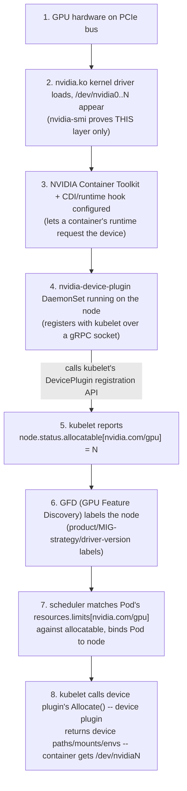

**Learning outcome:** Trace how hardware becomes an allocatable Kubernetes extended resource and how operator lifecycle automation fits around it.

Kubernetes device plugins advertise specialized devices to kubelet; the Node status then exposes allocatable extended resources. GPU Operator automates GPU-node software such as drivers, container toolkit integration, device plugin, telemetry and MIG-related components depending on configuration. It is lifecycle automation around the node stack; scheduling still follows Kubernetes resource requests.

```
kubectl get nodes -o jsonpath='{range .items[*]}{.metadata.name}{" "}{.status.allocatable.nvidia\.com/gpu}{"\n"}{end}'
kubectl -n gpu-operator get pods -o wide
kubectl describe node <gpu-node> | grep -A10 -i nvidia
```

## Worked scenario
**Situation:** nvidia-smi works on a node, but Kubernetes does not show nvidia.com/gpu.

1. Host hardware/driver is partially proven by nvidia-smi; move upward.
2. Check container-toolkit/runtime configuration and GPU Operator validation/components.
3. Check the device-plugin Pod logs/health on that node.
4. Inspect Node allocatable/resources and feature labels.
5. If MIG mode is active, verify what resource names/strategies are intentionally advertised.

**Conclusion:** Host driver success does not prove the Kubernetes device-advertisement layer.

---

➕ **ASCII diagram — the full path from PCIe device to a Pod's `resources.limits`, i.e. what "worked scenario" step 1→5 is walking backward through:**

`nvidia-smi` on the host only proves step 2. Everything from step 3 onward is a separate, independently-failing chain — this is exactly why the worked scenario insists on walking *up* from proven ground instead of guessing.

➕ **Annotated real output at each layer of the diagram — what healthy vs broken actually prints:**

```mermaid
flowchart TD
  %% Converted from the original ASCII diagram; source wording is preserved.
  n0["$ kubectl -n gpu-operator get pods -o wide"]
  n1["NAME READY STATUS RESTARTS NODE"]
  n2["nvidia-driver-daemonset-abcde 1/1 Running 0 gpu-node-07"]
  n3["nvidia-container-toolkit-daemonset-fghij 1/1 Running 0 gpu-node-07"]
  n4["nvidia-device-plugin-daemonset-klmno 0/1 CrashLoopBackOff 12 gpu-node-07 ← step 4 is broken"]
  n5["gpu-feature-discovery-pqrst 1/1 Running 0 gpu-node-07"]
  n6["$ kubectl -n gpu-operator logs nvidia-device-plugin-daemonset-klmno --previous"]
  n7["I0730 ... Starting FS watcher."]
  n8["I0730 ... Starting OS watcher."]
  n9["E0730 ... failed to initialize NVML: could not load NVML library"]
  n10["← toolkit/driver mount into the plugin pod itself"]
  n11["is broken, NOT the host driver — nvidia-smi on"]
  n12["the HOST would still pass fine"]
  n13["$ kubectl get node gpu-node-07 -o jsonpath='{.status.allocatable}'"]
  n14["{'cpu':'64','memory':'...' } ← no nvidia.com/gpu key at all — confirms step 5 never got populated"]
```

This is the exact "nvidia-smi works, Kubernetes doesn't show GPUs" symptom, reproduced with the specific log line (`failed to initialize NVML`) that names the layer: the *plugin's own container* can't reach the NVML library, which is a toolkit/CDI/mount problem — a layer entirely separate from and downstream of a healthy host driver.

➕ **Extra worked scenario — MIG-mode resource-naming mismatch, the failure mode step 5 of the original scenario hints at but doesn't spell out:**
> **Situation:** A node was just switched into MIG mode (single-strategy, `1g.10gb` slices). `kubectl describe node` shows `nvidia.com/gpu: 0` allocatable, but `nvidia.com/mig-1g.10gb: 7` instead. A Deployment written before the MIG migration still requests `nvidia.com/gpu: 1` and sits `Pending` with `0/1 nodes are available: Insufficient nvidia.com/gpu`.
> 1. This is not a device-plugin failure — the plugin is doing exactly what MIG configuration told it to advertise. Confirm via `kubectl -n gpu-operator get configmap -o yaml | grep -i mig` or the ClusterPolicy's `migStrategy` field (`single` vs `mixed`).
> 2. `single` strategy replaces `nvidia.com/gpu` entirely with per-profile resource names (`nvidia.com/mig-1g.10gb`, etc.) on that node — any workload still requesting `nvidia.com/gpu` becomes unschedulable there by design, not by bug.
> 3. `mixed` strategy would advertise both, at the cost of exposing MIG profile complexity to every workload's resource request.
> 4. Fix: either update the Deployment's resource request to the correct MIG profile name, or use `mixed` strategy with explicit per-workload profile selection, or exclude MIG nodes from that Deployment's nodeAffinity if it genuinely needs whole GPUs.
> **Interview-ready line:** "A Pod stuck Pending on `Insufficient nvidia.com/gpu` right after a MIG rollout usually isn't broken — the resource name changed underneath it, and that's a scheduling-contract change, not a device-plugin bug."

➕ **Shortcut — one-liner to see every GPU-related allocatable resource name a node is currently advertising (works whether it's whole-GPU, MIG, or mixed):**
```bash
kubectl get node <node> -o json | jq -r '.status.allocatable | to_entries[] | select(.key | contains("nvidia.com")) | "\(.key): \(.value)"'
```

➕ **Practice (continuation — original chapter had a worked scenario but no numbered Practice list; these are new):**
1. Walk the 8-step diagram above out loud from memory, naming which `kubectl`/host command proves each step, without looking at the diagram.
2. ➕ A node shows `nvidia.com/gpu: 8` allocatable, but a Pod requesting `nvidia.com/gpu: 1` still fails to schedule with a scheduling-predicate error unrelated to GPU count — name at least two other resource dimensions (CPU/memory requests, taints/tolerations, nodeSelector on a GFD-applied label) that could independently block scheduling even when the GPU resource itself is available.
