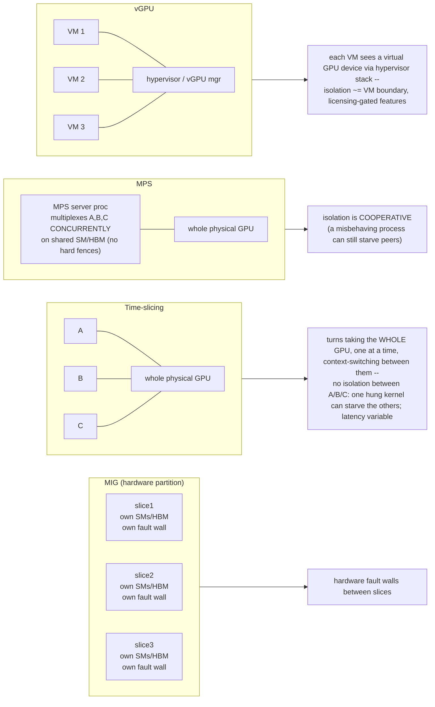

**Learning outcome:** Choose sharing based on isolation, latency determinism, memory behavior, hardware support and operational model.

Figure 2. Decide from workload requirements; sharing mode is the consequence.

| Mode | Strength | Trade-off |
|---|---|---|
| MIG | hardware-partitioned isolation on supported GPUs | fixed slice geometries; workload must fit slice; supported hardware only |
| Time slicing | simple over-subscription / improved dev utilization | shared memory/resources; variable latency; no hard slice isolation |
| MPS | concurrent CUDA process execution / throughput | different isolation semantics; CUDA workload compatibility/operations |
| vGPU | virtualization/VM-oriented resource sharing | licensing and hypervisor/virtualization operational model |

## Practitioner lens
**Sagar Desai: hollow GPUs are a workload-packing problem**
A public example compares sharing strategies for an LLM plus smaller ASR/TTS services and argues for hardware partitioning when predictable isolation and consolidation are both required. The important method is to measure workload footprint/latency sensitivity before choosing the sharing primitive.

[Public source](https://www.linkedin.com/posts/sagar-s-desai_genai-llm-gpuoptimization-activity-7413568134458142721-8b6Y)

---

**ASCII diagram — the four sharing modes' isolation boundaries, drawn to make the trade-off table's "strength/trade-off" columns visually obvious:**

**Extra worked scenario — the practitioner lens's exact example, worked with numbers, tying it to a scheduling-failure consequence:**
> **Situation:** One node hosts an LLM inference service (bursty, needs ~40% of a GPU's SMs at peak, latency-sensitive, P99 SLO) alongside a small ASR (speech-to-text) and TTS (text-to-speech) service (each low, steady utilization, also latency-sensitive). Time-slicing was configured to consolidate all three onto one physical GPU.
> 1. Under time-slicing, the LLM's burst preempts the whole GPU for its slice of the round-robin — ASR/TTS requests queued during that window see a latency spike proportional to how long the LLM's slice runs, even though ASR/TTS's own compute need is tiny. This is the "hollow GPU" the practitioner lens names: the *hardware* looks consolidated and efficient on a utilization graph, but the *tenants* are fighting for turns with no fairness guarantee beyond round-robin timing.
> 2. Switching to MIG with fixed slice geometry (e.g. one `3g.40gb` slice for the LLM, two `1g.10gb` slices for ASR/TTS) gives each service a hardware fault wall and a dedicated portion of SMs/HBM — ASR/TTS latency stops depending on what the LLM slice is doing at that instant.
> 3. The trade-off, stated explicitly: MIG's slice geometry is fixed at reconfiguration time (not per-request), so if the LLM's burst occasionally needs more than its `3g.40gb` slice provides, MIG can't elastically borrow spare capacity from the ASR/TTS slices the way time-slicing's round-robin could opportunistically hand more turns to a busy tenant.
> 4. Kubernetes consequence either way: the device plugin advertises different resource names depending on sharing mode (Chapter 4's MIG resource-naming point) — the platform-level scheduling contract changes, not just the GPU-level behavior.
> **Interview-ready line:** "Time-slicing optimizes for average utilization; MIG optimizes for worst-case tenant isolation — 'hollow GPU' is what you get when you pick the first for workloads that actually needed the second."

**Annotated real output — proving which sharing mode is active on a node, and MPS's cooperative-isolation signature:**

```mermaid
flowchart TD
  %% Converted from the original ASCII diagram; source wording is preserved.
  n0["$ nvidia-smi -q -d MIG | grep -A2 'MIG Mode'"]
  n1["MIG Mode"]
  n2["Current : Enabled"]
  n3["Pending : Enabled"]
  n4["← confirms MIG is active; compare against Chapter 4's resource-name check"]
  n5["$ nvidia-smi mig -lgi"]
  n6["+-------------------------------------------------+"]
  n7["| GPU instance profiles: |"]
  n8["| GPU Name Profile ID Instances Free/Total|"]
  n9["| 0 MIG 3g.40gb 9 1/1 |"]
  n10["| 0 MIG 1g.10gb 19 2/2 |"]
  n11["← hardware slice inventory; matches the LLM/ASR/TTS split above"]
  n12["$ ps -ef | grep nvidia-cuda-mps"]
  n13["root 18422 1 0 09:12 ? nvidia-cuda-mps-control -d"]
  n14["root 18430 18422 2 09:12 ? nvidia-cuda-mps-server"]
  n15["← MPS server proc — every CUDA process on this GPU now routes context"]
  n16["creation through this single server, which is HOW MPS achieves"]
  n17["concurrent execution without per-process context-switch overhead,"]
  n18["and WHY one misbehaving client can still affect the shared server"]
```

**Shortcut — mnemonic for choosing a sharing mode under interview time pressure:**
*"MIG for fences, slicing for spare cycles, MPS for cooperating siblings, vGPU for VMs."* If the workloads don't trust each other (multi-tenant, SLO-bound) → MIG. If it's dev/notebook idle-capacity mopping → time-slicing. If it's your *own* pipeline's cooperating processes wanting concurrent small kernels → MPS. If the platform is VM-based (not container-based) → vGPU, and immediately ask about licensing.

**Practice (continuation — original chapter had no numbered Practice list; these are new):**
1. Given the practitioner lens's LLM+ASR+TTS scenario, argue for `mixed` MIG strategy instead of pure MIG or pure time-slicing, and state what you'd need to measure first (footprint/latency sensitivity, per the chapter's own guidance) to justify it.
2. Explain why MPS is described as having "different isolation semantics" rather than "no isolation" — what specifically does the MPS server still guarantee (memory address space separation per client) versus not guarantee (a hung/faulting client can still take down the shared MPS server for all clients)?
