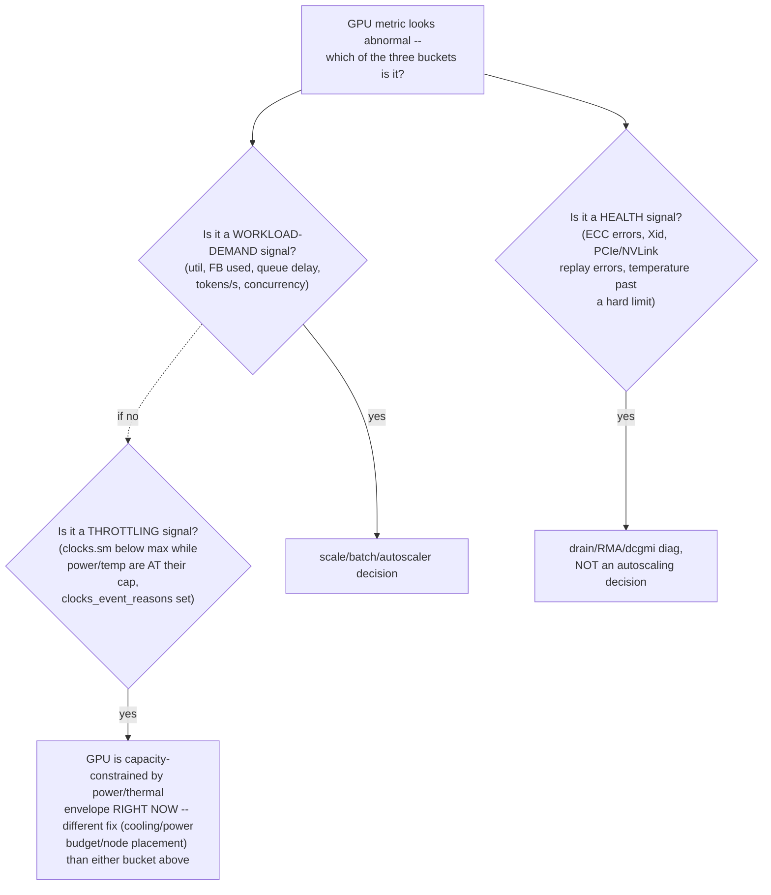

## First lab: build an evidence ladder

Run only on an authorized GPU host. These commands are read-only orientation commands.

### Step 1 — does PCIe enumerate an NVIDIA device?

```bash
lspci -nn | grep -i nvidia
```

Representative output:

```text
17:00.0 3D controller [0302]: NVIDIA Corporation Device [10de:2330]
```

This proves PCIe enumeration. It does not prove the driver loaded or the GPU can execute work.

### Step 2 — can the NVIDIA management stack talk to it?

```bash
nvidia-smi --query-gpu=index,name,uuid,driver_version,memory.total --format=csv
```

Representative output:

```text
index, name, uuid, driver_version, memory.total [MiB]
0, NVIDIA H100 80GB HBM3, GPU-..., 580.XX, 81559 MiB
```

Interpretation:

- device identity and memory capacity are visible;
- driver/user management communication works;
- this still does not prove a framework, container, multi-GPU link or workload result.

### Step 3 — what is the local topology?

```bash
nvidia-smi topo -m
```

Read the legend printed by your installed version. Compare GPU-to-GPU and GPU-to-NIC paths. Do not assume labels or topology are identical across systems.

### Step 4 — can a framework allocate and execute a tiny operation?

```python
import torch

print("torch:", torch.__version__)
print("cuda available:", torch.cuda.is_available())
print("device count:", torch.cuda.device_count())

if torch.cuda.is_available():
    x = torch.tensor([1.0, 2.0, 3.0], device="cuda")
    y = x * 2
    print("device:", y.device)
    print("result:", y.cpu().tolist())
```

Representative result:

```text
cuda available: True
device count: 1
device: cuda:0
result: [2.0, 4.0, 6.0]
```

This proves a small framework operation. It is not a benchmark or hardware diagnostic.

## Monitoring, health and diagnostics are different

NVIDIA Data Center GPU Manager (DCGM) provides inventory, telemetry, health, policy, diagnostics, profiling and workload accounting capabilities for supported NVIDIA data-center hardware.

- **Telemetry/field watches** collect measurements and events.
- **Passive health monitoring** evaluates retained telemetry for configured health conditions while ordinary work may continue.
- **Active diagnostics** execute tests and may consume GPU, memory, PCIe/NVLink, CPU, power and cooling resources. Coordinate with the scheduler and isolate resources first.

A passive result of Healthy means enabled rules found no incident in retained samples. It is not equivalent to passing every active test. An active diagnostic failure also needs interpretation: setup problems, skipped tests and per-entity errors differ from a confirmed hardware defect.

## A worked incident without shortcut conclusions

**Symptom:** A Pod is Running but reports `torch.cuda.is_available() == False`.

1. Confirm the Pod actually requests a GPU; Running alone does not imply allocation.
2. Inspect Pod resource requests/limits and assigned node.
3. Check the node's advertised `nvidia.com/gpu` capacity and allocatable values.
4. Check GPU Operator/device-plugin/toolkit operand status on that node.
5. Verify host `nvidia-smi`; preserve driver and kernel logs if it fails.
6. Inspect device/CDI/runtime configuration inside the container boundary.
7. Compare the image's framework/CUDA user-space requirements with the supported host stack.
8. Run the smallest framework allocation test before the real application.

The order moves from allocation to host to injection to user space. Reinstalling drivers first would cross several unproven boundaries and increase blast radius.

## DCGM and `nvidia-smi`

`nvidia-smi` is a host CLI built on NVIDIA management capabilities and is excellent for first orientation. **DCGM** is a data-center management framework for fleet telemetry, groups, health, policy, diagnostics, accounting and related functions.

Use the right claim:

- `nvidia-smi` lists the GPU: management stack sees a device.
- DCGM field has a value: a particular measurement was collected.
- passive health is clean: enabled health rules found no incident in retained evidence.
- active diagnostic passes: selected test executed successfully in that environment.
- representative workload passes: the application path worked under those test conditions.

These statements get progressively closer to user success but never become universal proof.

**Learning outcome:** Interpret hardware telemetry in the context of workload performance and distinguish demand, health and throttling.

DCGM provides health/telemetry/diagnostic capabilities for NVIDIA GPUs in data-center environments, and dcgm-exporter exposes metrics to Prometheus. Typical operational dimensions include utilization, framebuffer memory use, temperature, power, clocks and error/health counters. Device metrics need ownership labels so you can map them to node, Pod, namespace and workload.

```
# Prometheus-style examples vary by exporter version/config
DCGM_FI_DEV_GPU_UTIL
DCGM_FI_DEV_FB_USED
DCGM_FI_DEV_FB_FREE
DCGM_FI_DEV_POWER_USAGE
```

Autoscaling is a separate concern: device utilization helps explain hardware state, but inference demand may be better represented by request concurrency, queue delay, TTFT, throughput or tokens/s depending on the server.

---

**ASCII diagram — "demand vs health vs throttling," the chapter's core distinction, as a decision tree:**

Conflating these three is the single most common GPU-observability mistake: e.g. treating a throttling event as a "demand spike needing more replicas" adds replicas that will ALSO throttle.

**Annotated real output — the exact `DCGM_FI_DEV_*` fields from the chapter, as they appear scraped by Prometheus, with field-by-field reading:**
```
$ curl -s localhost:9400/metrics | grep -E 'DCGM_FI_DEV_(GPU_UTIL|FB_USED|FB_FREE|POWER_USAGE)' | grep -v '^#'
DCGM_FI_DEV_GPU_UTIL{gpu="0",UUID="GPU-a1b2...",Hostname="gpu-node-07",pod="llm-infer-7f8",namespace="inference"} 97
DCGM_FI_DEV_FB_USED{gpu="0",UUID="GPU-a1b2...",Hostname="gpu-node-07",pod="llm-infer-7f8",namespace="inference"} 71232
DCGM_FI_DEV_FB_FREE{gpu="0",UUID="GPU-a1b2...",Hostname="gpu-node-07",pod="llm-infer-7f8",namespace="inference"} 10327
DCGM_FI_DEV_POWER_USAGE{gpu="0",UUID="GPU-a1b2...",Hostname="gpu-node-07",pod="llm-infer-7f8",namespace="inference"} 312.4
```
The `pod`/`namespace` labels are the chapter's "ownership labels" point made concrete — without dcgm-exporter's Kubernetes pod-mapping (via `DCGM_EXPORTER_KUBERNETES=true` or the pod-GPU-mapper sidecar), these four numbers are just per-GPU-index facts with no way to attribute them to a workload; `FB_FREE=10327MiB` on an 80GB card with one pod already at `FB_USED=71232MiB` is the exact number you'd check before admitting a second workload onto this GPU (CUDA OOM risk, not cgroup OOM — the two are enforced by entirely different layers).

**Annotated real `dcgmi diag` output — the diagnostic tool the chapter names dcgm-exporter's sibling, run when metrics alone don't resolve a health question:**
```
$ dcgmi diag -r 2
Successfully ran diagnostic for group.
+---------------------------+------------------------------------------------+
| Diagnostic                | Result                                        |
+===========================+================================================+
| Deployment                |                                                |
| -----  Denylist            | Pass                                          |
| -----  NVML Library        | Pass                                          |
| -----  Driver Library      | Pass                                          |
+---------------------------+------------------------------------------------+
| Hardware                  |                                                |
| -----  GPU Memory          | Pass                                          |
| -----  Diagnostic          | Fail - GPU 0: Uncorrectable ECC error detected|
+---------------------------+------------------------------------------------+
```
`-r 2` runs the "medium" test tier (short of the full `-r 3` stress-test tier, which takes the GPU out of service) — this is the command you run *before* deciding whether a node needs draining, and the specific `Fail` line names the failing subsystem (GPU memory ECC) rather than a vague "GPU unhealthy."

**Extra worked scenario — throttling mistaken for demand, the exact conflation the decision-tree diagram warns about:**
> **Situation:** An inference service's HPA is configured to scale on `DCGM_FI_DEV_GPU_UTIL` averaged across pods. Utilization climbs to 100% during a regional traffic peak that coincides with a hot afternoon (data center cooling margin thinner than usual). HPA scales out aggressively. Tokens/s per replica *drops* after scale-out instead of the aggregate throughput rising proportionally.
> 1. Check `clocks.sm` (current SM clock) against `clocks.max.sm` (rated max) via `nvidia-smi --query-gpu=clocks.sm,clocks.max.sm,clocks_event_reasons.active --format=csv` — if current clocks are well below max and `clocks_event_reasons.active` shows a thermal or power-cap bit set, the GPUs are throttled, not simply "in high demand."
> 2. New replicas scheduled onto the same thermally-constrained rack inherit the same throttling — more replicas competing for the same power/cooling envelope makes the per-GPU throttling worse, which is why aggregate throughput didn't scale with replica count.
> 3. `DCGM_FI_DEV_GPU_UTIL=100%` was real, but it was measuring "SMs are busy" not "SMs are running at rated clock" — the HPA's signal was a demand proxy that silently degraded into a throttling proxy under thermal stress, and the HPA has no way to tell the difference from that one metric alone.
> 4. Fix: add a throttling-aware guard (alert or HPA-blocking condition) on `clocks_event_reasons.active` / `DCGM_FI_DEV_THERMAL_VIOLATION` / `DCGM_FI_DEV_POWER_VIOLATION` so autoscaling decisions are informed by "is the GPU able to actually deliver more work," not only "is it busy."
> **Interview-ready line:** "Utilization-based autoscaling assumes utilization means available headroom to add more of — under throttling, 100% utilization means the opposite, and conflating the two is how you make an outage worse by adding replicas."

**Shortcut — one-liner to check throttling reasons directly, faster than parsing DCGM field IDs:**
```bash
nvidia-smi --query-gpu=index,clocks.sm,clocks.max.sm,clocks_event_reasons.active --format=csv
# clocks.sm well below clocks.max.sm + a non-empty clocks_event_reasons.active = throttled right now, not idle-by-choice
```

**Practice (continuation — original chapter had no numbered Practice list; these are new):**
1. Design a three-alert scheme (one per bucket in the decision tree above: demand, health, throttling) using only the `DCGM_FI_DEV_*` metric names given in the chapter plus `clocks_event_reasons.active`, and state which one should ever be allowed to trigger an autoscaler.
2. Explain why `dcgmi diag -r 2` (medium tier) is the right choice before draining a node, while `-r 3` (full stress test) is not something you'd run against a node still serving production traffic — what does `-r 3` actually do differently that makes it service-impacting?
