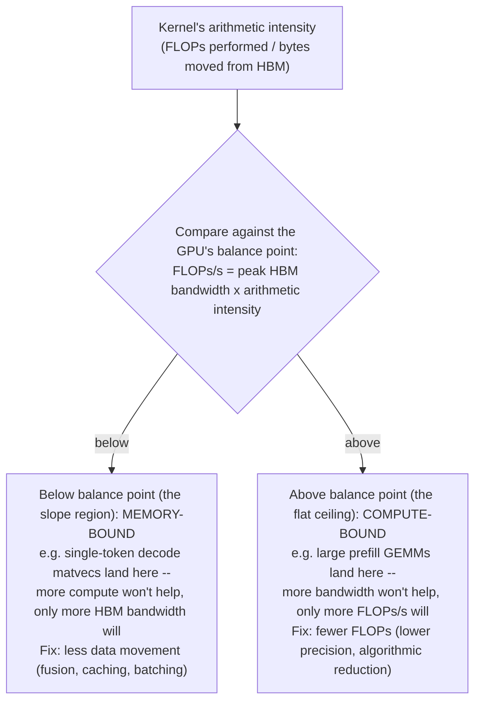

A GPU is built to execute large amounts of parallel work. Streaming multiprocessors schedule warps of threads; Tensor Cores accelerate matrix operations used heavily by deep learning; HBM provides very high bandwidth but finite capacity. Workloads can be compute-bound, memory-bandwidth-bound, latency-bound, launch-bound or communication-bound. “GPU utilization 100%” does not identify which resource is limiting useful work.

Arithmetic intensity is a useful mental model: how much computation is performed per byte moved. Large matrix multiplies can reuse data effectively and become compute-bound. Decode phases in LLM inference often move weights and KV data repeatedly and can become memory-bandwidth-sensitive. This is why the same GPU can behave very differently for prefill and decode.

## Senior addendum

*(the original Deep Dive text is already strong — real commands, correctly pitched at senior level, and largely extends Chapters 1-7, which now have diagrams/outputs/scenarios of their own. Rather than duplicate, this addendum adds only what's genuinely new: real annotated output, a couple of closed gaps, a mnemonic index, and a cross-reference table so you use both halves together instead of re-deriving the same material twice.)*

### Original Fourth Edition Senior Engineering Expansion framing
*(preserved in full)*

**GPU systems, lifecycle management and accelerated compute operations**

This expansion keeps the Fourth Edition teaching flow and adds the depth expected from a senior infrastructure engineer and customer-facing Solutions Architect. The emphasis is mechanism first: understand what the system is doing, observe it with concrete tools, then reason about failure, scale, reliability, performance and trade-offs.

The practitioner material used to shape the scope is a signal, not an authority. Technical behavior is anchored in official documentation and first-principles systems reasoning. Your Staff Engineer study guide contributes useful patterns around Kubernetes, observability, distributed systems, platform design and failure isolation; the NVIDIA material adds GPU systems, AI workloads, accelerated networking and customer architecture.

_Figure A. GPU problems can originate in application, runtime, container integration, driver, silicon or fabric._

### Quick cross-reference (so you use both halves together, not as duplicates)
| Deep Dive | Extends chapter | What's genuinely new in the Deep Dive vs the chapter |
|---|---|---|
| 1 — GPU execution model without CUDA overload | Ch1 | arithmetic intensity as the unifying concept behind prefill/decode — see below |
| 2 — Topology: PCIe, NVLink, NVSwitch, NUMA | Ch2 | GPUDirect RDMA / NIC locality as a distinct, separate concern from GPU-GPU topology |
| 3 — Driver, CUDA compatibility, container integration | Ch3 | the CDI (`/var/run/cdi`) boundary-proving commands — closest thing to a live checklist |
| 4 — GPU Operator as a dependency reconciler | Ch4 | the failure/boundary/evidence table — memorize this table's shape as a reusable interview answer |
| 5 — Sharing: MIG, time-slicing, MPS, vGPU | Ch5 | requirement-driven selection framing (isolation/latency/memory/elasticity/ops/licensing) as one checklist |
| 6 — DCGM, Xid, ECC, health semantics | Ch6 | Xid-number-specific triage — the one genuinely new mechanism not in Ch6; see below |
| 7 — Fleet lifecycle: upgrades, draining, known-good validation | new ground | the provision→validate→drain→upgrade→revalidate lifecycle — closest thing to a pre-flight checklist for the actual job |

### Deep Dive 1 — GPU execution model without CUDA-programming overload
*(original text — arithmetic intensity, SM/warp/Tensor Core model, prefill vs decode — preserved above; Chapter 1's enhanced content already has the full diagram, annotated `nvidia-smi`/`dmon` output, and the worked prefill/decode scenario for this exact material. Cross-reference rather than re-deriving.)*

➕ **The one genuinely new framing here vs Chapter 1: arithmetic intensity as a single number, not just a category.** Arithmetic intensity = FLOPs performed ÷ bytes moved from HBM. A GPU's own "balance point" (peak FLOPs ÷ peak HBM bandwidth) tells you the arithmetic intensity threshold above which you're compute-bound and below which you're memory-bandwidth-bound — e.g. an H100's balance point is roughly in the hundreds of FLOPs/byte. Large GEMMs in prefill comfortably exceed it; single-token decode matrix-vector operations fall well below it. This is the quantitative version of the qualitative "prefill is compute-bound, decode is memory-bound" claim — worth having the *shape* of this argument (a ratio compared against a hardware constant) ready, even without memorizing the exact balance-point number for a given GPU generation.

➕ **Diagram: the roofline — where a kernel lands decides what "optimize" means**

The slope region and the flat ceiling need opposite fixes: a kernel under the slope wants less data movement (fusion, caching, batching), a kernel against the ceiling wants fewer FLOPs (lower precision, algorithmic reduction) — misdiagnosing which side of the roofline a kernel sits on is the single most common wasted-optimization-effort mistake.
