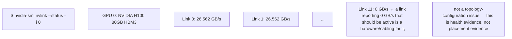
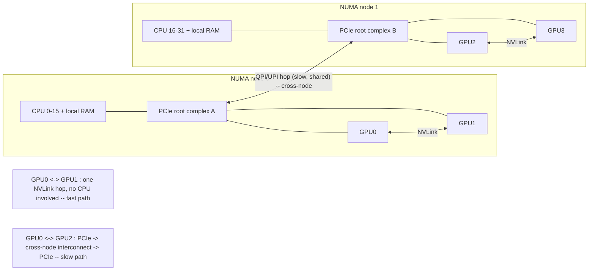

Topology is performance architecture. PCIe connects GPUs, NICs and CPUs through a tree of root complexes and switches. NVLink provides high-bandwidth GPU-to-GPU connectivity; NVSwitch creates a switched fabric across GPUs in supported systems. For multi-GPU communication, the fastest path depends on which devices are peers and how the topology is wired. A scheduler that knows only “8 GPUs free” can still make a poor placement if the workload requires tightly connected devices.

**Topology evidence on a GPU node**

nvidia-smi topo -m
nvidia-smi topo -p2p r
nvidia-smi nvlink --status
lspci -tv
numactl --hardware

NIC locality matters for distributed jobs. GPUDirect RDMA is most effective when GPU and high-speed NIC placement avoids unnecessary CPU/socket crossings. CPU feeder threads, pinned memory, interrupts and storage traffic also interact with NUMA locality. Think of the node as a topology graph, not a bag of identical GPUs.

## Build from the normal path


**The one command this chapter names that Chapter 2 doesn't cover — `nvidia-smi topo -p2p r`, annotated:**
```
$ nvidia-smi topo -p2p r
    GPU0  GPU1  GPU2  GPU3
GPU0  X    OK    NS    NS
GPU1  OK    X    NS    NS
GPU2  NS   NS     X    OK
GPU3  NS   NS    OK     X
```
`OK` means direct peer-to-peer memory access (CUDA P2P) is supported between that pair; `NS` means Not Supported for direct P2P — traffic must route through the host (or, on NVSwitch systems, through the switch fabric instead of failing entirely). This is a **narrower, P2P-specific** check than the general `topo -m` NV/PHB/SYS matrix — a pair can show `SYS` in `topo -m` (no NVLink, crosses NUMA) and still show `NS` here for a different, additive reason (e.g. virtualization or IOMMU grouping blocking P2P even where physically wired). Run both; they answer related but distinct questions.

**`nvidia-smi nvlink --status` — the per-link health check Deep Dive 2 lists that neither Chapter 2 nor the topo matrix covers, annotated:**

`topo -m` tells you the *intended* wiring; `nvlink --status` tells you whether each link is *actually* passing traffic at expected bandwidth right now — a down link changes the effective topology at runtime without changing what `topo -m` reports, which is why both commands belong in the same triage, not just one.

**Diagram: two GPUs, two ways home — the topology decides which one you pay for**

A process pinned to Node-0 CPUs feeding GPU2 (Node-1) pays the cross-node hop on every host-to-device copy — invisible to `nvidia-smi` utilization numbers, which only show the GPU side. `numactl --hardware` plus this chapter's `topo -m` is how you catch it before it shows up as an unexplained multi-GPU slowdown.
