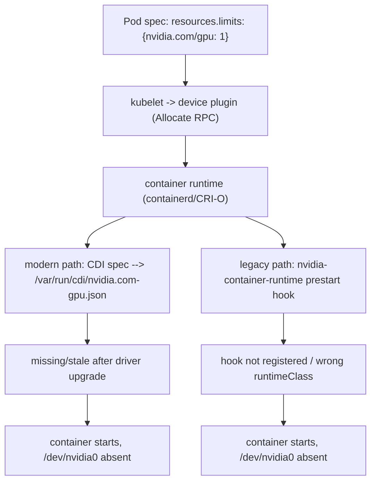

The NVIDIA kernel driver owns the device. User-space CUDA libraries and frameworks communicate through driver APIs. Containers normally bring user-space libraries but depend on a compatible host driver. The NVIDIA Container Toolkit configures the runtime so GPU devices and required driver libraries are made visible inside the container. This is why “CUDA works on the host” does not prove “the container can use the GPU”.

**Prove each boundary separately**

```bash
# Host
nvidia-smi
modinfo nvidia | head
ls -l /dev/nvidia*

# Runtime integration (commands depend on installation)
nvidia-ctk --version
find /var/run/cdi /etc/cdi -maxdepth 1 -type f 2>/dev/null

# Container smoke test
ctr -n k8s.io containers list | head
# or run a vendor-supported CUDA container through your normal runtime
```

## Senior addendum

*(original text — driver ownership, user-space CUDA libraries, NVIDIA Container Toolkit, the host/runtime/container boundary-proving command sequence — preserved above; Chapter 3's enhanced content already has the layered-stack diagram and the annotated driver-vs-CUDA-version failure output.)*

➕ **Annotated real output — the two commands in the boundary-proving list Chapter 3 doesn't demonstrate (`modinfo` and `ctr`):**
```
$ modinfo nvidia | head
filename:       /lib/modules/6.8.0-generic/updates/dkms/nvidia.ko
firmware:       nvidia/550.90.07/gsp_tu10x.bin
firmware:       nvidia/550.90.07/gsp_ad10x.bin
version:        550.90.07
supported:      external
license:        NVIDIA
$ ctr -n k8s.io containers list | head
CONTAINER    IMAGE                                        RUNTIME
a1b2c3d4...  docker.io/nvidia/cuda:12.8.0-base-ubuntu24.04 io.containerd.runc.v2
```
`modinfo nvidia`'s `version:` line is the same driver version `nvidia-smi` reports, but read from the kernel module metadata directly — useful when `nvidia-smi` itself won't run (e.g. the userspace tool is missing or broken) but you still need to confirm which driver *is* loaded. `ctr -n k8s.io containers list` bypasses `kubectl`/`docker` entirely and asks containerd directly which containers exist in the `k8s.io` namespace (the one kubelet uses) — it's the lowest-level container smoke test, useful when you suspect the CRI shim or `docker`/`kubectl` client itself, rather than the GPU stack, is lying to you.

➕ **The one boundary this Deep Dive's command list names that Chapter 3 doesn't drill into — the CDI (Container Device Interface) spec files themselves:**
```
$ find /var/run/cdi /etc/cdi -maxdepth 1 -type f 2>/dev/null
/var/run/cdi/nvidia.com-gpu.json

$ cat /var/run/cdi/nvidia.com-gpu.json | jq '.devices[0].containerEdits.deviceNodes'
[{"path": "/dev/nvidia0"}, {"path": "/dev/nvidiactl"}, {"path": "/dev/nvidia-uvm"}]
```
This file is the *actual mechanism* by which "the container gets the GPU device" happens under the modern CDI-based runtime path (as opposed to the older `nvidia-container-runtime` prestart-hook path) — an empty or missing CDI file here, with `nvidia-ctk --version` still reporting healthy, is a specific and different failure mode from a driver-version mismatch: the toolkit is installed but hasn't (re)generated the device spec, often after a driver upgrade that didn't trigger `nvidia-ctk cdi generate` again.

➕ **Diagram: two ways a container gets a GPU device node, and where each one breaks**

Both paths converge on the same visible symptom ("GPU requested, device missing in container") but the fix differs: regenerate the CDI spec (`nvidia-ctk cdi generate`) on the modern path, versus checking the OCI runtime hook registration on the legacy path — checking `nvidia-ctk --version` alone tells you the toolkit is installed, not which path is active or whether it actually ran.
