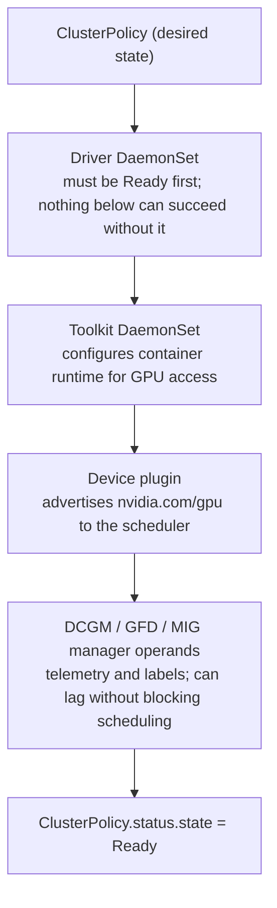

The GPU Operator automates the NVIDIA driver, Container Toolkit, Kubernetes device plugin, GPU Feature Discovery / node labels, DCGM-based monitoring and related operands. Operationally, this means one ClusterPolicy expresses desired GPU software state and multiple controllers/DaemonSets converge nodes toward it. When a node exposes zero GPUs, inspect operator state and each operand rather than reinstalling the driver blindly.


<!-- source-table:1 -->

| Failure | Likely boundary | Evidence |
| --- | --- | --- |
| nvidia-smi fails on host | driver/device/firmware | driver pod or host driver logs, dmesg, lspci |
| host works, Pod has no GPU | device plugin/runtime injection | device-plugin logs, allocatable resource, CDI/runtime config |
| GPU exists, wrong labels | feature discovery | GFD/NFD pods, node labels |
| metrics absent | DCGM/DCGM exporter/ServiceMonitor | exporter logs, /metrics endpoint, Prometheus target |
| operator stuck upgrading | ClusterPolicy/operand rollout | CSV/Helm status, DaemonSet readiness, node conditions |

## Senior addendum

*(original text — ClusterPolicy as desired state, the operand list, and the failure/boundary/evidence table — preserved above in full; this table is already the strongest artifact in this Deep Dive and Chapter 4's enhanced content builds its own 8-step diagram and MIG-resource-naming worked scenario around the same reconciliation model.)*

➕ **Reading the operator's own reconciliation state directly — the command this Deep Dive implies ("inspect operator state") but doesn't spell out:**
```bash
kubectl get clusterpolicy -o jsonpath='{.items[0].status.state}'
# Ready              ← the whole operand set has converged; if any operand DaemonSet isn't
                        Ready, ClusterPolicy status typically shows "notReady" with a reason,
                        which is your entry point into the failure table's five rows above
```
**Interview-ready line:** "ClusterPolicy status is the single top-level health check for the whole GPU software stack — if it's not `Ready`, don't chase individual operand pods yet, read *why* first."

➕ **Diagram: ClusterPolicy's operand dependency order — why "not Ready" always has one specific bottom-most cause**

Because each operand depends on the one above it, a stuck Driver DaemonSet cascades into every operand below reporting "not Ready" for a *different* reason each — reading the failure table top-down (driver first) instead of alphabetically or by pod-restart-count is what turns a five-operand outage into a one-line root cause.
