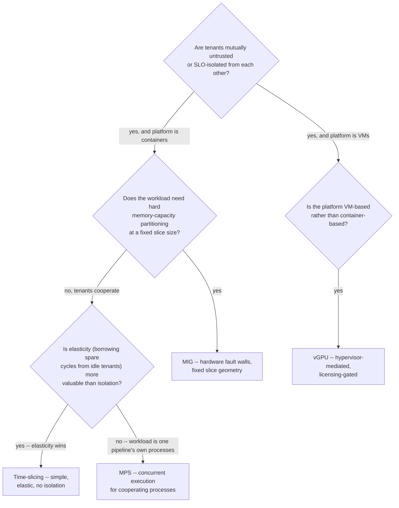

These mechanisms solve different problems. MIG partitions supported GPUs into hardware-isolated instances with dedicated portions of compute and memory-system resources, giving much stronger performance isolation than simple time-sharing. Time-slicing lets multiple workloads take turns on a GPU but does not create the same memory or fault isolation. MPS improves concurrent CUDA process execution for compatible workloads. vGPU virtualizes GPU access into VMs and involves a separate licensing and hypervisor stack.

Choose from requirements: isolation, predictable latency, memory capacity, workload elasticity, operational complexity and licensing. A small inference model requiring predictable tenant isolation may fit MIG; a bursty development cluster may prefer time-sharing; large training normally needs whole GPUs with topology-aware placement.

## Senior addendum

*(original text — the four mechanisms' isolation/memory/latency differences and the requirement-driven selection guidance — preserved above in full; Chapter 5's enhanced content already has the isolation-boundary diagram, the LLM+ASR+TTS worked scenario, and annotated `nvidia-smi mig -lgi`/MPS-process output.)*

➕ **The one framing genuinely new here vs Chapter 5: a requirement-driven decision checklist, not just a mode-by-mode comparison table.** Chapter 5's table answers "what does each mode do." This Deep Dive's original text answers a different question: "given a workload's requirements, which mode follows from them." The six inputs it names — isolation, predictable latency, memory capacity, workload elasticity, operational complexity, licensing — are a checklist to run *before* picking a mode, not after.

➕ **Diagram: the six inputs as a decision path, in the order that eliminates the most options first**

The order matters: asking "isolation vs elasticity" before "MIG vs time-slicing" is what keeps this a requirements-first decision instead of a features-first one — the practitioner-lens "hollow GPU" mistake in Chapter 5 is exactly what happens when Q1 and Q4 get answered in the wrong order (choosing for elasticity when the real requirement was isolation).

➕ **Annotated real output — proving operational complexity and licensing are not free-text checklist items but observable facts on a running system:**
```bash
$ nvidia-smi -q -d SUPPORTED_CLOCKS | grep -i "mig mode"
MIG Mode
Current : Enabled
$ nvidia-smi vgpu -q 2>&1 | head -3
NVIDIA-SMI has failed because it couldn't communicate with the vGPU
management stack. Ensure hypervisor vGPU manager is installed and running.
```
The second command isn't a failure to fix — it's evidence. `nvidia-smi vgpu` only returns data on a hypervisor host running the NVIDIA vGPU manager; on a bare-metal Kubernetes GPU node (the default assumption for MIG/time-slicing/MPS) this command is *expected* to fail, and that failure is itself the answer to "is vGPU even in scope here" before spending time on licensing questions.

➕ **Interview-ready line:** "The four mechanisms aren't ranked best-to-worst — they sit on an isolation-versus-elasticity line with MIG and vGPU on the hard-boundary end and time-slicing and MPS on the cooperative end. The requirement-driven checklist exists because picking from that line by feature list instead of by workload requirement is the mistake, not any one mode being wrong."

➕ **Practice (continuation — original Deep Dive had no numbered Practice list; these are new):**
1. Walk the decision diagram above for three workloads: a multi-tenant SaaS inference platform billing by isolated GPU-slice, a single team's internal batch-processing pipeline with several cooperating CUDA processes, and a VMware-based research lab reselling GPU time to VM tenants — name which leaf each lands on and why.
2. ➕ A platform team observes `nvidia-smi vgpu -q` failing on every node and concludes "vGPU is broken, file a ticket." Explain why this conclusion is likely wrong on a bare-metal Kubernetes GPU fleet, and what the command failing (versus succeeding) actually tells you about which of the four sharing mechanisms are even in scope.
