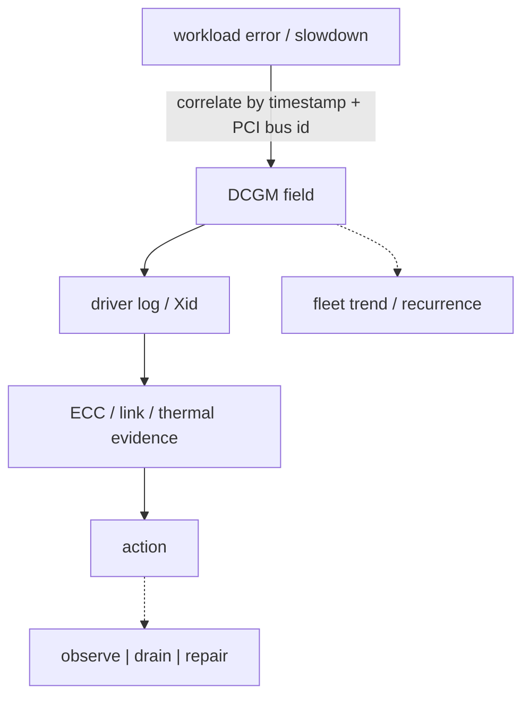

_Figure B. GPU health requires correlating workload errors with software, hardware and fabric evidence._

NVIDIA Data Center GPU Manager (DCGM) provides telemetry, diagnostics, health monitoring and APIs for data-center GPUs. The operational goal is not merely collecting utilization. Track temperature, power, clocks, memory use, ECC and error conditions, PCIe/NVLink health and job-level behavior. Xid messages from the driver indicate GPU-related errors but require context; the Xid number, frequency, affected device, workload and recovery behavior determine the next action.

**Health evidence: preserve timestamps and device UUIDs**

nvidia-smi -q
nvidia-smi --query-gpu=uuid,pci.bus\_id,temperature.gpu,power.draw,clocks.sm,memory.used,memory.total,ecc.errors.uncorrected.volatile.total --format=csv

dmesg -T | grep -iE 'NVRM|Xid|nvidia'
# DCGM tooling if deployed
dcgmi discovery -l
dcgmi health -g 0 -c
dcgmi diag -r 2

## Senior addendum

*(original text — DCGM as telemetry/diagnostics/health, the "Xid requires context" point, the health-evidence command list — preserved above.)*

➕ **Xid triage table — this is the genuinely new mechanism Deep Dive 6 names ("the Xid number, frequency, affected device, workload and recovery behavior determine the next action") but doesn't tabulate. Common Xid codes worth recognizing on sight:**
| Xid | Common meaning | Typical next action |
|---|---|---|
| 13 | Graphics engine exception (often an application-triggered fault) | Check the workload's own kernel/memory access pattern first; not necessarily hardware |
| 31 | GPU memory page fault | Often an application bug (out-of-bounds access); correlate with the specific job |
| 43 | GPU stopped processing (application/driver-level reset) | Check if `nvidia-smi` still enumerates the device; may self-recover via driver reset |
| 48 | Double-bit ECC error (uncorrectable) | Hardware degradation signal — schedule `dcgmi diag -r 2/3` and consider drain/RMA |
| 63 / 64 | Row-remapping event (ECC-related, HBM row remap pending/failed) | Pending remap needs a GPU reset to apply; failed remap is a stronger RMA signal |
| 79 | GPU has fallen off the bus | Hardware/firmware/PCIe-link fault — treat as a hard failure, drain immediately |

➕ **`dmesg -T | grep -iE 'NVRM|Xid|nvidia'` output, annotated with a real Xid line:**
```
$ dmesg -T | grep -iE 'NVRM|Xid|nvidia'
[Tue Jul 28 03:14:02 2026] NVRM: Xid (PCI:0000:1b:00): 79, pid=<...>, GPU has fallen off the bus.
```
The `Xid (PCI:...)` prefix gives you the exact device by bus ID — cross-reference against `nvidia-smi --query-gpu=pci.bus_id,uuid --format=csv` to name the specific card, then correlate the timestamp against the workload that was running on it at that second (job scheduler logs, dcgm-exporter's own timestamp) before deciding drain vs restart vs RMA. **Interview-ready line:** "An Xid code without frequency, device, and workload correlation is just a number — the triage table tells you what class of action to consider, but the timestamp-correlated evidence is what actually justifies drain-and-RMA versus 'log it and move on.'"

➕ **Visual model — health semantics require correlated layers:**

**Memory hook:** *"Metric says what; driver log says where; recurrence says whether."* Never drain—or dismiss—a GPU from a lone counter.
