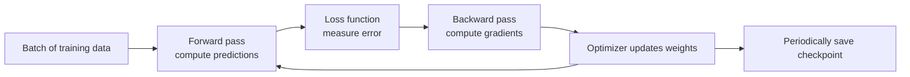
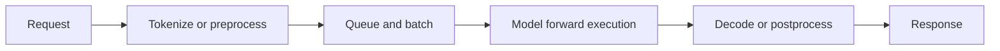
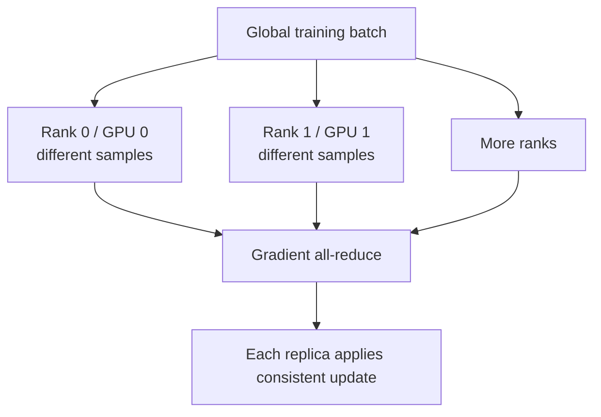

# Foundation — AI, machine learning and LLM workloads from zero

## Your learning contract

This chapter assumes AI and machine learning are new. It teaches enough application behavior to make infrastructure decisions sensible; it does not require advanced mathematics.

By the end you should be able to:

- distinguish AI, machine learning and deep learning;
- explain dataset, model, parameter, tensor, batch, loss, gradient and optimizer;
- trace training and inference as different systems;
- explain what an LLM token, prefill, decode and KV cache are;
- estimate the lower-bound memory for model weights;
- understand why models use multiple GPUs or nodes;
- trace an online request through a serving system;
- choose workload metrics before choosing infrastructure.

## 1. From rules to learned models

Traditional software contains rules written directly by developers. Machine-learning software learns parameters from examples.

Imagine spam classification:

- **Input:** message text and related features.
- **Label:** spam or not spam for training examples.
- **Model:** a mathematical function producing a score or probability.
- **Parameters/weights:** learned numeric values controlling that function.
- **Training:** adjust weights so predictions improve on examples.
- **Inference:** use the trained weights to classify a new message.

**Artificial intelligence (AI)** is the broad umbrella. **Machine learning (ML)** is a family of techniques that learn behavior from data. **Deep learning** uses neural networks with many layers and large numbers of parameters.

## 2. Essential data structures: scalars, vectors, matrices and tensors

A **scalar** is one value. A **vector** is a one-dimensional collection. A **matrix** has rows and columns. A **tensor** generalizes these ideas to more dimensions.

Examples:

| Data | Possible shape |
|---|---|
| one temperature | scalar |
| 768-value text embedding | `[768]` |
| batch of 32 embeddings | `[32, 768]` |
| batch of 16 RGB images | `[16, 3, 224, 224]` |
| language-model hidden state | `[batch, sequence, hidden_dimension]` |

The **shape** tells software how dimensions are organized. The **dtype/precision** tells it how each value is represented, such as FP32, FP16, BF16 or an integer format. Shape and dtype strongly affect memory and compatible GPU operations.

### Tiny runnable example

```python
import torch

x = torch.tensor([[1.0, 2.0], [3.0, 4.0]])
weights = torch.tensor([[0.5], [1.5]])
y = x @ weights

print("x shape:", tuple(x.shape))
print("weights shape:", tuple(weights.shape))
print("result shape:", tuple(y.shape))
print(y)
```

Representative output:

```text
x shape: (2, 2)
weights shape: (2, 1)
result shape: (2, 1)
tensor([[3.5000],
        [7.5000]])
```

The `@` operation performs matrix multiplication. Real models chain many operations, with frameworks selecting optimized CPU/GPU implementations.

## 3. Training: how weights change

At a high level, training repeats this loop:



### Terms that now have a place

- A **sample/example** is one training item.
- A **batch** is a group processed together before an update.
- A **forward pass** computes predictions from current weights.
- A **loss function** turns prediction error into a numeric objective.
- A **gradient** indicates how a parameter contributes to changing the loss.
- **Backpropagation** computes gradients through model operations.
- An **optimizer** uses gradients to update weights.
- An **epoch** is commonly one pass over the training dataset.
- A **checkpoint** stores recoverable training state such as weights and optimizer progress.

Training consumes more memory than weights alone because it can retain activations for backward computation, gradients, optimizer state and temporary workspace.

### Why checkpoints are infrastructure concerns

A long training job can lose hours of work when a node fails. Checkpoint frequency trades storage/network load against recomputation after failure. A good platform design asks:

- How long does checkpoint writing pause or slow the job?
- Is storage shared, durable and fast enough under many simultaneous writers?
- Does the checkpoint contain everything required to resume?
- How is corruption detected?
- What recovery point objective is acceptable?

## 4. Inference: fixed weights, new requests

Inference normally does not update the main model weights. It loads a trained model and performs a forward computation for new input.



Inference has two common operating modes:

| Mode | Success definition | Typical design pressure |
|---|---|---|
| Batch inference | a fixed corpus completes before a deadline | total throughput, cost, scheduling efficiency |
| Online inference | individual requests meet latency/availability objectives | queueing, tail latency, concurrency, warm capacity |

A team calling a continuous request stream "batch" does not make it batch infrastructure. Ask about arrival pattern and per-request latency expectations.

## 5. What makes a large language model special

An LLM processes sequences of **tokens**. A token may be a word, part of a word, punctuation or another encoded unit depending on the tokenizer.

### Model weights and a lower-bound memory estimate

Suppose a model has 70 billion parameters:

| Weight representation | Bytes per parameter (simplified) | Weight storage lower bound |
|---|---:|---:|
| FP32 | 4 | about 280 GB |
| FP16/BF16 | 2 | about 140 GB |
| 8-bit | 1 | about 70 GB |
| 4-bit | 0.5 | about 35 GB |

This is only weight storage. Runtime overhead, quantization metadata, temporary workspace, activations and KV cache require additional memory. Actual engine layouts and supported precisions vary.

### Prefill and decode

LLM generation usually has two operational phases:

1. **Prefill:** process the input prompt and create attention state. It can expose substantial parallel computation across prompt tokens.
2. **Decode:** generate new tokens iteratively, updating state and repeatedly reading model/cache data.

The same request can therefore change resource behavior over its lifetime.

### KV cache

Attention layers create key/value state for prior tokens. Retaining this **KV cache** avoids recomputing the entire prior sequence for each new token. It consumes device memory and grows with factors including concurrent sequences, sequence lengths, model architecture, precision and parallel placement.

Operational consequences:

- longer prompts and outputs can consume more cache;
- more concurrent requests compete for cache capacity;
- cache-aware scheduling/routing may improve reuse but adds state-aware complexity;
- a replica can be alive yet not have enough memory to admit additional sequences;
- scaling down or rerouting may discard useful cache state.

## 6. Latency and throughput vocabulary

| Metric | Meaning | Why it matters |
|---|---|---|
| Request latency | total time from request to completion | user experience for complete responses |
| TTFT | time until the first output token | queueing, prefill and startup responsiveness |
| Inter-token latency | delay between generated tokens | perceived streaming speed/decode behavior |
| Tokens per second | generation throughput | engine/device efficiency, but define aggregation scope |
| Queue time/depth | waiting before execution/admission | insufficient or badly scheduled capacity |
| Request concurrency | simultaneous active/in-flight requests | drives batching, memory and queue pressure |
| Goodput | work meeting defined quality/SLO conditions | avoids counting unusably slow or failed output as success |

Always define whether a metric is per request, per sequence, per GPU, per replica or fleet-wide. A high fleet tokens/s number can hide poor tail latency.

## 7. Why batching helps—and what it costs

GPUs often execute more efficiently when several compatible requests are processed together. **Dynamic batching** waits briefly to form a larger batch. Triton's architecture provides per-model schedulers with configurable batching behavior.

Trade-off:

- wait longer: potentially larger batches and higher throughput;
- wait too long: increased request latency;
- batch incompatible shapes/lengths poorly: padding or scheduling inefficiency;
- admit too much concurrency: queue and device-memory pressure.

There is no universal correct batch size. Benchmark representative prompt/output distributions, concurrency and SLOs.

## 8. Multi-GPU and multi-node execution

Models use more than one GPU for two broad reasons:

1. **Capacity:** model/training state does not fit on one GPU.
2. **Performance:** more parallel resources can reduce completion time or increase throughput, if communication overhead remains controlled.

### Common forms of parallelism

- **Data parallelism:** workers hold model replicas and process different data; gradients are synchronized during training.
- **Tensor parallelism:** split operations/tensors within layers across GPUs; communication is frequent and topology-sensitive.
- **Pipeline parallelism:** place different model stages/layer ranges on different devices; scheduling tries to keep stages busy.
- **Expert parallelism:** distribute experts in mixture-of-experts models; routing creates communication and load-balance concerns.



Adding GPUs does not guarantee linear speedup. Communication, imbalance, CPU/data input, storage and synchronization can dominate. One slow rank can delay a collective and therefore every peer.

## 9. Serving-system layers

Separate the model from the service around it:

| Layer | Responsibility |
|---|---|
| Gateway/API | authentication, rate limits, request contract, routing entry |
| Model router | select model/version/replica and possibly cache-aware destination |
| Scheduler/batcher | queue, admit and group requests |
| Inference backend/engine | execute optimized model operations |
| Model repository/cache | store and distribute model artifacts |
| GPU platform | allocate devices, driver/runtime, network and storage |
| Observability | request, queue, engine, GPU and outcome evidence |

### Triton example

Official Triton architecture describes requests arriving through HTTP/gRPC/C API, routing to a per-model scheduler, optional batching, backend execution and response. A model repository makes model versions/configuration available.

### NIM example

Current NIM LLM documentation describes a container with orchestration, profile/model management and an inference engine. Profiles can encode backend, precision, tensor/pipeline parallelism and hardware/memory fit. NIM simplifies packaging and supported deployment behavior; it does not remove workload sizing or platform responsibilities.

## 10. Training, fine-tuning, RAG and agents are not the same workload

| Workload | Changes weights? | Important state/dependencies |
|---|---|---|
| Pretraining | yes | large dataset, optimizer, distributed checkpoints |
| Fine-tuning | yes, often fewer/all parameters depending method | base model, training data, adapters/checkpoints |
| Evaluation | no main update | versioned test set, metrics, reproducible environment |
| Online inference | normally no | weights, KV cache, request queue, service dependencies |
| RAG | normally no main update | embedding model, vector/search index, source documents, authorization |
| Agentic workflow | normally no main update | model calls, tool APIs, workflow state, credentials and guardrails |

RAG does not "teach" the model new weights at request time. It retrieves external context and includes it in the inference workflow. This adds freshness, permission, retrieval-quality and dependency-latency concerns.

## 11. First safe lab: compare CPU and GPU execution

This lab needs PyTorch and optionally a CUDA-capable environment.

```python
import time
import torch

def run(device: str, size: int = 2048) -> None:
    a = torch.randn(size, size, device=device)
    b = torch.randn(size, size, device=device)

    if device == "cuda":
        torch.cuda.synchronize()

    started = time.perf_counter()
    c = a @ b

    if device == "cuda":
        torch.cuda.synchronize()

    elapsed = time.perf_counter() - started
    print(device, tuple(c.shape), f"{elapsed:.4f}s")

run("cpu")
if torch.cuda.is_available():
    run("cuda")
```

Why synchronize? GPU operations are commonly asynchronous with respect to the host. Without synchronization, the timer may measure submission rather than completed work.

Do not publish this as a benchmark. The result depends on hardware, software, warm-up, matrix size, precision and many other factors. Its teaching purpose is to expose host/device placement and asynchronous execution.

## 12. Worked platform scenario

**Request:** "Deploy a 70B model for 200 concurrent users. We have eight GPUs."

A beginner might immediately select an engine. A structured discovery asks:

1. Which exact model and weight precision/profile?
2. Maximum and typical input/output token distributions?
3. Streaming or complete responses?
4. TTFT, inter-token and total-latency objectives at which percentiles?
5. Expected arrival rate and concurrency over time?
6. Quality constraints for quantization or alternate models?
7. Does weight + KV cache + workspace fit under proposed parallelism?
8. What happens during model load, cold start and replica failure?
9. Which network/storage path distributes model artifacts?
10. What benchmark represents real traffic, and what is the acceptance threshold?

Only then compare TensorRT-LLM, vLLM, NIM or Triton-based serving arrangements and GPU topology.

## 13. Common beginner traps

- "Training and inference both run a model, so infrastructure is the same." They have different state, memory and SLO behavior.
- "Parameters equal total memory." They are a lower bound; runtime state adds more.
- "More GPUs always makes it faster." Communication and synchronization can erase gains.
- "100% GPU utilization means optimal throughput." It does not define useful work or efficiency.
- "Batch size is purely a performance knob." It changes memory and latency as well.
- "A Running Pod means the model is ready." Model download/load and readiness are separate.
- "RAG is fine-tuning." Retrieval supplies context without normally changing model weights.
- "Tokens per second is enough." Define scope and pair it with latency, errors and quality.

## 14. Study route through Volume 5

1. Classify the workload and success metric.
2. Trace training and checkpoints.
3. Trace LLM prefill, decode and KV cache.
4. Learn serving engines versus platform ownership.
5. Learn scaling from queues/work, not CPU alone.
6. Add distributed/disaggregated execution.
7. Add RAG state and dependencies.
8. Add security/tenancy.
9. Build a representative benchmark and cost model.

## Official references

- [CUDA programming model](https://docs.nvidia.com/cuda/cuda-programming-guide/01-introduction/programming-model.html)
- [NVIDIA Deep Learning Performance](https://docs.nvidia.com/deeplearning/performance/)
- [NVIDIA deep-learning framework containers/software stack](https://docs.nvidia.com/deeplearning/frameworks/user-guide/)
- [NCCL documentation](https://docs.nvidia.com/deeplearning/nccl/)
- [Triton architecture](https://docs.nvidia.com/deeplearning/triton-inference-server/user-guide/docs/user_guide/architecture.html)
- [Triton metrics](https://docs.nvidia.com/deeplearning/triton-inference-server/user-guide/docs/user_guide/metrics.html)
- [NIM for LLMs overview](https://docs.nvidia.com/nim/large-language-models/latest/about-nim-llm/overview.html)
- [NIM profiles and selection](https://docs.nvidia.com/nim/large-language-models/latest/deployment/model-profiles-and-selection.html)
- [NIM API and management endpoints](https://docs.nvidia.com/nim/large-language-models/latest/api-reference.html)
- [NVIDIA AI Enterprise application software](https://docs.nvidia.com/ai-enterprise/software/latest/application-software.html)

## Final readiness check

Explain a training step and an LLM inference request without using unexplained acronyms. Then calculate weight-storage lower bounds for a model at two precisions and list the runtime memory omitted. If you can do that, later AI architecture chapters will no longer begin in mid-air.

