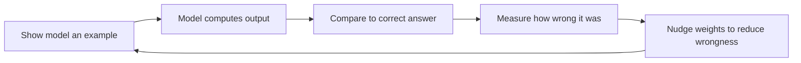
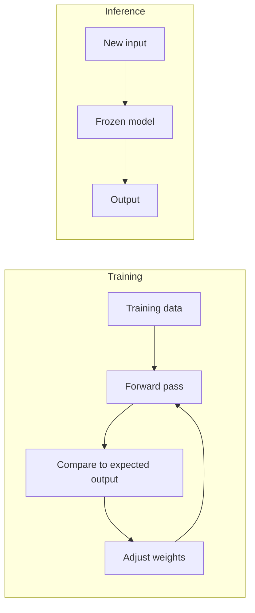
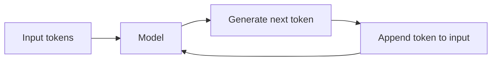
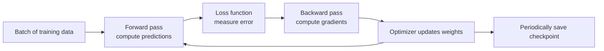
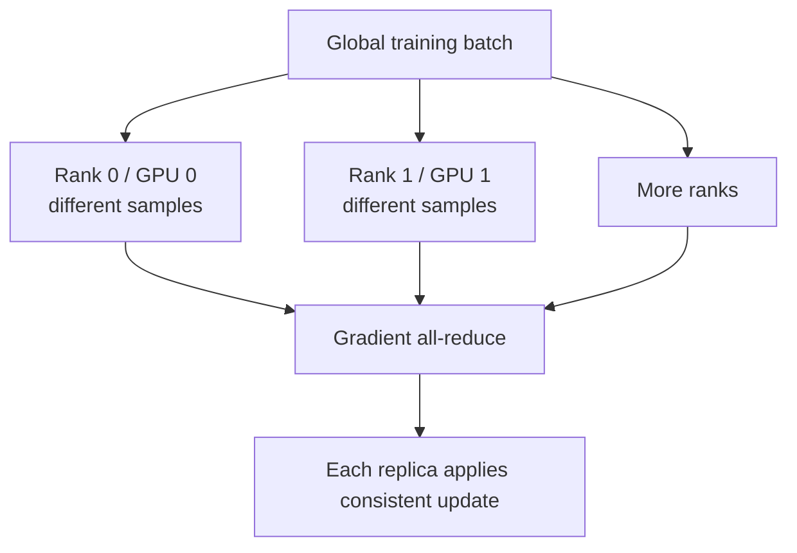
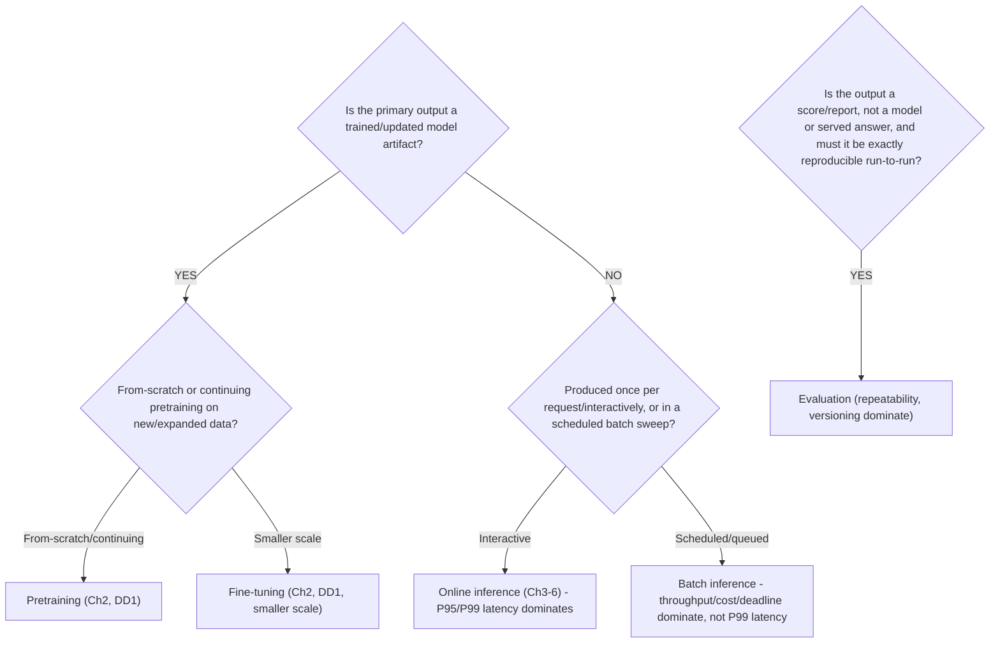
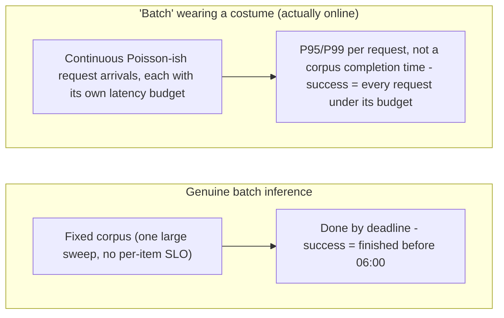
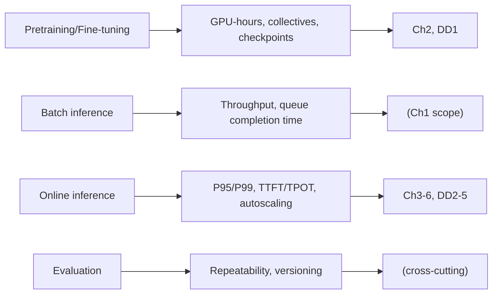

## Foundations: start here if AI/ML concepts are new to you

### What this section is, and what it isn't

This section will not make you a machine learning engineer, and it won't teach you the math behind neural network training in any rigorous sense — the rest of this chapter assumes you already have a working vocabulary for "training," "inference," "parameters," and "tokens," and moves straight into infrastructure decisions built on top of that vocabulary. What this section gives you is exactly that vocabulary, demystified rather than hand-waved, so that when the rest of this chapter says "training and inference have very different infrastructure needs," you already know precisely what those two words mean and why that sentence is true.

You're a senior engineer. You've almost certainly heard "model," "training," "inference," "parameters," and "LLM" tossed around casually. This section's job is to make sure those words mean something precise and unmysterious to you, one at a time.

### What a machine learning model actually is: honest version, no mysticism

Strip away the framing you may have absorbed from marketing or media: a **machine learning model** (a mathematical function with a large number of adjustable internal numbers that produces an output from an input) is, at the most honest level, a big function. You give it an input, it does arithmetic, it gives you an output. What makes it "learn" anything is that this function has an enormous number of internal numbers that can be adjusted — and adjusting them changes what the function computes.

Those adjustable internal numbers are called **parameters**, also commonly called **weights** (the adjustable numbers inside a model that determine what it computes; changing them changes the model's behavior). Think of them the same way you'd think of tunable coefficients in a big formula you already understand — like coefficients in a linear regression, just vastly more of them, arranged in layers instead of one flat equation. Nothing about a weight, by itself, is mysterious: it's a number, multiplied against some input, contributing to a result. The "intelligence," such as it is, comes entirely from having found — through a process described next — a specific combination of billions of these numbers that happens to produce useful outputs.

This is deliberately deflationary, and that's the point: a model is curve-fitting at enormous scale, not something categorically different from statistics you already understand the shape of.

**Check your understanding**
- Q: What is a "parameter" or "weight," concretely? A: One of the adjustable internal numbers in a model's function; changing it changes what the function outputs, the same way changing a coefficient changes a formula's result.
- Q: Is a model doing something fundamentally different from curve-fitting? A: No — at the honest, mechanical level, it's curve-fitting at a much larger scale, with many more adjustable numbers than a simple regression.

### What "training" actually means

So how do you find a good combination of billions of numbers? You don't set them by hand — you can't. **Training** (the process of repeatedly showing a model examples, measuring how wrong its output was, and adjusting its weights slightly to be less wrong next time) is that search process, done automatically and repeatedly.

The loop, in plain terms: show the model an example input where you know the correct output. Let the model compute its current output. Compare that output to the correct one and quantify how wrong it was. Nudge every weight a small amount in whatever direction tends to reduce that wrongness. Repeat — typically billions of times, across a huge dataset of examples.



This is precisely why training needs so much computation, and precisely why GPUs matter specifically for this step: each "nudge all the weights a little based on this batch of examples" step is, mechanically, applying the same kind of arithmetic operation across an enormous number of independent numbers at once — the exact same shape of problem a GPU is built for (recall the spreadsheet analogy: the same formula applied to millions of cells simultaneously). Training a large model is that operation, repeated at massive scale, which is why it's so GPU-hungry.

**Check your understanding**
- Q: In one sentence, what does "training" mean? A: Repeatedly showing a model examples, scoring how wrong its output was, and adjusting its weights to reduce that wrongness.
- Q: Why does training specifically need GPUs rather than just "a lot of computers"? A: Because adjusting millions or billions of weights based on a batch of examples is the same massively-parallel, same-operation-on-lots-of-data shape of math that GPUs are purpose-built to accelerate.

### What "inference" actually means, and why the training/inference split is the most important idea here

**Inference** (using an already-trained model, with its weights frozen and unchanging, to produce an output for a new input) is what happens after training is done. The weights are no longer being adjusted — you're just running the function forward, once, on a new input, to get an answer.

This distinction — training adjusts weights, inference does not — is the single most load-bearing idea for reading the rest of this chapter. Training and inference have almost entirely different infrastructure profiles: training is a long-running, extremely GPU- and memory-intensive batch process you run occasionally (to produce or update a model); inference is what happens continuously, in production, every time a user asks the deployed model something, and it typically needs to be fast and cheap per-request rather than maximally powerful per-run. The rest of this chapter spends real time on exactly this split because "which infrastructure do I need" has a completely different answer depending on which of the two you're doing. If you remember nothing else from this section, remember: training changes the model; inference uses the model.



**Check your understanding**
- Q: What's the one-sentence difference between training and inference? A: Training adjusts a model's weights based on examples; inference uses an already-trained, frozen model to produce an output for a new input, without changing anything.
- Q: Why might a production system need very different infrastructure for inference than for training? A: Training is an occasional, long-running, maximally GPU-intensive batch job to produce a model; inference is a continuous, per-request workload that usually needs to be fast and cost-efficient rather than maximally powerful.

### What a "token" is, and why generating one at a time matters

A **token** (a chunk of text — roughly a word or word-piece — that a language model reads and generates one unit at a time) is the basic unit a language model actually operates on. Text gets broken into tokens before the model ever sees it, and a language model's output is produced one token at a time, not as a complete answer in one step: it generates a token, feeds that back in as part of its own input, generates the next token, and so on.



This one-token-at-a-time behavior is not an implementation detail you can ignore — it's the direct reason the rest of this chapter treats **prefill** and **decode** as two separate phases with different performance characteristics. Loosely: the model first processes your entire input at once (prefill), then generates the reply token by token, each new token depending on everything generated so far (decode). You don't need this chapter's full depth on this yet — you just need to already know that "a model produces text one token at a time" is *why* those two phases exist as a distinction at all, instead of encountering that split as an unexplained given.

**Check your understanding**
- Q: What is a token, in plain terms? A: A chunk of text, roughly a word or piece of a word, that a language model reads or generates as a single unit.
- Q: Why does a model generating one token at a time (rather than a full answer at once) lead to something like separate "prefill" and "decode" phases? A: Because processing the given input happens once up front, while generating the reply happens step by step, each new token depending on everything produced so far — two different kinds of work with different performance behavior.

### What "70 billion parameters" actually means, and why bigger models need more GPU memory

You've likely heard models described by size, like "a 70 billion parameter model." Given everything above, this is now simple to interpret honestly: it's a count — the model has roughly 70 billion of those adjustable weight numbers described earlier. Nothing more mysterious than that.

And once it's just a count of numbers, "bigger models need more GPU memory" stops being a mysterious fact and becomes an obvious consequence: every one of those numbers has to be stored somewhere to be used, and has to be involved in the arithmetic every time the model runs (whether training or doing inference). More numbers means more memory to hold them and more computation to process them — the relationship is direct and mechanical, not a special property of "AI." A 70-billion-parameter model needing far more GPU memory than a 1-billion-parameter model follows the same logic as a program needing more RAM to hold a bigger array.

**Check your understanding**
- Q: What does "70 billion parameters" literally refer to? A: A count of roughly 70 billion adjustable weight numbers inside the model.
- Q: Why does a bigger parameter count directly imply a need for more GPU memory? A: Because every parameter must be stored and used in computation each time the model runs — more numbers means more storage and more arithmetic, the same way a larger array needs more RAM.

### 2. Essential data structures: scalars, vectors, matrices and tensors

A **scalar** is one value. A **vector** is a one-dimensional collection. A **matrix** has rows and columns. A **tensor** generalizes these ideas to more dimensions.

Examples:

| Data | Possible shape |
|---|---|
| one temperature | scalar |
| 768-value text embedding | `[768]` |
| batch of 32 embeddings | `[32, 768]` |
| batch of 16 RGB images | `[16, 3, 224, 224]` |
| language-model hidden state | `[batch, sequence, hidden_dimension]` |

The **shape** tells software how dimensions are organized. The **dtype/precision** tells it how each value is represented, such as FP32, FP16, BF16 or an integer format. Shape and dtype strongly affect memory and compatible GPU operations.

#### Tiny runnable example

```python
import torch

x = torch.tensor([[1.0, 2.0], [3.0, 4.0]])
weights = torch.tensor([[0.5], [1.5]])
y = x @ weights

print("x shape:", tuple(x.shape))
print("weights shape:", tuple(weights.shape))
print("result shape:", tuple(y.shape))
print(y)
```

Representative output:

```text
x shape: (2, 2)
weights shape: (2, 1)
result shape: (2, 1)
tensor([[3.5000],
        [7.5000]])
```

The `@` operation performs matrix multiplication. Real models chain many operations, with frameworks selecting optimized CPU/GPU implementations.

### 3. Training: how weights change

At a high level, training repeats this loop:



#### Terms that now have a place

- A **sample/example** is one training item.
- A **batch** is a group processed together before an update.
- A **forward pass** computes predictions from current weights.
- A **loss function** turns prediction error into a numeric objective.
- A **gradient** indicates how a parameter contributes to changing the loss.
- **Backpropagation** computes gradients through model operations.
- An **optimizer** uses gradients to update weights.
- An **epoch** is commonly one pass over the training dataset.
- A **checkpoint** stores recoverable training state such as weights and optimizer progress.

Training consumes more memory than weights alone because it can retain activations for backward computation, gradients, optimizer state and temporary workspace.

#### Why checkpoints are infrastructure concerns

A long training job can lose hours of work when a node fails. Checkpoint frequency trades storage/network load against recomputation after failure. A good platform design asks:

- How long does checkpoint writing pause or slow the job?
- Is storage shared, durable and fast enough under many simultaneous writers?
- Does the checkpoint contain everything required to resume?
- How is corruption detected?
- What recovery point objective is acceptable?

### 5. What makes a large language model special

An LLM processes sequences of **tokens**. A token may be a word, part of a word, punctuation or another encoded unit depending on the tokenizer.

#### Model weights and a lower-bound memory estimate

Suppose a model has 70 billion parameters:

| Weight representation | Bytes per parameter (simplified) | Weight storage lower bound |
|---|---:|---:|
| FP32 | 4 | about 280 GB |
| FP16/BF16 | 2 | about 140 GB |
| 8-bit | 1 | about 70 GB |
| 4-bit | 0.5 | about 35 GB |

This is only weight storage. Runtime overhead, quantization metadata, temporary workspace, activations and KV cache require additional memory. Actual engine layouts and supported precisions vary.

#### Prefill and decode

LLM generation usually has two operational phases:

1. **Prefill:** process the input prompt and create attention state. It can expose substantial parallel computation across prompt tokens.
2. **Decode:** generate new tokens iteratively, updating state and repeatedly reading model/cache data.

The same request can therefore change resource behavior over its lifetime.

#### KV cache

Attention layers create key/value state for prior tokens. Retaining this **KV cache** avoids recomputing the entire prior sequence for each new token. It consumes device memory and grows with factors including concurrent sequences, sequence lengths, model architecture, precision and parallel placement.

Operational consequences:

- longer prompts and outputs can consume more cache;
- more concurrent requests compete for cache capacity;
- cache-aware scheduling/routing may improve reuse but adds state-aware complexity;
- a replica can be alive yet not have enough memory to admit additional sequences;
- scaling down or rerouting may discard useful cache state.

### 6. Latency and throughput vocabulary

| Metric | Meaning | Why it matters |
|---|---|---|
| Request latency | total time from request to completion | user experience for complete responses |
| TTFT | time until the first output token | queueing, prefill and startup responsiveness |
| Inter-token latency | delay between generated tokens | perceived streaming speed/decode behavior |
| Tokens per second | generation throughput | engine/device efficiency, but define aggregation scope |
| Queue time/depth | waiting before execution/admission | insufficient or badly scheduled capacity |
| Request concurrency | simultaneous active/in-flight requests | drives batching, memory and queue pressure |
| Goodput | work meeting defined quality/SLO conditions | avoids counting unusably slow or failed output as success |

Always define whether a metric is per request, per sequence, per GPU, per replica or fleet-wide. A high fleet tokens/s number can hide poor tail latency.

### 7. Why batching helps—and what it costs

GPUs often execute more efficiently when several compatible requests are processed together. **Dynamic batching** waits briefly to form a larger batch. Triton's architecture provides per-model schedulers with configurable batching behavior.

Trade-off:

- wait longer: potentially larger batches and higher throughput;
- wait too long: increased request latency;
- batch incompatible shapes/lengths poorly: padding or scheduling inefficiency;
- admit too much concurrency: queue and device-memory pressure.

There is no universal correct batch size. Benchmark representative prompt/output distributions, concurrency and SLOs.

### 8. Multi-GPU and multi-node execution

Models use more than one GPU for two broad reasons:

1. **Capacity:** model/training state does not fit on one GPU.
2. **Performance:** more parallel resources can reduce completion time or increase throughput, if communication overhead remains controlled.

#### Common forms of parallelism

- **Data parallelism:** workers hold model replicas and process different data; gradients are synchronized during training.
- **Tensor parallelism:** split operations/tensors within layers across GPUs; communication is frequent and topology-sensitive.
- **Pipeline parallelism:** place different model stages/layer ranges on different devices; scheduling tries to keep stages busy.
- **Expert parallelism:** distribute experts in mixture-of-experts models; routing creates communication and load-balance concerns.



Adding GPUs does not guarantee linear speedup. Communication, imbalance, CPU/data input, storage and synchronization can dominate. One slow rank can delay a collective and therefore every peer.

### 9. Serving-system layers

Separate the model from the service around it:

| Layer | Responsibility |
|---|---|
| Gateway/API | authentication, rate limits, request contract, routing entry |
| Model router | select model/version/replica and possibly cache-aware destination |
| Scheduler/batcher | queue, admit and group requests |
| Inference backend/engine | execute optimized model operations |
| Model repository/cache | store and distribute model artifacts |
| GPU platform | allocate devices, driver/runtime, network and storage |
| Observability | request, queue, engine, GPU and outcome evidence |

#### Triton example

Official Triton architecture describes requests arriving through HTTP/gRPC/C API, routing to a per-model scheduler, optional batching, backend execution and response. A model repository makes model versions/configuration available.

#### NIM example

Current NIM LLM documentation describes a container with orchestration, profile/model management and an inference engine. Profiles can encode backend, precision, tensor/pipeline parallelism and hardware/memory fit. NIM simplifies packaging and supported deployment behavior; it does not remove workload sizing or platform responsibilities.

### 10. Training, fine-tuning, RAG and agents are not the same workload

| Workload | Changes weights? | Important state/dependencies |
|---|---|---|
| Pretraining | yes | large dataset, optimizer, distributed checkpoints |
| Fine-tuning | yes, often fewer/all parameters depending method | base model, training data, adapters/checkpoints |
| Evaluation | no main update | versioned test set, metrics, reproducible environment |
| Online inference | normally no | weights, KV cache, request queue, service dependencies |
| RAG | normally no main update | embedding model, vector/search index, source documents, authorization |
| Agentic workflow | normally no main update | model calls, tool APIs, workflow state, credentials and guardrails |

RAG does not "teach" the model new weights at request time. It retrieves external context and includes it in the inference workflow. This adds freshness, permission, retrieval-quality and dependency-latency concerns.

### 11. First safe lab: compare CPU and GPU execution

This lab needs PyTorch and optionally a CUDA-capable environment.

```python
import time
import torch

def run(device: str, size: int = 2048) -> None:
    a = torch.randn(size, size, device=device)
    b = torch.randn(size, size, device=device)

    if device == "cuda":
        torch.cuda.synchronize()

    started = time.perf_counter()
    c = a @ b

    if device == "cuda":
        torch.cuda.synchronize()

    elapsed = time.perf_counter() - started
    print(device, tuple(c.shape), f"{elapsed:.4f}s")

run("cpu")
if torch.cuda.is_available():
    run("cuda")
```

Why synchronize? GPU operations are commonly asynchronous with respect to the host. Without synchronization, the timer may measure submission rather than completed work.

Do not publish this as a benchmark. The result depends on hardware, software, warm-up, matrix size, precision and many other factors. Its teaching purpose is to expose host/device placement and asynchronous execution.

### 12. Worked platform scenario

**Request:** "Deploy a 70B model for 200 concurrent users. We have eight GPUs."

A beginner might immediately select an engine. A structured discovery asks:

1. Which exact model and weight precision/profile?
2. Maximum and typical input/output token distributions?
3. Streaming or complete responses?
4. TTFT, inter-token and total-latency objectives at which percentiles?
5. Expected arrival rate and concurrency over time?
6. Quality constraints for quantization or alternate models?
7. Does weight + KV cache + workspace fit under proposed parallelism?
8. What happens during model load, cold start and replica failure?
9. Which network/storage path distributes model artifacts?
10. What benchmark represents real traffic, and what is the acceptance threshold?

Only then compare TensorRT-LLM, vLLM, NIM or Triton-based serving arrangements and GPU topology.

### 13. Common beginner traps

- "Training and inference both run a model, so infrastructure is the same." They have different state, memory and SLO behavior.
- "Parameters equal total memory." They are a lower bound; runtime state adds more.
- "More GPUs always makes it faster." Communication and synchronization can erase gains.
- "100% GPU utilization means optimal throughput." It does not define useful work or efficiency.
- "Batch size is purely a performance knob." It changes memory and latency as well.
- "A Running Pod means the model is ready." Model download/load and readiness are separate.
- "RAG is fine-tuning." Retrieval supplies context without normally changing model weights.
- "Tokens per second is enough." Define scope and pair it with latency, errors and quality.

### 14. Study route through Volume 5

1. Classify the workload and success metric.
2. Trace training and checkpoints.
3. Trace LLM prefill, decode and KV cache.
4. Learn serving engines versus platform ownership.
5. Learn scaling from queues/work, not CPU alone.
6. Add distributed/disaggregated execution.
7. Add RAG state and dependencies.
8. Add security/tenancy.
9. Build a representative benchmark and cost model.

### Official references

- [CUDA programming model](https://docs.nvidia.com/cuda/cuda-programming-guide/01-introduction/programming-model.html)
- [NVIDIA Deep Learning Performance](https://docs.nvidia.com/deeplearning/performance/)
- [NVIDIA deep-learning framework containers/software stack](https://docs.nvidia.com/deeplearning/frameworks/user-guide/)
- [NCCL documentation](https://docs.nvidia.com/deeplearning/nccl/)
- [Triton architecture](https://docs.nvidia.com/deeplearning/triton-inference-server/user-guide/docs/user_guide/architecture.html)
- [Triton metrics](https://docs.nvidia.com/deeplearning/triton-inference-server/user-guide/docs/user_guide/metrics.html)
- [NIM for LLMs overview](https://docs.nvidia.com/nim/large-language-models/latest/about-nim-llm/overview.html)
- [NIM profiles and selection](https://docs.nvidia.com/nim/large-language-models/latest/deployment/model-profiles-and-selection.html)
- [NIM API and management endpoints](https://docs.nvidia.com/nim/large-language-models/latest/api-reference.html)
- [NVIDIA AI Enterprise application software](https://docs.nvidia.com/ai-enterprise/software/latest/application-software.html)

### Check your understanding: connect workload behavior to infrastructure

**Q1: Why are model weights only a lower bound for GPU-memory sizing?**
A: Runtime workspaces, activations, optimizer state during training, quantization metadata, and KV cache during inference add memory beyond stored weights.

**Q2: What does a higher fleet-wide tokens-per-second result fail to prove?**
A: It does not prove individual requests meet TTFT, inter-token, tail-latency, error-rate, or quality objectives. Define the aggregation scope and pair throughput with SLOs.

**Q3: Why can adding GPUs make scaling disappointing?**
A: Communication, synchronization, data input, imbalance, and one slow rank can dominate. Compare measured scaling efficiency and per-stage timing rather than assuming linear speedup.

### Glossary

- **Model** — a mathematical function with a large number of adjustable internal numbers that produces an output from an input.
- **Parameter / weight** — one of the adjustable internal numbers in a model that determines what it computes.
- **Training** — repeatedly showing a model examples, measuring how wrong its output was, and adjusting weights to reduce that wrongness.
- **Inference** — using an already-trained, frozen model to produce an output for a new input, without adjusting weights.
- **Token** — a chunk of text, roughly a word or word-piece, that a language model reads or generates as a single unit.
- **Prefill** — the phase where a model processes the entire given input at once, before generating any reply.
- **Decode** — the phase where a model generates the reply one token at a time, each depending on everything generated so far.
- **LLM (large language model)** — a language model with a very large number of parameters, typically trained on large amounts of text.
- **Tensor** — a multidimensional array whose shape and dtype influence memory use and compatible operations.
- **Batch** — a group of samples or requests processed together.
- **Loss / gradient / optimizer** — the measured training objective, its sensitivity to parameters, and the rule that updates weights.
- **Checkpoint** — saved training state used to resume after interruption.
- **KV cache** — retained attention state for prior tokens that avoids recomputation during generation.
- **TTFT** — time to first token, covering admission, queueing, and prefill before streaming begins.
- **Goodput** — completed work that also satisfies defined latency, correctness, or quality conditions.
- **RAG** — retrieval-augmented generation, which supplies external context without normally changing model weights.

### Before you go deeper, make sure you can...

- Explain what a model's "parameters" or "weights" literally are, without resorting to mystical language.
- State the training loop (show example, measure wrongness, nudge weights) in your own words.
- Explain the training-vs-inference distinction and why it drives fundamentally different infrastructure choices.
- Explain what a token is and why one-token-at-a-time generation is the reason prefill and decode exist as separate phases.
- Explain why a model with more parameters requires more GPU memory, using the "more numbers to store and compute" logic rather than an appeal to complexity.
- Read tensor shape and dtype as direct inputs to memory and execution behavior.
- Define TTFT, inter-token latency, throughput, queueing, concurrency, and goodput with an explicit aggregation scope.
- Explain why batching and multi-GPU parallelism trade latency or communication against capacity and throughput.

With that vocabulary in place, here's how to actually classify a workload before designing infrastructure for it.

**VOLUME 5**

**AI Workloads and AI Platform Architecture**

Training, inference, serving, scaling, state, security and performance trade-offs

**Fourth Edition - Teaching text with mechanisms, examples, visuals, scenarios and exercises**

Independent study guide based on public documentation and public practitioner material. Not an NVIDIA publication.

---

**Learning outcome:** Distinguish training, fine-tuning, evaluation, batch inference and online inference by compute, communication, storage and SLO behavior.

| Workload | Dominant concerns |
|---|---|
| Pretraining / large training | GPU-hours, distributed collectives, dataset feed, checkpoints, job reliability |
| Fine-tuning | model memory, training framework, smaller distributed jobs, artifacts/checkpoints |
| Batch inference | throughput, scheduling, queue completion time, cost |
| Online inference | P95/P99 latency, TTFT/TPOT, concurrency, autoscaling, availability |
| Evaluation | repeatability, dataset/model versioning, controlled benchmark environment |

Start architecture discovery by naming the workload and measurable outcome. An online service with a 500 ms P95 constraint needs a different capacity strategy from an overnight batch job that only needs to finish by 06:00.

➕ **Why this table is the entire interview opener for this volume:** every subsequent chapter (training topology, KV cache, autoscaling signal choice, security boundary, cost model) is a *downstream consequence* of which row of this table you're in. A Senior SA who jumps straight to "you need H100s with NVLink" without first asking "is this training or online inference, and what's the SLO" is answering the wrong question confidently. The single most valuable habit this chapter teaches is: **ask for the workload classification and the measurable outcome before any hardware/topology conversation starts.**

➕ **Classification decision tree (the mechanism behind the table):**

➕ **Interview-ready line:** *"Before I talk topology or GPU SKU, I need to know which cell of the workload table we're in — training and online inference have almost opposite infrastructure priorities: training optimizes for sustained throughput and restart cost, online inference optimizes for tail latency and elastic capacity."*

➕ **Extra worked scenario — the classification mistake that actually happens in the field:**
> **Situation:** A customer asks for "the same GPU cluster sizing as their training cluster" to run what they call "batch inference" — but on inspection, the workload is actually thousands of small, latency-sensitive requests arriving continuously from a live product feature, misnamed "batch" internally because it runs "in the background" from the caller's point of view.
> 1. Ask for the actual SLO: is there a deadline (batch) or a per-request latency budget (online, even if traffic-shaped)?
> 2. Check arrival pattern: a Poisson-ish continuous arrival stream with a latency budget is online inference wearing a batch costume; a large fixed corpus processed once with a completion deadline is genuine batch inference.
> 3. Misclassifying this leads to the wrong infrastructure twice: provisioning for throughput-only (no autoscaling, no P99 tracking) when the real requirement is tail latency, or over-provisioning idle always-on capacity for what is actually a nightly job.
> **Conclusion:** "Batch" and "online" are properties of the SLO and arrival pattern, not of internal team vocabulary — always verify against the measurable outcome column, not the label the requester uses.

➕ **Shortcut/mnemonic:** *"T-F-B-O-E: Time-to-train, Fit memory, Batch deadline, Online tail, Evaluation repeatability."* — five workload rows, five different primary metrics; if you can't name the primary metric in one sentence, you haven't classified the workload yet.

➕ **Diagram: arrival-pattern test for "batch" vs "online" (the field mistake, visualized)**

Same word ("batch") in the requester's vocabulary, two completely different infrastructure answers — the arrival pattern and the presence/absence of a per-item latency budget is the tell, not the label.

➕ **Diagram: workload row → dominant metric → chapter map**

The classification isn't academic — it is a routing table that tells you which later chapter's mechanisms actually apply to the workload in front of you.
