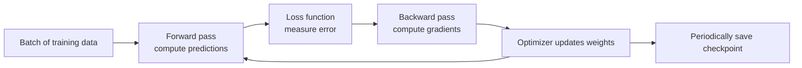
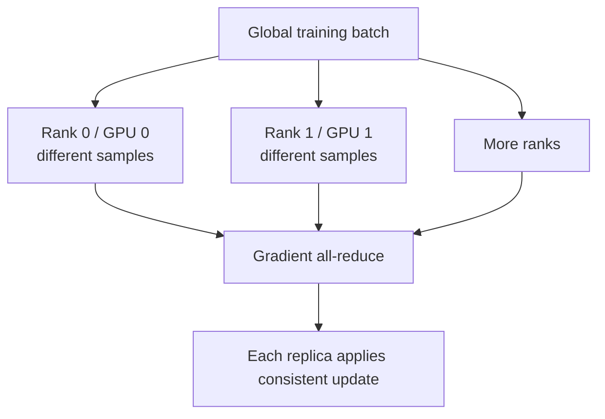
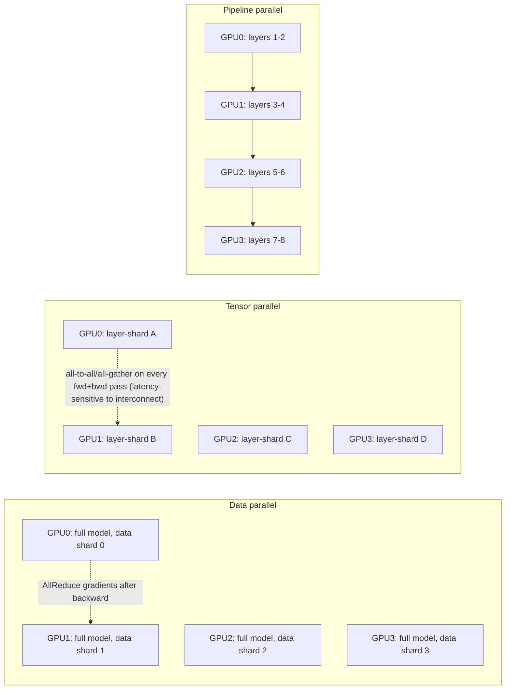
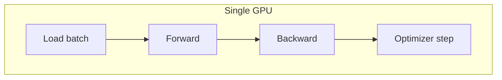
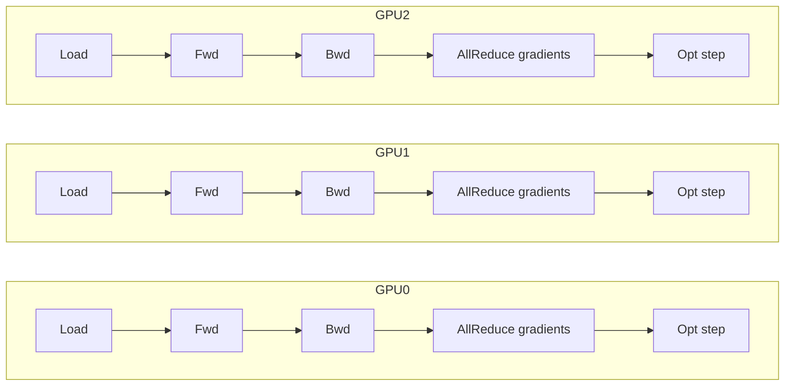
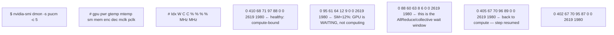
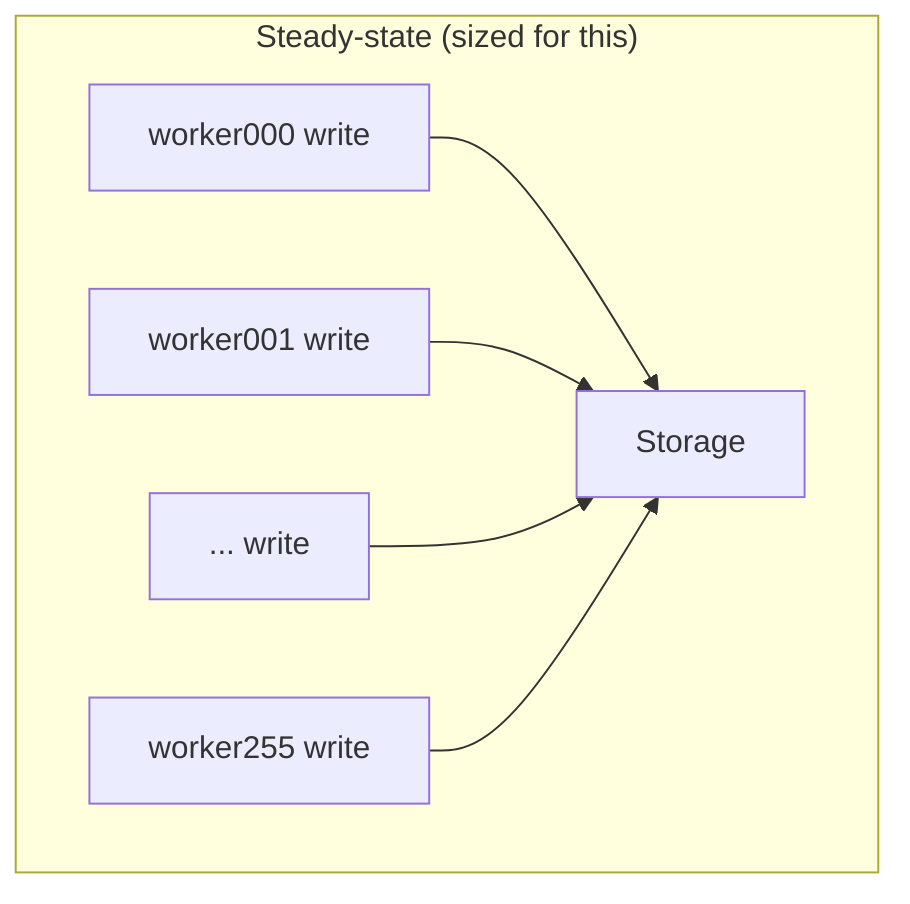
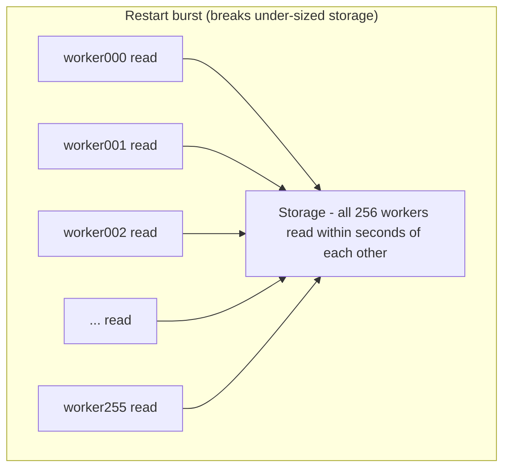

## Training and model-development software

**PyTorch** and **TensorFlow** are frameworks commonly used to define and train models. NVIDIA publishes optimized framework containers incorporating tested accelerator libraries.

**NeMo** is an NVIDIA framework/ecosystem for building, customizing and deploying generative-AI models and applications. It belongs closer to AI development than to low-level cluster provisioning.

Frameworks call optimized libraries; libraries call CUDA/driver interfaces; the cluster platform supplies devices, network, storage and scheduling. These ownership boundaries help incident routing.

## Training: how weights change

At a high level, training repeats this loop:

### Terms that now have a place

- A **sample/example** is one training item.
- A **batch** is a group processed together before an update.
- A **forward pass** computes predictions from current weights.
- A **loss function** turns prediction error into a numeric objective.
- A **gradient** indicates how a parameter contributes to changing the loss.
- **Backpropagation** computes gradients through model operations.
- An **optimizer** uses gradients to update weights.
- An **epoch** is commonly one pass over the training dataset.
- A **checkpoint** stores recoverable training state such as weights and optimizer progress.

Training consumes more memory than weights alone because it can retain activations for backward computation, gradients, optimizer state and temporary workspace.

### Why checkpoints are infrastructure concerns

A long training job can lose hours of work when a node fails. Checkpoint frequency trades storage/network load against recomputation after failure. A good platform design asks:

- How long does checkpoint writing pause or slow the job?
- Is storage shared, durable and fast enough under many simultaneous writers?
- Does the checkpoint contain everything required to resume?
- How is corruption detected?
- What recovery point objective is acceptable?

## Multi-GPU and multi-node execution

Models use more than one GPU for two broad reasons:

1. **Capacity:** model/training state does not fit on one GPU.
2. **Performance:** more parallel resources can reduce completion time or increase throughput, if communication overhead remains controlled.

### Common forms of parallelism

- **Data parallelism:** workers hold model replicas and process different data; gradients are synchronized during training.
- **Tensor parallelism:** split operations/tensors within layers across GPUs; communication is frequent and topology-sensitive.
- **Pipeline parallelism:** place different model stages/layer ranges on different devices; scheduling tries to keep stages busy.
- **Expert parallelism:** distribute experts in mixture-of-experts models; routing creates communication and load-balance concerns.

Adding GPUs does not guarantee linear speedup. Communication, imbalance, CPU/data input, storage and synchronization can dominate. One slow rank can delay a collective and therefore every peer.

**Learning outcome:** Understand why distributed training depends on GPU topology, fabric, storage and scheduler behavior.

Training repeatedly loads batches, performs forward/backward computation, exchanges data across devices when distributed, and periodically writes checkpoints. The critical path can shift across phases. GPU utilization drops if data preprocessing starves the device; scaling efficiency drops if collective communication grows faster than useful compute.

## 2.1 Parallelism vocabulary for infrastructure

| Pattern | Infrastructure implication |
|---|---|
| Data parallel | replicas process different data; gradient synchronization creates collective traffic |
| Tensor/model parallel | single model split across GPUs; latency/bandwidth sensitivity to interconnect |
| Pipeline parallel | layers/stages distributed; pipeline bubbles and stage balance matter |
| Checkpointing | large writes + durability/restart time; storage path affects recovery |

**Diagram: three parallelism patterns, same 4 GPUs, different split axis**

Data parallel: each GPU holds different data, same weights. Tensor parallel: each GPU holds the same layer, a different slice of its weights. Pipeline parallel: each GPU holds different layers, same data, flowing stage-to-stage; pipeline bubbles appear if stages are unbalanced.
The infrastructure implication column in the table above is a direct consequence of which axis is split: data parallel trades bandwidth for gradient sync once per step, tensor parallel pays interconnect latency on every layer, pipeline parallel pays idle "bubble" time when stages aren't balanced.

## Worked scenario
**Situation:** A training job scales from 8 to 32 GPUs but throughput only doubles.

1. Calculate scaling efficiency rather than celebrating total throughput alone.
2. Compare GPU step time and collective/communication time at 8 versus 32 GPUs.
3. Check topology/fabric and placement: are workers crossing slower links or nodes unexpectedly?
4. Check data-loader/storage throughput; more GPUs may amplify input demand.
5. Check batch/global-batch changes and framework configuration before blaming hardware.

**Conclusion:** Distributed scaling is an efficiency curve; adding GPUs increases both compute capacity and coordination cost.

**The training step timeline, made visible (what "step time" in the worked scenario is actually measuring):**

Single GPU: if load-batch time exceeds compute time, the GPU starves (SM util < 100%).

Every GPU blocks at the AllReduce step until all peers finish backward and the collective completes — one slow straggler stalls everyone.
The AllReduce bar is the "coordination cost" the worked scenario's conclusion names abstractly — it does not shrink just because you added GPUs; it can grow if the fabric between the new GPUs is slower (cross-node vs. NVLink) or if gradient tensor size stays fixed while step count per GPU drops, making the fixed communication overhead a larger fraction of each step.

**Sample `nvidia-smi dmon` output during a data-parallel step, annotated for exactly this diagnosis:**

Two consecutive low-`sm%` rows sandwiched between high-`sm%` rows is the signature of collective-communication stall, not data-loader starvation — a data-loader stall usually shows a longer, less regular low-utilization stretch and correlates with `iostat`/page-cache-miss evidence instead of a fixed periodic pattern tied to step boundaries. Distinguishing these two is exactly what the worked scenario's steps 2-4 are asking you to do with instrumentation instead of guessing.

**Extra worked scenario — checkpoint storm, a training-specific failure mode the original scenario doesn't cover:**
> **Situation:** A 256-GPU pretraining job checkpoints every 30 minutes. A transient network blip causes the job to restart. On restart, all 256 workers simultaneously attempt to read the last checkpoint shard set from shared storage within the same few seconds.
> 1. Storage throughput required at restart = (checkpoint shard size × 256) delivered near-simultaneously — a completely different I/O profile than the steady periodic *write* pattern storage was sized for.
> 2. If storage was sized for "256 workers writing 30-minute-interval checkpoints" (a smoothed, staggered load) but not for "256 workers reading the same checkpoint generation within one restart window," the read burst can saturate the storage backend, and restart time balloons — sometimes taking longer than the training interval it's protecting.
> 3. Fix directions: shard/replicate checkpoint reads (each worker reads only its own shard, not a shared monolith), stagger read start times, or use a storage tier with burst read bandwidth headroom sized for the *restart* case, not just the steady-state write case.
> 4. This is also why "restore time objective," named explicitly in Chapter 1, has to be measured under realistic full-job-restart conditions, not extrapolated from a single-worker checkpoint read test.
> **Conclusion:** Checkpoint storage capacity planning has two distinct load profiles — steady-state write and simultaneous full-fleet read — and sizing for only one silently breaks the other.

**Diagram: checkpoint storm — write profile vs. restart-read profile**

Steady-state writes are staggered over the 30-minute interval — smooth load.

Burst read bandwidth, not steady write bandwidth, is the number that matters here.

**Shortcut/mnemonic:** *"Scaling efficiency = useful compute ÷ (useful compute + coordination) — and coordination cost is a function of fabric speed, tensor size, and straggler variance, not GPU count alone."* When throughput doesn't scale linearly, the three things to check in order are: (1) is a straggler forcing everyone to wait, (2) is the fabric between the new GPUs slower than the fabric within the original set, (3) did global batch size change in a way that shifted the compute/communication ratio.

**Chapter drill questions (chapter-specific, additive):**
1. Given `nvidia-smi dmon` shows a regular, step-periodic dip in `sm%` to near-zero on every worker simultaneously, name the two most likely root causes and the one command/log correlation that distinguishes them.
2. A checkpoint write takes 90 seconds and happens every 5 minutes on a job whose step time is 2 seconds. Compute the percentage of wall-clock training time lost to checkpointing, and state at what step-time-to-checkpoint-time ratio you would recommend asynchronous/non-blocking checkpoint writes instead of synchronous ones.
