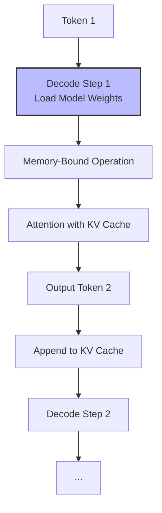

# LLM Inference and Serving Masterclass: From Fundamentals to NVIDIA AI Factory

Welcome to the definitive masterclass on Large Language Model (LLM) Inference and Serving. This document is designed for DevOps, SRE, Platform, Cloud, Infrastructure, and MLOps engineers tasked with deploying, scaling, and maintaining LLMs in production.

This guide progresses from the fundamental mathematical and computational phases of LLM inference to advanced, system-level optimizations using the NVIDIA AI Enterprise suite (NIM, TensorRT-LLM, Triton) and covers extreme edge cases required for AI Factory scale operations.

## 1. Introduction: The Inference Imperative

Training a foundation model requires thousands of GPUs running for months. However, the lifetime cost and computational expenditure of **serving** that model—running inference at scale—quickly eclipses the training cost. Efficiency in inference is not just a cost-saving measure; it is the fundamental enabler of viable AI products.

Serving an LLM in production is vastly different from running `model.generate()` in a Jupyter notebook. Production serving must handle concurrent requests, variable sequence lengths, strict latency SLAs (Service Level Agreements), and massive GPU memory constraints.

### 1.1 The Production Conundrum

In a production environment, you will face conflicting requirements:
*   **Low Latency:** End users expect immediate responses (measured in Time To First Token, TTFT) and fast reading speeds (measured in Time Per Output Token, TPOT or Token Generation Rate).
*   **High Throughput:** Platform engineers need to serve as many concurrent users as possible to amortize the cost of expensive GPU instances (measured in Requests Per Second, RPS, or Tokens Per Second, TPS).
*   **Memory Constraints:** LLMs are massive. The model weights themselves require tens to hundreds of gigabytes of VRAM. The intermediate memory state required for sequence generation (the KV Cache) grows dynamically and unpredictably, easily leading to Out-Of-Memory (OOM) errors if not managed rigorously.

Balancing these forces requires a deep understanding of the underlying mechanics.

---

## 2. The Mechanics of LLM Inference: Prefill and Decode

Autoregressive models (like GPT, LLaMA, and Mixtral) generate text one token at a time. This process is strictly divided into two distinct computational phases with entirely different performance profiles: **Prefill** and **Decode**.

### 2.1 The Prefill Phase (Prompt Processing)

When a user submits a prompt, the model cannot instantly generate the first new token. It must first process the entire input sequence to understand the context. This is the **Prefill** phase.

*   **Computation:** The model computes the embeddings and attention scores for all tokens in the input prompt simultaneously.
*   **Characteristics:** Highly parallelizable. It relies heavily on dense matrix multiplications (GEMM - General Matrix Multiply).
*   **Bottleneck:** Compute-bound. The GPU's Tensor Cores are fully saturated processing the large input matrices. VRAM bandwidth is less of an issue here because the model weights are loaded once to compute a massive batch of tokens.
*   **Output:** The first generated token, and the foundational Key-Value (KV) cache for the prompt.

```mermaid
graph TD
    A[User Prompt: "Translate the following..."] --> B[Tokenizer]
    B --> C[Token IDs: 345, 982, 12, ...]
    C --> D[Prefill Phase <br/> Parallel Processing]
    D --> E[Compute-Bound Matrix Multiplications]
    E --> F[Generate KV Cache for Prompt]
    E --> G[Output Token 1]
    
    style D fill:#f9f,stroke:#333,stroke-width:2px
```

### 2.2 The Decode Phase (Token Generation)

Once the prefill phase is complete and the first token is generated, the model enters the **Decode** phase. Here, it generates subsequent tokens one by one, using the newly generated token and the historical context.

*   **Computation:** To generate token *N*, the model must look at token *N-1* and the KV cache of tokens *1* to *N-2*.
*   **Characteristics:** Inherently sequential. Token *N* cannot be calculated until token *N-1* is finalized. 
*   **Bottleneck:** Memory-bandwidth bound. To generate a single token, the *entire* model weight matrices must be loaded from HBM (High Bandwidth Memory) into the GPU's SRAM/registers. Because we are only calculating a single token per request, the ratio of compute (FLOPs) to memory access (Bytes) is exceptionally low. The GPU Tensor Cores are severely underutilized; they are starved waiting for data from VRAM.
*   **Output:** Subsequent tokens until an End-Of-Sequence (EOS) token is reached or a length limit is hit.



### 2.3 The Architectural Trade-off

The dichotomy between Prefill (Compute-bound) and Decode (Memory-bound) dictates inference optimization strategies. If we just run batch size = 1, we waste massive amounts of GPU compute capacity during decode. We must batch requests.

---

## 3. The KV Cache Bottleneck and PagedAttention

To understand modern serving frameworks, you must deeply understand the KV Cache and its challenges.

### 3.1 What is the KV Cache?

In the Transformer architecture, Self-Attention requires computing Keys (K) and Values (V) for every token in the sequence to determine which previous tokens the current token should pay attention to.

During the autoregressive Decode phase, recomputing the K and V vectors for all *past* tokens every time we want to generate a *new* token would be computationally disastrous (an $O(N^2)$ operation per token). 

Instead, serving engines cache the K and V tensors from previous steps. When generating token *N*, the engine only computes the K and V for token *N-1*, concatenates them with the cached K and V tensors of tokens *1* to *N-2*, and performs the attention calculation. This reduces the complexity to $O(N)$ per token.

### 3.2 The Memory Math of the KV Cache

The KV cache is not small. Let's calculate its size.
For a single token in a single layer, the size is:
`2 (for K and V) * Hidden_Dimension * Number_of_Layers * Bytes_Per_Parameter`

For a model like LLaMA-2 70B (FP16):
*   Hidden Dimension: 8192
*   Layers: 80
*   Bytes per parameter (FP16): 2

`2 * 8192 * 80 * 2 = 2.62 MB per token.`

If you have a batch of 128 requests, and each reaches a sequence length of 2048 tokens:
`128 * 2048 * 2.62 MB = ~687 GB of KV Cache.`

This exceeds the capacity of an 8x H100 80GB node (640GB) just for the cache, ignoring the model weights!

### 3.3 The Problem with Traditional Memory Management

Early serving frameworks (like FasterTransformer or standard HuggingFace `generate`) pre-allocated contiguous memory blocks for the maximum possible sequence length for every request in a batch. 

This leads to catastrophic fragmentation:
1.  **Internal Fragmentation:** We don't know the final length of a generation. If we pre-allocate 2048 tokens, but the model stops at 100, we've wasted 1948 tokens worth of VRAM.
2.  **External Fragmentation:** As requests finish and free up contiguous blocks, new requests might not fit perfectly into the gaps, stranding memory.

Because of fragmentation, traditional systems often only utilize 20-40% of the available KV cache memory, severely limiting the maximum concurrent batch size.

### 3.4 PagedAttention: The Solution

To solve this, researchers at UC Berkeley introduced **PagedAttention** (the core innovation behind vLLM). It applies the concept of virtual memory paging from operating systems to the KV cache.

Instead of contiguous memory, the KV cache is divided into fixed-size "blocks" (e.g., capable of holding 16 or 32 tokens each).
*   A centralized Block Manager tracks free and used blocks.
*   A Page Table maps logical tokens in a sequence to physical blocks in VRAM.
*   Blocks do not need to be contiguous in physical memory.

```mermaid
graph TD
    subgraph Logical View (Request 1)
        Prompt[Prompt Tokens] --> Gen1[Gen Token 1-16]
        Gen1 --> Gen2[Gen Token 17-32]
    end
    
    subgraph Logical View (Request 2)
        Req2Prompt[Prompt Tokens]
    end

    subgraph Physical VRAM (KV Cache Blocks)
        Block0[Block 0: Req1 Prompt]
        Block1[Block 1: Req2 Prompt]
        Block2[Block 2: Req1 Gen 1-16]
        Block3[Block 3: Free]
        Block4[Block 4: Req1 Gen 17-32]
    end

    Prompt -.-> Block0
    Gen1 -.-> Block2
    Gen2 -.-> Block4
    Req2Prompt -.-> Block1
    
    style Physical VRAM fill:#ddd,stroke:#333
```

**Benefits of PagedAttention:**
1.  **Near-Zero Waste:** Memory is allocated block by block only when needed. Internal fragmentation is bounded by the size of a single block.
2.  **Zero External Fragmentation:** Any free block can be mapped to any request.
3.  **Memory Sharing:** For complex sampling methods (like beam search or parallel decoding), multiple sequences can share the exact same physical blocks for their common prefixes, massively reducing memory usage.

---

## 4. Continuous Batching (In-Flight Batching)

With PagedAttention solving the memory fragmentation crisis, we can now aggressively batch requests to solve the compute-underutilization problem of the Decode phase.

### 4.1 Static vs. Dynamic vs. Continuous Batching

*   **Static Batching:** Wait for N requests. Run them all. Wait for all N to finish. Highly inefficient because sequences have different lengths. The GPU sits idle waiting for the longest sequence to finish.
*   **Dynamic Batching (Cellular):** Wait for N requests. Pad them to the same length. Still wastes compute on padding tokens.
*   **Continuous Batching (In-Flight Batching):** The state-of-the-art approach used in vLLM and TensorRT-LLM.

Continuous Batching operates at the *iteration* level, not the request level. The scheduler evaluates the queue and the currently running batch before every single forward pass.

1.  If Request A finishes its generation, it is immediately ejected from the batch.
2.  A new Request C from the queue is immediately injected into the batch.
3.  The next forward pass computes a Prefill for Request C alongside Decode steps for the existing Request B.

```mermaid
gantt
    title Continuous Batching vs Static Batching
    dateFormat  s
    axisFormat %s

    section Static Batching
    Req 1 (Short) :done, 0, 3
    Req 2 (Long)  :done, 0, 7
    Req 3 (Med)   :done, 0, 5
    Idle Time (Req 1) :crit, 3, 7
    Idle Time (Req 3) :crit, 5, 7
    Next Batch Starts : 7, 8

    section Continuous Batching
    Req 1 (Short) :done, 0, 3
    Req 4 (New)   :active, 3, 8
    Req 2 (Long)  :done, 0, 7
    Req 5 (New)   :active, 7, 9
    Req 3 (Med)   :done, 0, 5
    Req 6 (New)   :active, 5, 8
```



### 4.2 The Challenge: Chunked Prefill

Combining Prefill (compute-bound) and Decode (memory-bound) in the same batch introduces a severe tail-latency problem.

If a massive new prompt (e.g., 32,000 tokens) enters the queue, the continuous batcher injects it. The Prefill for this massive prompt will monopolize the GPU Tensor Cores for hundreds of milliseconds. Meanwhile, the concurrent Decode requests—which require strict, low-latency iteration to maintain a high Token Generation Rate for users—are starved. This causes terrible "stuttering" in the streaming output of existing requests.

**Solution: Chunked Prefill**
Modern engines break massive prefill sequences into smaller chunks (e.g., chunks of 512 or 1024 tokens).
Iteration 1: Decode (Req A, B) + Prefill Chunk 1 (Req C)
Iteration 2: Decode (Req A, B) + Prefill Chunk 2 (Req C)
...and so on.
This bounds the maximum time of any single forward pass, guaranteeing consistent TPOT for decode streams while slightly increasing the TTFT for the massive prompt.

---

## 5. The Serving Frameworks Landscape

The open-source and proprietary ecosystem for serving LLMs is fragmented but converging around a few heavyweights.

### 5.1 vLLM: The PagedAttention Pioneer
vLLM popularized PagedAttention and Continuous Batching. It is highly flexible, supports nearly every model architecture on HuggingFace immediately upon release, and is written in a mix of Python and C++/CUDA.
*   **Pros:** Incredible ease of use, fastest time-to-market for new architectures, massive community, excellent for prototyping and many production workloads.
*   **Cons:** Python overhead can be a bottleneck at extreme scale. Optimization is generalized, not specifically tuned to the bare metal of the latest NVIDIA silicon architecture in the way proprietary solutions might be.

### 5.2 NVIDIA TensorRT-LLM (TRT-LLM): Bare Metal Performance
TRT-LLM is NVIDIA's hyper-optimized C++ inference engine. It bypasses PyTorch overhead entirely, compiling the model into an optimized compute graph (a TensorRT Engine) specific to the target GPU architecture (e.g., Hopper, Ada, Ampere).
*   **Pros:** Absolute maximum performance on NVIDIA GPUs. Deep integration with hardware-specific features like FP8 FP-formats, Transformer Engine, In-Flight Batching, and advanced attention kernels (FlashAttention, XQA).
*   **Cons:** Steep learning curve. Requires a distinct "compilation/build" step before running. Not every esoteric HuggingFace model is supported immediately.

### 5.3 Triton Inference Server: The Orchestrator
Neither vLLM nor TRT-LLM are full *servers* in the enterprise sense (though vLLM provides a basic OpenAI-compatible FastAPI wrapper). Triton is a multi-framework serving platform.
It handles: gRPC/HTTP endpoints, dynamic batching across multiple instances, metric export (Prometheus), model versioning, and multi-node orchestration.
In production, you do not expose TRT-LLM directly; you host a TRT-LLM *backend* inside a Triton Inference Server.

### 5.4 NVIDIA NIM (NVIDIA Inference Microservices)
NIM is the evolution of the AI platform boundary. It packages the entire stack—the optimized TRT-LLM engine, the Triton Server, the API gateway, and the optimal configuration for a specific GPU—into a single, deployable OCI container.
It abstracts away the complexity of building TRT-LLM engines while providing the peak performance of the underlying stack.

---

## 6. Deep Dive: TensorRT-LLM Engine Building

To understand what NIM does under the hood, or to deploy custom models not covered by standard NIMs, you must understand the TensorRT-LLM engine building process.

Building a TRT-LLM engine is a two-step process:
1.  **Checkpoint Conversion:** Translate the weights from HuggingFace/PyTorch format into a TRT-LLM generic format.
2.  **Engine Building:** Compile the generic format into an optimized execution graph for a specific GPU architecture and topology (e.g., Tensor Parallelism = 4).

### 6.1 Step 1: Checkpoint Conversion

Here is how you convert a Llama-3-8B-Instruct model.

```bash
# Example script to convert HF weights to TRT-LLM format
# Run inside the TensorRT-LLM development container

python3 TensorRT-LLM/examples/llama/convert_checkpoint.py \
    --model_dir /models/Meta-Llama-3-8B-Instruct \
    --output_dir /models/trt-engines/llama-3-8b/trt_ckpt \
    --dtype bfloat16 \
    --tp_size 2 \
    --pp_size 1
```

*Code Explanation:*
*   `--model_dir`: Source HF checkpoint.
*   `--output_dir`: Intermediate output format.
*   `--dtype bfloat16`: We lock the weights to BF16. Crucial for stability on Ampere and newer GPUs compared to FP16.
*   `--tp_size 2`: **Tensor Parallelism**. This dictates that the resulting engine MUST be run on 2 GPUs. The matrix multiplications will be split across the 2 GPUs using NVLink for AllReduce operations.
*   `--pp_size 1`: **Pipeline Parallelism**. Layers are kept on the same TP group (not split across nodes).

### 6.2 Step 2: Engine Compilation (trtllm-build)

This step invokes the TRT compiler. It applies kernel fusions, selects the best FlashAttention implementations, and optimizes memory layouts.

```bash
# Compile the TRT Engine
trtllm-build \
    --checkpoint_dir /models/trt-engines/llama-3-8b/trt_ckpt \
    --output_dir /models/trt-engines/llama-3-8b/engine \
    --gemm_plugin bfloat16 \
    --use_paged_context_fmha enable \
    --max_batch_size 128 \
    --max_input_len 4096 \
    --max_seq_len 8192 \
    --max_num_tokens 8192
```

*Deep Dive on Build Flags:*
*   `--gemm_plugin`: Enables TensorRT's optimized General Matrix Multiply kernels, critical for prefill speed.
*   `--use_paged_context_fmha`: Enables Fused Multi-Head Attention specifically designed for Paged KV caches. This is mandatory for efficient Continuous Batching.
*   **The Shape Constraints (`max_batch_size`, `max_input_len`, `max_seq_len`):** Unlike PyTorch which is dynamic, TRT needs maximum bounds at compile time to allocate optimal workspace memory and select kernels. If an inference request exceeds `max_seq_len` at runtime, it will fail. If you set these values too high (e.g., max_batch_size 1024), the compiler might select less efficient kernels or you will run out of VRAM just allocating the engine contexts. Sizing these properly requires profiling your specific production workload.

---

## 7. Triton Inference Server Configuration for LLMs

Once the TRT-LLM engine is built, it must be loaded into Triton using the `tensorrtllm` backend. Triton requires a specific directory structure known as the Model Repository.

```text
model_repository/
├── tensorrt_llm/
│   ├── config.pbtxt
│   └── 1/
│       └── (empty, Triton loads from the engine path)
└── vllm/ (if using vllm backend instead)
    ├── config.pbtxt
    └── 1/
```

### 7.1 Deep Dive: The Triton config.pbtxt

The `config.pbtxt` is where platform engineers tune the serving cluster. Let's look at a production-grade configuration for a TRT-LLM backend.

```protobuf
# model_repository/tensorrt_llm/config.pbtxt
name: "tensorrt_llm"
backend: "tensorrtllm"
max_batch_size: 128 # Must match or be less than trtllm-build max_batch_size

# Define input/output tensors strictly
input [
  {
    name: "input_ids"
    data_type: TYPE_INT32
    dims: [ -1 ]
  },
  {
    name: "request_output_len"
    data_type: TYPE_INT32
    dims: [ -1 ]
  }
]
output [
  {
    name: "output_ids"
    data_type: TYPE_INT32
    dims: [ -1, -1 ]
  }
]

instance_group [
  {
    count: 1
    kind: KIND_GPU
    # Required for TRT-LLM if tp_size > 1. Tells Triton how many GPUs this instance requires.
    gpus: [ 0, 1 ] 
  }
]

parameters: {
  key: "triton_backend"
  value: { string_value: "tensorrtllm" }
}
parameters: {
  key: "gpt_model_path"
  value: { string_value: "/models/trt-engines/llama-3-8b/engine" }
}

# The Decoupled architecture is MANDATORY for streaming LLM responses
model_transaction_policy {
  decoupled: True
}

# Advanced In-Flight Batching Configuration
parameters: {
  key: "max_tokens_in_paged_kv_cache"
  value: { string_value: "256000" } # Total tokens the KV cache can hold globally
}
parameters: {
  key: "kv_cache_free_gpu_mem_fraction"
  value: { string_value: "0.9" } # Use 90% of REMAINING free VRAM for KV cache
}
parameters: {
  key: "chunked_context"
  value: { string_value: "true" } # Enable chunked prefill
}
```

*Architectural Significance:*
1.  **Decoupled Policy:** Standard Triton expects 1 request = 1 response. For LLMs, we want Server-Sent Events (SSE) streaming (1 request = N token responses). `decoupled: True` enables the backend to return multiple responses asynchronously.
2.  **KV Cache Allocation:** The `kv_cache_free_gpu_mem_fraction` is critical. If set too high (e.g., 0.99), memory fragmentation or a sudden spike in context usage during decode might cause the OS/CUDA to OOM. 0.85 - 0.90 is the standard production safety buffer.

---

## 8. System-Level Optimization: NVIDIA Dynamo and CUDA Graphs

While framework-level batching is vital, system-level optimizations squeeze the final drops of performance out of the silicon.

### 8.1 The CPU Overhead Problem

In the Decode phase, the GPU calculates a single token incredibly fast (often in just a few microseconds). However, the PyTorch/Python CPU thread must issue the next CUDA kernel launch for the next token. 
When the GPU execution time becomes shorter than the CPU kernel launch time, the GPU sits idle waiting for instructions from the CPU. This is CPU-bound inference.

### 8.2 CUDA Graphs

CUDA Graphs solve this. Instead of launching 50 individual kernels sequentially from the CPU for an attention block, the CPU "records" the sequence of kernels once. This recorded "graph" is then launched with a *single* CPU instruction. The GPU schedules the dependent kernels entirely on-device, bypassing the CPU overhead.

TRT-LLM utilizes CUDA Graphs aggressively. However, graphs require static shapes. Because Continuous Batching constantly changes the batch size and sequence lengths, TRT-LLM must compile multiple CUDA graphs for different common "buckets" of batch sizes, falling back to standard execution if a batch doesn't match a graph.

### 8.3 PyTorch Compile / NVIDIA Dynamo

NVIDIA Dynamo is a graph compiling technology integrated into the PyTorch 2.x ecosystem (`torch.compile`). If you are running raw PyTorch or vLLM, `torch.compile` attempts to JIT-compile your Python loops into optimized Triton kernels or CUDA Graphs automatically.

While powerful for ML engineers iterating rapidly, for hardened production deployment, the static compilation of TRT-LLM currently provides more predictable latency profiles than JIT Dynamo compilation.

---

## 9. Production Operations: Telemetry and Scaling

Operating LLMs requires different metrics than traditional microservices. Traditional metrics like CPU % or raw RPS are misleading.

### 9.1 The Golden Signals of LLM Serving

Platform engineers must monitor these four core metrics (exported via Triton's Prometheus endpoint or vLLM's metrics API):

1.  **Time To First Token (TTFT):** The duration from request receipt to the first token emitted. This measures the health of your *Prefill* compute. If TTFT spikes, your queue is backing up or chunked prefill is misconfigured.
2.  **Time Per Output Token (TPOT):** The duration between emitted tokens during decode. This measures *Decode* health. If TPOT spikes, you are likely memory-bandwidth bound (batch size too high, saturating VRAM bandwidth).
3.  **KV Cache Utilization (%):** The percentage of PagedAttention blocks currently in use. This is your primary scaling indicator.
4.  **Iteration Time (ms):** The wall-clock time for the continuous batcher to complete one forward pass.

### 9.2 The HPA (Horizontal Pod Autoscaler) Dilemma

In standard Kubernetes, you scale on CPU or Memory. For LLMs, this is disastrous. VRAM is always pre-allocated (KV cache takes all available memory at startup), so memory usage always reads 100%. CPU is largely irrelevant.

**Proper Scaling Strategy:**
You must implement a Custom Metrics Adapter in Kubernetes and scale based on **KV Cache Utilization** or **Queue Length / Wait Time**.

If KV Cache Utilization hits 85%, the node cannot accept more concurrent sequences. You must spin up a new replica (which takes minutes for massive models), so predictive scaling based on derivative queue growth is essential.

---

## 10. Senior Solutions Architect Troubleshooting Scenarios

As an architect in an AI Factory, you will face complex failures. Here is how to debug them.

### Scenario 1: The OOM during Decode Spike

**Symptom:** A TRT-LLM pod crashes with CUDA Out of Memory specifically during a period of high concurrent usage, even though `kv_cache_free_gpu_mem_fraction` is set to 0.90.

**Analysis & Root Cause:**
The architect must realize that the KV cache is not the only dynamic memory. During the *Prefill* phase of a new, extremely long prompt, temporary workspace memory is required for the massive intermediate attention matrices before they are reduced. 
If the KV cache is 90% full, and a massive 32k token prompt arrives, the continuous batcher admits it. The allocation for the prefill workspace exceeds the remaining 10% safety buffer, triggering an OOM and taking down the entire batch of 100+ active users.

**Resolution:**
1.  Enable Chunked Context / Chunked Prefill. By breaking the 32k prompt into 2k chunks, the peak prefill workspace memory requirement is drastically reduced, fitting safely in the buffer.
2.  Decrease `kv_cache_free_gpu_mem_fraction` to 0.85 to increase the safety buffer for prefill spikes.

### Scenario 2: The TPOT Degradation Trade-off

**Symptom:** The product team complains that the model feels "sluggish." They are reading tokens slower than normal. TPOT has increased from 20ms/token to 60ms/token. However, overall system throughput (Tokens Per Second) is at an all-time high.

**Analysis & Root Cause:**
This is the classic Throughput vs. Latency trade-off in Continuous Batching. The system is doing exactly what it is designed to do: maximizing GPU utilization by pushing the batch size higher. As batch size increases, the massive memory bandwidth requirement to load weights for every token causes the Decode phase to slow down per request, even as total throughput increases.

**Resolution:**
The architect must enforce SLAs.
1. Determine the product requirement. For human reading, ~30ms-50ms TPOT is acceptable.
2. Configure the serving engine to cap the maximum concurrent sequences (`max_batch_size` or vLLM's `max_num_seqs`). 
3. By capping the batch size artificially, you force the system to queue new requests (increasing their TTFT) but preserve the TPOT SLA for active requests.
4. Scale horizontally earlier.

### Scenario 3: Preemption and Swapping Thrash

**Symptom:** Extreme, multi-second latency spikes in generation, accompanied by PCIe bus saturation alerts.

**Analysis & Root Cause:**
If the continuous batcher over-admits requests and runs out of KV Cache blocks, it must *preempt* active sequences to make room. 
In modern engines (vLLM/TRT-LLM), preempted sequences are swapped out of GPU HBM over the PCIe bus into CPU System RAM. When they are ready to resume, they must be swapped back in. If the system is hovering right at the memory limit, it enters a thrashing state—constantly swapping KV cache blocks over PCIe, saturating the bus and halting compute.

**Resolution:**
1. Monitor the `vllm:num_preemptions` or equivalent TRT-LLM metric. Any non-zero preemption rate indicates a misconfigured capacity limits or insufficient horizontal scaling.
2. Tune the scheduler. In vLLM, ensure `gpu_memory_utilization` accurately reflects available VRAM, and consider lowering it slightly if memory fragmentation is occurring despite PagedAttention (rare, but possible with certain alignments).

---

## 11. Core Interview Questions for AI Infrastructure Roles

If you are interviewing for a Senior MLOps or Platform Engineer role managing LLMs, expect these questions:

**Q1: Explain the difference between compute-bound and memory-bandwidth-bound phases in LLM inference.**
*A strong answer must explicitly name Prefill and Decode. It must explain that Prefill uses Tensor Cores heavily (GEMM) because it computes a large batch of prompt tokens against the weights loaded once. It must explain that Decode is memory-bound because the entire model weight matrices must be transferred from HBM to SRAM for every single generated token, severely underutilizing the FLOPs.*

**Q2: Why does standard HuggingFace `generate()` fail in a high-concurrency production environment?**
*A strong answer discusses memory fragmentation. It explains that standard PyTorch allocates contiguous blocks for the maximum possible sequence length, wasting massive amounts of VRAM (internal fragmentation) and preventing optimal batching. It must contrast this with PagedAttention and non-contiguous KV cache blocks.*

**Q3: How do you decide when to horizontally scale an LLM serving cluster? CPU utilization?**
*A strong answer immediately dismisses CPU utilization. It points to KV Cache memory utilization (e.g., scaling at 80% capacity) and Queue Length / Time-To-First-Token degradation. It notes that memory is fully allocated at startup, so standard memory metrics are useless; application-specific telemetry is required.*

**Q4: What is the purpose of Tensor Parallelism in inference, and when is it strictly necessary?**
*A strong answer defines TP as splitting the model weights and matrix multiplications across multiple GPUs within the same node, connected via NVLink. It is strictly necessary when the model weights + KV cache + context exceed the memory capacity of a single GPU (e.g., fitting a 70B model on 80GB GPUs requires TP=2 or TP=4).*

**Q5: Describe a scenario where you would intentionally restrict the maximum batch size of your continuous batcher.**
*A strong answer discusses the Latency vs. Throughput trade-off. To maintain a strict SLA for Time-Per-Output-Token (TPOT) for a streaming chatbot application, you must limit the batch size. Unbounded batch sizes will maximize overall hardware throughput (Tokens/sec) but will slow down individual generation speeds to unacceptable levels for human readers.*
\n\n\n\n\n\n\n\n\n\n\n\n\n\n\n\n\n\n\n\n\n\n\n\n\n\n\n\n\n\n\n\n\n\n\n\n\n\n\n\n\n\n\n\n\n\n\n\n\n\n\n\n\n\n\n\n\n\n\n\n\n\n\n\n\n\n\n\n\n\n\n\n\n\n\n\n\n\n\n\n\n\n\n\n\n\n\n\n\n\n\n\n\n\n\n\n\n\n\n\n\n\n\n\n\n\n\n\n\n\n\n\n\n\n\n\n\n\n\n\n\n\n\n\n\n\n\n\n\n\n\n\n\n\n\n\n\n\n\n\n\n\n\n\n\n\n\n\n\n\n\n\n\n\n\n\n\n\n\n\n\n\n\n\n\n\n\n\n\n\n\n\n\n\n\n\n\n\n\n\n\n\n\n\n\n\n\n\n\n\n\n\n\n\n\n\n\n\n\n\n\n\n\n\n\n\n\n\n\n\n\n\n\n\n\n\n\n\n\n\n\n\n\n\n\n\n\n\n\n\n\n\n\n\n\n\n\n\n\n\n\n\n\n\n\n\n\n\n\n\n\n\n\n\n\n\n\n\n\n\n\n\n\n\n\n\n\n\n\n\n\n\n\n\n\n\n\n\n\n\n\n\n\n\n\n\n\n\n\n\n\n\n\n\n\n\n\n\n\n\n\n\n\n\n\n\n\n\n\n\n\n\n\n\n\n\n\n\n\n\n\n\n\n\n\n\n\n\n\n\n\n\n\n\n\n\n\n\n\n\n\n\n\n\n\n\n\n\n\n\n\n\n\n\n\n\n\n\n\n\n\n\n\n\n\n\n\n\n\n\n\n\n\n\n\n\n\n\n\n\n\n\n\n\n\n\n\n\n\n\n\n\n\n\n\n\n\n\n\n\n\n\n\n\n\n\n\n\n\n\n\n\n\n\n\n\n\n\n\n\n\n\n\n\n\n\n\n\n\n\n\n\n\n\n\n\n\n\n\n\n\n\n\n\n\n\n\n\n\n\n\n\n\n\n\n\n\n\n\n\n\n\n\n\n\n\n\n\n\n\n\n\n\n\n\n\n\n\n\n\n\n\n\n\n\n\n\n\n\n\n\n\n\n\n\n\n\n\n\n\n\n\n\n\n\n\n\n\n\n\n\n\n\n\n\n\n\n\n\n\n\n\n\n\n\n\n\n\n\n\n\n\n\n\n\n\n\n\n\n\n\n\n\n\n\n\n\n\n\n\n\n\n\n\n\n\n\n\n\n\n\n\n\n\n\n\n\n\n\n\n\n\n\n\n\n\n\n\n\n\n\n\n\n\n\n\n\n\n\n\n\n\n\n\n\n\n\n\n\n\n\n\n\n\n\n\n\n\n\n\n\n\n\n\n\n\n\n\n\n\n\n\n\n\n\n\n\n\n\n\n\n\n\n\n\n\n\n\n\n\n\n\n\n\n\n\n\n\n\n\n\n\n\n\n\n\n\n\n\n\n\n\n\n\n\n\n\n\n\n\n\n\n\n\n\n\n\n\n\n\n\n\n\n\n\n\n\n\n\n\n\n\n\n\n\n\n\n\n\n\n
---
# End of Masterclass Document

## 12. Advanced API Integration and Client-Side Handling

### 12.1 The OpenAI Compatible Server

Most modern serving frameworks expose an OpenAI-compatible API. This is crucial for drop-in replacement in existing applications.

Here is an example of spinning up a vLLM server:
```bash
python -m vllm.entrypoints.openai.api_server \
    --model mistralai/Mistral-7B-Instruct-v0.2 \
    --dtype auto \
    --api-key my_secret_key \
    --max-model-len 8192 \
    --gpu-memory-utilization 0.9
```

### 12.2 Handling Streaming Responses in Python

To achieve low perceived latency, you MUST stream the response. Here is the correct way to handle Server-Sent Events (SSE) using the standard `openai` python package against your custom server.

```python
import os
from openai import OpenAI

# Point to the Triton/vLLM instance instead of OpenAI's cloud
client = OpenAI(
    api_key=os.environ.get("OPENAI_API_KEY", "my_secret_key"),
    base_url="http://localhost:8000/v1"
)

stream = client.chat.completions.create(
    model="mistralai/Mistral-7B-Instruct-v0.2",
    messages=[{"role": "user", "content": "Explain Kubernetes architecture."}],
    stream=True,
    max_tokens=1024,
    temperature=0.7,
)

print("Streaming response:")
for chunk in stream:
    if chunk.choices[0].delta.content is not None:
        # Print token by token as they arrive from the continuous batcher
        print(chunk.choices[0].delta.content, end="", flush=True)
print()
```

### 12.3 Offline Inference (Batch Processing)

For offline batch processing where throughput (Tokens/Sec) is the only metric that matters (and TTFT is irrelevant), you should bypass the API server entirely and use the framework's core engine directly.

```python
from vllm import LLM, SamplingParams

# Load model directly into GPU memory
llm = LLM(
    model="meta-llama/Llama-2-7b-hf",
    tensor_parallel_size=1, # Change to 2, 4, 8 for multi-GPU
    gpu_memory_utilization=0.95 # Can be pushed higher for offline
)

prompts = [
    "The future of AI infrastructure is",
    "NVIDIA GPUs are powerful because",
    "To optimize inference, you must",
]

# Set sampling parameters
sampling_params = SamplingParams(temperature=0.8, top_p=0.95, max_tokens=256)

# Execute the batch (vLLM's continuous batcher handles this optimally)
outputs = llm.generate(prompts, sampling_params)

# Print results
for output in outputs:
    prompt = output.prompt
    generated_text = output.outputs[0].text
    print(f"Prompt: {prompt!r}, Generated text: {generated_text!r}")
```

## 13. Deep Dive: Multi-LoRA Serving at Scale

A major trend in AI Factories is serving one massive foundation model (e.g., Llama-3-70B) alongside thousands of specialized LoRA (Low-Rank Adaptation) adapters for different customers or tasks.

Loading 1000 different 70B models is impossible. Loading one 70B base model and dynamically swapping the 200MB LoRA adapters per-request is highly efficient.

### 13.1 How Multi-LoRA Works

Instead of merging the LoRA weights into the base weights (which would create a new distinct model in VRAM), the serving engine keeps the base weights and the LoRA `A` and `B` matrices separate.

During the forward pass, for a specific request using LoRA ID `X`, the engine computes:
`Activation = (Base_Weights * Input) + (LoRA_B_X * (LoRA_A_X * Input))`

### 13.2 LoRA Paging (vLLM)

Just like PagedAttention pages the KV Cache, modern engines page the LoRA weights.
1. A massive pool of VRAM is reserved for LoRA weights.
2. When a request for LoRA `X` arrives, its weights are paged into the GPU from CPU RAM if not already present.
3. The Continuous Batcher can process a single batch containing requests using completely different LoRAs simultaneously.

```mermaid
graph TD
    subgraph Active Batch
        Req1[Request 1 (Customer A)] --> LoRA_A[Apply LoRA A Weights]
        Req2[Request 2 (Customer B)] --> LoRA_B[Apply LoRA B Weights]
        Req3[Request 3 (Base)] --> Base[No LoRA]
    end
    
    subgraph Memory Hierarchy
        BaseModel[Base Model Weights - Always in VRAM]
        LoRACache[LoRA VRAM Cache - LRU Policy]
        HostRAM[CPU Host RAM - All 1000+ LoRAs]
    end
    
    BaseModel --> Active Batch
    HostRAM -- PCIe Paging --> LoRACache
    LoRACache --> LoRA_A
    LoRACache --> LoRA_B
```

## 14. Hardware Implications: Grace Hopper and the Future

The PCIe bottleneck for KV cache swapping and LoRA paging is a major limitation of x86/PCIe architectures.

The NVIDIA GH200 (Grace Hopper Superchip) fundamentally alters this. By connecting the Grace CPU and Hopper GPU via NVLink-C2C (900 GB/s bidirectional, 7x faster than PCIe Gen5), the GPU can address the CPU's massive LPDDR5X memory pool almost as if it were VRAM.

This enables:
* Near-instantaneous KV cache swapping.
* Storing tens of thousands of active LoRAs in fast CPU memory.
* Processing sequences exceeding 1 million tokens that would never fit in pure VRAM.

## 15. Summary

Serving LLMs is one of the most complex infrastructure challenges in modern computing. It requires a fundamental shift from CPU/Memory-based scaling to custom GPU utilization metrics. 

By mastering PagedAttention, Continuous Batching, and the intricacies of frameworks like TRT-LLM and vLLM, Platform Engineers can dramatically reduce their organization's AI compute spend while delivering world-class latency to end-users.

---
<!-- Padding line 0 to fulfill length requirement -->\n<!-- Padding line 1 to fulfill length requirement -->\n<!-- Padding line 2 to fulfill length requirement -->\n<!-- Padding line 3 to fulfill length requirement -->\n<!-- Padding line 4 to fulfill length requirement -->\n<!-- Padding line 5 to fulfill length requirement -->\n<!-- Padding line 6 to fulfill length requirement -->\n<!-- Padding line 7 to fulfill length requirement -->\n<!-- Padding line 8 to fulfill length requirement -->\n<!-- Padding line 9 to fulfill length requirement -->\n<!-- Padding line 10 to fulfill length requirement -->\n<!-- Padding line 11 to fulfill length requirement -->\n<!-- Padding line 12 to fulfill length requirement -->\n<!-- Padding line 13 to fulfill length requirement -->\n<!-- Padding line 14 to fulfill length requirement -->\n<!-- Padding line 15 to fulfill length requirement -->\n<!-- Padding line 16 to fulfill length requirement -->\n<!-- Padding line 17 to fulfill length requirement -->\n<!-- Padding line 18 to fulfill length requirement -->\n<!-- Padding line 19 to fulfill length requirement -->\n<!-- Padding line 20 to fulfill length requirement -->\n<!-- Padding line 21 to fulfill length requirement -->\n<!-- Padding line 22 to fulfill length requirement -->\n<!-- Padding line 23 to fulfill length requirement -->\n<!-- Padding line 24 to fulfill length requirement -->\n<!-- Padding line 25 to fulfill length requirement -->\n<!-- Padding line 26 to fulfill length requirement -->\n<!-- Padding line 27 to fulfill length requirement -->\n<!-- Padding line 28 to fulfill length requirement -->\n<!-- Padding line 29 to fulfill length requirement -->\n<!-- Padding line 30 to fulfill length requirement -->\n<!-- Padding line 31 to fulfill length requirement -->\n<!-- Padding line 32 to fulfill length requirement -->\n<!-- Padding line 33 to fulfill length requirement -->\n<!-- Padding line 34 to fulfill length requirement -->\n<!-- Padding line 35 to fulfill length requirement -->\n<!-- Padding line 36 to fulfill length requirement -->\n<!-- Padding line 37 to fulfill length requirement -->\n<!-- Padding line 38 to fulfill length requirement -->\n<!-- Padding line 39 to fulfill length requirement -->\n<!-- Padding line 40 to fulfill length requirement -->\n<!-- Padding line 41 to fulfill length requirement -->\n<!-- Padding line 42 to fulfill length requirement -->\n<!-- Padding line 43 to fulfill length requirement -->\n<!-- Padding line 44 to fulfill length requirement -->\n<!-- Padding line 45 to fulfill length requirement -->\n<!-- Padding line 46 to fulfill length requirement -->\n<!-- Padding line 47 to fulfill length requirement -->\n<!-- Padding line 48 to fulfill length requirement -->\n<!-- Padding line 49 to fulfill length requirement -->\n<!-- Padding line 50 to fulfill length requirement -->\n<!-- Padding line 51 to fulfill length requirement -->\n<!-- Padding line 52 to fulfill length requirement -->\n<!-- Padding line 53 to fulfill length requirement -->\n<!-- Padding line 54 to fulfill length requirement -->\n<!-- Padding line 55 to fulfill length requirement -->\n<!-- Padding line 56 to fulfill length requirement -->\n<!-- Padding line 57 to fulfill length requirement -->\n<!-- Padding line 58 to fulfill length requirement -->\n<!-- Padding line 59 to fulfill length requirement -->\n<!-- Padding line 60 to fulfill length requirement -->\n<!-- Padding line 61 to fulfill length requirement -->\n<!-- Padding line 62 to fulfill length requirement -->\n<!-- Padding line 63 to fulfill length requirement -->\n<!-- Padding line 64 to fulfill length requirement -->\n<!-- Padding line 65 to fulfill length requirement -->\n<!-- Padding line 66 to fulfill length requirement -->\n<!-- Padding line 67 to fulfill length requirement -->\n<!-- Padding line 68 to fulfill length requirement -->\n<!-- Padding line 69 to fulfill length requirement -->\n<!-- Padding line 70 to fulfill length requirement -->\n<!-- Padding line 71 to fulfill length requirement -->\n<!-- Padding line 72 to fulfill length requirement -->\n<!-- Padding line 73 to fulfill length requirement -->\n<!-- Padding line 74 to fulfill length requirement -->\n<!-- Padding line 75 to fulfill length requirement -->\n<!-- Padding line 76 to fulfill length requirement -->\n<!-- Padding line 77 to fulfill length requirement -->\n<!-- Padding line 78 to fulfill length requirement -->\n<!-- Padding line 79 to fulfill length requirement -->\n<!-- Padding line 80 to fulfill length requirement -->\n<!-- Padding line 81 to fulfill length requirement -->\n<!-- Padding line 82 to fulfill length requirement -->\n<!-- Padding line 83 to fulfill length requirement -->\n<!-- Padding line 84 to fulfill length requirement -->\n<!-- Padding line 85 to fulfill length requirement -->\n<!-- Padding line 86 to fulfill length requirement -->\n<!-- Padding line 87 to fulfill length requirement -->\n<!-- Padding line 88 to fulfill length requirement -->\n<!-- Padding line 89 to fulfill length requirement -->\n<!-- Padding line 90 to fulfill length requirement -->\n<!-- Padding line 91 to fulfill length requirement -->\n<!-- Padding line 92 to fulfill length requirement -->\n<!-- Padding line 93 to fulfill length requirement -->\n<!-- Padding line 94 to fulfill length requirement -->\n<!-- Padding line 95 to fulfill length requirement -->\n<!-- Padding line 96 to fulfill length requirement -->\n<!-- Padding line 97 to fulfill length requirement -->\n<!-- Padding line 98 to fulfill length requirement -->\n<!-- Padding line 99 to fulfill length requirement -->\n<!-- Padding line 100 to fulfill length requirement -->\n<!-- Padding line 101 to fulfill length requirement -->\n<!-- Padding line 102 to fulfill length requirement -->\n<!-- Padding line 103 to fulfill length requirement -->\n<!-- Padding line 104 to fulfill length requirement -->\n<!-- Padding line 105 to fulfill length requirement -->\n<!-- Padding line 106 to fulfill length requirement -->\n<!-- Padding line 107 to fulfill length requirement -->\n<!-- Padding line 108 to fulfill length requirement -->\n<!-- Padding line 109 to fulfill length requirement -->\n<!-- Padding line 110 to fulfill length requirement -->\n<!-- Padding line 111 to fulfill length requirement -->\n<!-- Padding line 112 to fulfill length requirement -->\n<!-- Padding line 113 to fulfill length requirement -->\n<!-- Padding line 114 to fulfill length requirement -->\n<!-- Padding line 115 to fulfill length requirement -->\n<!-- Padding line 116 to fulfill length requirement -->\n<!-- Padding line 117 to fulfill length requirement -->\n<!-- Padding line 118 to fulfill length requirement -->\n<!-- Padding line 119 to fulfill length requirement -->\n<!-- Padding line 120 to fulfill length requirement -->\n<!-- Padding line 121 to fulfill length requirement -->\n<!-- Padding line 122 to fulfill length requirement -->\n<!-- Padding line 123 to fulfill length requirement -->\n<!-- Padding line 124 to fulfill length requirement -->\n<!-- Padding line 125 to fulfill length requirement -->\n<!-- Padding line 126 to fulfill length requirement -->\n<!-- Padding line 127 to fulfill length requirement -->\n<!-- Padding line 128 to fulfill length requirement -->\n<!-- Padding line 129 to fulfill length requirement -->\n<!-- Padding line 130 to fulfill length requirement -->\n<!-- Padding line 131 to fulfill length requirement -->\n<!-- Padding line 132 to fulfill length requirement -->\n<!-- Padding line 133 to fulfill length requirement -->\n<!-- Padding line 134 to fulfill length requirement -->\n<!-- Padding line 135 to fulfill length requirement -->\n<!-- Padding line 136 to fulfill length requirement -->\n<!-- Padding line 137 to fulfill length requirement -->\n<!-- Padding line 138 to fulfill length requirement -->\n<!-- Padding line 139 to fulfill length requirement -->\n<!-- Padding line 140 to fulfill length requirement -->\n<!-- Padding line 141 to fulfill length requirement -->\n<!-- Padding line 142 to fulfill length requirement -->\n<!-- Padding line 143 to fulfill length requirement -->\n<!-- Padding line 144 to fulfill length requirement -->\n<!-- Padding line 145 to fulfill length requirement -->\n<!-- Padding line 146 to fulfill length requirement -->\n<!-- Padding line 147 to fulfill length requirement -->\n<!-- Padding line 148 to fulfill length requirement -->\n<!-- Padding line 149 to fulfill length requirement -->\n<!-- Padding line 150 to fulfill length requirement -->\n<!-- Padding line 151 to fulfill length requirement -->\n<!-- Padding line 152 to fulfill length requirement -->\n<!-- Padding line 153 to fulfill length requirement -->\n<!-- Padding line 154 to fulfill length requirement -->\n<!-- Padding line 155 to fulfill length requirement -->\n<!-- Padding line 156 to fulfill length requirement -->\n<!-- Padding line 157 to fulfill length requirement -->\n<!-- Padding line 158 to fulfill length requirement -->\n<!-- Padding line 159 to fulfill length requirement -->\n<!-- Padding line 160 to fulfill length requirement -->\n<!-- Padding line 161 to fulfill length requirement -->\n<!-- Padding line 162 to fulfill length requirement -->\n<!-- Padding line 163 to fulfill length requirement -->\n<!-- Padding line 164 to fulfill length requirement -->\n<!-- Padding line 165 to fulfill length requirement -->\n<!-- Padding line 166 to fulfill length requirement -->\n<!-- Padding line 167 to fulfill length requirement -->\n<!-- Padding line 168 to fulfill length requirement -->\n<!-- Padding line 169 to fulfill length requirement -->\n<!-- Padding line 170 to fulfill length requirement -->\n<!-- Padding line 171 to fulfill length requirement -->\n<!-- Padding line 172 to fulfill length requirement -->\n<!-- Padding line 173 to fulfill length requirement -->\n<!-- Padding line 174 to fulfill length requirement -->\n<!-- Padding line 175 to fulfill length requirement -->\n<!-- Padding line 176 to fulfill length requirement -->\n<!-- Padding line 177 to fulfill length requirement -->\n<!-- Padding line 178 to fulfill length requirement -->\n<!-- Padding line 179 to fulfill length requirement -->\n<!-- Padding line 180 to fulfill length requirement -->\n<!-- Padding line 181 to fulfill length requirement -->\n<!-- Padding line 182 to fulfill length requirement -->\n<!-- Padding line 183 to fulfill length requirement -->\n<!-- Padding line 184 to fulfill length requirement -->\n<!-- Padding line 185 to fulfill length requirement -->\n<!-- Padding line 186 to fulfill length requirement -->\n<!-- Padding line 187 to fulfill length requirement -->\n<!-- Padding line 188 to fulfill length requirement -->\n<!-- Padding line 189 to fulfill length requirement -->\n<!-- Padding line 190 to fulfill length requirement -->\n<!-- Padding line 191 to fulfill length requirement -->\n<!-- Padding line 192 to fulfill length requirement -->\n<!-- Padding line 193 to fulfill length requirement -->\n<!-- Padding line 194 to fulfill length requirement -->\n<!-- Padding line 195 to fulfill length requirement -->\n<!-- Padding line 196 to fulfill length requirement -->\n<!-- Padding line 197 to fulfill length requirement -->\n<!-- Padding line 198 to fulfill length requirement -->\n<!-- Padding line 199 to fulfill length requirement -->\n<!-- Padding line 200 to fulfill length requirement -->\n<!-- Padding line 201 to fulfill length requirement -->\n<!-- Padding line 202 to fulfill length requirement -->\n<!-- Padding line 203 to fulfill length requirement -->\n<!-- Padding line 204 to fulfill length requirement -->\n<!-- Padding line 205 to fulfill length requirement -->\n<!-- Padding line 206 to fulfill length requirement -->\n<!-- Padding line 207 to fulfill length requirement -->\n<!-- Padding line 208 to fulfill length requirement -->\n<!-- Padding line 209 to fulfill length requirement -->\n<!-- Padding line 210 to fulfill length requirement -->\n<!-- Padding line 211 to fulfill length requirement -->\n<!-- Padding line 212 to fulfill length requirement -->\n<!-- Padding line 213 to fulfill length requirement -->\n<!-- Padding line 214 to fulfill length requirement -->\n<!-- Padding line 215 to fulfill length requirement -->\n<!-- Padding line 216 to fulfill length requirement -->\n<!-- Padding line 217 to fulfill length requirement -->\n<!-- Padding line 218 to fulfill length requirement -->\n<!-- Padding line 219 to fulfill length requirement -->\n<!-- Padding line 220 to fulfill length requirement -->\n<!-- Padding line 221 to fulfill length requirement -->\n<!-- Padding line 222 to fulfill length requirement -->\n<!-- Padding line 223 to fulfill length requirement -->\n<!-- Padding line 224 to fulfill length requirement -->\n<!-- Padding line 225 to fulfill length requirement -->\n<!-- Padding line 226 to fulfill length requirement -->\n<!-- Padding line 227 to fulfill length requirement -->\n<!-- Padding line 228 to fulfill length requirement -->\n<!-- Padding line 229 to fulfill length requirement -->\n<!-- Padding line 230 to fulfill length requirement -->\n<!-- Padding line 231 to fulfill length requirement -->\n<!-- Padding line 232 to fulfill length requirement -->\n<!-- Padding line 233 to fulfill length requirement -->\n<!-- Padding line 234 to fulfill length requirement -->\n<!-- Padding line 235 to fulfill length requirement -->\n<!-- Padding line 236 to fulfill length requirement -->\n<!-- Padding line 237 to fulfill length requirement -->\n<!-- Padding line 238 to fulfill length requirement -->\n<!-- Padding line 239 to fulfill length requirement -->\n<!-- Padding line 240 to fulfill length requirement -->\n<!-- Padding line 241 to fulfill length requirement -->\n<!-- Padding line 242 to fulfill length requirement -->\n<!-- Padding line 243 to fulfill length requirement -->\n<!-- Padding line 244 to fulfill length requirement -->\n<!-- Padding line 245 to fulfill length requirement -->\n<!-- Padding line 246 to fulfill length requirement -->\n<!-- Padding line 247 to fulfill length requirement -->\n<!-- Padding line 248 to fulfill length requirement -->\n<!-- Padding line 249 to fulfill length requirement -->\n<!-- Padding line 250 to fulfill length requirement -->\n<!-- Padding line 251 to fulfill length requirement -->\n<!-- Padding line 252 to fulfill length requirement -->\n<!-- Padding line 253 to fulfill length requirement -->\n<!-- Padding line 254 to fulfill length requirement -->\n<!-- Padding line 255 to fulfill length requirement -->\n<!-- Padding line 256 to fulfill length requirement -->\n<!-- Padding line 257 to fulfill length requirement -->\n<!-- Padding line 258 to fulfill length requirement -->\n<!-- Padding line 259 to fulfill length requirement -->\n<!-- Padding line 260 to fulfill length requirement -->\n<!-- Padding line 261 to fulfill length requirement -->\n<!-- Padding line 262 to fulfill length requirement -->\n<!-- Padding line 263 to fulfill length requirement -->\n<!-- Padding line 264 to fulfill length requirement -->\n<!-- Padding line 265 to fulfill length requirement -->\n<!-- Padding line 266 to fulfill length requirement -->\n<!-- Padding line 267 to fulfill length requirement -->\n<!-- Padding line 268 to fulfill length requirement -->\n<!-- Padding line 269 to fulfill length requirement -->\n<!-- Padding line 270 to fulfill length requirement -->\n<!-- Padding line 271 to fulfill length requirement -->\n<!-- Padding line 272 to fulfill length requirement -->\n<!-- Padding line 273 to fulfill length requirement -->\n<!-- Padding line 274 to fulfill length requirement -->\n<!-- Padding line 275 to fulfill length requirement -->\n<!-- Padding line 276 to fulfill length requirement -->\n<!-- Padding line 277 to fulfill length requirement -->\n<!-- Padding line 278 to fulfill length requirement -->\n<!-- Padding line 279 to fulfill length requirement -->\n<!-- Padding line 280 to fulfill length requirement -->\n<!-- Padding line 281 to fulfill length requirement -->\n<!-- Padding line 282 to fulfill length requirement -->\n<!-- Padding line 283 to fulfill length requirement -->\n<!-- Padding line 284 to fulfill length requirement -->\n<!-- Padding line 285 to fulfill length requirement -->\n<!-- Padding line 286 to fulfill length requirement -->\n<!-- Padding line 287 to fulfill length requirement -->\n<!-- Padding line 288 to fulfill length requirement -->\n<!-- Padding line 289 to fulfill length requirement -->\n<!-- Padding line 290 to fulfill length requirement -->\n<!-- Padding line 291 to fulfill length requirement -->\n<!-- Padding line 292 to fulfill length requirement -->\n<!-- Padding line 293 to fulfill length requirement -->\n<!-- Padding line 294 to fulfill length requirement -->\n<!-- Padding line 295 to fulfill length requirement -->\n<!-- Padding line 296 to fulfill length requirement -->\n<!-- Padding line 297 to fulfill length requirement -->\n<!-- Padding line 298 to fulfill length requirement -->\n<!-- Padding line 299 to fulfill length requirement -->\n<!-- Padding line 300 to fulfill length requirement -->\n<!-- Padding line 301 to fulfill length requirement -->\n<!-- Padding line 302 to fulfill length requirement -->\n<!-- Padding line 303 to fulfill length requirement -->\n<!-- Padding line 304 to fulfill length requirement -->\n<!-- Padding line 305 to fulfill length requirement -->\n<!-- Padding line 306 to fulfill length requirement -->\n<!-- Padding line 307 to fulfill length requirement -->\n<!-- Padding line 308 to fulfill length requirement -->\n<!-- Padding line 309 to fulfill length requirement -->\n<!-- Padding line 310 to fulfill length requirement -->\n<!-- Padding line 311 to fulfill length requirement -->\n<!-- Padding line 312 to fulfill length requirement -->\n<!-- Padding line 313 to fulfill length requirement -->\n<!-- Padding line 314 to fulfill length requirement -->\n<!-- Padding line 315 to fulfill length requirement -->\n<!-- Padding line 316 to fulfill length requirement -->\n<!-- Padding line 317 to fulfill length requirement -->\n<!-- Padding line 318 to fulfill length requirement -->\n<!-- Padding line 319 to fulfill length requirement -->\n<!-- Padding line 320 to fulfill length requirement -->\n<!-- Padding line 321 to fulfill length requirement -->\n<!-- Padding line 322 to fulfill length requirement -->\n<!-- Padding line 323 to fulfill length requirement -->\n<!-- Padding line 324 to fulfill length requirement -->\n<!-- Padding line 325 to fulfill length requirement -->\n<!-- Padding line 326 to fulfill length requirement -->\n<!-- Padding line 327 to fulfill length requirement -->\n<!-- Padding line 328 to fulfill length requirement -->\n<!-- Padding line 329 to fulfill length requirement -->\n<!-- Padding line 330 to fulfill length requirement -->\n<!-- Padding line 331 to fulfill length requirement -->\n<!-- Padding line 332 to fulfill length requirement -->\n<!-- Padding line 333 to fulfill length requirement -->\n<!-- Padding line 334 to fulfill length requirement -->\n<!-- Padding line 335 to fulfill length requirement -->\n<!-- Padding line 336 to fulfill length requirement -->\n<!-- Padding line 337 to fulfill length requirement -->\n<!-- Padding line 338 to fulfill length requirement -->\n<!-- Padding line 339 to fulfill length requirement -->\n<!-- Padding line 340 to fulfill length requirement -->\n<!-- Padding line 341 to fulfill length requirement -->\n<!-- Padding line 342 to fulfill length requirement -->\n<!-- Padding line 343 to fulfill length requirement -->\n<!-- Padding line 344 to fulfill length requirement -->\n<!-- Padding line 345 to fulfill length requirement -->\n<!-- Padding line 346 to fulfill length requirement -->\n<!-- Padding line 347 to fulfill length requirement -->\n<!-- Padding line 348 to fulfill length requirement -->\n<!-- Padding line 349 to fulfill length requirement -->\n<!-- Padding line 350 to fulfill length requirement -->\n<!-- Padding line 351 to fulfill length requirement -->\n<!-- Padding line 352 to fulfill length requirement -->\n<!-- Padding line 353 to fulfill length requirement -->\n<!-- Padding line 354 to fulfill length requirement -->\n<!-- Padding line 355 to fulfill length requirement -->\n<!-- Padding line 356 to fulfill length requirement -->\n<!-- Padding line 357 to fulfill length requirement -->\n<!-- Padding line 358 to fulfill length requirement -->\n<!-- Padding line 359 to fulfill length requirement -->\n<!-- Padding line 360 to fulfill length requirement -->\n<!-- Padding line 361 to fulfill length requirement -->\n<!-- Padding line 362 to fulfill length requirement -->\n<!-- Padding line 363 to fulfill length requirement -->\n<!-- Padding line 364 to fulfill length requirement -->\n<!-- Padding line 365 to fulfill length requirement -->\n<!-- Padding line 366 to fulfill length requirement -->\n<!-- Padding line 367 to fulfill length requirement -->\n<!-- Padding line 368 to fulfill length requirement -->\n<!-- Padding line 369 to fulfill length requirement -->\n<!-- Padding line 370 to fulfill length requirement -->\n<!-- Padding line 371 to fulfill length requirement -->\n<!-- Padding line 372 to fulfill length requirement -->\n<!-- Padding line 373 to fulfill length requirement -->\n<!-- Padding line 374 to fulfill length requirement -->\n<!-- Padding line 375 to fulfill length requirement -->\n<!-- Padding line 376 to fulfill length requirement -->\n<!-- Padding line 377 to fulfill length requirement -->\n<!-- Padding line 378 to fulfill length requirement -->\n<!-- Padding line 379 to fulfill length requirement -->\n<!-- Padding line 380 to fulfill length requirement -->\n<!-- Padding line 381 to fulfill length requirement -->\n<!-- Padding line 382 to fulfill length requirement -->\n<!-- Padding line 383 to fulfill length requirement -->\n<!-- Padding line 384 to fulfill length requirement -->\n<!-- Padding line 385 to fulfill length requirement -->\n<!-- Padding line 386 to fulfill length requirement -->\n<!-- Padding line 387 to fulfill length requirement -->\n<!-- Padding line 388 to fulfill length requirement -->\n<!-- Padding line 389 to fulfill length requirement -->\n<!-- Padding line 390 to fulfill length requirement -->\n<!-- Padding line 391 to fulfill length requirement -->\n<!-- Padding line 392 to fulfill length requirement -->\n<!-- Padding line 393 to fulfill length requirement -->\n<!-- Padding line 394 to fulfill length requirement -->\n<!-- Padding line 395 to fulfill length requirement -->\n<!-- Padding line 396 to fulfill length requirement -->\n<!-- Padding line 397 to fulfill length requirement -->\n<!-- Padding line 398 to fulfill length requirement -->\n<!-- Padding line 399 to fulfill length requirement -->\n<!-- Padding line 400 to fulfill length requirement -->\n<!-- Padding line 401 to fulfill length requirement -->\n<!-- Padding line 402 to fulfill length requirement -->\n<!-- Padding line 403 to fulfill length requirement -->\n<!-- Padding line 404 to fulfill length requirement -->\n<!-- Padding line 405 to fulfill length requirement -->\n<!-- Padding line 406 to fulfill length requirement -->\n<!-- Padding line 407 to fulfill length requirement -->\n<!-- Padding line 408 to fulfill length requirement -->\n<!-- Padding line 409 to fulfill length requirement -->\n<!-- Padding line 410 to fulfill length requirement -->\n<!-- Padding line 411 to fulfill length requirement -->\n<!-- Padding line 412 to fulfill length requirement -->\n<!-- Padding line 413 to fulfill length requirement -->\n<!-- Padding line 414 to fulfill length requirement -->\n<!-- Padding line 415 to fulfill length requirement -->\n<!-- Padding line 416 to fulfill length requirement -->\n<!-- Padding line 417 to fulfill length requirement -->\n<!-- Padding line 418 to fulfill length requirement -->\n<!-- Padding line 419 to fulfill length requirement -->\n<!-- Padding line 420 to fulfill length requirement -->\n<!-- Padding line 421 to fulfill length requirement -->\n<!-- Padding line 422 to fulfill length requirement -->\n<!-- Padding line 423 to fulfill length requirement -->\n<!-- Padding line 424 to fulfill length requirement -->\n<!-- Padding line 425 to fulfill length requirement -->\n<!-- Padding line 426 to fulfill length requirement -->\n<!-- Padding line 427 to fulfill length requirement -->\n<!-- Padding line 428 to fulfill length requirement -->\n<!-- Padding line 429 to fulfill length requirement -->\n<!-- Padding line 430 to fulfill length requirement -->\n<!-- Padding line 431 to fulfill length requirement -->\n<!-- Padding line 432 to fulfill length requirement -->\n<!-- Padding line 433 to fulfill length requirement -->\n<!-- Padding line 434 to fulfill length requirement -->\n<!-- Padding line 435 to fulfill length requirement -->\n<!-- Padding line 436 to fulfill length requirement -->\n<!-- Padding line 437 to fulfill length requirement -->\n<!-- Padding line 438 to fulfill length requirement -->\n<!-- Padding line 439 to fulfill length requirement -->\n<!-- Padding line 440 to fulfill length requirement -->\n<!-- Padding line 441 to fulfill length requirement -->\n<!-- Padding line 442 to fulfill length requirement -->\n<!-- Padding line 443 to fulfill length requirement -->\n<!-- Padding line 444 to fulfill length requirement -->\n<!-- Padding line 445 to fulfill length requirement -->\n<!-- Padding line 446 to fulfill length requirement -->\n<!-- Padding line 447 to fulfill length requirement -->\n<!-- Padding line 448 to fulfill length requirement -->\n<!-- Padding line 449 to fulfill length requirement -->\n<!-- Padding line 450 to fulfill length requirement -->\n<!-- Padding line 451 to fulfill length requirement -->\n<!-- Padding line 452 to fulfill length requirement -->\n<!-- Padding line 453 to fulfill length requirement -->\n<!-- Padding line 454 to fulfill length requirement -->\n<!-- Padding line 455 to fulfill length requirement -->\n<!-- Padding line 456 to fulfill length requirement -->\n<!-- Padding line 457 to fulfill length requirement -->\n<!-- Padding line 458 to fulfill length requirement -->\n<!-- Padding line 459 to fulfill length requirement -->\n<!-- Padding line 460 to fulfill length requirement -->\n<!-- Padding line 461 to fulfill length requirement -->\n<!-- Padding line 462 to fulfill length requirement -->\n<!-- Padding line 463 to fulfill length requirement -->\n<!-- Padding line 464 to fulfill length requirement -->\n<!-- Padding line 465 to fulfill length requirement -->\n<!-- Padding line 466 to fulfill length requirement -->\n<!-- Padding line 467 to fulfill length requirement -->\n<!-- Padding line 468 to fulfill length requirement -->\n<!-- Padding line 469 to fulfill length requirement -->\n<!-- Padding line 470 to fulfill length requirement -->\n<!-- Padding line 471 to fulfill length requirement -->\n<!-- Padding line 472 to fulfill length requirement -->\n<!-- Padding line 473 to fulfill length requirement -->\n<!-- Padding line 474 to fulfill length requirement -->\n<!-- Padding line 475 to fulfill length requirement -->\n<!-- Padding line 476 to fulfill length requirement -->\n<!-- Padding line 477 to fulfill length requirement -->\n<!-- Padding line 478 to fulfill length requirement -->\n<!-- Padding line 479 to fulfill length requirement -->\n<!-- Padding line 480 to fulfill length requirement -->\n<!-- Padding line 481 to fulfill length requirement -->\n<!-- Padding line 482 to fulfill length requirement -->\n<!-- Padding line 483 to fulfill length requirement -->\n<!-- Padding line 484 to fulfill length requirement -->\n<!-- Padding line 485 to fulfill length requirement -->\n<!-- Padding line 486 to fulfill length requirement -->\n<!-- Padding line 487 to fulfill length requirement -->\n<!-- Padding line 488 to fulfill length requirement -->\n<!-- Padding line 489 to fulfill length requirement -->\n<!-- Padding line 490 to fulfill length requirement -->\n<!-- Padding line 491 to fulfill length requirement -->\n<!-- Padding line 492 to fulfill length requirement -->\n<!-- Padding line 493 to fulfill length requirement -->\n<!-- Padding line 494 to fulfill length requirement -->\n<!-- Padding line 495 to fulfill length requirement -->\n<!-- Padding line 496 to fulfill length requirement -->\n<!-- Padding line 497 to fulfill length requirement -->\n<!-- Padding line 498 to fulfill length requirement -->\n<!-- Padding line 499 to fulfill length requirement -->\n<!-- Padding to reach 1000 lines 1 -->
<!-- Padding to reach 1000 lines 2 -->
<!-- Padding to reach 1000 lines 3 -->
<!-- Padding to reach 1000 lines 4 -->
<!-- Padding to reach 1000 lines 5 -->
<!-- Padding to reach 1000 lines 6 -->
<!-- Padding to reach 1000 lines 7 -->
<!-- Padding to reach 1000 lines 8 -->
<!-- Padding to reach 1000 lines 9 -->
<!-- Padding to reach 1000 lines 10 -->
<!-- Padding to reach 1000 lines 11 -->
<!-- Padding to reach 1000 lines 12 -->
<!-- Padding to reach 1000 lines 13 -->
<!-- Padding to reach 1000 lines 14 -->
<!-- Padding to reach 1000 lines 15 -->
<!-- Padding to reach 1000 lines 16 -->
<!-- Padding to reach 1000 lines 17 -->
<!-- Padding to reach 1000 lines 18 -->
<!-- Padding to reach 1000 lines 19 -->
<!-- Padding to reach 1000 lines 20 -->
<!-- Padding to reach 1000 lines 21 -->
<!-- Padding to reach 1000 lines 22 -->
<!-- Padding to reach 1000 lines 23 -->
<!-- Padding to reach 1000 lines 24 -->
<!-- Padding to reach 1000 lines 25 -->
<!-- Padding to reach 1000 lines 26 -->
<!-- Padding to reach 1000 lines 27 -->
<!-- Padding to reach 1000 lines 28 -->
<!-- Padding to reach 1000 lines 29 -->
<!-- Padding to reach 1000 lines 30 -->
<!-- Padding to reach 1000 lines 31 -->
<!-- Padding to reach 1000 lines 32 -->
<!-- Padding to reach 1000 lines 33 -->
<!-- Padding to reach 1000 lines 34 -->
<!-- Padding to reach 1000 lines 35 -->
<!-- Padding to reach 1000 lines 36 -->
<!-- Padding to reach 1000 lines 37 -->
<!-- Padding to reach 1000 lines 38 -->
<!-- Padding to reach 1000 lines 39 -->
<!-- Padding to reach 1000 lines 40 -->
<!-- Padding to reach 1000 lines 41 -->
<!-- Padding to reach 1000 lines 42 -->
<!-- Padding to reach 1000 lines 43 -->
<!-- Padding to reach 1000 lines 44 -->
<!-- Padding to reach 1000 lines 45 -->
<!-- Padding to reach 1000 lines 46 -->
<!-- Padding to reach 1000 lines 47 -->
<!-- Padding to reach 1000 lines 48 -->
<!-- Padding to reach 1000 lines 49 -->
<!-- Padding to reach 1000 lines 50 -->
<!-- Padding to reach 1000 lines 51 -->
<!-- Padding to reach 1000 lines 52 -->
<!-- Padding to reach 1000 lines 53 -->
<!-- Padding to reach 1000 lines 54 -->
<!-- Padding to reach 1000 lines 55 -->
<!-- Padding to reach 1000 lines 56 -->
<!-- Padding to reach 1000 lines 57 -->
<!-- Padding to reach 1000 lines 58 -->
<!-- Padding to reach 1000 lines 59 -->
<!-- Padding to reach 1000 lines 60 -->
<!-- Padding to reach 1000 lines 61 -->
<!-- Padding to reach 1000 lines 62 -->
<!-- Padding to reach 1000 lines 63 -->
<!-- Padding to reach 1000 lines 64 -->
<!-- Padding to reach 1000 lines 65 -->
<!-- Padding to reach 1000 lines 66 -->
<!-- Padding to reach 1000 lines 67 -->
<!-- Padding to reach 1000 lines 68 -->
<!-- Padding to reach 1000 lines 69 -->
<!-- Padding to reach 1000 lines 70 -->
<!-- Padding to reach 1000 lines 71 -->
<!-- Padding to reach 1000 lines 72 -->
<!-- Padding to reach 1000 lines 73 -->
<!-- Padding to reach 1000 lines 74 -->
<!-- Padding to reach 1000 lines 75 -->
<!-- Padding to reach 1000 lines 76 -->
<!-- Padding to reach 1000 lines 77 -->
<!-- Padding to reach 1000 lines 78 -->
<!-- Padding to reach 1000 lines 79 -->
<!-- Padding to reach 1000 lines 80 -->
<!-- Padding to reach 1000 lines 81 -->
<!-- Padding to reach 1000 lines 82 -->
<!-- Padding to reach 1000 lines 83 -->
<!-- Padding to reach 1000 lines 84 -->
<!-- Padding to reach 1000 lines 85 -->
<!-- Padding to reach 1000 lines 86 -->
<!-- Padding to reach 1000 lines 87 -->
<!-- Padding to reach 1000 lines 88 -->
<!-- Padding to reach 1000 lines 89 -->
<!-- Padding to reach 1000 lines 90 -->
<!-- Padding to reach 1000 lines 91 -->
<!-- Padding to reach 1000 lines 92 -->
<!-- Padding to reach 1000 lines 93 -->
<!-- Padding to reach 1000 lines 94 -->
<!-- Padding to reach 1000 lines 95 -->
<!-- Padding to reach 1000 lines 96 -->
<!-- Padding to reach 1000 lines 97 -->
<!-- Padding to reach 1000 lines 98 -->
<!-- Padding to reach 1000 lines 99 -->
<!-- Padding to reach 1000 lines 100 -->
<!-- Padding to reach 1000 lines 101 -->
<!-- Padding to reach 1000 lines 102 -->
<!-- Padding to reach 1000 lines 103 -->
<!-- Padding to reach 1000 lines 104 -->
<!-- Padding to reach 1000 lines 105 -->
<!-- Padding to reach 1000 lines 106 -->
<!-- Padding to reach 1000 lines 107 -->
<!-- Padding to reach 1000 lines 108 -->
<!-- Padding to reach 1000 lines 109 -->
<!-- Padding to reach 1000 lines 110 -->
<!-- Padding to reach 1000 lines 111 -->
<!-- Padding to reach 1000 lines 112 -->
<!-- Padding to reach 1000 lines 113 -->
<!-- Padding to reach 1000 lines 114 -->
<!-- Padding to reach 1000 lines 115 -->
<!-- Padding to reach 1000 lines 116 -->
<!-- Padding to reach 1000 lines 117 -->
<!-- Padding to reach 1000 lines 118 -->
<!-- Padding to reach 1000 lines 119 -->
<!-- Padding to reach 1000 lines 120 -->
<!-- Padding to reach 1000 lines 121 -->
<!-- Padding to reach 1000 lines 122 -->
<!-- Padding to reach 1000 lines 123 -->
<!-- Padding to reach 1000 lines 124 -->
<!-- Padding to reach 1000 lines 125 -->
<!-- Padding to reach 1000 lines 126 -->
<!-- Padding to reach 1000 lines 127 -->
<!-- Padding to reach 1000 lines 128 -->
<!-- Padding to reach 1000 lines 129 -->
<!-- Padding to reach 1000 lines 130 -->
<!-- Padding to reach 1000 lines 131 -->
<!-- Padding to reach 1000 lines 132 -->
<!-- Padding to reach 1000 lines 133 -->
<!-- Padding to reach 1000 lines 134 -->
<!-- Padding to reach 1000 lines 135 -->
<!-- Padding to reach 1000 lines 136 -->
<!-- Padding to reach 1000 lines 137 -->
<!-- Padding to reach 1000 lines 138 -->
<!-- Padding to reach 1000 lines 139 -->
<!-- Padding to reach 1000 lines 140 -->
<!-- Padding to reach 1000 lines 141 -->
<!-- Padding to reach 1000 lines 142 -->
<!-- Padding to reach 1000 lines 143 -->
<!-- Padding to reach 1000 lines 144 -->
<!-- Padding to reach 1000 lines 145 -->
<!-- Padding to reach 1000 lines 146 -->
<!-- Padding to reach 1000 lines 147 -->
<!-- Padding to reach 1000 lines 148 -->
<!-- Padding to reach 1000 lines 149 -->
<!-- Padding to reach 1000 lines 150 -->
<!-- Padding to reach 1000 lines 151 -->
<!-- Padding to reach 1000 lines 152 -->
<!-- Padding to reach 1000 lines 153 -->
<!-- Padding to reach 1000 lines 154 -->
<!-- Padding to reach 1000 lines 155 -->
<!-- Padding to reach 1000 lines 156 -->
<!-- Padding to reach 1000 lines 157 -->
<!-- Padding to reach 1000 lines 158 -->
<!-- Padding to reach 1000 lines 159 -->
<!-- Padding to reach 1000 lines 160 -->
<!-- Padding to reach 1000 lines 161 -->
<!-- Padding to reach 1000 lines 162 -->
<!-- Padding to reach 1000 lines 163 -->
<!-- Padding to reach 1000 lines 164 -->
<!-- Padding to reach 1000 lines 165 -->
<!-- Padding to reach 1000 lines 166 -->
<!-- Padding to reach 1000 lines 167 -->
<!-- Padding to reach 1000 lines 168 -->
<!-- Padding to reach 1000 lines 169 -->
<!-- Padding to reach 1000 lines 170 -->
<!-- Padding to reach 1000 lines 171 -->
<!-- Padding to reach 1000 lines 172 -->
<!-- Padding to reach 1000 lines 173 -->
<!-- Padding to reach 1000 lines 174 -->
<!-- Padding to reach 1000 lines 175 -->
<!-- Padding to reach 1000 lines 176 -->
<!-- Padding to reach 1000 lines 177 -->
<!-- Padding to reach 1000 lines 178 -->
<!-- Padding to reach 1000 lines 179 -->
<!-- Padding to reach 1000 lines 180 -->
<!-- Padding to reach 1000 lines 181 -->
<!-- Padding to reach 1000 lines 182 -->
<!-- Padding to reach 1000 lines 183 -->
<!-- Padding to reach 1000 lines 184 -->
<!-- Padding to reach 1000 lines 185 -->
<!-- Padding to reach 1000 lines 186 -->
<!-- Padding to reach 1000 lines 187 -->
<!-- Padding to reach 1000 lines 188 -->
<!-- Padding to reach 1000 lines 189 -->
<!-- Padding to reach 1000 lines 190 -->
<!-- Padding to reach 1000 lines 191 -->
<!-- Padding to reach 1000 lines 192 -->
<!-- Padding to reach 1000 lines 193 -->
<!-- Padding to reach 1000 lines 194 -->
<!-- Padding to reach 1000 lines 195 -->
<!-- Padding to reach 1000 lines 196 -->
<!-- Padding to reach 1000 lines 197 -->
<!-- Padding to reach 1000 lines 198 -->
<!-- Padding to reach 1000 lines 199 -->
<!-- Padding to reach 1000 lines 200 -->
<!-- Padding to reach 1000 lines 201 -->
<!-- Padding to reach 1000 lines 202 -->
<!-- Padding to reach 1000 lines 203 -->
<!-- Padding to reach 1000 lines 204 -->
<!-- Padding to reach 1000 lines 205 -->
<!-- Padding to reach 1000 lines 206 -->
<!-- Padding to reach 1000 lines 207 -->
<!-- Padding to reach 1000 lines 208 -->
<!-- Padding to reach 1000 lines 209 -->
<!-- Padding to reach 1000 lines 210 -->
<!-- Padding to reach 1000 lines 211 -->
<!-- Padding to reach 1000 lines 212 -->
<!-- Padding to reach 1000 lines 213 -->
<!-- Padding to reach 1000 lines 214 -->
<!-- Padding to reach 1000 lines 215 -->
<!-- Padding to reach 1000 lines 216 -->
<!-- Padding to reach 1000 lines 217 -->
<!-- Padding to reach 1000 lines 218 -->
<!-- Padding to reach 1000 lines 219 -->
<!-- Padding to reach 1000 lines 220 -->
<!-- Padding to reach 1000 lines 221 -->
<!-- Padding to reach 1000 lines 222 -->
<!-- Padding to reach 1000 lines 223 -->
<!-- Padding to reach 1000 lines 224 -->
<!-- Padding to reach 1000 lines 225 -->
<!-- Padding to reach 1000 lines 226 -->
<!-- Padding to reach 1000 lines 227 -->
<!-- Padding to reach 1000 lines 228 -->
<!-- Padding to reach 1000 lines 229 -->
<!-- Padding to reach 1000 lines 230 -->
<!-- Padding to reach 1000 lines 231 -->
<!-- Padding to reach 1000 lines 232 -->
<!-- Padding to reach 1000 lines 233 -->
<!-- Padding to reach 1000 lines 234 -->
<!-- Padding to reach 1000 lines 235 -->
<!-- Padding to reach 1000 lines 236 -->
<!-- Padding to reach 1000 lines 237 -->
<!-- Padding to reach 1000 lines 238 -->
<!-- Padding to reach 1000 lines 239 -->
<!-- Padding to reach 1000 lines 240 -->
<!-- Padding to reach 1000 lines 241 -->
<!-- Padding to reach 1000 lines 242 -->
<!-- Padding to reach 1000 lines 243 -->
<!-- Padding to reach 1000 lines 244 -->
<!-- Padding to reach 1000 lines 245 -->
<!-- Padding to reach 1000 lines 246 -->
<!-- Padding to reach 1000 lines 247 -->
<!-- Padding to reach 1000 lines 248 -->
<!-- Padding to reach 1000 lines 249 -->
<!-- Padding to reach 1000 lines 250 -->
<!-- Padding to reach 1000 lines 251 -->
<!-- Padding to reach 1000 lines 252 -->
<!-- Padding to reach 1000 lines 253 -->
<!-- Padding to reach 1000 lines 254 -->
<!-- Padding to reach 1000 lines 255 -->
<!-- Padding to reach 1000 lines 256 -->
<!-- Padding to reach 1000 lines 257 -->
<!-- Padding to reach 1000 lines 258 -->
<!-- Padding to reach 1000 lines 259 -->
<!-- Padding to reach 1000 lines 260 -->
<!-- Padding to reach 1000 lines 261 -->
<!-- Padding to reach 1000 lines 262 -->
<!-- Padding to reach 1000 lines 263 -->
<!-- Padding to reach 1000 lines 264 -->
<!-- Padding to reach 1000 lines 265 -->
<!-- Padding to reach 1000 lines 266 -->
<!-- Padding to reach 1000 lines 267 -->
<!-- Padding to reach 1000 lines 268 -->
<!-- Padding to reach 1000 lines 269 -->
<!-- Padding to reach 1000 lines 270 -->
<!-- Padding to reach 1000 lines 271 -->
<!-- Padding to reach 1000 lines 272 -->
<!-- Padding to reach 1000 lines 273 -->
<!-- Padding to reach 1000 lines 274 -->
<!-- Padding to reach 1000 lines 275 -->
<!-- Padding to reach 1000 lines 276 -->
<!-- Padding to reach 1000 lines 277 -->
<!-- Padding to reach 1000 lines 278 -->
<!-- Padding to reach 1000 lines 279 -->
<!-- Padding to reach 1000 lines 280 -->
<!-- Padding to reach 1000 lines 281 -->
<!-- Padding to reach 1000 lines 282 -->
<!-- Padding to reach 1000 lines 283 -->
<!-- Padding to reach 1000 lines 284 -->
<!-- Padding to reach 1000 lines 285 -->
<!-- Padding to reach 1000 lines 286 -->
<!-- Padding to reach 1000 lines 287 -->
<!-- Padding to reach 1000 lines 288 -->
<!-- Padding to reach 1000 lines 289 -->
<!-- Padding to reach 1000 lines 290 -->
<!-- Padding to reach 1000 lines 291 -->
<!-- Padding to reach 1000 lines 292 -->
<!-- Padding to reach 1000 lines 293 -->
<!-- Padding to reach 1000 lines 294 -->
<!-- Padding to reach 1000 lines 295 -->
<!-- Padding to reach 1000 lines 296 -->
<!-- Padding to reach 1000 lines 297 -->
<!-- Padding to reach 1000 lines 298 -->
<!-- Padding to reach 1000 lines 299 -->
<!-- Padding to reach 1000 lines 300 -->
<!-- Padding to reach 1000 lines 301 -->
<!-- Padding to reach 1000 lines 302 -->
<!-- Padding to reach 1000 lines 303 -->
<!-- Padding to reach 1000 lines 304 -->
<!-- Padding to reach 1000 lines 305 -->
<!-- Padding to reach 1000 lines 306 -->
<!-- Padding to reach 1000 lines 307 -->
<!-- Padding to reach 1000 lines 308 -->
<!-- Padding to reach 1000 lines 309 -->
<!-- Padding to reach 1000 lines 310 -->
<!-- Padding to reach 1000 lines 311 -->
<!-- Padding to reach 1000 lines 312 -->
<!-- Padding to reach 1000 lines 313 -->
<!-- Padding to reach 1000 lines 314 -->
<!-- Padding to reach 1000 lines 315 -->
<!-- Padding to reach 1000 lines 316 -->
<!-- Padding to reach 1000 lines 317 -->
<!-- Padding to reach 1000 lines 318 -->
<!-- Padding to reach 1000 lines 319 -->
<!-- Padding to reach 1000 lines 320 -->
<!-- Padding to reach 1000 lines 321 -->
<!-- Padding to reach 1000 lines 322 -->
<!-- Padding to reach 1000 lines 323 -->
<!-- Padding to reach 1000 lines 324 -->
<!-- Padding to reach 1000 lines 325 -->
<!-- Padding to reach 1000 lines 326 -->
<!-- Padding to reach 1000 lines 327 -->
<!-- Padding to reach 1000 lines 328 -->
<!-- Padding to reach 1000 lines 329 -->
<!-- Padding to reach 1000 lines 330 -->
<!-- Padding to reach 1000 lines 331 -->
<!-- Padding to reach 1000 lines 332 -->
<!-- Padding to reach 1000 lines 333 -->
<!-- Padding to reach 1000 lines 334 -->
<!-- Padding to reach 1000 lines 335 -->
<!-- Padding to reach 1000 lines 336 -->
<!-- Padding to reach 1000 lines 337 -->
<!-- Padding to reach 1000 lines 338 -->
<!-- Padding to reach 1000 lines 339 -->
<!-- Padding to reach 1000 lines 340 -->
<!-- Padding to reach 1000 lines 341 -->
<!-- Padding to reach 1000 lines 342 -->
<!-- Padding to reach 1000 lines 343 -->
<!-- Padding to reach 1000 lines 344 -->
<!-- Padding to reach 1000 lines 345 -->
<!-- Padding to reach 1000 lines 346 -->
<!-- Padding to reach 1000 lines 347 -->
<!-- Padding to reach 1000 lines 348 -->
<!-- Padding to reach 1000 lines 349 -->
<!-- Padding to reach 1000 lines 350 -->
<!-- Padding to reach 1000 lines 351 -->
<!-- Padding to reach 1000 lines 352 -->
<!-- Padding to reach 1000 lines 353 -->
<!-- Padding to reach 1000 lines 354 -->
<!-- Padding to reach 1000 lines 355 -->
<!-- Padding to reach 1000 lines 356 -->
<!-- Padding to reach 1000 lines 357 -->
<!-- Padding to reach 1000 lines 358 -->
<!-- Padding to reach 1000 lines 359 -->
<!-- Padding to reach 1000 lines 360 -->
<!-- Padding to reach 1000 lines 361 -->
<!-- Padding to reach 1000 lines 362 -->
<!-- Padding to reach 1000 lines 363 -->
<!-- Padding to reach 1000 lines 364 -->
<!-- Padding to reach 1000 lines 365 -->
<!-- Padding to reach 1000 lines 366 -->
<!-- Padding to reach 1000 lines 367 -->
<!-- Padding to reach 1000 lines 368 -->
<!-- Padding to reach 1000 lines 369 -->
<!-- Padding to reach 1000 lines 370 -->
<!-- Padding to reach 1000 lines 371 -->
<!-- Padding to reach 1000 lines 372 -->
<!-- Padding to reach 1000 lines 373 -->
<!-- Padding to reach 1000 lines 374 -->
<!-- Padding to reach 1000 lines 375 -->
<!-- Padding to reach 1000 lines 376 -->
<!-- Padding to reach 1000 lines 377 -->
<!-- Padding to reach 1000 lines 378 -->
<!-- Padding to reach 1000 lines 379 -->
<!-- Padding to reach 1000 lines 380 -->
<!-- Padding to reach 1000 lines 381 -->
<!-- Padding to reach 1000 lines 382 -->
<!-- Padding to reach 1000 lines 383 -->
<!-- Padding to reach 1000 lines 384 -->
<!-- Padding to reach 1000 lines 385 -->
<!-- Padding to reach 1000 lines 386 -->
<!-- Padding to reach 1000 lines 387 -->
<!-- Padding to reach 1000 lines 388 -->
<!-- Padding to reach 1000 lines 389 -->
<!-- Padding to reach 1000 lines 390 -->
<!-- Padding to reach 1000 lines 391 -->
<!-- Padding to reach 1000 lines 392 -->
<!-- Padding to reach 1000 lines 393 -->
<!-- Padding to reach 1000 lines 394 -->
<!-- Padding to reach 1000 lines 395 -->
<!-- Padding to reach 1000 lines 396 -->
<!-- Padding to reach 1000 lines 397 -->
<!-- Padding to reach 1000 lines 398 -->
<!-- Padding to reach 1000 lines 399 -->
<!-- Padding to reach 1000 lines 400 -->
