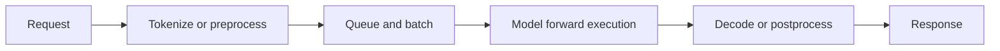
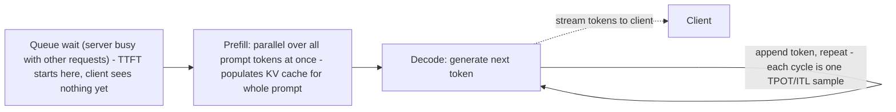
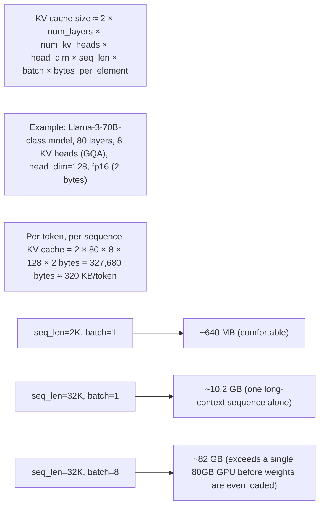
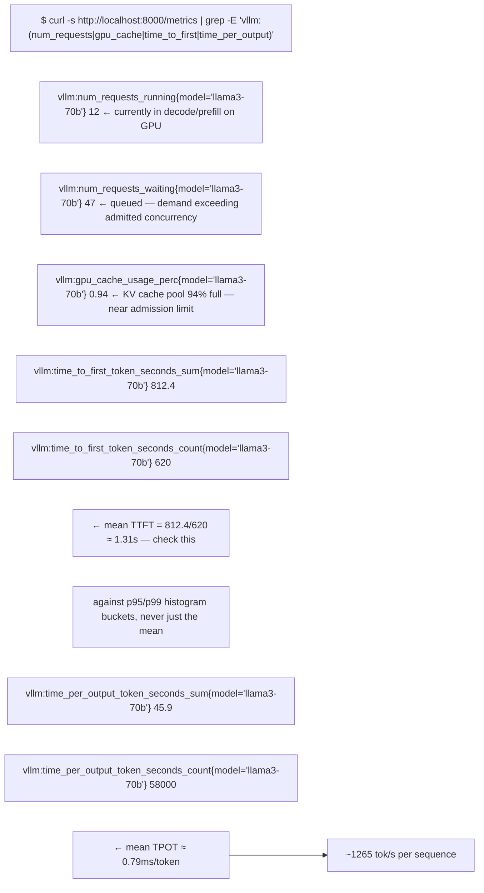

## Inference: fixed weights, new requests

Inference normally does not update the main model weights. It loads a trained model and performs a forward computation for new input.

Inference has two common operating modes:

| Mode | Success definition | Typical design pressure |
|---|---|---|
| Batch inference | a fixed corpus completes before a deadline | total throughput, cost, scheduling efficiency |
| Online inference | individual requests meet latency/availability objectives | queueing, tail latency, concurrency, warm capacity |

A team calling a continuous request stream "batch" does not make it batch infrastructure. Ask about arrival pattern and per-request latency expectations.

## What makes a large language model special

An LLM processes sequences of **tokens**. A token may be a word, part of a word, punctuation or another encoded unit depending on the tokenizer.

### Model weights and a lower-bound memory estimate

Suppose a model has 70 billion parameters:

| Weight representation | Bytes per parameter (simplified) | Weight storage lower bound |
|---|---:|---:|
| FP32 | 4 | about 280 GB |
| FP16/BF16 | 2 | about 140 GB |
| 8-bit | 1 | about 70 GB |
| 4-bit | 0.5 | about 35 GB |

This is only weight storage. Runtime overhead, quantization metadata, temporary workspace, activations and KV cache require additional memory. Actual engine layouts and supported precisions vary.

### Prefill and decode

LLM generation usually has two operational phases:

1. **Prefill:** process the input prompt and create attention state. It can expose substantial parallel computation across prompt tokens.
2. **Decode:** generate new tokens iteratively, updating state and repeatedly reading model/cache data.

The same request can therefore change resource behavior over its lifetime.

### KV cache

Attention layers create key/value state for prior tokens. Retaining this **KV cache** avoids recomputing the entire prior sequence for each new token. It consumes device memory and grows with factors including concurrent sequences, sequence lengths, model architecture, precision and parallel placement.

Operational consequences:

- longer prompts and outputs can consume more cache;
- more concurrent requests compete for cache capacity;
- cache-aware scheduling/routing may improve reuse but adds state-aware complexity;
- a replica can be alive yet not have enough memory to admit additional sequences;
- scaling down or rerouting may discard useful cache state.

## Latency and throughput vocabulary

| Metric | Meaning | Why it matters |
|---|---|---|
| Request latency | total time from request to completion | user experience for complete responses |
| TTFT | time until the first output token | queueing, prefill and startup responsiveness |
| Inter-token latency | delay between generated tokens | perceived streaming speed/decode behavior |
| Tokens per second | generation throughput | engine/device efficiency, but define aggregation scope |
| Queue time/depth | waiting before execution/admission | insufficient or badly scheduled capacity |
| Request concurrency | simultaneous active/in-flight requests | drives batching, memory and queue pressure |
| Goodput | work meeting defined quality/SLO conditions | avoids counting unusably slow or failed output as success |

Always define whether a metric is per request, per sequence, per GPU, per replica or fleet-wide. A high fleet tokens/s number can hide poor tail latency.

## Why batching helps—and what it costs

GPUs often execute more efficiently when several compatible requests are processed together. **Dynamic batching** waits briefly to form a larger batch. Triton's architecture provides per-model schedulers with configurable batching behavior.

Trade-off:

- wait longer: potentially larger batches and higher throughput;
- wait too long: increased request latency;
- batch incompatible shapes/lengths poorly: padding or scheduling inefficiency;
- admit too much concurrency: queue and device-memory pressure.

There is no universal correct batch size. Benchmark representative prompt/output distributions, concurrency and SLOs.

**Learning outcome:** Connect model-serving mechanics to memory, latency, throughput and scaling decisions.

Autoregressive inference has a prompt-processing phase (prefill) and iterative token generation (decode). Prefill can be compute-heavy; decode repeatedly accesses model/KV state and is sensitive to memory behavior. Continuous batching lets a server combine work from multiple requests. KV cache stores attention state for active sequences and can become a major memory consumer as concurrency/context grows.

Figure 1. The model server is one stage in a production request system with routing, state/caches, GPU and observability.

| Metric | Interpretation |
|---|---|
| TTFT | how quickly the first token arrives; includes queue + prefill + overhead |
| TPOT / inter-token latency | decode responsiveness |
| tokens/s | throughput / capacity outcome |
| queue duration/depth | demand versus service capacity |
| concurrency | active requests and memory pressure |
| GPU memory | model + KV cache + runtime workspace headroom |

## Practitioner lens
**Anshul Jindal: production inference spans mechanics and operations**
Public material for an NVIDIA GTC session links prefill/decode and KV-cache behavior to NIM/vLLM deployment, aggregated/disaggregated inference, API gateways, cost/token tracking and Prometheus/Grafana/Loki/Tempo. The useful lesson is that platform design starts with serving mechanics, then adds operational layers.

[Public source](https://de.linkedin.com/in/ansjin)

**The prefill/decode timeline, made visible (the single diagram worth memorizing for this whole volume):**

TTFT spans the queue wait plus prefill. Each decode step reads all prior KV cache plus weights from GPU memory to produce one token; the gap between consecutive decode tokens is one TPOT/ITL sample. Decode is drawn as a repeating loop because it is sequential, one token per step, autoregressive.
Prefill is compute-bound and embarrassingly parallel across prompt tokens (matrix-multiply heavy, scales with prompt length² in attention cost) — it looks like a training forward pass. Decode is one token at a time, memory-bandwidth-bound (every step re-reads the full KV cache and all weights to produce a single new token), and does not get faster by adding more compute — this is exactly why prefill and decode want different hardware/pool shapes, the motivation behind Chapter 6's disaggregation and Chapter 4's Dynamo material.

**KV cache growth — the memory-pressure mechanism the metrics table only names abstractly:**

This is the concrete arithmetic behind "KV cache can become a major memory consumer as concurrency/context grows" — the growth is *linear in both sequence length and batch size simultaneously*, which is why long-context + high-concurrency is the specific combination that causes OOM, not either factor alone.

**Sample vLLM/NIM metrics endpoint output during a load test, annotated:**

`gpu_cache_usage_perc` at 94% with 47 requests waiting is the tell: the server isn't CPU- or GPU-compute-starved, it's KV-cache-capacity-starved — new requests can't be admitted into a running batch because there's no cache room, so they queue, and queue time is exactly what inflates TTFT even though decode itself is fast. This is the metric that answers "why is TTFT bad when GPU utilization looks fine."

**Extra worked scenario — long-context KV OOM in production:**
> **Situation:** A chatbot service that historically handled 2K-token conversations starts supporting a new "upload a document and ask questions" feature with prompts up to 30K tokens. Within a day, the service starts throwing CUDA OOM errors under normal traffic that previously had headroom.
> 1. Compute KV cache footprint at the new max sequence length using the arithmetic above — for a 15x longer average prompt, KV cache per sequence grows ~15x, not linearly with "one more feature."
> 2. Check `gpu_cache_usage_perc` and `num_requests_waiting` before and after the feature launch — a jump in waiting requests with cache usage pinned near 100% confirms cache exhaustion, not a code regression.
> 3. Fix directions with explicit tradeoffs: reduce max concurrent sequences to leave more cache per sequence (lowers throughput), enable prefix caching if documents are reused across questions (saves recompute + cache, but adds routing complexity per Chapter 2), or move long-context requests to a separate pool sized specifically for large KV footprints (isolates the blast radius from the short-prompt chat traffic).
> **Conclusion:** A feature that only changes prompt length, with no code change to the serving path, can still cause OOM — because KV cache is workload-shape-dependent memory, not a fixed per-replica cost.

**Shortcut/mnemonic:** *"Prefill is compute, decode is bandwidth, KV cache is the rent you pay per token per sequence for as long as it's alive."* If asked to name the single number that predicts KV OOM risk fastest: `gpu_cache_usage_perc` trending toward 100% while `num_requests_waiting` climbs — that pair, not raw GPU utilization.

**Interview-ready line:** *"TTFT and TPOT decompose into different bottlenecks — TTFT is queue-plus-prefill, mostly compute and admission-control bound; TPOT is decode, mostly memory-bandwidth and KV-cache-capacity bound — so I diagnose them with different signals, not one 'latency is bad' investigation."*

**Chapter drill questions (chapter-specific, additive):**
1. A service reports P50 TTFT of 200ms but P99 TTFT of 4 seconds, with GPU compute utilization steady at 60%. Using only the metrics table and the vLLM metrics sample above, name the two most likely explanations and the one metric that discriminates between them.
2. Using the KV cache formula, compute the maximum concurrent 8K-token sequences a single 80GB GPU can hold if the model weights consume 40GB and per-token KV cost is 320KB — state your headroom assumption for runtime workspace.
