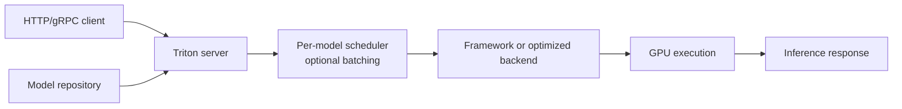
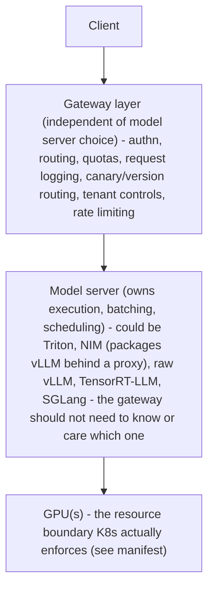
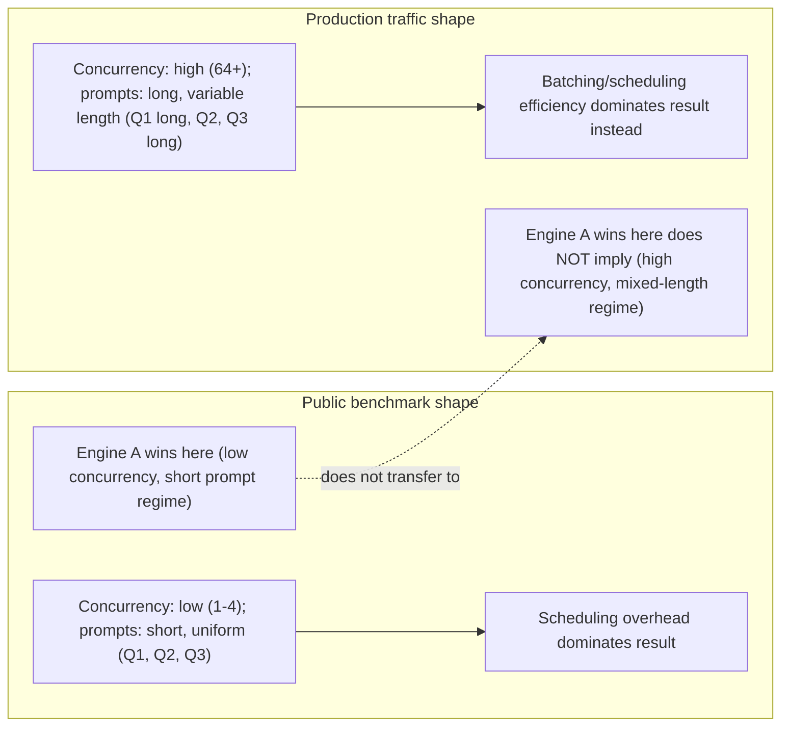
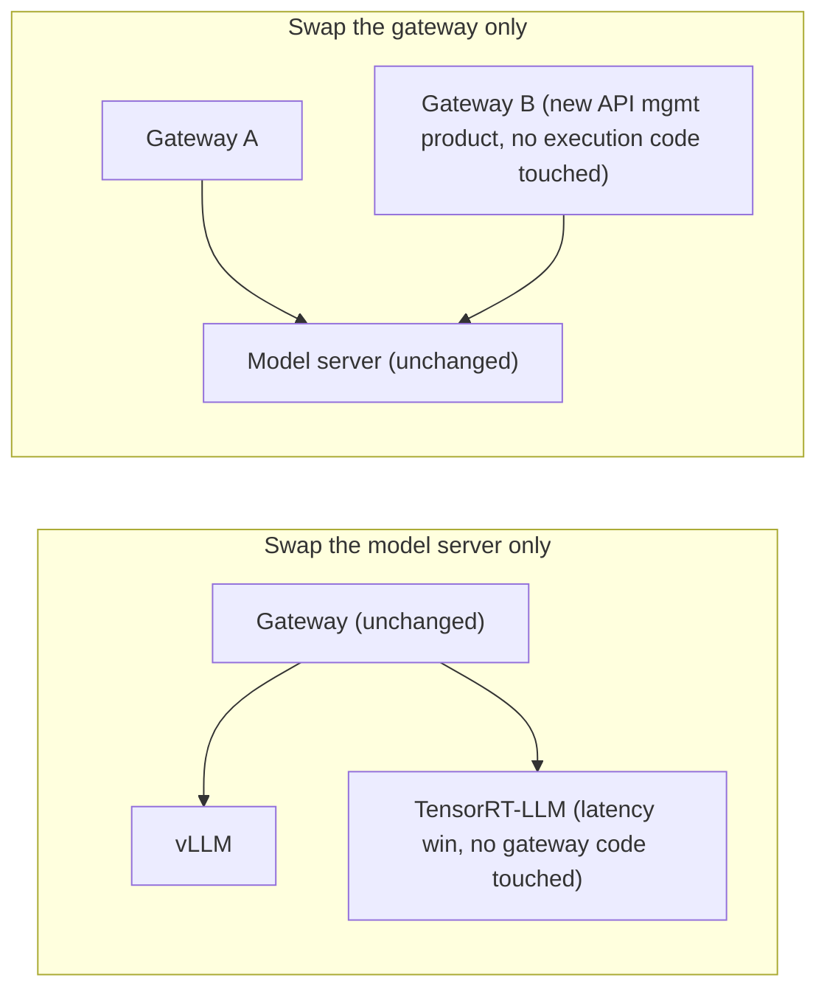

## Inference products: TensorRT, Triton and NIM are not synonyms

### TensorRT

TensorRT optimizes and executes trained neural networks for inference on NVIDIA GPUs. Think **model optimization and runtime execution**.

### Triton Inference Server

Triton is an inference server supporting multiple model backends. Its documented architecture includes a model repository, per-model scheduling, optional batching, backend execution, health endpoints and metrics. Think **multi-model serving server and scheduling surface**.



### NVIDIA NIM

NIM packages production-oriented inference microservices with standardized APIs and management behavior. Current NIM LLM documentation describes an orchestration layer, profile/model management and an inference engine. Hardware-aware profiles can encode backend, precision and parallelism choices.

Think **packaged, supported inference microservice**, not "a new GPU scheduler." A NIM still requires compatible infrastructure, model access, storage/cache, network, security, capacity and monitoring.

### NIM Operator

NIM Operator manages deployment and lifecycle of NIM-based applications on Kubernetes. It belongs to the Kubernetes control plane and does not replace the inference engine inside the NIM container.

## Serving-system layers

Separate the model from the service around it:

| Layer | Responsibility |
|---|---|
| Gateway/API | authentication, rate limits, request contract, routing entry |
| Model router | select model/version/replica and possibly cache-aware destination |
| Scheduler/batcher | queue, admit and group requests |
| Inference backend/engine | execute optimized model operations |
| Model repository/cache | store and distribute model artifacts |
| GPU platform | allocate devices, driver/runtime, network and storage |
| Observability | request, queue, engine, GPU and outcome evidence |

### Triton example

Official Triton architecture describes requests arriving through HTTP/gRPC/C API, routing to a per-model scheduler, optional batching, backend execution and response. A model repository makes model versions/configuration available.

### NIM example

Current NIM LLM documentation describes a container with orchestration, profile/model management and an inference engine. Profiles can encode backend, precision, tensor/pipeline parallelism and hardware/memory fit. NIM simplifies packaging and supported deployment behavior; it does not remove workload sizing or platform responsibilities.

**Learning outcome:** Place Triton, NIM, vLLM and application gateways in an architecture without treating product names as the design.

A model server owns model execution, batching/scheduling and model-specific runtime behavior. NVIDIA Triton provides a general inference serving platform; NIM packages optimized model inference into standardized service containers/APIs; vLLM is a popular LLM-serving engine. The gateway layer can handle authentication, routing, quotas, request logging, canary/version routing and tenant controls independently of the model server.

Benchmark engines on the target model, precision, GPU and request distribution. Do not choose an engine solely from a public benchmark with a different workload.

```text
# Example Kubernetes resource boundary (illustrative)
resources:
  requests:
    nvidia.com/gpu: 1
    cpu: "4"
    memory: 16Gi
  limits:
    nvidia.com/gpu: 1
    memory: 24Gi
```

**The platform-boundary diagram (what "product names are not the design" means in practice):**

The architectural point: swapping the model server (e.g. vLLM → TensorRT-LLM for a latency win) should not require rewriting the gateway's auth/quota/routing logic, and swapping the gateway (e.g. adding a new API management product) should not require touching model execution. Coupling these two layers is the most common "platform boundary" mistake — e.g. baking tenant quota logic into a custom Triton backend instead of the gateway.

**Sample output — proving the resource boundary is real, not just YAML:**

```mermaid
flowchart TD
  %% Converted from the original ASCII diagram; source wording is preserved.
  n0["$ kubectl describe pod llm-server-0 | grep -A4 'Limits\|Requests'"]
  n1["Limits"]
  n2["memory: 24Gi"]
  n3["Requests"]
  n4["cpu: 4"]
  n5["memory: 16Gi"]
  n6["nvidia.com/gpu: 1"]
  n7["$ kubectl exec llm-server-0 -- nvidia-smi --query-gpu=memory.used,memory.total --format=csv"]
  n8["memory.used [MiB], memory.total [MiB]"]
  n9["71234 MiB, 81920 MiB ← 71GB used of 80GB — note: nvidia.com/gpu:1 gives WHOLE-GPU"]
  n10["access, K8s has no native concept of fractional GPU memory"]
  n11["limits here — that enforcement is the model server's job, or"]
  n12["requires MIG/time-slicing configured outside this manifest"]
```

This is the gap worth naming explicitly: the Kubernetes `limits.memory: 24Gi` governs *host* memory, not GPU memory — `nvidia.com/gpu: 1` is a whole-device allocation unit with no granularity below one GPU unless MIG partitioning or a fractional-GPU scheduler (Run:ai, per Chapter 5) is layered in. A candidate who assumes `limits` constrains GPU memory the way it constrains CPU memory will misdiagnose GPU OOM as a Kubernetes scheduling bug.

**Extra worked scenario — benchmarking trap:**
> **Situation:** A team picks vLLM over TensorRT-LLM based on a public benchmark showing vLLM 20% faster, then deploys and measures 30% slower throughput than the benchmark reported.
> 1. Check whether the public benchmark used the same model size/quantization, GPU SKU, and — critically — the same request distribution (concurrency level, input/output length mix) as production traffic.
> 2. A benchmark run at low concurrency with short prompts favors different engine internals (scheduling overhead dominates) than production traffic at high concurrency with long, variable-length prompts (batching/scheduling efficiency dominates).
> 3. Re-run the benchmark in-house with production-representative request shape before trusting any cross-engine comparison — this is exactly what the chapter's "do not choose an engine solely from a public benchmark with a different workload" line is warning against, made concrete.
> **Conclusion:** Engine benchmarks are workload-shape-specific measurements, not universal rankings — re-validate on your own model, precision, GPU and traffic pattern every time.

**Diagram: why the public benchmark and production diverged**

Two different bottlenecks are being measured under two different request shapes — a ranking under one shape does not transfer to the other, which is exactly why the in-house re-benchmark step is non-optional.

**Diagram: engine/gateway swap independence (the payoff of the platform boundary)**

If either swap forces a change on the other side of the boundary, the two layers were coupled — the specific bug pattern to watch for is tenant-quota or batching logic accidentally implemented inside a custom backend instead of the gateway.

**Shortcut/mnemonic:** *"Gateway decides who and how much; model server decides how fast and how batched; GPU is the only resource K8s actually fences — everything above that is software policy."*

**Chapter drill questions (chapter-specific, additive):**
1. A tenant is granted `nvidia.com/gpu: 1` with no other GPU isolation. Name two concrete failure modes another tenant's workload could cause on the same physical GPU that Kubernetes resource limits would not prevent.
2. Design the boundary: which of the following belongs in the gateway vs. the model server — per-tenant token-per-minute quota, continuous batching admission control, canary 5% traffic split to a new model version, KV cache eviction policy? Justify each placement in one sentence.
