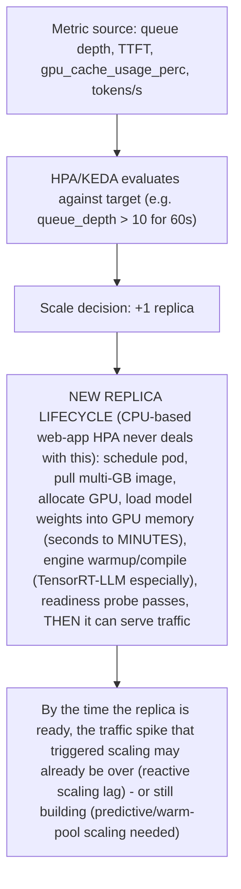
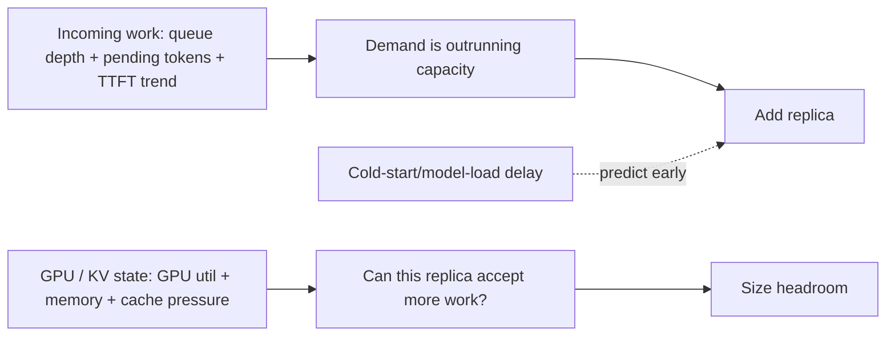

**Learning outcome:** Choose signals that represent demand and saturation, then account for model-load time, GPU granularity and cold capacity.

CPU utilization is often weakly correlated with GPU inference demand. Candidate scaling inputs include request concurrency, queue depth/duration, TTFT/latency, requests/s and tokens/s. GPU utilization/memory help determine whether a replica can safely take more load and whether memory is the limiting resource. The correct signal depends on the server and SLO.

## Practitioner lens
**Sagar Desai: hardware metrics and service metrics answer different questions**
A public post contrasts DCGM metrics (hardware behavior/health) with model-server traffic/queue metrics for scaling decisions. Use that split as a diagnostic framework: demand is not the same thing as device busy percentage.

[Public source](https://www.linkedin.com/posts/sagar-s-desai_kubernetes-gpu-nvidia-activity-7413160079337684992-fOZI)

## Worked scenario
**Situation:** GPU utilization sits at 95%, but P95 latency is within SLO and queue depth is near zero.

1. Do not scale solely because device utilization looks high.
2. Check concurrency, queue duration, TTFT/TPOT and error rate to determine service saturation.
3. Check headroom for traffic bursts/failures and memory capacity.
4. If unit economics matter, high utilization with healthy SLO may be desirable.
5. Scale when the chosen saturation/demand signal predicts SLO risk, not on a universal utilization threshold.

**Conclusion:** A busy GPU can be an efficient GPU; saturation is defined relative to service outcomes.

➕ **The autoscaling control loop, made visible (why this is harder than CPU-based HPA):**

This lifecycle box is the mechanism behind Senior Deep Dive 5's line "model load time can be minutes, so predictive capacity, warm pools and staged rollout may outperform reactive HPA alone" — a plain HPA reacting to a metric crossing a threshold has no concept of the multi-minute lead time between "decide to scale" and "capacity actually available."

➕ **Sample KEDA/HPA custom-metrics output during a scale event, annotated:**

```mermaid
flowchart TD
  %% Converted from the original ASCII diagram; source wording is preserved.
  n0["$ kubectl get hpa llm-server-hpa"]
  n1["NAME REFERENCE TARGETS MINPODS MAXPODS REPLICAS"]
  n2["llm-server-hpa Deployment/llm-server 47/10 (queue_depth) 2 10 6"]
  n3["↑ current value ↑ HPA has already scaled"]
  n4["far exceeds target to 6 trying to catch up —"]
  n5["but each new replica takes"]
  n6["~90s to load a 70B model"]
  n7["$ kubectl describe hpa llm-server-hpa | tail -6"]
  n8["Type Reason Age From Message"]
  n9["------ ---- ----"]
  n10["Normal SuccessfulRescale 45s horizontal-pod-autoscaler New size: 6; reason: external metric"]
  n11["queue_depth above target"]
  n12["Warning FailedGetExternalMetric 30s horizontal-pod-autoscaler unable to fetch metrics"]
  n13["no data returned from custom metrics API"]
  n14["← metrics pipeline gap = HPA flies blind"]
```

The `FailedGetExternalMetric` warning is the operational trap: if the Prometheus adapter or metrics pipeline feeding KEDA/HPA has a gap (scrape failure, adapter restart), the autoscaler doesn't fail loudly — it just stalls at the last known replica count, silently, while queue depth may be climbing. Alert on metrics-pipeline health itself, not only on the scaling metric.

➕ **Extra worked scenario — autoscaler thrashing on the wrong metric:**
> **Situation:** An inference service is scaled on GPU utilization (target: scale up above 80%). Traffic is steady, but replica count oscillates between 4 and 8 every few minutes, and P99 latency is inconsistent.
> 1. GPU utilization for a healthy, well-batched LLM server legitimately sits near 90-100% under normal load — per this chapter's own worked scenario, high utilization with healthy SLO is desirable, not a scale trigger.
> 2. Scaling up on GPU% adds a replica, which — because continuous batching immediately spreads existing queued requests across more replicas — drops per-replica utilization below the scale-down threshold within one metric window, triggering scale-down, which then re-concentrates load and triggers scale-up again. This is oscillation caused by the *scaling metric reacting to the scaling action itself*.
> 3. Fix: scale on queue depth/duration or pending-request count instead — these are demand signals that don't mechanically drop the moment you add capacity in the same self-referential way, and add a cooldown/stabilization window regardless of metric choice.
> **Conclusion:** GPU utilization is a *saturation* signal (is this replica full), not a *demand* signal (is there more work than capacity) — using a saturation signal as the scale trigger causes the scaler to fight its own actions.

➕ **Shortcut/mnemonic:** *"Scale on demand-outpacing-capacity (queue depth, pending tokens, TTFT trend), size headroom on saturation (GPU%, KV cache%) — conflating the two causes either thrashing or SLO misses."*

➕ **Interview-ready line:** *"High GPU utilization by itself is not a scaling signal — it tells you a replica is being used efficiently. The scaling signal is whatever tells you demand is outpacing capacity before the SLO breaks, and that's usually queue depth or TTFT trend, not device busy percentage."*

➕ **Chapter drill questions (chapter-specific, additive):**
1. Design an autoscaling policy for a 70B-parameter model with a 90-second cold-start-to-ready time and a P95 TTFT SLO of 2 seconds under bursty traffic. Name the specific signal, the lead-time compensation mechanism, and one metric you'd alert on to detect a stalled metrics pipeline.
2. Explain why `kubectl top pod` and DCGM `DCGM_FI_DEV_GPU_UTIL` can disagree with a model server's own `num_requests_running` count as a scaling input, using the hardware-metric-vs-service-metric framing from the practitioner lens.

➕ **Visual model — separate the signal to scale from the signal to size:**

**Memory hook:** *"Queue tells you to scale; saturation tells you how much room remains."* CPU or raw GPU utilisation alone cannot express the user-facing SLO.
