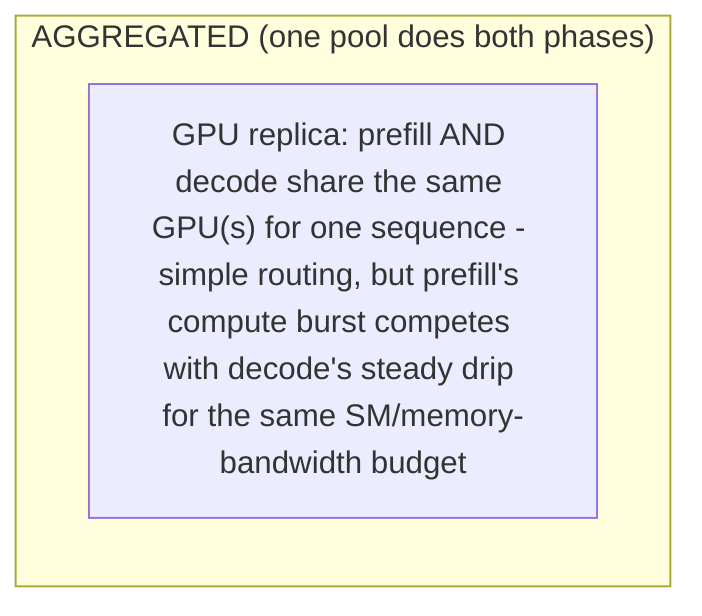
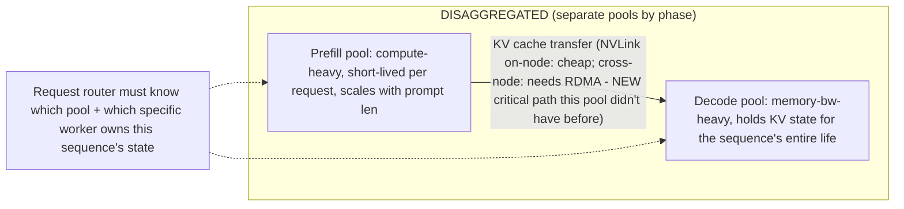
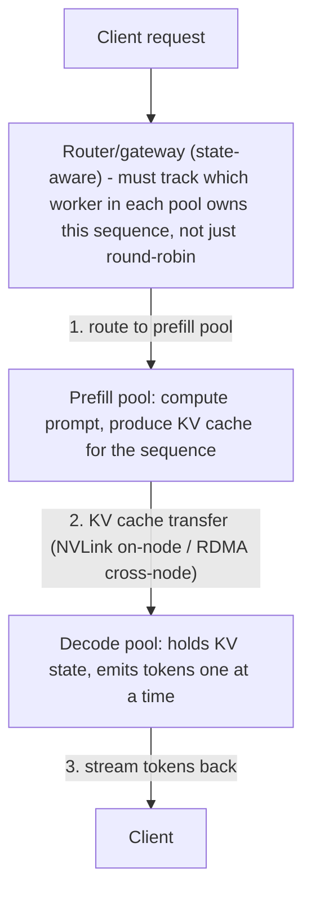
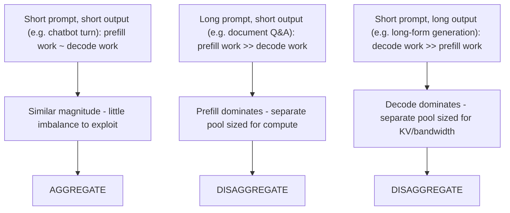

**Learning outcome:** Understand when multi-GPU/multi-node inference is necessary and what new failure/performance dependencies appear.

Large models may require tensor/model parallelism across GPUs. Very high-throughput systems may distribute work across replicas and specialized stages. Disaggregated architectures can separate prefill and decode pools, which creates explicit network/state-routing requirements. The benefit must outweigh added scheduling, routing, network and failure complexity.

For multi-node inference, capacity planning becomes topology-aware. A replica is not simply N interchangeable GPUs; it may require a specific connected set and communication characteristics.

➕ **Aggregated vs. disaggregated inference, side by side (the diagram this chapter needs):**


The KV cache transfer arrow is the new failure/performance dependency the chapter's text names abstractly ("explicit network/state-routing requirements") — on a single node with NVLink, this transfer is cheap enough to be a rounding error; across nodes, it requires high-bandwidth interconnect (RDMA) and becomes a real latency contributor that must be benchmarked, not assumed away. This is also the exact mechanism Senior Deep Dive 4 (Dynamo) builds routing and KV management around.

➕ **Sample output — proving whether a "replica" actually got the topology it needs:**
```bash
$ nvidia-smi topo -m
GPU0 GPU1 GPU2 GPU3 CPU Affinity
GPU0 X NV12 NV12 NV12 0-31
GPU1 NV12 X NV12 NV12 0-31
GPU2 NV12 NV12 X NV12 32-63 ← different NUMA node than GPU0/1
GPU3 NV12 NV12 NV12 X 32-63
$ kubectl get pod tensor-parallel-replica-0 -o jsonpath='{.spec.nodeName}'
gpu-node-14
$ kubectl exec tensor-parallel-replica-0 -- nvidia-smi topo -m | grep NV
GPU0 GPU1 GPU2 GPU3
GPU0 X NV12 SYS SYS ← GPU0-1 are NVLinked, GPU2-3 are NOT (SYS = PCIe/cross-node path)
```
`SYS` in the topology matrix where you expected `NVx` is the single fastest way to catch "this tensor-parallel replica was scheduled across a slower link than the design assumed" — a scheduler that only checks `nvidia.com/gpu` count as a resource request has no native awareness of this, which is exactly why the chapter says "a replica is not simply N interchangeable GPUs."

➕ **Extra worked scenario — when disaggregation makes things worse:**
> **Situation:** A team disaggregates prefill and decode for a model serving short (200-token) prompts with short (150-token) outputs, expecting the throughput gains described for long-context workloads. Latency gets worse instead.
> 1. For short, roughly-symmetric prompt/output lengths, prefill and decode resource shapes don't diverge much — there's little of the "long prompts stress prefill, long outputs stress decode" imbalance disaggregation is designed to exploit (per Senior Deep Dive 4).
> 2. The KV transfer between pools, which was supposed to be a small fixed cost, becomes a larger fraction of total request time when the sequence itself is short — fixed overhead dominates when there's less work to amortize it over.
> 3. Correct decision: aggregate for this workload shape; reserve disaggregation for workloads where prefill and decode genuinely have different resource profiles (long documents, or very high concurrency with long generations).
> **Conclusion:** "The benefit must outweigh added scheduling, routing, network and failure complexity" is a workload-shape-dependent inequality, not a default — measure both configurations against the actual prompt/output length distribution before committing.

➕ **Diagram: disaggregated request routing, end to end**

Step 2 is the new failure/performance dependency aggregated inference never had — a router that loses track of which decode worker holds a sequence's KV state cannot simply retry against any replica.

➕ **Diagram: aggregate vs. disaggregate decision by prompt/output shape**

The deciding property is the *ratio* of prefill to decode work implied by the prompt/output length distribution — not model size and not traffic volume alone.

➕ **Shortcut/mnemonic:** *"Disaggregate when prefill and decode want different amounts of GPU — same amount, keep them together; check `nvidia-smi topo -m` before trusting any multi-GPU replica's performance model."*

➕ **Chapter drill questions (chapter-specific, additive):**
1. A tensor-parallel replica spans 4 GPUs, 2 of which show `SYS` instead of `NVx` in `nvidia-smi topo -m`. Explain the latency mechanism by which this degrades every forward pass, not just occasional requests.
2. Name the one architectural property of a workload (beyond raw model size) that should decide whether you disaggregate prefill/decode, and explain why a short-prompt chatbot and a long-document summarizer would reach opposite conclusions using that property.
