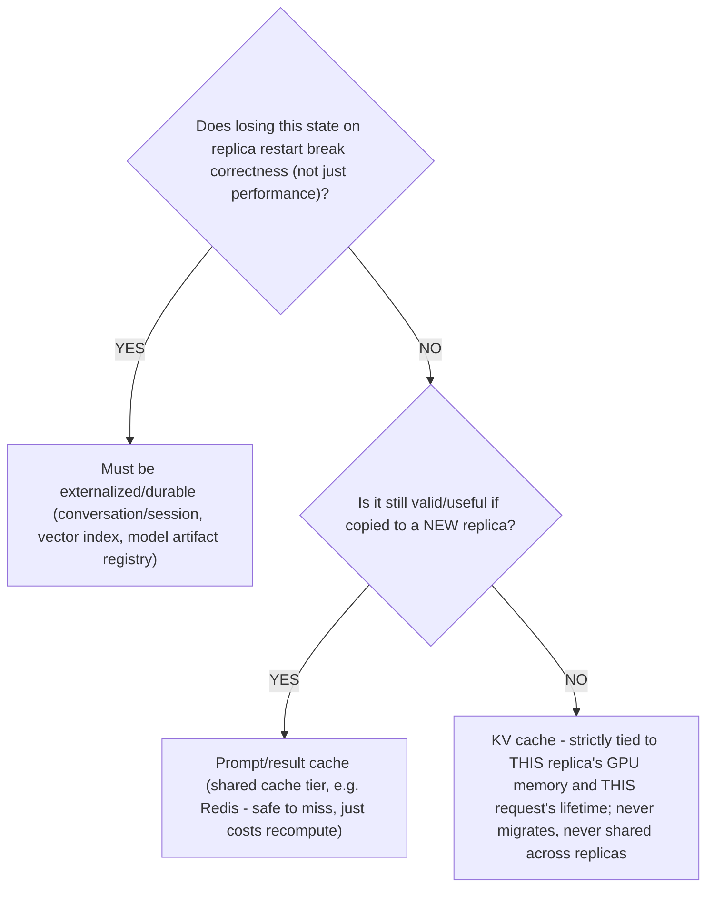
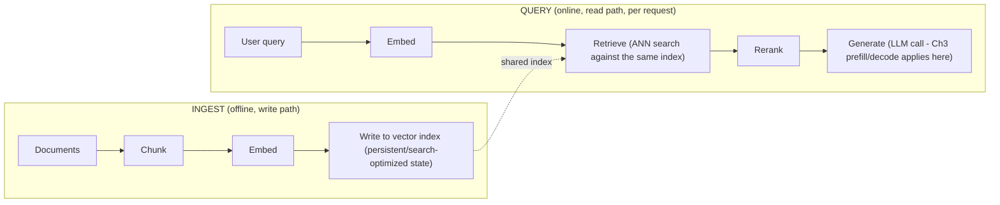

**Learning outcome:** Classify durable state, request state, model artifacts, vector data and caches so replicas can scale safely.

Keep application compute stateless when practical, but do not confuse "stateless service" with "no state in the system." Conversation history, vector indexes, model artifacts, prompt/result caches and KV-cache have different durability/locality requirements. Make each explicit.

## Practitioner lens
**Sagar Desai: decouple conversational state from Pod lifetime**
A public architecture example argues against relying on local in-process history/sticky sessions for horizontally scaled Kubernetes LLM services. The general lesson is to externalize durable session state while treating local caches as disposable acceleration.

[Public source](https://www.linkedin.com/posts/sagar-s-desai_systemdesign-llm-kubernetes-activity-7414861928189370368-hiHp)

| State | Typical property |
|---|---|
| Model artifact | versioned, large, read-mostly; startup distribution matters |
| Conversation/session | durable across replica changes; low-latency access |
| Vector index | persistent/search optimized; update/query behavior |
| KV cache | request/runtime-local performance state; large GPU memory footprint |
| Prompt/result cache | optional performance/cost optimization with invalidation/privacy concerns |

**The state classification decision tree (durability × locality, the two axes the table implies but doesn't draw):**

The KV cache leaf is the one most likely to be misclassified by someone applying general "externalize state" instincts from web-service architecture — unlike conversation history, KV cache is not a candidate for externalization to Redis/a database; it lives in GPU HBM for the duration of one request/session and is deliberately non-durable. Prefix caching (Chapter 2) reuses it *within* a serving tier via routing, not by copying it out to a shared store.

**Sample output — a session-affinity bug this classification prevents:**

```mermaid
flowchart TD
  %% Converted from the original ASCII diagram; source wording is preserved.
  n0["$ kubectl get pods -l app=llm-chat -o wide"]
  n1["NAME READY STATUS NODE"]
  n2["llm-chat-7f9c-0 1/1 Running gpu-node-3"]
  n3["llm-chat-7f9c-1 1/1 Running gpu-node-7"]
  n4["$ curl -s https://chat.internal/v1/conversations/abc123/history"]
  n5["{'error': 'conversation not found'} ← user's 2nd message hit a DIFFERENT replica than their 1st"]
  n6["$ kubectl logs llm-chat-7f9c-1 | grep abc123"]
  n7["(no output — this replica never saw this conversation ID)"]
```

This is the exact failure Sagar Desai's practitioner lens warns against: conversation history held only in the serving replica's process memory disappears the instant the load balancer routes a follow-up message to a different Pod — which it will, under any non-sticky load balancing, and even sticky sessions break on replica restart/rescale. The fix is externalizing conversation state to a shared store (Redis, a database) keyed by conversation ID, looked up by whichever replica happens to handle the request — not making replicas sticky, which just delays the same failure to the next scale-down event.

**Extra worked scenario — prompt cache invalidation/privacy interaction:**
> **Situation:** A team adds a prompt/result cache keyed on exact prompt text to cut inference cost on repeated queries. Weeks later, a user reports seeing what looks like part of another user's earlier conversation in a response.
> 1. Root cause candidates: the cache key didn't include tenant/user scoping (two different users produced the same prompt text and got each other's cached completion), or the cache TTL/invalidation didn't account for the underlying model or system prompt changing, serving a stale answer.
> 2. This is the "invalidation/privacy concerns" the table's last row names in five words — the concrete failure is cross-tenant data leakage through an under-scoped cache key, which is a security incident, not just a correctness bug.
> 3. Fix: cache key must include every dimension that legitimately changes the answer's validity or the isolation boundary — tenant ID, model version, system prompt hash — at minimum. Treat the prompt/result cache as being inside the tenancy boundary discussed in Chapter 8, not outside it.
> **Conclusion:** A performance optimization (prompt caching) that ignores the tenancy/durability classification from this chapter turns into a security defect — the two chapters are not independent in practice.

**Shortcut/mnemonic:** *"KV cache never leaves the GPU; session state never lives only in the Pod; model artifacts are read-mostly and versioned; prompt caches must be scoped as tightly as the tenancy boundary they sit inside."*

**Diagram: RAG's two pipelines — the vector index row of the table, unpacked**

The ingest and query pipelines share the vector index but run on entirely different schedules and failure domains — a slow or stale ingest path degrades answer quality silently, while a slow query-path retrieve step shows up directly as added TTFT on top of the LLM's own prefill/decode timeline from Chapter 3.
