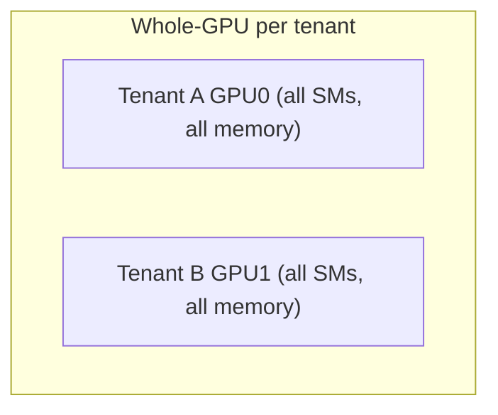
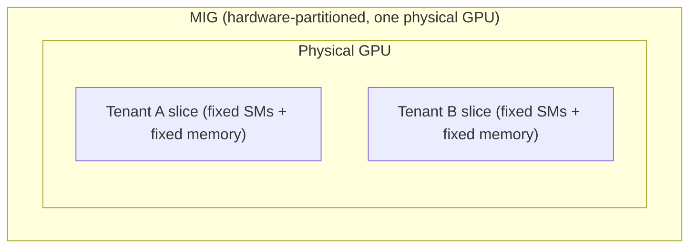
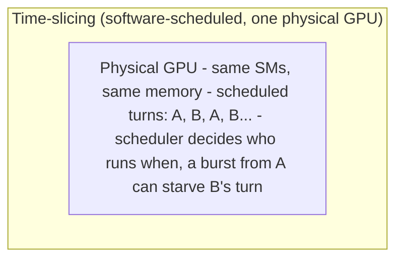

**Learning outcome:** Apply familiar platform security controls to models, prompts, data, artifacts and shared GPUs.

AI infrastructure inherits cloud-native security requirements — identity, RBAC, network segmentation, secrets, image provenance, runtime hardening — and adds model/data supply chain concerns. Ask who can deploy models, pull artifacts, access prompts/data, call inference endpoints, use expensive GPU quota and read logs containing sensitive content.

GPU sharing also becomes a tenancy decision: cost-efficient packing is not enough if isolation requirements demand dedicated resources or hardware partitioning. Logging/telemetry must avoid leaking prompts, tokens or secrets by default.

➕ **The AI-platform security surface, mapped onto familiar cloud-native controls (the table this chapter implies but doesn't draw):**

| Cloud-native control | AI-platform-specific extension |
|---|---|
| Identity/RBAC | Who can pull a model artifact, call inference, burn GPU-hours (a new, expensive quota dimension) |
| Network segmentation | Isolate prefill/decode/KV-transfer traffic (Ch6) between tenants sharing a fabric |
| Secrets management | API keys AND now "the prompt itself" — prompts can contain PII/secrets pasted by users, unlike typical service-to-service payloads |
| Image provenance | Model artifact provenance — was this checkpoint tampered with, does it match a signed/known hash |
| Runtime hardening | GPU-level isolation: process-level (no isolation), MIG (hardware-partitioned), time-slicing (software scheduled, no memory isolation) — different guarantees |
➕ **GPU sharing modes, compared for the isolation question the chapter poses directly:**
| Mode | Isolation | Noisy-neighbor risk | When required |
|---|---|---|---|
| Whole-GPU per tenant | Full (separate device) | None | Regulated/hard multi-tenant isolation |
| MIG (Multi-Instance GPU) | Hardware-partitioned (separate SM/memory slices) | Low — memory faults contained | Multiple trusted-but-separate workloads on one physical GPU |
| Time-slicing | None — same SM/memory, scheduled in time | High — one tenant's burst steals cycles from another | Best-effort, cost-sensitive, non-regulated workloads only |

➕ **Sample output — a noisy-neighbor incident caught via DCGM, not application metrics:**
```bash
$ dcgmi dmon -e 203,204,1002 -c 5
#Entity DBE SBE GPUUTIL
GPU 0 0 0 98 ← tenant A's workload, expected high util
GPU 0 0 0 97
GPU 0 0 0 99
(this is a time-sliced GPU — tenant B is on the SAME device)
$ kubectl logs tenant-b-inference-0 | tail -3
WARN: request latency 4200ms (SLO: 500ms) — GPU allocated but compute starved
```
Tenant B's pod has a `nvidia.com/gpu: 1` request satisfied by Kubernetes (scheduling succeeded, pod is Running) — but on a time-sliced physical GPU, "allocated" does not mean "guaranteed compute share." Tenant A's 98% utilization is silently starving Tenant B, and nothing in Kubernetes' own resource accounting will surface this — it requires DCGM-level, per-process GPU telemetry to prove, which is exactly why the chapter says isolation requirements may demand dedicated resources or hardware partitioning instead of time-slicing, despite the latter's better cost-efficiency.

➕ **Extra worked scenario — the log-leakage angle:**
> **Situation:** A platform team enables verbose request logging for debugging a latency issue in an LLM gateway. Three weeks later, a security review finds full user prompts — including some containing pasted API keys and one containing a customer's SSN — sitting in a log aggregation system with broad internal read access.
> 1. Root cause: "verbose logging" for an LLM gateway defaults to logging the full request/response body, which for this workload class *is* the sensitive data — unlike a typical REST API where the body is usually structured/non-sensitive metadata.
> 2. This is the concrete form of "logging/telemetry must avoid leaking prompts, tokens or secrets by default" — the failure mode is not exotic; it's the default behavior of a debugging feature nobody scoped for this workload's data sensitivity.
> 3. Fix: redact/exclude prompt and completion bodies from default log verbosity; if full-content logging is needed for debugging, gate it behind a narrowly-scoped, audited, time-boxed access path — treat it like credential logging, not like general request tracing.
> **Conclusion:** For AI platforms, "the payload" and "the sensitive data" are frequently the same bytes — security review of logging defaults needs to happen before the debugging feature ships, not after an incident.

➕ **Diagram: GPU isolation boundaries, drawn as physical vs. logical separation**

Separate physical devices, no shared failure domain.

Separate SM/memory slices, hardware fault containment between them.

No isolation of memory or of "how long is my turn."
The physical boxes above map directly to the "Isolation" column in the table: whole-GPU draws a hardware boundary between tenants, MIG draws it inside one device, and time-slicing draws no boundary at all — only a schedule, which is why Tenant B's starvation in the DCGM incident above is invisible to Kubernetes.

➕ **Shortcut/mnemonic:** *"GPU-hours are a quota dimension like API rate limits, but ten times more expensive per unit — treat GPU quota abuse as a cost-security issue, not just a fairness issue. And when in doubt about isolation: time-slicing shares cycles, MIG shares hardware but partitions it, whole-GPU shares nothing."*

➕ **Interview-ready line:** *"Time-slicing and MIG both let you multi-tenant a GPU, but they give fundamentally different isolation guarantees — time-slicing is a scheduling policy with no memory/fault isolation, MIG is hardware-partitioned; the choice between them is a tenancy risk decision, not just a packing-efficiency one."*
