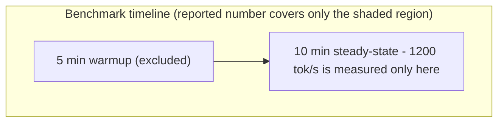
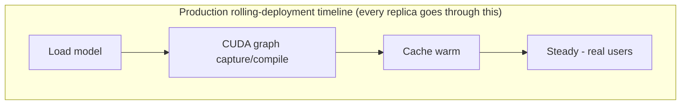

**Learning outcome:** Translate benchmarks into capacity, cost per unit work and headroom under real request distributions.

For inference, useful economic units include cost per 1K/1M tokens, cost per request at an SLO, or throughput per GPU. For training, GPU-hours and time-to-train matter, but failed/restarted jobs and checkpoint overhead can dominate cost. Benchmark warm and cold behavior, typical and peak request distributions, and failure headroom.

## Worked scenario
**Situation:** A cheaper GPU produces 60% of the throughput of a premium GPU at 45% of the hourly price.

1. Normalize by the actual outcome: tokens/s at required latency, not peak FLOPS.
2. Include replica count required for peak demand and availability headroom.
3. Include model fit, precision support, power/operational constraints and startup time.
4. Compute cost per unit work under expected utilization, then sensitivity-test traffic changes.
5. Recommend the cheaper device only if operational and SLO constraints remain acceptable.

**Conclusion:** Architecture cost decisions require normalized workload outcomes, not list price comparisons.

➕ **The cost-per-token arithmetic, worked all the way through (the calculation the worked scenario describes but doesn't compute):**
```text
Premium GPU:  $4.00/hr,  100 tok/s at SLO-compliant batch config
Cheaper GPU:  $1.80/hr,   60 tok/s at SLO-compliant batch config   (60% throughput, 45% price)

Cost per 1M tokens:
Premium: ($4.00/hr ÷ 3600s) ÷ 100 tok/s × 1,000,000 tokens = $11.11 / 1M tokens
Cheaper: ($1.80/hr ÷ 3600s) ÷  60 tok/s × 1,000,000 tokens = $8.33  / 1M tokens
                                                              ↑ cheaper GPU wins on $/token
                                                                DESPITE lower absolute throughput —
                                                                this is the number the "45% of the
                                                                price, 60% of the throughput" headline
                                                                obscures until you divide them

But: replicas needed for the same peak tokens/s target
Premium: peak 1000 tok/s ÷ 100 tok/s/replica = 10 replicas × $4.00/hr = $40/hr fleet cost
Cheaper: peak 1000 tok/s ÷  60 tok/s/replica ≈ 17 replicas × $1.80/hr = $30.60/hr fleet cost
                                                                ↑ still cheaper — but now also check:
                                                                17 replicas vs 10 means MORE GPU-count-
                                                                bound risk (scheduling, node capacity,
                                                                MIG/quota limits) and more model-load-time
                                                                aggregate exposure during scale events
```
The headline "60% throughput at 45% price" sounds like it should be a wash — dividing them out shows the cheaper GPU is actually ~25% cheaper per token, which is the number worth presenting, along with the replica-count operational tradeoff the raw $/token figure hides.

➕ **Sample output — the training-cost side, where "failed/restarted jobs... can dominate cost" becomes a real invoice line:**
```bash
$ cat training_run_ledger.csv | awk -F, '{sum+=$2} END {print sum" GPU-hours total"}'
14200 GPU-hours total

$ grep -c "job_restart" training_events.log
6

$ awk -F, '$3=="restart_recompute" {sum+=$2} END {print sum" GPU-hours lost to restart recompute"}' training_run_ledger.csv
3100 GPU-hours lost to restart recompute
```
3,100 of 14,200 GPU-hours (≈22%) went to recomputing work lost across 6 restarts — at any GPU-hour price, that's a 22% cost overrun invisible in a "time-to-train" headline number that only counts wall-clock, not wasted compute. This is the concrete form of Senior Deep Dive 1's "measure application throughput and storage behavior together" and Chapter 2's checkpoint-storm scenario — checkpoint frequency/restore time objective is a cost lever, not just a reliability lever.

➕ **Extra worked scenario — warm vs. cold benchmark trap:**
> **Situation:** A benchmark reports 1200 tok/s aggregate throughput for a new serving configuration, measured over a 10-minute steady-state run after a 5-minute warmup that was excluded from the reported numbers. Production deploys the same configuration and observes P99 latency SLA violations during every rolling deployment.
> 1. The excluded "warmup" period is not benchmark noise to discard — it's real production behavior every time a replica starts: model load, CUDA graph capture/compilation (TensorRT-LLM especially), and cache warming all happen there, and users hit that replica during exactly this window in a rolling deployment.
> 2. Benchmark cold-start behavior explicitly and separately from steady-state throughput — the chapter's line "benchmark warm and cold behavior" is the direct fix, and it needs its own SLO treatment (e.g. exclude new replicas from the load balancer until a readiness probe confirms warm state, not just process-up state).
> **Conclusion:** A throughput number measured only in steady state is a different claim from "this configuration meets SLO in production," where cold starts happen continuously during every deploy, scale event, and node replacement.

➕ **Diagram: what the benchmark excluded vs. what production actually experiences**


New replica is in the load balancer receiving traffic during the entire load/compile/warm sequence if readiness means "process up" instead of "warm state confirmed."
The benchmark's excluded warmup window and production's cold-start window are the same physical process — the only difference is whether users are being served during it, which is a readiness-probe design choice, not an inherent property of the hardware.

➕ **Diagram: $/token comparison, restated as the arithmetic the headline hides**
```text
'60% throughput at 45% price' — looks like a wash
Premium ████████████████████ 100 tok/s @ $4.00/hr
Cheaper ████████████ 60 tok/s @ $1.80/hr
Divide throughput into price ($/1M tokens) — it is NOT a wash
Premium ███████████ $11.11 / 1M tok
Cheaper ████████ $8.33 / 1M tok ← ~25% cheaper per token
Then re-divide by replicas needed for the SAME peak tok/s target
Premium: 10 replicas
$40.00/hr fleet
Cheaper: 17 replicas
$30.60/hr fleet ← still cheaper, but now carries
more replicas' worth of cold-start
and scheduling risk
```
Three different "cheaper" claims (hourly price, per-token cost, fleet cost at peak) can all be true simultaneously and still not agree with each other on magnitude — always state which one a recommendation is based on.

➕ **Shortcut/mnemonic:** *"Normalize to $/unit-of-real-work (token, request-at-SLO), never to $/hour or $/FLOP alone — and always price in replica count, restart overhead, and cold-start exposure, not just steady-state throughput."*

➕ **Interview-ready line:** *"A GPU that's cheaper per hour isn't necessarily cheaper per token, and a GPU that's cheaper per token isn't automatically the right choice once you price in the replica count needed for peak demand and the operational risk of running more, smaller units."*

## Practice
1. Draw a training data/checkpoint/collective path and list observability at each boundary.
2. For an LLM service, define TTFT, queue duration, tokens/s and GPU memory, then explain how they interact.
3. Design autoscaling signals for batch inference versus interactive inference.
4. Classify five types of AI platform state by durability and locality.

➕ 5. Take the cost-per-token worked calculation above and add a third variable: the cheaper GPU has a 90-second cold start vs. the premium GPU's 20-second cold start. Recompute the effective fleet cost assuming traffic requires 3 scale-up events per day, and state at what cold-start-frequency threshold the cheaper GPU's per-token advantage gets eroded by scale-event overhead.
➕ 6. A training job's checkpoint ledger shows 22% of GPU-hours lost to restart recompute, as in the sample output above. Propose two concrete infrastructure changes (not "have fewer bugs") that would reduce this percentage, and state the tradeoff each introduces.

## Targeted references

[NVIDIA Developer: Deploying Generative AI in Production with NIM](https://www.youtube.com/watch?v=bpOvayHifNQ) - Short visual overview of NIM, Kubernetes scaling, metrics and production deployment.

[NVIDIA Kubernetes technical blog](https://developer.nvidia.com/blog/tag/kubernetes/) - Current posts on disaggregated inference, Dynamo, autoscaling and AI platform operations.
