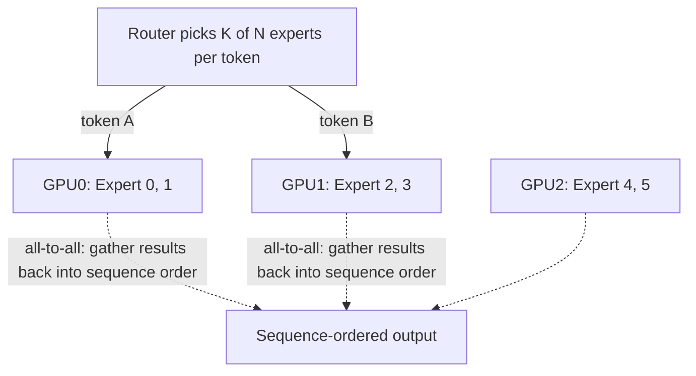
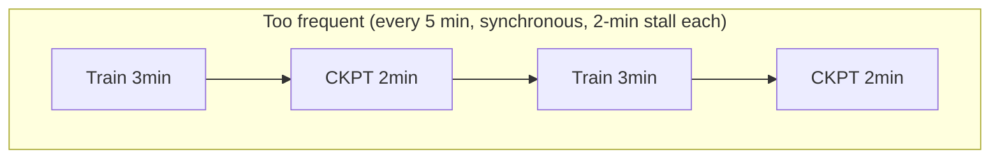
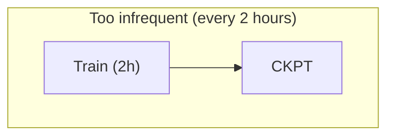
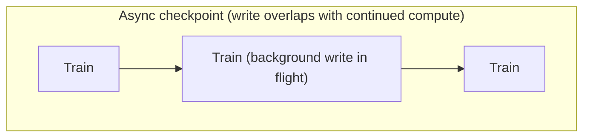

Distributed training is a pipeline of compute, communication and data movement. Data parallelism replicates the model and exchanges gradients; tensor parallelism splits tensor operations across devices; pipeline parallelism splits layers/stages; expert parallelism distributes mixture-of-experts experts. These choices change the required GPU topology, collective patterns, memory pressure and sensitivity to stragglers.

Checkpointing is reliability architecture. Decide checkpoint size, frequency, synchronous versus asynchronous write behavior, target storage and restore time objective. A checkpoint every five minutes is not useful if it stalls training for two minutes. Measure application throughput and storage behavior together.

## Build from the normal path

_Figure A. Decompose latency before selecting a scaling strategy._

**What Figure A's caption is pointing at, made explicit:** this is the single-sentence thesis of the whole Deep Dive set — every escalation in this addendum (disaggregation, KV-aware routing, fractional GPU scheduling, agentic fan-out) is a *scaling strategy*, and the text's repeated warning is that none of them should be chosen before the latency (or cost, or amplification) has been decomposed into its component causes. Chapter 3's TTFT/TPOT split, Deep Dive 6's per-hop RAG latency chain, and Deep Dive 8's per-component benchmark checklist are all the same instruction applied at different layers of the stack.

**Quick cross-reference (use both halves together, not as duplicates):**

| Deep Dive | Extends chapter | What's genuinely new in the Deep Dive vs. the chapter |
|---|---|---|
| 1 — Training: parallelism, collectives, checkpoints | Ch2 | expert parallelism (MoE) — not covered in Ch2 at all; restore-time-objective framing |
| 2 — Prefill, decode, KV cache, continuous batching | Ch3 | prefix caching → LLM-aware routing implication; metric table already matches Ch3's — see cross-ref note |
| 3 — NIM, vLLM, TensorRT-LLM, serving boundaries | Ch4 | mostly restates Ch4's platform-boundary point with named products — see cross-ref note |
| 4 — NVIDIA Dynamo: system-level inference optimization | Ch6 | Dynamo as a named product implementing Ch6's disaggregation concepts — GA timeline, KV-aware routing specifics |
| 5 — Autoscaling from work, not CPU | Ch5 | Run:ai / fractional GPU scheduling as a named lever — new ground vs. Ch5 |
| 6 — RAG, vector search, stateful dependencies | Ch7 | the RAG pipeline itself as a distributed-transaction chain — genuinely new, Ch7 doesn't cover RAG's request shape |
| 7 — Agentic and multimodal infrastructure | new ground | fan-out amplification math — entirely new, no chapter covers this |
| 8 — Production benchmark design | Ch9 | benchmark methodology detail beyond Ch9's cost-normalization focus |

**Expert parallelism (MoE), the one parallelism pattern not in Chapter 2's table:**

Dense model: every token passes through every layer's full weights. MoE model: a router picks K of N "experts" per token; experts are sharded across GPUs — different tokens in the same batch route to DIFFERENT GPUs' experts.

This all-to-all communication to gather results back into the sequence's correct order is a NEW collective pattern beyond AllReduce, sensitive to routing skew: if tokens unevenly favor a few experts, those GPUs become stragglers even with identical hardware.
The infrastructure implication: MoE trades a straightforward AllReduce-bound scaling story (Chapter 2) for an all-to-all-bound one where *load imbalance across experts*, not just fabric speed, determines straggler risk — worth naming if a Dynamo/MoE-serving question comes up, since MoE inference (not just training) has this same imbalance risk.

**Diagram: checkpoint economics — the two costs the addendum's "not useful if it stalls training" line is trading off**

40% of wall-clock time spent stalled, not training.

If a crash happens at minute 115, up to ~2h of work is lost — this is the restore-time-objective tradeoff.

No foreground stall, but needs spare host bandwidth/memory to buffer the snapshot.
The right frequency is the point where (checkpoint stall cost × frequency) roughly balances (expected work lost per crash × crash rate) — synchronous checkpointing makes frequency itself expensive, which is exactly why asynchronous writes change the economics rather than just the mechanics.
