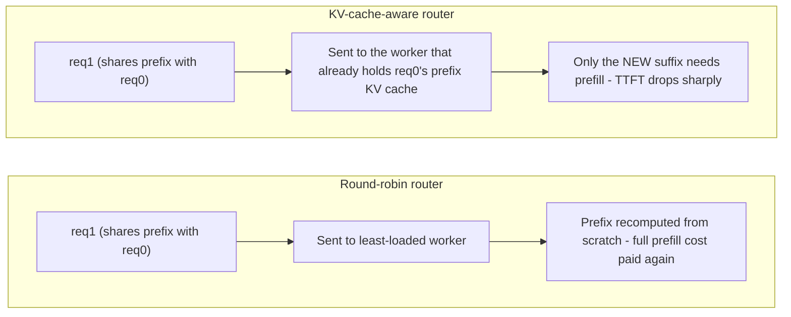
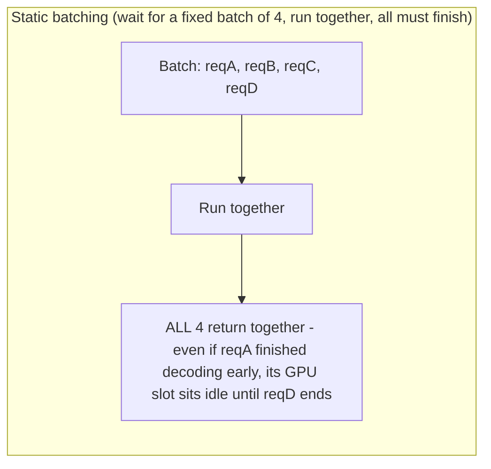
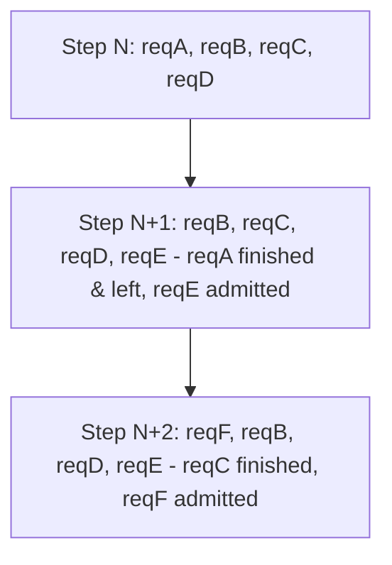

Prefill processes the input prompt and creates KV cache state; decode generates output tokens iteratively using that state. Prefill tends to reward compute throughput and grows with input length. Decode repeatedly reads weights and KV state and is often sensitive to memory bandwidth, KV capacity and concurrency. Continuous batching improves GPU utilization by admitting and interleaving requests dynamically instead of waiting for fixed batches.

KV cache is operational state. Longer context, higher concurrency and more layers increase memory consumption. Prefix caching can avoid recomputing shared prompt prefixes, but it changes routing: a worker that already owns relevant cache may be a better destination than the least-loaded worker. This is one reason LLM-aware routing is different from round-robin HTTP load balancing.

<!-- source-table:1 -->

| Metric | What it captures | Primary pressure |
| --- | --- | --- |
| TTFT | request arrival -> first output token | queue + prefill + network |
| ITL / TPOT | spacing/time per output token | decode scheduling + memory bandwidth |
| End-to-end latency | complete request duration | queue + prefill + decode length |
| Tokens/s | throughput | batching, parallelism, utilization |
| Concurrent users | capacity at SLO | memory/KV + latency budget |

## Build from the normal path

**Prefix caching → LLM-aware routing, made concrete (the paragraph's key sentence, unpacked):**

The tradeoff this introduces: KV-aware routing needs the router to track *which worker holds which prefix's cache*, and that map goes stale the instant a worker evicts cache under memory pressure or restarts — a routing decision based on stale cache-location state sends a request to a worker that has to recompute anyway, paying routing complexity cost without the latency win. This is precisely the "senior design question" the Deep Dive 4 text poses for Dynamo specifically, but it's true of any KV-aware router.

**Diagram: continuous batching — why it beats fixed/static batching**

Every step, the scheduler re-evaluates who's in the batch — no request holds a GPU slot idle waiting for the slowest peer, and new requests join without waiting for the whole batch to drain.
This is the mechanism behind "admitting and interleaving requests dynamically instead of waiting for fixed batches" — the GPU-utilization win comes from never leaving a slot idle just because one sequence in the batch finished before the others.
