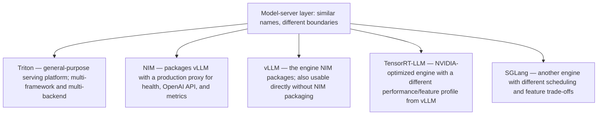
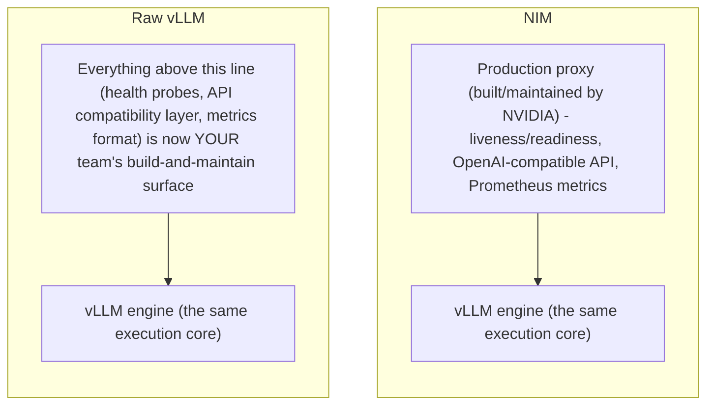

An inference engine optimizes model execution; a serving product adds packaging, health, security, lifecycle and operational contracts. NVIDIA NIM for LLMs currently packages vLLM behind a production-oriented proxy with liveness/readiness, OpenAI-compatible inference endpoints and Prometheus-compatible metrics. TensorRT-LLM provides NVIDIA-optimized inference capabilities, while vLLM and SGLang are widely used engines with different feature/performance trade-offs. An SA should compare workloads and operational requirements rather than treating engines as interchangeable labels.

## Senior addendum

➕ **Cross-reference:** this is the named-products version of Chapter 4's platform-boundary diagram — read Chapter 4 first for the mechanism (gateway vs. model server vs. GPU resource boundary); this Deep Dive just maps real product names onto that diagram's middle layer:

➕ **The one operational distinction worth stating precisely in an interview:** choosing "NIM" vs. "vLLM directly" is not choosing a different engine — it's choosing whether you want the production proxy layer (health probes, standardized API, metrics) built and maintained for you, or whether you'll build/maintain that layer yourself around the open-source engine. Conflating "engine choice" with "packaging choice" is the exact category error Chapter 4 warns against with "do not treat product names as the design."

➕ **Diagram: NIM's packaging vs. raw vLLM — same engine, different build responsibility**

The execution core is identical either way — the decision is entirely about who owns the operational proxy layer above it.
