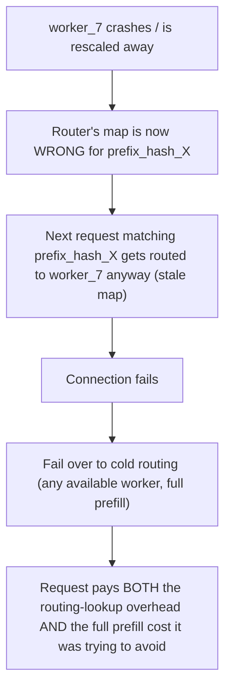
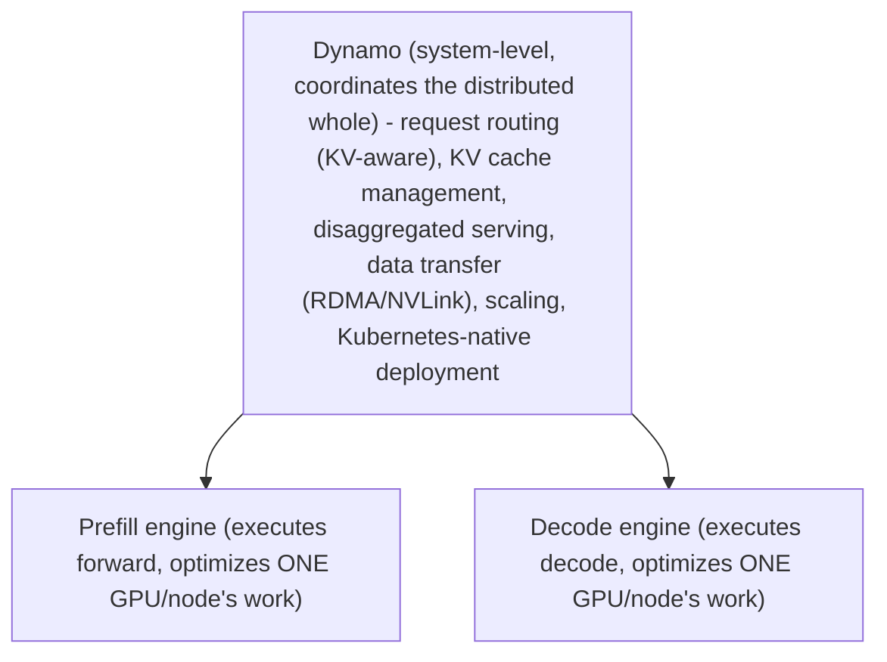

_Figure B. Disaggregated serving separates resource shapes and turns KV transfer into a first-class data path._

NVIDIA Dynamo became GA in 2026 as a distributed inference platform. It adds system-level capabilities around inference engines: request routing, KV cache management, disaggregated serving, data transfer, scaling and Kubernetes-native deployment. The key mental model is that the engine optimizes execution on GPUs while Dynamo coordinates the distributed system around those engines.

Disaggregated serving separates prefill and decode worker pools. This helps when their resource shapes diverge—long prompts make prefill expensive, while high concurrency and long outputs stress decode and KV memory. It is not automatically faster: KV transfer becomes a critical path. On-node NVLink can make transfer cheap; cross-node designs require high-performance data movement, often RDMA, and careful placement.

Dynamo also introduces KV-aware routing: route requests where useful cache already exists while balancing load. The senior design question is when cache locality improves TTFT enough to justify additional routing/state complexity, and how failures or worker turnover invalidate that state.

## Senior addendum

➕ **Cross-reference:** Chapter 6's enhanced version already derives the aggregated-vs-disaggregated diagram and a full "when disaggregation makes things worse" worked scenario, and Deep Dive 2 already unpacked the prefix-caching → routing mechanism. Dynamo is the named platform that implements both of those general concepts as a product — the mental model to hold is: **Chapter 6 + Deep Dive 2 = the mechanism; Dynamo = one specific system-level implementation of that mechanism, GA as of 2026.**

➕ **The failure/turnover question the text poses, made concrete with the mechanism:**

Router's cache-location map: `{prefix_hash_X: worker_7, prefix_hash_Y: worker_3}`

This is why "how do failures or worker turnover invalidate that state" is named explicitly as the senior design question — a KV-aware router needs a lease/TTL or active invalidation mechanism tied to worker health, not just a static map, or worker churn silently degrades TTFT gains into TTFT losses (routing overhead paid, caching benefit lost).

➕ **Diagram: the mental model — engine vs. Dynamo layer boundary**

The engine has no visibility above its own node's execution; every cross-worker decision — which pool, which specific worker, when to fail over — is Dynamo's layer, not the engine's.
