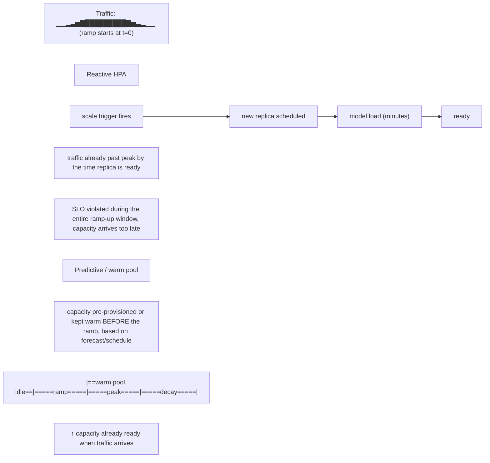

CPU utilization is usually a weak signal for GPU inference. Better scaling signals include queue depth, pending tokens, request concurrency, TTFT/ITL SLOs, KV pressure and engine-specific utilization. Scaling too slowly violates latency; scaling too aggressively incurs model-load cost and wastes scarce GPUs. Model load time can be minutes, so predictive capacity, warm pools and staged rollout may outperform reactive HPA alone.

Run:ai and similar workload managers add scheduling and allocation capabilities above Kubernetes. Current NVIDIA enterprise reference architecture material demonstrates scaling NIM workloads and fractional GPU scheduling as a utilization/TCO lever. Treat results as workload-specific; validate your model, sequence-length distribution, concurrency and SLO.

## Senior addendum

➕ **Cross-reference:** Chapter 5's enhanced version already derives the full autoscaling control-loop diagram, the model-load-lifecycle box, a KEDA/HPA output sample, and the GPU-utilization-thrashing worked scenario — this Deep Dive's genuinely new content vs. Chapter 5 is Run:ai / fractional GPU scheduling as a named lever, expanded below.

➕ **Fractional GPU scheduling as a TCO lever, and the tenancy tradeoff it reintroduces from Chapter 8:**
```
Whole-GPU-per-replica:        Run:ai / fractional scheduling:
  1 replica = 1 GPU,             N replicas time-share or MIG-share
  simple accounting,              1 GPU, higher utilization/lower
  low utilization if traffic       $/replica, but reintroduces the
  per replica < 1 GPU worth         EXACT noisy-neighbor risk table
                                    from Chapter 8 (time-slicing vs.
                                    MIG isolation guarantees)
```
The senior framing: fractional GPU scheduling for autoscaling is a cost/utilization win that is *only* safe to the degree Chapter 8's isolation analysis says it is — a Run:ai deployment maximizing packing density on time-sliced GPUs across untrusted tenants is optimizing the wrong variable if isolation is a hard requirement. Always answer "what's the TCO lever" and "what's the isolation requirement" together, not sequentially.

➕ **Diagram: reactive HPA vs. predictive/warm-pool scaling against a traffic ramp**

This is the mechanism behind "predictive capacity, warm pools and staged rollout may outperform reactive HPA alone" — the multi-minute model-load lead time from Chapter 5's lifecycle box means a purely reactive loop is structurally unable to keep up with a fast ramp, no matter how well the trigger threshold is tuned.

➕ **Diagram: isolation guarantee vs. packing density, the tradeoff Run:ai reintroduces**
```
             low density                                high density
             (whole-GPU)                              (time-sliced fractional)
Isolation:   ████████████ strong                       ░░░░░░░░░░░░ weak
Utilization: ████░░░░░░░░ lower ($/replica higher)      ████████████ higher ($/replica lower)

MIG sits in between: partitioned isolation, moderate density —
neither endpoint of this bar, a distinct third option.
```
Moving right on this bar buys utilization/TCO and spends isolation guarantee — the correct position on the bar is a tenancy decision (Chapter 8), not a scheduling-efficiency decision.
