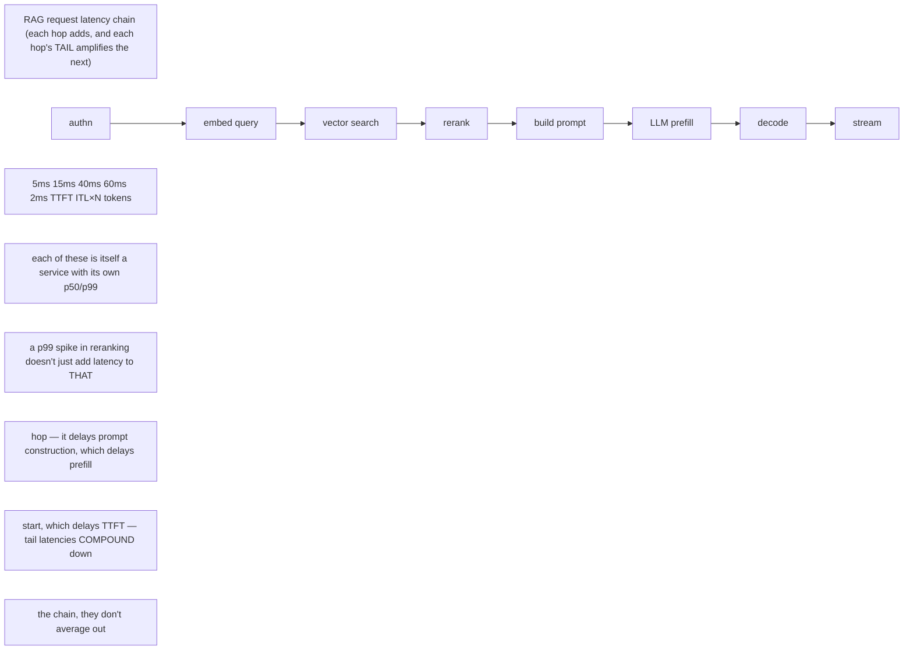
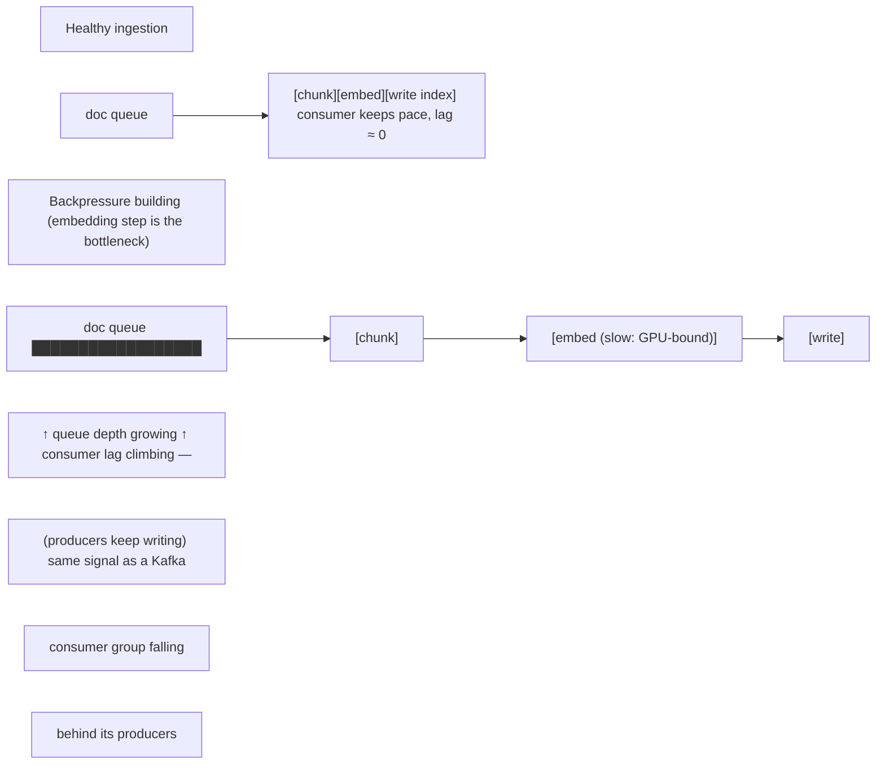

A RAG request is a distributed transaction-like pipeline: authenticate -> embed/transform query -> retrieve candidates -> optional rerank -> construct prompt -> infer -> return/stream. Reliability depends on multiple services whose latency distributions add or amplify. Vector databases are not “AI magic”; understand indexing, replication, consistency, query filters, cache behavior and backup/restore just as with other data systems.

Your Staff Engineer guide’s database and distributed-log material is useful here as a mental bridge: partitioning increases parallelism but changes balancing and failure behavior; replication increases availability at coordination/storage cost; consumer lag is backpressure evidence. Apply the same thinking to embedding pipelines, ingestion queues and asynchronous inference jobs.

## Senior addendum

➕ **This is new ground vs. Chapter 7 — Chapter 7 classifies vector indexes as a state *type*; this Deep Dive is about the RAG *request pipeline* as a latency chain, which deserves its own diagram:**

➕ **The concrete operational consequence:** measuring only end-to-end p50 latency for a RAG service hides which hop is the tail-latency contributor. Instrument each hop's own p95/p99 (retrieval, rerank, generation separately) — this is the same "decompose before you scale" instinct as Chapter 3's TTFT/TPOT split, applied one layer up the stack, and it's exactly what Senior Deep Dive 8's benchmark methodology expects you to report per-component, not just end-to-end.

➕ **Diagram: ingestion pipeline backpressure, the "consumer lag is backpressure evidence" idea applied to embedding pipelines**

Growing queue depth plus growing consumer lag on the embedding stage means the vector index is falling behind fresh documents — the query path may keep answering fast while silently answering against a stale index, which is a correctness risk the end-to-end RAG latency chain above will never surface on its own.
