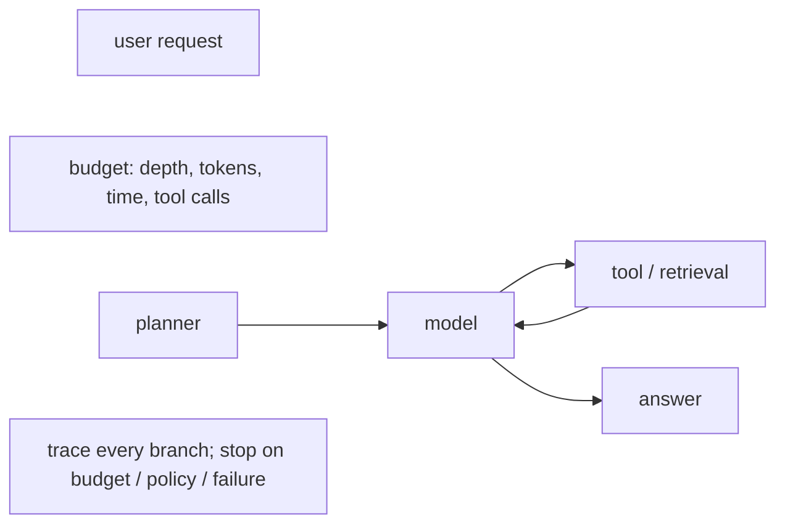

Agentic workloads can turn one user request into many model calls, tool calls and retrieval steps. Capacity planning must reason about amplification: requests per user action, token distribution, tool latency, retry behavior and maximum loop depth. A service that is safe at 100 user requests/s can overwhelm model endpoints if each request fans out into ten model calls. Add budgets, concurrency controls and trace-level observability.

## Build from the normal path

**This is genuinely new ground — no earlier chapter covers fan-out amplification. Worth its own arithmetic and a worked scenario:**

```mermaid
flowchart TD
  %% Converted from the original ASCII diagram; source wording is preserved.
  n0["Naive capacity model: Amplified reality"]
  n1["100 user req/s 100 user req/s × 10 model calls/req"]
  n2["provision for 100 req/s (avg agent loop depth) × 1.3"]
  n3["of model-endpoint capacity (retry factor for tool failures)"]
  n4["= 1,300 model-endpoint req/s needed"]
  n5["— a 13x under-provisioning if"]
  n6["sized on the user-facing number"]
```

**Extra worked scenario — the incident this amplification math prevents:**
> **Situation:** An agentic coding assistant is capacity-planned at "the same model endpoint sizing as our old single-shot chat feature," based on expected user request rate. After launch, the model endpoint saturates and queue depth spikes at a fraction of the planned user traffic.
> 1. The chat feature was one user request → one model call. The agentic feature is one user request → an average of 6 tool-call/retrieval/model-call round-trips per task, with occasional loops up to a configured max depth of 15 on complex tasks.
> 2. Capacity was sized on user-facing request rate, not on the amplified model-endpoint request rate — the correct sizing input is `user_req/s × avg_loop_depth × retry_factor`, not `user_req/s` alone.
> 3. Add a hard max-loop-depth budget (bounds worst-case amplification per request) and per-user/per-session concurrency limits (bounds blast radius of any one runaway agent loop) — both are capacity controls, not just cost controls.
> **Conclusion:** Agentic workloads break the assumption "capacity scales with user request rate" that every other chapter in this volume implicitly relies on — this is the one workload class in the whole book where you must capacity-plan on the *amplified* request rate, explicitly modeled, not the user-facing one.

**Interview-ready line:** *"For agentic workloads, I capacity-plan on model-endpoint request rate, not user request rate — the multiplier is average loop depth times retry factor, and it needs a hard budget, not just a monitoring dashboard, because a single runaway loop can consume a disproportionate share of GPU capacity."*

**Visual model — an agent request is a bounded tree, not one inference call:**

**Key takeaway:** *"Fan-out multiplies capacity and failure domains."* The budget must travel with the request, because no fleet-level average can contain a single runaway branch.
