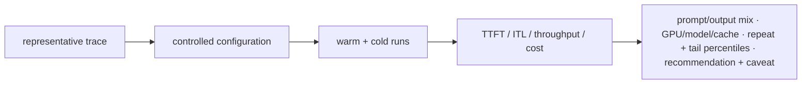

A useful benchmark reproduces workload shape, not only peak throughput. Record input/output sequence-length distributions, concurrency, streaming behavior, model precision, engine/version, GPU type/topology, cache state and network/storage conditions. Report p50/p95/p99 TTFT and ITL together with tokens/s and GPU efficiency. A single average hides tail latency and overload behavior.

## Senior addendum

➕ **Cross-reference:** Chapter 9's enhanced version already derives the cost-per-token arithmetic and a warm-vs-cold benchmark worked scenario — this Deep Dive is the methodology checklist behind that scenario. Turn its list into an actual benchmark report template, since "what should a benchmark report contain" is a direct interview question:

➕ **Minimal credible LLM-serving benchmark report — a checklist you can recite:**
```
Workload shape:     input/output length distribution (not just mean — report p50/p90/p99
                    of BOTH, since a long-tail of long prompts changes prefill cost non-linearly)
Concurrency:        fixed vs. Poisson arrival; concurrency level(s) tested
Streaming:          on/off — affects perceived vs. measured TTFT
Precision/engine:   exact engine + version + precision (fp16/fp8/int4) — perf isn't portable across these
GPU/topology:       SKU, count, interconnect (NVLink/PCIe/cross-node) — see Ch6's topo -m point
Cache state:        cold start included/excluded, and reported SEPARATELY either way (Ch9's warm/cold scenario)
Latency:            p50/p95/p99 for BOTH TTFT and ITL — never just the mean (Ch3's mean-vs-p99 trap)
Throughput:         tokens/s AND GPU efficiency (tok/s per GPU, or per dollar) — raw tok/s alone hides cost
```
A benchmark report missing any row above is not yet a "production" benchmark by this Deep Dive's own definition — this checklist is the fastest way to audit a vendor's or a colleague's benchmark claim in an interview setting: ask which of these eight rows is missing, and that's the row hiding the workload-mismatch risk from Chapter 4's benchmarking trap scenario.

## Targeted references and reinforcement

**NVIDIA NIM LLM architecture:** [https://docs.nvidia.com/nim/large-language-models/latest/reference/architecture.html](https://docs.nvidia.com/nim/large-language-models/latest/reference/architecture.html) — Current NIM LLM architecture, health and metrics surfaces.

**NVIDIA NIM benchmarking metrics:** [https://docs.nvidia.com/nim/benchmarking/llm/latest/metrics.html](https://docs.nvidia.com/nim/benchmarking/llm/latest/metrics.html) — Definitions for TTFT and common inference latency/throughput metrics.

**NVIDIA Dynamo:** [https://docs.nvidia.com/dynamo/getting-started/introduction](https://docs.nvidia.com/dynamo/getting-started/introduction) — 2026 distributed inference platform: disaggregation, routing, KV management and Kubernetes-native operation.

**Anshul Jindal public NVIDIA workshop signal:** [https://de.linkedin.com/in/ansjin](https://de.linkedin.com/in/ansjin) — Practitioner scope: prefill/decode, KV cache, NIM/vLLM, Dynamo, API gateway and Prometheus/Grafana/Loki/Tempo observability.

**Vishakha Sadhwani — AI systems for DevOps:** [https://www.linkedin.com/in/vsadhwani](https://www.linkedin.com/in/vsadhwani) — Practitioner scope: APIs, GPU-backed services, autoscaling, RAG awareness, event-driven systems, reliability and cost.

➕ **Visual model — benchmark from workload shape to a decision:**

**Memory hook:** *"A peak number is a property of a test; a decision needs a workload."* Preserve the inputs and the state so another team can reproduce the claim.
