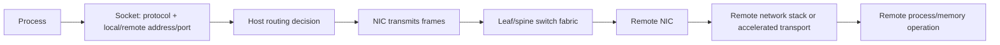
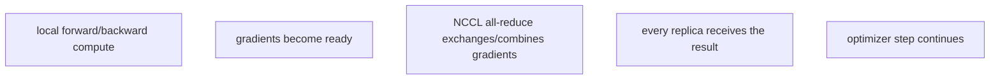

# Foundation — what HPC infrastructure is and why AI needs it

## What this volume is trying to teach

High-performance computing (HPC) runs large or tightly coordinated workloads efficiently across expensive shared resources. Modern distributed AI inherits many HPC concerns: high-speed communication, predictable topology, shared data, batch scheduling, failure amplification and reproducible environments.

The central lesson is that a multi-node GPU job is one distributed system. Its speed is limited by computation, communication, data supply and synchronization—not by GPU specifications alone.

## From one process to a distributed job

| Scale | New dependency |
|---|---|
| One process on CPU | operating system, memory, local files |
| One GPU | driver, CUDA libraries, device memory |
| Several GPUs in one node | PCIe/NVLink/NVSwitch topology and synchronization |
| Several nodes | NIC/HCA, switch fabric, addressing, transport and rank coordination |
| Large cluster | scheduler policy, shared storage, health gating and failure domains |

## Essential language

- A **distributed job** uses processes/resources on more than one machine.
- A **rank** is one process identity in a coordinated parallel job.
- A **collective** is a group communication operation such as broadcast or all-reduce.
- **MPI** is a standard and library ecosystem for communication among processes.
- **NCCL** is NVIDIA's library for efficient GPU collective communication.
- **Slurm** is a scheduler allocating resources and launching batch jobs; it is not a communication library.
- **RDMA** enables direct memory-oriented network transfers with reduced CPU/copy involvement.
- **InfiniBand** is a purpose-built fabric supporting RDMA.
- **RoCE** carries RDMA semantics over Ethernet and depends on correct Ethernet fabric design.
- A **parallel filesystem** serves shared data at scale across many clients.
- A **checkpoint** is saved workload state used to resume after interruption.

## The normal training path

The scheduler allocates nodes and GPUs. A launcher starts ranks. Each rank receives data and drives GPU computation. Collectives exchange gradients or other tensors. Storage supplies datasets and receives checkpoints. At synchronized boundaries, one slow rank can delay the entire job.

This gives a clean troubleshooting order: allocation → rank launch → local GPU → inter-process bootstrap → network path → collective behavior → storage/data → application correctness.

## Ethernet, RDMA and locality

Ethernet provides familiar packet networking. RDMA is a data-movement capability, not a synonym for a fast cable. InfiniBand and RoCE provide different operational environments for RDMA. GPU Direct RDMA can shorten the path between GPU memory and a network adapter, but physical topology, software configuration and supported hardware still determine whether the intended path is used.

## A real-life example

A job scales well from one to eight GPUs on one server but poorly across two servers. The change introduces rank bootstrap, NIC selection, switch fabric, RDMA/NCCL configuration and cross-node synchronization. The scheduler may have allocated correct resources while communication still falls back to a slower path. Prove each new boundary rather than blaming "the network" broadly.

## Ethernet first: how a packet reaches another host

Before RDMA, understand ordinary networking:



IP routing answers where packets go. Ethernet switching forwards frames within layer-2 domains. TCP provides a reliable byte stream but involves kernel/protocol work. MTU mismatch, loss, congestion, bad routes, firewall state and interface selection can all affect distributed jobs.

## RDMA from first principles

Remote Direct Memory Access allows a network adapter to perform operations involving registered memory with reduced CPU involvement and copying compared with a conventional application/TCP path. It requires a complete ecosystem: supported NIC/HCA, drivers, registered memory, queue-pair/transport setup, addressing/routing and a correctly operated fabric.

**InfiniBand** is a fabric architecture designed for high-performance communication. **RoCE** carries RDMA over Ethernet. RoCE does not make congestion disappear; loss/congestion/QoS design and telemetry remain operational responsibilities.

## MPI, PMIx and NCCL have different jobs

| Component | Responsibility |
|---|---|
| Slurm | allocate resources and initiate job execution |
| PMIx/launcher integration | exchange process/rank bootstrap information |
| MPI implementation | general process communication API/runtime |
| NCCL | topology-aware GPU collective communication |

A training framework may use Slurm for allocation, PMIx/MPI for launch/control coordination and NCCL for GPU tensor collectives. A failure before every rank launches should not begin with NCCL tuning.

## Collective communication and stragglers

An all-reduce combines values across ranks and distributes the result. Every participating rank must reach compatible collective calls. One missing, delayed or mismatched rank can stall peers.

For data-parallel training:



Measure step-time distribution, per-rank timing and collective performance. Fleet averages can hide one slow node whose delay becomes global at synchronization.

## Storage is part of the compute pipeline

AI jobs commonly need:

- model/container distribution before launch;
- high-throughput dataset reads;
- metadata operations for many files;
- checkpoint writes and restart reads;
- local scratch for transformed/sharded data;
- durable artifact storage.

Local NVMe, shared POSIX filesystems, parallel filesystems and object storage have different semantics. "Storage bandwidth" without access pattern, block/file/object semantics, metadata rate, concurrency and durability does not size a system.

## A two-node debugging ladder

When one-node training works and two-node training fails:

1. Confirm the scheduler allocated expected nodes/GPUs and no resource overlap.
2. Prove every rank starts and prints rank/host/local GPU identity.
3. Confirm identical application, MPI/NCCL and driver/container environment.
4. Run a CPU-level MPI barrier/collective.
5. Run one-node `nccl-tests`, then two-node tests with recorded topology.
6. Record selected interfaces and transport from NCCL logs.
7. Check NIC link state, counters, routing and fabric telemetry.
8. Compare performance with known-good baseline and message sizes.
9. Add storage/data loading only after communication is stable.
10. Run the smallest real framework job before production scale.

Change one dimension at a time. "Set `NCCL_DEBUG=INFO`" is an observation step, not a fix.

## Safe observation commands

Commands vary by distribution and installed fabric tooling:

```bash
ip -brief link
ip route
ethtool INTERFACE
nvidia-smi topo -m
ibv_devices
ibv_devinfo
```

Read-only output proves local observations only. A link reporting Up does not prove end-to-end bandwidth, correct routing, congestion behavior or GPU Direct use.

## Common beginner mistakes

- calling Slurm, MPI and NCCL interchangeable;
- assuming RDMA means traffic bypasses every host/software concern;
- benchmarking one message size and generalizing to the workload;
- using aggregate bandwidth while ignoring tail/straggler behavior;
- treating a mounted filesystem as proof it can meet checkpoint demand;
- forcing interface environment variables before recording automatic selection;
- comparing theoretical line rate directly with application goodput without protocol/collective context.

## References and reinforcement

- [NVIDIA NCCL documentation](https://docs.nvidia.com/deeplearning/nccl/)
- [NVIDIA networking documentation](https://docs.nvidia.com/networking/)
- [NVIDIA GPUDirect RDMA documentation](https://docs.nvidia.com/cuda/gpudirect-rdma/)
- [Slurm documentation](https://slurm.schedmd.com/documentation.html)
- Local Staff guides: `networking-service-mesh_consolidated.md`, `databases-storage_consolidated.md`
- Local SRE labs: `interview-prep/hands-on-labs/networking/`

## How to study this volume

Study distributed performance, Ethernet, RDMA, GPU/NIC paths, Kubernetes network integration, storage and Slurm in that order. Then compare Kubernetes and Slurm. Use deep dives after you can explain the normal end-to-end data path and which tool owns allocation versus communication.
