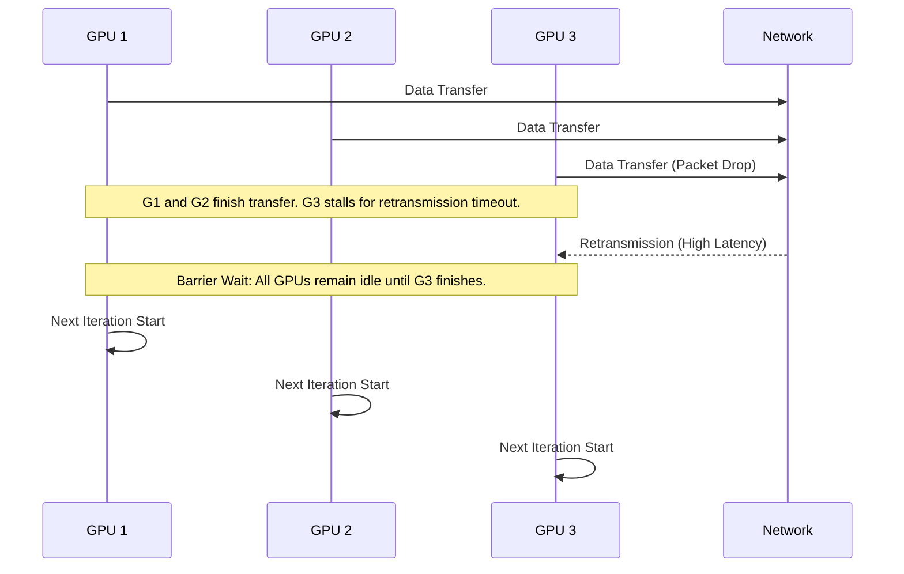
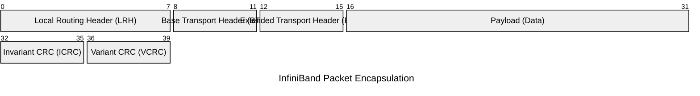
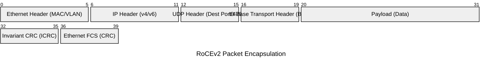
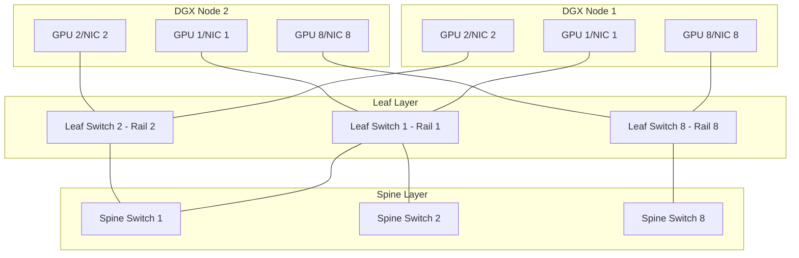

# AI Networking & RDMA Masterclass: Ethernet, InfiniBand, and RoCEv2

## Introduction

In the era of large language models (LLMs) and massive distributed deep learning, networking is no longer just a conduit for data; it is the fundamental limiting factor—or the primary enabler—of cluster-scale performance. When training jobs span thousands of GPUs across hundreds of nodes, the network effectively becomes the computer's internal bus. In these environments, traditional TCP/IP networking, with its kernel overhead, context switches, and CPU utilization, introduces intolerable latency and jitter. Straggler amplification—where one delayed packet can stall thousands of GPUs—requires a shift from software-driven networking to hardware-accelerated, zero-copy communication architectures.

This masterclass is designed for Senior Platform, Infrastructure, DevOps, and SRE engineers building NVIDIA AI Factories. We will journey from the first principles of Remote Direct Memory Access (RDMA) through the architectural trade-offs between InfiniBand and Ethernet (RoCEv2), explore topology design at cluster scale, and conclude with advanced troubleshooting scenarios you will face in production. 

---

## 1. The Distributed Systems Performance Imperative

### 1.1 The Anatomy of an AI Training Job
Modern AI training, such as GPT-style transformer training, relies heavily on data parallelism, tensor parallelism, and pipeline parallelism. These techniques require GPUs to constantly exchange gradients, activations, and weights. 

The fundamental communication primitives used are **collectives** (provided by libraries like NCCL - NVIDIA Collective Communication Library):
- **AllReduce:** Used in data parallelism to sum gradients across all GPUs and distribute the result back.
- **AllGather / ReduceScatter:** Used in model and sequence parallelism.
- **Send/Recv:** Point-to-point operations used in pipeline parallelism.

### 1.2 The Straggler Problem
In a synchronous training iteration, every GPU must wait for all other GPUs to complete their computation and network exchanges before proceeding to the next step. If a single network link drops a packet, causing a retransmission, the GPU attached to that link stalls. Consequently, all other GPUs in the collective operation must also wait. 



This phenomenon is **straggler amplification**. A 0.01% drop rate on a 10,000 GPU cluster can decimate cluster utilization (MFU - Model Flops Utilization). Thus, AI networks are engineered not just for high bandwidth, but for **ultra-low, deterministic latency and zero packet loss**.

---

## 2. RDMA: Remote Direct Memory Access

### 2.1 Why TCP/IP Fails for AI
Standard TCP/IP involves:
1. Application calls `send()`.
2. Context switch to kernel space.
3. CPU copies data from user-space buffer to kernel-space socket buffer.
4. TCP stack processes headers, calculates checksums.
5. CPU copies data to NIC via PCIe.
6. Receiving side reverses this process.

This consumes massive CPU cycles and introduces tens of microseconds of latency.

### 2.2 The RDMA Architecture
RDMA bypasses the operating system kernel entirely. The network adapter (NIC/HCA) directly reads from and writes to the application's memory (e.g., GPU memory via GPUDirect RDMA).

```mermaid
graph LR
    subgraph Node A
        AppA[User Application]
        MemA[Host/GPU Memory]
        HCAA[RDMA NIC]
    end
    
    subgraph Node B
        AppB[User Application]
        MemB[Host/GPU Memory]
        HCAB[RDMA NIC]
    end
    
    AppA -. "Registers Memory" .-> HCAA
    AppB -. "Registers Memory" .-> HCAB
    
    HCAA === "Zero-Copy Network Transfer" === HCAB
    MemA --- "PCIe DMA" --- HCAA
    HCAB --- "PCIe DMA" --- MemB
```

**Key RDMA Concepts:**
- **Queue Pairs (QPs):** The communication endpoints. Each QP consists of a Send Queue (SQ) and a Receive Queue (RQ).
- **Work Requests (WRs):** Instructions posted by the application to the queues (e.g., "Send this memory region").
- **Memory Regions (MRs):** Pinned (non-pageable) physical memory areas registered with the NIC for direct access.
- **Completion Queues (CQs):** Where the NIC posts results of completed Work Requests.

### 2.3 GPUDirect RDMA
GPUDirect RDMA extends this by allowing the NIC to read/write directly from **GPU VRAM** over the PCIe bus (or NVLink switch if supported), bypassing system RAM and the host CPU completely.

---

## 3. The Fabric Wars: InfiniBand vs. Ethernet (RoCEv2)

To carry RDMA traffic across a cluster, you need a fabric. The two dominant choices are InfiniBand and Ethernet running RoCEv2 (RDMA over Converged Ethernet v2).

### 3.1 InfiniBand: The Purpose-Built AI Fabric
InfiniBand (IB) was designed from day one for RDMA, lossless transmission, and High-Performance Computing (HPC).

**Strengths:**
- **Inherent Lossless Fabric:** Uses credit-based flow control at the link layer. A switch port will not transmit a packet unless it knows the receiving buffer has space. No dropped packets due to congestion.
- **Adaptive Routing (AR):** IB switches make per-packet routing decisions based on real-time port loads, balancing traffic perfectly across multiple paths.
- **Subnet Manager (SM):** Centralized control plane (OpenSM or UFM) that discovers topology, provisions routes, and handles failures instantly, avoiding the slow convergence of Ethernet protocols like BGP.

**InfiniBand Packet Structure:**


### 3.2 RoCEv2: Ethernet Fights Back
RoCEv2 encapsulates IB transport headers inside standard UDP/IPv4 or IPv6 headers, allowing RDMA to run over standard Ethernet switches.

**The Challenge:** Ethernet is inherently lossy. When buffers fill up, switches drop packets. For RDMA to work efficiently on Ethernet, the network must be heavily tuned to emulate losslessness.

**Required Ethernet Technologies for RoCEv2:**
1. **PFC (Priority Flow Control - IEEE 802.1Qbb):** The Ethernet equivalent of credit-based flow control. When a switch buffer fills, it sends a PFC Pause frame to the upstream device, telling it to stop transmitting for a specific traffic class.
2. **ECN (Explicit Congestion Notification):** Switches mark packets when queues get too deep (before they overflow). The receiver echoes this back (CNP - Congestion Notification Packet), and the sender slows down.
3. **DCQCN (Data Center Quantized Congestion Notification):** The algorithmic framework used by NICs to react to ECN marks.

**RoCEv2 Packet Structure:**


### 3.3 Trade-offs Summary

| Feature | InfiniBand (NDR/XDR) | Ethernet RoCEv2 (Spectrum-X/Tomahawk) |
| :--- | :--- | :--- |
| **Flow Control** | Credit-based (inherent, perfect) | PFC (reactive, pause frames) |
| **Congestion Control**| Hardware-managed, proactive | ECN/DCQCN (requires complex tuning) |
| **Routing** | Adaptive Routing (per-packet) | ECMP (per-flow hashing, prone to collision) |
| **Control Plane** | Centralized Subnet Manager | Distributed (BGP/OSPF/EVPN) |
| **Ecosystem** | NVIDIA end-to-end | Multi-vendor, standard tooling |
| **Skillset** | Specialized HPC knowledge | Standard Network Engineering |

*Note: NVIDIA Spectrum-X (Spectrum-4 switches + BlueField-3 DPUs) adds RoCE adaptive routing and advanced congestion control, significantly closing the gap between Ethernet and InfiniBand for AI workloads.*

---

## 4. AI Network Topology Design

AI networks require full bisection bandwidth and massive scale. The standard architecture is the **Clos Network (Leaf-Spine or Fat-Tree)**.

### 4.1 Rails Architecture
Modern AI nodes (like DGX H100) have 8 GPUs and 8 dedicated compute NICs (e.g., ConnectX-7). To maximize performance, we use a "Rail-optimized" topology.

- **Rail:** All NIC #1s across all nodes are connected to Leaf Switch #1. All NIC #2s to Leaf #2, and so on.
- This ensures that when GPU 1 on Node A talks to GPU 1 on Node B, they are separated by only ONE switch hop.



### 4.2 Compute vs. Storage/Management Fabrics
AI clusters physically separate traffic types:
1. **Compute Fabric (Backend):** InfiniBand or RoCEv2. Dedicated exclusively to GPU-to-GPU NCCL traffic. No routing to the internet.
2. **Storage Fabric (Frontend):** High-speed Ethernet for reading datasets and writing checkpoints to parallel file systems (WEKA, VAST, Lustre).
3. **Management Fabric:** Standard Ethernet for SSH, Kubernetes control plane, IPMI, and Prometheus scraping.

---

## 5. Operations: Configuring and Validating the Network

### 5.1 Verifying RDMA NICs (ibstat)
:::tip
The fundamental tool for checking RDMA interface status is `ibstat` or `ibv_devinfo`.
:::

```bash
# Check the status of Mellanox/NVIDIA NICs
ibstat
```

**Expected Output (InfiniBand):**
```text
CA 'mlx5_0'
        CA type: MT4123
        Number of ports: 1
        Firmware version: 20.31.1014
        Hardware version: 0
        Node GUID: 0x08c0eb0300a1b2c3
        System image GUID: 0x08c0eb0300a1b2c3
        Port 1:
                State: Active
                Physical state: LinkUp
                Rate: 200 (HDR)
                Base lid: 32
                LMC: 0
                SM lid: 1
                Capability mask: 0x2651e848
                Port GUID: 0x08c0eb0300a1b2c3
                Link layer: InfiniBand
```
*Note: State MUST be 'Active' and Physical state 'LinkUp'. The Base lid (Local Identifier) is assigned by the Subnet Manager. If State is 'Initializing', the SM is likely unreachable or misconfigured.*

**Expected Output (RoCEv2):**
```text
CA 'mlx5_1'
        Port 1:
                State: Active
                Physical state: LinkUp
                Rate: 400
                Base lid: 0
                LMC: 0
                SM lid: 0
                Capability mask: 0x00010000
                Port GUID: 0x0000000000000000
                Link layer: Ethernet
```
*Note: Base lid and SM lid are 0 because RoCE uses IP routing, not an IB Subnet Manager.*

### 5.2 Performance Testing (perftest)
Before running distributed training, you must validate fabric bandwidth and latency using the `perftest` suite (e.g., `ib_write_bw`, `ib_send_lat`).

**Server Side (Node A):**
```bash
# Start RDMA write bandwidth test on interface mlx5_0, port 1
ib_write_bw -d mlx5_0 -i 1
```

**Client Side (Node B):**
```bash
# Connect to Node A and test bandwidth
ib_write_bw -d mlx5_0 -i 1 <IP_OF_NODE_A>
```

**Expected Output:**
```text
---------------------------------------------------------------------------------------
                    RDMA_Write BW Test
 Dual-port       : OFF          Device         : mlx5_0
 Number of qps   : 1            Transport type : IB
 Connection type : RC           Using SRQ      : OFF
 TX depth        : 128
 CQ Moderation   : 100
 Mtu             : 4096[B]
 Link type       : IB
 Max inline data : 0[B]
 rdma_cm QPs     : OFF
 Data ex. method : Ethernet
---------------------------------------------------------------------------------------
 #bytes     #iterations    BW peak[MB/sec]    BW average[MB/sec]   MsgRate[Mpps]
 65536      5000           23500.2            23450.5              0.375208
---------------------------------------------------------------------------------------
```
*For a 200Gbps HDR link, expected bandwidth is ~23,500 MB/s. For 400Gbps NDR, ~47,000 MB/s.*

### 5.3 Configuring RoCEv2 Switch Ports (Mellanox Cumulus/Onyx)

To achieve a lossless fabric on Ethernet, switches must be configured for PFC (Priority Flow Control) and ECN (Explicit Congestion Notification) on specific traffic classes (usually Differentiated Services Code Point - DSCP).

RDMA traffic is typically mapped to Priority 3 (DSCP 24 or 26).

**Example Configuration (Mellanox Onyx):**
```text
# Enable ECN for traffic class 3
switch (config) # interface ethernet 1/1-1/32 traffic-class 3 congestion-control ecn minimum-absolute 150 maximum-absolute 1500

# Enable PFC for priority 3
switch (config) # interface ethernet 1/1-1/32 dcb priority-flow-control mode on force
switch (config) # interface ethernet 1/1-1/32 dcb priority-flow-control priority 3

# Configure strict priority queueing and buffers
switch (config) # interface ethernet 1/1-1/32 traffic-class 3 bind strict-priority
```

---

## 6. Advanced Troubleshooting & Production Scenarios

### 6.1 The PFC Deadlock Scenario
:::warning
In RoCE networks, PFC creates a mechanism where Switch A tells Switch B to stop sending. If a loop occurs, or due to severe congestion patterns, Switch B tells Switch C to stop, C tells D, and D tells A. You now have a cyclical buffer dependency. No traffic moves. The network is deadlocked.
:::

**Symptoms:**
- GPU workloads completely hang (0% GPU utilization, infinite runtime).
- Switch port counters show massive PFC Tx/Rx frame counts, but zero data packet transmission.
- `ib_write_bw` tests hang indefinitely.

**The Solution:**
1. **Network Design:** Ensure loop-free topologies (e.g., strictly layered Clos networks without cross-links between spine switches).
2. **PFC Watchdog:** Enable PFC Watchdog on the switches and NICs.
   - If a port is paused for more than a threshold (e.g., 50ms), the switch assumes a deadlock.
   - The switch automatically drops the packets in the paused queue to break the cycle.
   - Dropping a packet forces TCP/RoCE to retransmit, but saves the cluster from a hard hang.

**Configuring Watchdog (Onyx):**
```text
switch (config) # dcb priority-flow-control deadlock-watchdog enable
switch (config) # dcb priority-flow-control deadlock-watchdog timeout 50000 priority 3
switch (config) # dcb priority-flow-control deadlock-watchdog action drop priority 3
```

### 6.2 Microbursts and ECN Tuning
**The Problem:** AI workloads generate synchronized, highly intensive traffic patterns (incast). Many GPUs send data to one GPU simultaneously. This causes sudden spikes (microbursts) that fill switch buffers in microseconds, faster than standard SNMP monitoring (which polls every 10-60 seconds) can detect.

**Symptoms:**
- Monitoring shows average link utilization is low (e.g., 20%).
- Yet, packet drops are occurring, or PFC pause frames are firing rapidly.
- AI training performance is highly erratic and non-deterministic.

**The Solution:**
1. **Telemetry:** Use high-frequency streaming telemetry (e.g., gNMI or NetQ) to capture micro-second level buffer occupancy.
2. **Tune ECN Thresholds:** If ECN thresholds are too high, the buffer fills up and triggers PFC (halting traffic) before ECN has time to tell the sender to slow down gracefully.
   - *Action:* Lower the `minimum-absolute` ECN marking threshold. The switch will start marking packets earlier, signaling Congestion Notification Packets (CNPs) back to the NICs to throttle transmission smoothly via DCQCN, preventing hard PFC pauses.

### 6.3 Analyzing RoCE Traffic with tcpdump
Because RoCEv2 runs over UDP (Port 4791), you can capture headers using standard tools. (Note: capturing line-rate 400Gbps payload is impossible on a CPU, but capturing headers for troubleshooting protocol behavior is feasible using ACLs or port mirroring).

**tcpdump filter for RoCEv2 CNPs (Congestion Notification Packets):**
CNPs are sent when a receiver gets an ECN-marked packet. High CNP rates indicate congestion.

```bash
# Capture RoCEv2 traffic, filter for UDP port 4791, and specifically look for BTH opcode indicating a CNP (0x81)
# Note: BTH opcode is at a specific offset inside the UDP payload.
sudo tcpdump -i mlx5_1 -nn -e -v udp port 4791
```

**Wireshark Analysis:**
Export the pcap and open in Wireshark. Ensure Wireshark is configured to decode UDP 4791 as "RoCE". Look for:
- **BTH Opcode:** Differentiates between Send, Write, Read, and Acknowledge (ACK).
- **Syndrome:** Check ACKs for NAK (Negative Acknowledgment) syndromes, which indicate out-of-sequence packets (a sign of dropped packets or routing flaps).

### 6.4 InfiniBand Subnet Manager Flapping
**The Problem:** In InfiniBand, the Subnet Manager (SM) calculates all routes. If links constantly flap (go up/down due to faulty cables or optics), the SM is forced into a continuous cycle of "Heavy Sweeps" (recalculating the entire fabric topology).

**Symptoms:**
- The fabric becomes sluggish. New job launches take minutes instead of seconds to establish connections.
- UFM (Unified Fabric Manager) or OpenSM logs show continuous "Fabric Topology Changed" events and heavy sweeps.

**The Solution:**
1. Identify the flapping port using SM logs.
2. Manually disable the port to stabilize the fabric while replacing the optic/cable.
3. Use InfiniBand diagnostic tools:
```bash
# Query fabric errors and identify links with high symbol errors or recovery events
ibdiagnet -c 1000
```
Review the `ibdiagnet2.pm` output file to isolate physical layer degradation.

---

## 7. The Architect's Interview: Knowledge Check

If you are interviewing for a Senior AI Network Engineer role, expect these scenarios:

**Q: "We have an 8k GPU cluster using RoCEv2. Our NCCL AllReduce times are highly erratic. Some steps take 10ms, others take 500ms. CPU usage is low. Link utilization on our dashboards maxes out at 40%. Where do you look first?"**
**A:** This is a classic symptom of microbursts causing network congestion that standard polling misses. I would look at three things:
1. Switch buffer occupancy histograms via high-resolution telemetry.
2. PFC pause frame generation counters on the switches (Tx Pause).
3. CNP (Congestion Notification Packet) generation rates on the NICs.
If PFC is firing frequently but ECN marks are low, our ECN thresholds are set too high. The buffer is filling and triggering PFC before DCQCN can throttle the flow. I would tune the switch ECN thresholds lower.

**Q: "Explain how GPUDirect RDMA improves performance over standard RDMA."**
**A:** Standard RDMA bypasses the CPU and OS kernel, but the NIC still reads/writes to system RAM. For GPU workloads, data originates in GPU VRAM. Without GPUDirect, the CPU must copy data from VRAM across the PCIe bus to System RAM, and then the NIC DMAs it from System RAM across the PCIe bus. GPUDirect RDMA maps the GPU's memory directly to the NIC's address space. The NIC DMAs the data straight out of GPU VRAM across the PCIe bus (or PCIe switch/NVLink), eliminating the bounce buffer in System RAM and halving the PCIe bandwidth consumed.

---

## Conclusion
Designing and operating networks for AI Factories is a fundamental shift from traditional enterprise networking. Whether utilizing the inherent losslessness of InfiniBand or engineering lossless behavior into RoCEv2 Ethernet, the goals remain the same: deterministic ultra-low latency, zero packet loss, and immense scale. Mastery of these concepts, combined with rigorous telemetry and proactive congestion management, is what separates a poorly performing cluster from a world-class AI supercomputer.


## Deep Dive: Additional Diagnostic Workflows

### Diagnosing Link Layer Retransmissions
When operating InfiniBand or RoCEv2, the link layer health is paramount.
Link level retries occur when the physical layer fails to successfully deliver the frame.
Use `ibportstate` to query the specific counters:
```bash
ibportstate 1 1
```
Look for `LinkDownedCounter` and `SymbolErrorCounter`. High counts here usually point to:
- Dirty or damaged fiber optic ends.
- Failing optical transceivers.
- Bad seating of the transceiver in the switch or NIC port.
Always replace cables and transceivers systematically and verify the counters have stabilized.

### Hardware Offload Verification
Modern DPUs like the BlueField-3 offload many networking tasks. You must verify these offloads are active.
```bash
ethtool -k mlx5_0 | grep tcp-segmentation
```
Ensuring TSO (TCP Segmentation Offload) and LRO (Large Receive Offload) are correctly configured for your specific workload profile.
For AI traffic (mostly RDMA), these legacy TCP offloads are less relevant, but ensuring the hardware is steering traffic correctly to the application queues is critical.
Use `ethtool -S mlx5_0` to view detailed hardware statistics and confirm packets are bypassing the kernel.


## Deep Dive: Additional Diagnostic Workflows


## Deep Dive: Additional Diagnostic Workflows


## Deep Dive: Additional Diagnostic Workflows


## Deep Dive: Additional Diagnostic Workflows


## Deep Dive: Additional Diagnostic Workflows


## Deep Dive: Additional Diagnostic Workflows


## Deep Dive: Additional Diagnostic Workflows


## Deep Dive: Additional Diagnostic Workflows


## Deep Dive: Additional Diagnostic Workflows


## Deep Dive: Additional Diagnostic Workflows


## Deep Dive: Additional Diagnostic Workflows


## Deep Dive: Additional Diagnostic Workflows


## Deep Dive: Additional Diagnostic Workflows


## Deep Dive: Additional Diagnostic Workflows


## Deep Dive: Additional Diagnostic Workflows


## Deep Dive: Additional Diagnostic Workflows


## Deep Dive: Additional Diagnostic Workflows


## Deep Dive: Additional Diagnostic Workflows


## Deep Dive: Additional Diagnostic Workflows


## Deep Dive: Additional Diagnostic Workflows


## Deep Dive: Additional Diagnostic Workflows


## Deep Dive: Additional Diagnostic Workflows


## Deep Dive: Additional Diagnostic Workflows


## Deep Dive: Additional Diagnostic Workflows


## Deep Dive: Additional Diagnostic Workflows