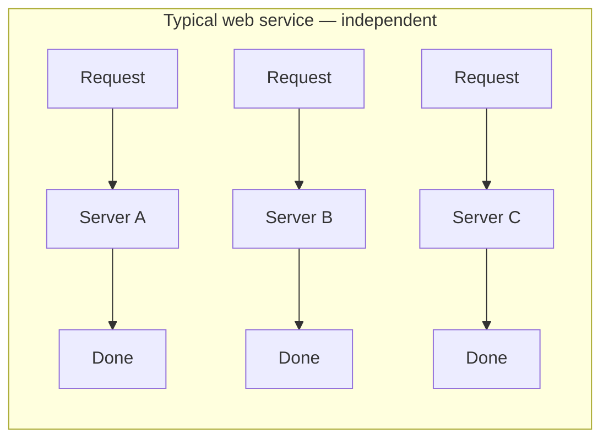
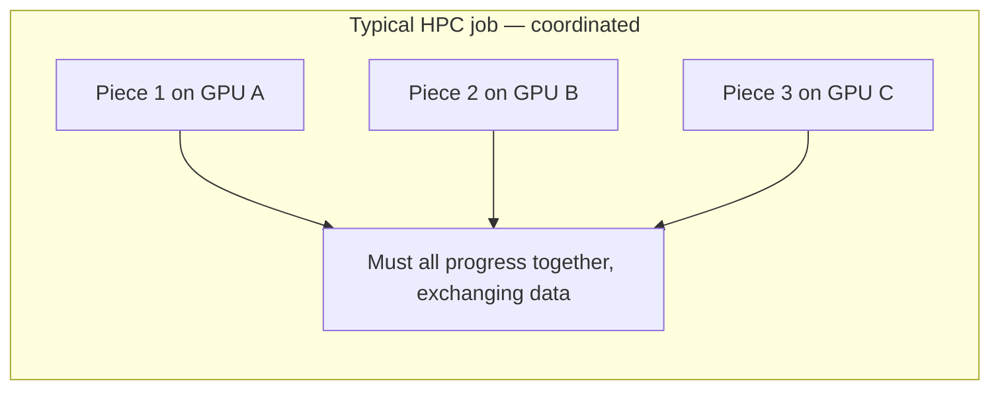
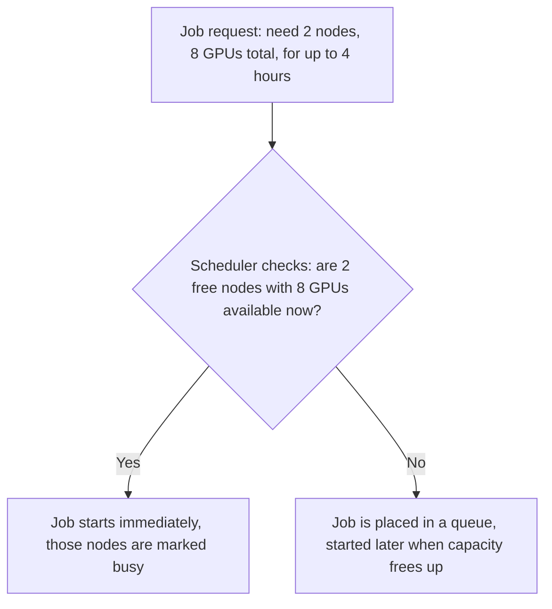
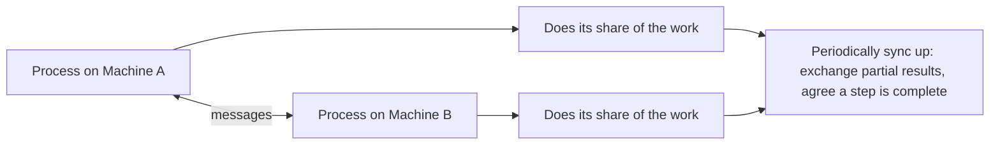
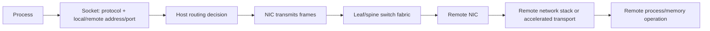
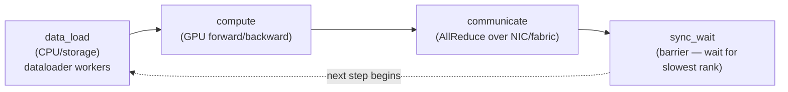

## Foundations: start here if HPC concepts are new to you

### What this section does and does not do

This section builds the basic mental model of High-Performance Computing (HPC — a discipline focused on solving one large computation as fast as possible by spreading it across many machines at once) that the rest of this chapter assumes you already have. It will not make you able to operate a cluster or write parallel code. Its only job is to make sure that when the rest of this chapter says "the scheduler," "the fabric," or "the ranks," you already have a picture in your head for what those words point at, instead of encountering the term and the deep technical detail about it at the same moment.

If you're a senior DevOps or backend engineer, almost everything in your existing mental model of "operating servers" still applies here. HPC does not throw that away. It adds one new, genuinely different problem on top, and that problem is this section's real subject.

### The core difference: coordinated versus independent work

#### The problem, in plain terms

Think about a typical web service you've operated: many independent users send many independent requests, and many independent servers behind a load balancer each handle some subset of those requests. If one server is slow or crashes, the others keep going. Requests don't need to know about each other. This is **independent, uncoordinated work** — every unit of work (each request) can succeed or fail on its own, and the system's overall health is roughly "the sum of many small, separate outcomes."

HPC workloads are usually the opposite shape. A single large computation — say, training one large AI model — is split into many pieces, but those pieces are not independent. They are all part of *one job*, running at the same time, and they must actively cooperate to make progress. If you split a model across 64 GPUs spread over 8 physical machines, all 64 GPUs need to be running, healthy, and exchanging data with each other *simultaneously* for the job to make any progress at all. One slow or crashed GPU doesn't just fail its own eighth of the work — it can stall the entire job, because the other 63 are waiting on it.

#### Naming the concept

Call this **coordinated parallel computing**: many processes (a process is just a running copy of a program) that are all part of one logical job, running at the same time on different machines, that must communicate and stay in step with each other to make progress. This is the one idea underneath almost everything HPC-specific in the rest of this chapter.

#### The basic shape





In the web-service diagram, one slowdown doesn't block the others. In the HPC diagram, one stall blocks all.

#### Check your understanding

**Q1: Why does a single slow machine matter so much more in an HPC job than in a typical web service?**
A: In a web service, each request is handled independently, so one slow server only slows down the requests it personally handles. In an HPC job, all the machines are collaborating on one piece of work at the same time, so if one machine falls behind, the others must wait for it — the whole job runs at the speed of its slowest participant.

**Q2: Is HPC just "DevOps but with bigger machines"? Why or why not?**
A: No. The machines and the OS-level skills are similar, but the workload shape is fundamentally different — coordinated, simultaneous, interdependent work versus independent, uncoordinated requests. That difference is why HPC has its own scheduling model, its own networking priorities, and its own failure modes, which is what the rest of this chapter covers.

### What a "cluster" means here

#### The problem

If you have one big coordinated job that needs, say, 8 machines with GPUs at once, you can't just let each machine be "someone's individual server" that people log into and use however they like. You need a way to treat a group of machines as one shared pool of capacity that jobs can be handed out of, on demand, without two different people accidentally grabbing the same machine for two different jobs.

#### Naming the concept

That shared pool is a **cluster**: a group of machines that are managed and allocated together as one resource, rather than as separate individually-owned servers. Being "in the cluster" means a machine's compute capacity (its CPUs, memory, and GPUs) is available to be handed out to whichever job needs it next, under the control of one central system — not that any one person is logged into it doing their own thing.

#### The basic shape

A cluster typically has:
- **Compute nodes** — the machines that actually run jobs (a "node" is just HPC vocabulary for one machine in the cluster).
- **A scheduler** — the central system that decides which job gets which nodes and when (covered next).
- A shared way for jobs to read/write data that any node might need to access (covered later in this chapter as cluster storage).

#### Check your understanding

**Q1: What's the difference between "a machine I personally SSH into and run things on" and "a compute node in a cluster"?**
A: With a personal machine, you decide what runs on it and when. A compute node's capacity is handed out by a central scheduler to whichever job is next in line — you generally don't decide to run something on a specific node directly; you ask the cluster for capacity and it's assigned to you.

### What problem a job scheduler solves

#### The problem

If a cluster has, say, 40 nodes, and at any moment several different teams each want to run a job that needs some number of those nodes, something has to decide: who gets which nodes, right now, and who has to wait? Left ungoverned, two jobs could easily end up assigned to the same GPU at the same time, corrupting both jobs' results without either job's owner ever knowing why their run behaved strangely.

#### Naming the concept

A **job scheduler** is the system that solves this: it takes requests for compute capacity ("I need 8 nodes with GPUs for the next 4 hours"), decides when and where each request can be satisfied, queues requests when the cluster is fully booked, and guarantees that no two jobs are ever handed the same piece of hardware at the same time. The rest of this chapter goes deep on **Slurm**, the most common scheduler in HPC — this section only needs you to have the concept, not Slurm's commands or internals.

#### The analogy

A job scheduler is like a restaurant host, not a "first person in the door gets the first open table" free-for-all. A party of 8 doesn't get seated at a 2-top just because that table is currently free — the host holds them until a table (or combination of tables) that actually fits becomes available, seats smaller parties at smaller tables in the meantime, and never double-books a table to two parties at once. Swap "party of a given size" for "job that needs a given number of GPUs," and "table" for "node," and you have the core of what a scheduler does: it matches jobs to hardware based on what each job actually needs and what's actually free, queuing when nothing fits yet, and never handing the same hardware to two jobs simultaneously.

#### First real example

You won't run real Slurm commands in this section (later in this chapter does), but here is the shape of what a request looks like conceptually, so it's not alien later:



#### Check your understanding

**Q1: Why can't a cluster just let jobs grab whatever node they want, whenever they want?**
A: Because two jobs could end up assigned to the same hardware at the same time, silently corrupting both, and there'd be no fair or predictable way to decide who runs next when the cluster is busy. A central scheduler prevents both problems.

**Q2: In the restaurant analogy, what does "queuing" correspond to on a cluster?**
A: A job whose required nodes/GPUs aren't free yet waits in the scheduler's queue, the same way a party waits for a table to open up, rather than being seated (started) on hardware that isn't actually free.

### What MPI is, at the concept level

#### The problem

Once a job has been handed several machines by the scheduler, those machines are each running their own separate copy of the program (remember: separate processes, one logical job). But they need to actually cooperate — exchange partial results, agree on when a step is done, combine data — not just run alongside each other in silence. Without a way to talk to each other, "8 machines running the same program" is just 8 unrelated programs that happen to have started at the same time.

#### Naming the concept

**MPI (Message Passing Interface)** is a standard way for many separate running processes — usually one per machine or one per GPU — to send messages to each other and coordinate, so that a computation split across many machines can behave as one coherent, cooperating job instead of many isolated ones. This section deliberately does not teach MPI's actual API (its function calls, its send/receive mechanics) — that's covered later in this chapter. The only job here is to make sure the term and its purpose aren't alien when you get there.

#### The analogy

Think of a group project where each person owns one section of the work, but the sections depend on each other — you can't write your section's conclusion until you know roughly what the other sections found. MPI is the mechanism by which each "team member" (each process) can message the others: "here's what I've got so far," "wait for me before you move to the next step," "here's the piece you asked for." Each participant does their own share of the work, but they periodically must synchronize and exchange information for the whole thing to add up to a correct final result.

#### The basic shape



#### Check your understanding

**Q1: Why isn't "8 machines running the same program" automatically a coordinated HPC job?**
A: Because without something like MPI letting the processes communicate, each machine's copy of the program would run in isolation, unaware of the others' progress or results — there'd be no mechanism for them to actually cooperate on one shared computation.

**Q2: In your own words, what does MPI let separate processes do, without worrying about the actual function calls yet?**
A: It lets separate processes running as part of one job send each other messages and synchronize, so a computation split across many machines/GPUs can behave as one cooperating whole rather than many unrelated programs.

### Why network speed matters so much more here

#### The one-sentence version

In HPC, machines are constantly exchanging data *in the middle of* the computation — not just at the start and end of a request — so a slow network doesn't just add a bit of latency to one operation; it can slow down the entire coordinated job for every participant, because everyone is waiting on those in-flight exchanges to keep going.

#### Why this is different from typical web services

A typical web request touches the network mainly at its boundaries: the request comes in, maybe a database is queried once or twice, and a response goes out. The bulk of the work in between is often local computation. In an HPC job using MPI-style coordination, the processes are exchanging data with each other repeatedly *throughout* the run — a slow or congested network means every one of those exchanges takes longer, and because the whole job is only as fast as its slowest participant (recall the earlier section), network slowness effectively becomes computation slowness for the entire job, not just a delay for one exchange.

This is exactly why the rest of this chapter spends so much time on high-speed networking technologies (RDMA, InfiniBand, and similar) instead of treating "the network" as a solved, uninteresting layer the way many web-service architectures can afford to.

#### Evidence vs. proof: a first example

Suppose a training job is running much slower than expected across its 8 machines, and you run a command that shows one network interface with unusually high retransmit counts on one machine.

- **What this evidence DOES show:** that machine's network interface is experiencing packet loss or congestion severe enough to trigger retransmits.
- **What it does NOT show:** that this network issue is actually the cause of the job's slowness (it could be a coincidental, unrelated problem, or a symptom of something else, like a failing NIC), that this is the *only* affected machine, or that fixing this one interface will resolve the whole job's slowness.
- **What additional evidence you'd want:** per-machine timing of the coordination steps (are the other 7 machines all shown as waiting specifically on this one?), confirmation the retransmit counts started around the same time the slowdown began, and ideally a comparison against a known-healthy run's baseline retransmit rate. Only with that combination would you be near a confident conclusion — one number is a lead, not a verdict.

#### Check your understanding

**Q1: Why does a slow network hurt an HPC job more than it hurts a typical web request?**
A: Because HPC processes exchange data with each other continuously throughout the computation, not just at request boundaries, and the whole job progresses only as fast as its slowest, most-delayed exchange — so network slowness compounds into overall job slowness for everyone involved, not just a one-time added delay.

**Q2: You see one machine with high network retransmits during a slow training job. Is that proof the network caused the slowdown?**
A: No — it's evidence worth investigating, but by itself it doesn't rule out other causes (a different failing component, an unrelated coincidence) or confirm this is even the machine the rest of the job is waiting on. You'd want timing correlation and a healthy-run baseline before treating it as the cause.

### The normal training path

The scheduler allocates nodes and GPUs. A launcher starts ranks. Each rank receives data and drives GPU computation. Collectives exchange gradients or other tensors. Storage supplies datasets and receives checkpoints. At synchronized boundaries, one slow rank can delay the entire job.

This gives a clean troubleshooting order: allocation → rank launch → local GPU → inter-process bootstrap → network path → collective behavior → storage/data → application correctness.

### Ethernet, RDMA and locality

Ethernet provides familiar packet networking. RDMA is a data-movement capability, not a synonym for a fast cable. InfiniBand and RoCE provide different operational environments for RDMA. GPU Direct RDMA can shorten the path between GPU memory and a network adapter, but physical topology, software configuration and supported hardware still determine whether the intended path is used.

### A real-life example

A job scales well from one to eight GPUs on one server but poorly across two servers. The change introduces rank bootstrap, NIC selection, switch fabric, RDMA/NCCL configuration and cross-node synchronization. The scheduler may have allocated correct resources while communication still falls back to a slower path. Prove each new boundary rather than blaming "the network" broadly.

### Ethernet first: how a packet reaches another host

Before RDMA, understand ordinary networking:



IP routing answers where packets go. Ethernet switching forwards frames within layer-2 domains. TCP provides a reliable byte stream but involves kernel/protocol work. MTU mismatch, loss, congestion, bad routes, firewall state and interface selection can all affect distributed jobs.

### RDMA from first principles

Remote Direct Memory Access allows a network adapter to perform operations involving registered memory with reduced CPU involvement and copying compared with a conventional application/TCP path. It requires a complete ecosystem: supported NIC/HCA, drivers, registered memory, queue-pair/transport setup, addressing/routing and a correctly operated fabric.

**InfiniBand** is a fabric architecture designed for high-performance communication. **RoCE** carries RDMA over Ethernet. RoCE does not make congestion disappear; loss/congestion/QoS design and telemetry remain operational responsibilities.

### MPI, PMIx and NCCL have different jobs

| Component | Responsibility |
|---|---|
| Slurm | allocate resources and initiate job execution |
| PMIx/launcher integration | exchange process/rank bootstrap information |
| MPI implementation | general process communication API/runtime |
| NCCL | topology-aware GPU collective communication |

A training framework may use Slurm for allocation, PMIx/MPI for launch/control coordination and NCCL for GPU tensor collectives. A failure before every rank launches should not begin with NCCL tuning.

**Where containers fit inside a Slurm allocation.** Slurm allocates bare machines/GPUs to a job, but most real training workloads still want to run inside a container image for the same reasons they do anywhere else — a consistent, portable user-space environment. **Enroot** unpacks and runs a container image as an unprivileged user process on a compute node, without requiring a persistent container daemon. **Pyxis** is a Slurm plugin that lets `srun`/`sbatch` requests specify a container image directly, so Slurm launches each rank's process already inside its Enroot container instead of a bare host process. The distinction worth keeping straight: Slurm decides *which nodes and GPUs* a job gets; Enroot/Pyxis decide *what user-space environment* each launched process actually runs inside. A job failing to start can be a Slurm allocation problem, an Enroot image/unpack problem, or an application problem inside an otherwise-correctly-launched container — three different boundaries that "the job didn't start" collapses into one symptom.

### Collective communication and stragglers

An all-reduce combines values across ranks and distributes the result. Every participating rank must reach compatible collective calls. One missing, delayed or mismatched rank can stall peers.

For data-parallel training:

```text
local forward/backward compute
gradients become ready
NCCL all-reduce exchanges/combines gradients
every replica receives the result
optimizer step continues
```

Measure step-time distribution, per-rank timing and collective performance. Fleet averages can hide one slow node whose delay becomes global at synchronization.

### Storage is part of the compute pipeline

AI jobs commonly need:

- model/container distribution before launch;
- high-throughput dataset reads;
- metadata operations for many files;
- checkpoint writes and restart reads;
- local scratch for transformed/sharded data;
- durable artifact storage.

Local NVMe, shared POSIX filesystems, parallel filesystems and object storage have different semantics. "Storage bandwidth" without access pattern, block/file/object semantics, metadata rate, concurrency and durability does not size a system.

### A two-node debugging ladder

When one-node training works and two-node training fails:

1. Confirm the scheduler allocated expected nodes/GPUs and no resource overlap.
2. Prove every rank starts and prints rank/host/local GPU identity.
3. Confirm identical application, MPI/NCCL and driver/container environment.
4. Run a CPU-level MPI barrier/collective.
5. Run one-node `nccl-tests`, then two-node tests with recorded topology.
6. Record selected interfaces and transport from NCCL logs.
7. Check NIC link state, counters, routing and fabric telemetry.
8. Compare performance with known-good baseline and message sizes.
9. Add storage/data loading only after communication is stable.
10. Run the smallest real framework job before production scale.

Change one dimension at a time. "Set `NCCL_DEBUG=INFO`" is an observation step, not a fix.

### Safe observation commands

Commands vary by distribution and installed fabric tooling:

```bash
ip -brief link
ip route
ethtool INTERFACE
nvidia-smi topo -m
ibv_devices
ibv_devinfo
```

Read-only output proves local observations only. A link reporting Up does not prove end-to-end bandwidth, correct routing, congestion behavior or GPU Direct use.

### Common beginner mistakes

- calling Slurm, MPI and NCCL interchangeable;
- assuming RDMA means traffic bypasses every host/software concern;
- benchmarking one message size and generalizing to the workload;
- using aggregate bandwidth while ignoring tail/straggler behavior;
- treating a mounted filesystem as proof it can meet checkpoint demand;
- forcing interface environment variables before recording automatic selection;
- comparing theoretical line rate directly with application goodput without protocol/collective context.

### References and reinforcement

- [NVIDIA NCCL documentation](https://docs.nvidia.com/deeplearning/nccl/)
- [NVIDIA networking documentation](https://docs.nvidia.com/networking/)
- [NVIDIA GPUDirect RDMA documentation](https://docs.nvidia.com/cuda/gpudirect-rdma/)
- [Slurm documentation](https://slurm.schedmd.com/documentation.html)
- Local Staff guides: `networking-service-mesh_consolidated.md`, `databases-storage_consolidated.md`
- Local SRE labs: `interview-prep/hands-on-labs/networking/`

### How to study this volume

Study distributed performance, Ethernet, RDMA, GPU/NIC paths, Kubernetes network integration, storage and Slurm in that order. Then compare Kubernetes and Slurm. Use deep dives after you can explain the normal end-to-end data path and which tool owns allocation versus communication.

### Check your understanding: locate the distributed boundary

**Q1: One-node training works and two-node training fails. What changed?**
A: Rank bootstrap, NIC/interface selection, fabric transport, cross-node collectives, and synchronization were introduced. Prove rank launch and a CPU-level communication path before tuning NCCL.

**Q2: A link reports Up. What does that prove?**
A: Only local link state at the observation point. It does not prove routing, end-to-end bandwidth, congestion behavior, RDMA operation, GPUDirect use, or application goodput.

**Q3: Why does one slow rank affect every rank at a collective?**
A: The participants must reach compatible collective operations before the group can progress, so the slowest participant becomes a synchronization barrier.

### Glossary

- **HPC (High-Performance Computing)** — a discipline focused on solving one large computation as fast as possible by spreading it across many machines working together at once.
- **Coordinated parallel computing** — many processes, all part of one logical job, running simultaneously on different machines and actively communicating to make progress together.
- **Node** — HPC vocabulary for one machine that is part of a cluster.
- **Cluster** — a group of machines managed and allocated together as one shared resource pool, rather than as separate individually-owned servers.
- **Job scheduler** — the system that decides which job gets which machines and when, queues jobs when the cluster is busy, and prevents two jobs from being given the same hardware at once (Slurm is the example named in this chapter).
- **MPI (Message Passing Interface)** — a standard way for many separate processes, usually one per machine or GPU, to send each other messages and coordinate so a split computation behaves as one cooperating job.
- **Rank** — MPI vocabulary (mentioned here only so it isn't alien later) for the identifying number given to each process participating in a coordinated job.
- **Collective** — a group communication operation, such as broadcast or all-reduce, that participating ranks execute together.
- **NCCL** — NVIDIA's topology-aware library for GPU collective communication.
- **RDMA** — direct memory-oriented network transfers with reduced CPU and copying involvement.
- **InfiniBand** — a purpose-built high-performance fabric supporting RDMA.
- **RoCE** — RDMA carried over Ethernet, with Ethernet loss, congestion, and QoS considerations.
- **PMIx** — an interface used to exchange process and rank bootstrap information with launchers and runtimes.
- **Parallel filesystem** — shared storage designed to serve data across many concurrent cluster clients.
- **Checkpoint** — saved workload state that permits restart after interruption.
- **Enroot** — runs a container image as an unprivileged process on a compute node, without a persistent container daemon.
- **Pyxis** — a Slurm plugin that lets `srun`/`sbatch` launch each rank's process inside an Enroot container directly.

### Before you go deeper, make sure you can...

- Explain, without jargon, why HPC workloads are "one coordinated job across many machines" rather than "many independent requests," and why that changes what matters operationally.
- Describe what a cluster is, in contrast to a set of individually-owned servers.
- Explain, using the restaurant analogy or your own equivalent, what problem a job scheduler like Slurm solves.
- Explain, at the concept level only, what MPI lets separate processes do — without needing its API yet.
- State the one-sentence reason network speed matters more in HPC than in typical web services, and give a first example of evidence (not proof) that a network issue is affecting a coordinated job.
- Distinguish scheduler allocation, PMIx/rank bootstrap, MPI process communication, and NCCL GPU collectives.
- Explain what Enroot and Pyxis each add on top of a Slurm allocation, and why a failed job launch could be a Slurm, Enroot, or application-inside-the-container problem.
- Explain how Ethernet, InfiniBand, RoCE, RDMA, and GPUDirect relate without using them as synonyms.
- Walk a one-node-success/two-node-failure case through rank, transport, fabric, collective, storage, and application evidence.

With that model in place, here's what actually limits performance in a distributed GPU job.

**VOLUME 6**

**HPC, Networking and Storage for AI**

Distributed communication, RDMA fabrics, storage paths, Slurm and performance troubleshooting

> Fourth Edition - Teaching text with mechanisms, examples, visuals, scenarios and exercises

Independent study guide based on public documentation and public practitioner material. Not an NVIDIA publication.

**Learning outcome:** Build a scaling-efficiency model that separates compute, communication, synchronization and I/O.

A single GPU can run independently. Multiple GPUs introduce coordination. Within a node, peer links/topology matter; across nodes, the network fabric and collective library matter. Scaling efficiency falls when communication/synchronization consumes an increasing fraction of step time.

```
speedup = throughput_N / throughput_1
efficiency = speedup / N
# Example: 8 GPUs give 6.4x throughput -> 80% scaling efficiency
```

Do not treat efficiency loss as automatically "network." Input pipelines, CPU preprocessing, imbalance and framework configuration can all create idle time. Profile the phase that grew with scale.

➕ **The step-time decomposition the formula above hides — this is the model an interviewer wants you to draw:**
```
step_time = compute_time + communication_time + sync_wait_time + data_load_wait_time

At N=1:  step_time ≈ compute_time                    (nothing to communicate or sync)
At N=8:  step_time = compute_time/8*  + comm_time(N) + sync_wait(N) + data_wait(N)
                      *if compute scales linearly, which is the best case, not the default

efficiency_loss = 1 - (step_time(N) / N) / step_time(1)
```
The single most useful move in this chapter: **efficiency is a symptom, not a diagnosis.** "80% efficiency" tells you nothing about *which* term in the right-hand side grew. You have to instrument each term separately — that's the whole content of this chapter, restated as an equation.

➕ **View of where each term actually lives in the training loop:**

Each box has a distinct tool: `nvidia-smi dmon` / GPU util for compute, `nccl-tests` / NIC counters for communicate, per-rank step-time variance for sync_wait, and `iostat`/dataloader worker queue depth for data_load. A profiler that only reports "GPU util 62%" collapses all four boxes into one number — the job in this chapter is to separate them again.

➕ **Sample `nccl-tests` output, annotated** (the first thing you'd actually run to separate "compute" from "communicate"):
```bash
$ ./build/all_reduce_perf -b 8M -e 8M -f 2 -g 8
# size count type redop time algbw busbw #wrong
8388608 2097152 float sum 3821 2.19 3.84 0 ← 8 GPUs, single node
#
# Out-of-place hack: time in us, algbw/busbw in GB/s
```
`busbw` (bus bandwidth — normalized for the AllReduce ring's 2x data-movement factor) is the number to compare against the fabric's theoretical max, not `algbw`. If `busbw` is far below the NIC's line rate (e.g. 3.84 GB/s on a 200Gb/s = 25GB/s NIC), that gap is your `communication_time` term inflating — run this in isolation from the actual training job specifically so you're not also measuring `compute_time` and `data_load_wait_time` in the same number.

➕ **Diagram: why the barrier makes the mean lie**
```text
rank0 compute ██████████████████ | idle waiting at barrier ░░░░░░░░░░
rank1 compute ██████████████████ | idle waiting at barrier ░░░░░░░░░░
rank2 compute ██████████████████ | idle waiting at barrier ░░░░░░░░░░
rank3 compute ████████████████████████████████████████████ (straggler)
barrier releases here —
every other rank paid
for rank3's slowness
```
Average GPU utilization across the four ranks looks moderate, but step_time is set entirely by the slowest rank. This is why "check the mean" hides the exact fault the triage below is built to find.

➕ **Worked scenario — the "80% efficiency, which term?" triage, made concrete:**
> **Situation:** Scaling from 1 to 8 nodes (64 GPUs), measured efficiency drops from 100% to 71%. The on-call engineer's first instinct is "check the network."
> 1. Capture per-step GPU utilization time series across all 64 GPUs, not the cluster average — a 71% *average* efficiency could be 8 nodes all uniformly slower (fabric-wide issue) or 1 node dramatically slower dragging the barrier (straggler — see Deep Dive 1).
> 2. Run `nccl-tests all_reduce_perf` node-pair-by-node-pair at the actual message size the model uses (not the tool's default) — isolates `communication_time` from the live job's `compute_time` and `data_load_wait_time`.
> 3. If `nccl-tests` numbers look fine in isolation but the live job still shows the gap, suspect `sync_wait_time` (one rank slow) or `data_load_wait_time` (dataloader workers under-provisioned as GPU count — and therefore CPU demand — increased 8x).
> 4. Only if `nccl-tests` itself degrades at scale do you have a genuine fabric/topology problem — and now you have a reproducible, isolated number to hand to the network team instead of "training is slower."
> **Interview-ready line:** "Scaling efficiency is the aggregate signal — I never diagnose from it directly, I use it to decide which of four separate measurements to take next."

➕ **Shortcut — the one-line mental model for fast recall:** *"Compute scales with GPUs, communication scales with the fabric, and sync_wait scales with your worst node — always suspect the max, not the mean."*

## Practice
➕ 1. Given per-step GPU utilization traces for 8 nodes where 7 show 95% and 1 shows 40%, write the one-sentence hypothesis you'd test first, and the exact command to test it.
➕ 2. A team reports "scaling efficiency dropped after we doubled batch size per GPU." Explain why this is expected to change `compute_time` and `data_load_wait_time` simultaneously, and how you'd isolate which one moved.
