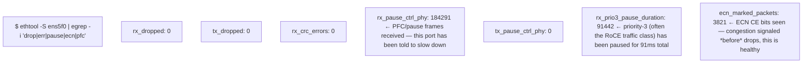
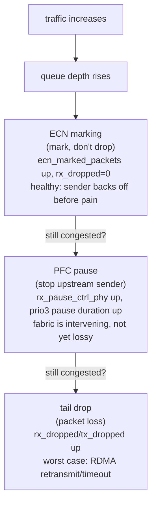
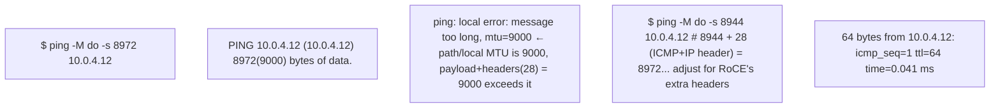
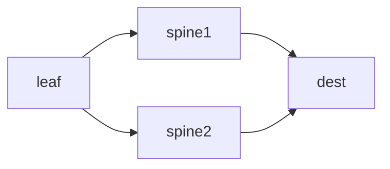

**Learning outcome:** Understand link speed, MTU, queues, loss, ECMP and congestion before learning RoCE.

High-speed Ethernet still follows familiar networking principles. Link speed is a ceiling; application throughput depends on protocol overhead, path, congestion and flow distribution. MTU mismatch can cause fragmentation or connectivity failures. ECMP can distribute flows across equal-cost paths. Queue drops and congestion can damage latency and RDMA behavior.

```
ip -s link show dev <iface>
ethtool <iface>
ethtool -S <iface> | egrep -i 'drop|err|pause|ecn|pfc'
ping -M do -s 8972 <peer> # example jumbo-frame validation; adjust for headers/environment
```

➕ **Sample `ethtool -S` output, annotated the way an interviewer wants to hear it read:**

Reading order: `rx_dropped`/`tx_dropped` at zero is not "no problem" by itself — `rx_pause_ctrl_phy` climbing and `rx_prio3_pause_duration` growing means the fabric *is* congested and PFC is actively intervening, it's just doing its job of converting drops into backpressure. The number to actually worry about is `ecn_marked_packets` *not* decreasing over time relative to traffic volume — ECN marking without corresponding drop or pause growth is the sign congestion control is working as designed. Zero everything across the board on a saturated link is the actually suspicious reading — it can mean the counters aren't wired up, not that the fabric is healthy.

➕ **Diagram: the congestion-response ladder the counters above are reading out**

Reading `ethtool -S` top-to-bottom is reading how far down this ladder the link has gone — ECN activity alone is the system working correctly; drops mean every earlier rung failed to relieve the congestion.

➕ **MTU mismatch — why "ping works" is not "MTU is correct," shown as a command sequence:**

`-M do` sets the Don't-Fragment bit — this is the entire point of the test: you want to *prove* a frame of exactly this size transits without silent fragmentation, not just get an ICMP reply. A regular unqualified `ping` (default 56-byte payload) will succeed across an MTU mismatch that later fails a 9000-byte RDMA send — this is precisely why "ping works" and "the fabric is fine for large transfers" are different claims. RoCEv2 has additional UDP/IB transport headers layered on top of the IP/Ethernet MTU budget, so the "jumbo frame is 9000, subtract standard headers" arithmetic from generic Ethernet tuning guides needs re-deriving for RoCE specifically — never copy a jumbo-MTU number from a non-RDMA tuning doc.

➕ **ECMP and AI collectives — the failure mode this chapter's mention of "ECMP can distribute flows" doesn't spell out:**

ECMP hashes on (src IP, dst IP, src port, dst port, protocol) → ONE flow always takes ONE path
A single AllReduce ring's traffic between two fixed ranks is (usually) a small number of long-lived flows — ECMP can hash them all onto the *same* spine link if the hash happens to collide, leaving other spine links idle while that one link becomes the bottleneck for the whole collective. This is fundamentally different from web traffic, where thousands of short flows average out across ECMP paths naturally. **Interview-ready line:** "ECMP load-balances flows, not bytes — a small number of fat, long-lived collective flows can defeat ECMP's statistical averaging in a way ephemeral web traffic never does, which is exactly why rail-optimized designs (Deep Dive 3) exist instead of relying on ECMP alone."

➕ **Shortcut — fast triage one-liner for "is this fabric healthy" before touching RoCE-specific tools:**
```bash
for i in $(ls /sys/class/net/ | grep -E '^(ens|eth|ib)'); do
  echo "=== $i ==="; ethtool -S "$i" 2>/dev/null | egrep -i 'drop|pause|ecn|error' | awk '$NF>0'
done
```
Anything printed by this loop is a candidate root cause before you even open `ibstat`/`rdma link` in Chapter 3 — cheap, host-local, no fabric access needed.

➕ **Worked scenario — MTU mismatch after a NIC firmware/driver upgrade:**
> **Situation:** After a routine NIC driver update on half the fleet, a subset of nodes intermittently fail to complete large RDMA writes while small control messages work fine, and `ip link show` reports the same MTU (9000) on every node.
> 1. `ip link show` matching everywhere rules out the obvious case — but it only reports *configured* MTU, not the effective *path* MTU, which can differ if an intermediate switch port or a bonded/VLAN interface silently reverted to 1500 during the upgrade.
> 2. `ping -M do -s <size>` node-pair by node-pair, sized to the actual jumbo frame in use, is the only way to prove effective path MTU — sweep sizes with a binary search (`8000, 8972, 9000...`) to find the exact breakpoint.
> 3. The breakpoint size, cross-referenced against "which nodes fail," localizes the problem to a specific switch/port/bond that the driver upgrade touched — not a generic "network is flaky" ticket.
> 4. Fix: correct the MTU on the identified hop; re-run the `ping -M do` sweep to confirm before declaring resolved — don't just restart the job and hope.
> **Conclusion:** "Configured MTU matches" and "effective path MTU matches" are different claims — this chapter's `ping -M do` command is the tool that closes that gap, and it's worth reaching for before any RDMA-specific tooling.

## Practice
➕ 1. Explain why a ping with default payload size succeeding is insufficient evidence that jumbo frames will work for RDMA traffic.
➕ 2. Given `ethtool -S` output showing `ecn_marked_packets` climbing steadily but `rx_dropped=0` and `rx_pause_ctrl_phy=0`, explain what this combination tells you about where in the congestion-response ladder (ECN vs PFC vs drop) this link currently sits, and why that's the *healthy* reading, not a red flag.
