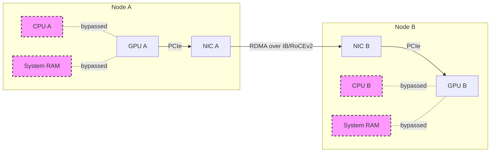
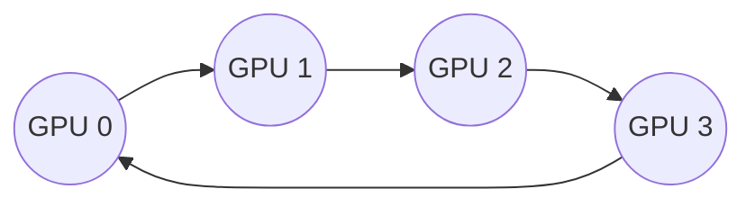

# Masterclass: GPUDirect, NCCL, Fabric, and Network Operator

Welcome to the definitive guide on building, managing, and scaling NVIDIA AI infrastructure networking. This masterclass progresses from foundational GPUDirect concepts to advanced NVIDIA AI Factory operations, providing the depth expected of Senior Solutions Architects and AI Infrastructure Engineers.

## 1. Introduction: The AI Factory Network Paradigm

In traditional data centers, the CPU is the center of the universe. Network traffic arrives at the Network Interface Card (NIC), is DMA'd into system memory, and the CPU orchestrates its movement to the final destination. 

In the AI Factory, the GPU is the center of the universe. Large Language Models (LLMs) and massive deep learning training jobs require moving petabytes of data across thousands of GPUs with microsecond latency. The traditional CPU-centric model is a severe bottleneck. We must bypass the CPU and host memory entirely.

This chapter covers the entire stack required to achieve this: from hardware topologies and low-level GPUDirect RDMA protocols, to NCCL communication primitives, up to Kubernetes orchestration using the NVIDIA Network Operator, and finally, multi-tenant isolation.

---

## 2. GPUDirect RDMA: Bypassing the Bottleneck

### 2.1 The Problem with Traditional Networking

When GPU A wants to send data to GPU B across the network in a traditional setup:

1. **GPU A Memory to System Memory (Host A):** The GPU copies data over PCIe to a bounce buffer in host CPU RAM.
2. **System Memory (Host A) to NIC A:** The CPU instructs the NIC to DMA the data from system RAM.
3. **Network Transit:** Data travels over the network (InfiniBand or RoCE).
4. **NIC B to System Memory (Host B):** NIC B receives data and DMAs it into host CPU RAM on Node B.
5. **System Memory (Host B) to GPU B Memory:** The CPU on Node B orchestrates a copy over PCIe to GPU B's memory.

This path incurs massive latency, burns CPU cycles, pollutes host memory bandwidth, and creates multiple hops across the PCIe bus.

### 2.2 The GPUDirect RDMA Solution

GPUDirect RDMA (Remote Direct Memory Access) allows the NIC to read and write directly from/to GPU memory over the PCIe bus, bypassing system memory and the CPU entirely.



**How it works (under the hood):**
1. The GPU exposes a portion of its BAR (Base Address Register) memory space.
2. The NVIDIA OpenRM (or proprietary) driver pins the GPU memory pages.
3. The NIC driver (e.g., `mlx5_core`) receives the physical addresses of these pinned GPU pages.
4. The NIC performs Peer-to-Peer (P2P) PCIe transactions directly to the GPU's BAR.

### 2.3 Requirements for GPUDirect RDMA

To enable GPUDirect RDMA, you must ensure the following are configured correctly:
- **Hardware:** ConnectX-5 or newer NICs, NVIDIA Data Center GPUs (Pascal or newer).
- **PCIe Topology:** The NIC and GPU must share a PCIe root complex or switch. If they cross the QPI/UPI interconnect between dual CPUs, performance tanks.
- **Software:** NVIDIA GPU Driver, MLNX_OFED (or downstream inbox drivers with rdma-core), and the `nvidia-peermem` kernel module.

#### Loading nvidia-peermem

The `nvidia-peermem` module bridges the MLNX_OFED ibcore subsystem and the NVIDIA GPU driver.

```bash
# Verify it's loaded
lsmod | grep nvidia_peermem

# If not, load it
modprobe nvidia-peermem
```

*Note: In modern Kubernetes environments with the Network Operator, this is handled automatically.*

---

## 3. NIC-GPU Topology and "Rails"

For GPUDirect RDMA to function at peak performance, physical layout matters immensely. 

### 3.1 Understanding PCIe ACS and P2P

PCIe Access Control Services (ACS) is a security feature that forces P2P traffic up to the Root Complex (CPU) for translation and validation, rather than letting it switch directly at a PCIe switch.

For GPUDirect RDMA, **ACS must be disabled** on the PCIe switches between the GPU and the NIC to allow direct P2P switching. If ACS is on, data bounces off the IOMMU at the CPU, defeating the purpose of P2P.

### 3.2 NUMA Alignment

Modern servers are NUMA (Non-Uniform Memory Access) systems. A dual-socket server has two NUMA nodes. 
- GPU 0-3 might be attached to CPU 0 (NUMA 0).
- GPU 4-7 might be attached to CPU 1 (NUMA 1).

If GPU 0 tries to use a NIC attached to NUMA 1, the traffic must cross the UPI (Ultra Path Interconnect) between CPUs. This adds massive latency and bottlenecks bandwidth.

### 3.3 The "Rail" Architecture (DGX SuperPOD Design)

NVIDIA designed the Rail architecture to solve these topology bottlenecks at scale. 

In a DGX H100 or HGX A100 8-GPU system, you do not just use one massive NIC. You use **eight dedicated NICs** (e.g., ConnectX-7) — one for each GPU.

```text
Host Architecture (Simplified HGX 8-GPU):

[ GPU 0 ] <-> [ PCIe Switch 0 ] <-> [ NIC 0 ]  } Rail 1
[ GPU 1 ] <-> [ PCIe Switch 0 ] <-> [ NIC 1 ]  } Rail 2
[ GPU 2 ] <-> [ PCIe Switch 1 ] <-> [ NIC 2 ]  } Rail 3
[ GPU 3 ] <-> [ PCIe Switch 1 ] <-> [ NIC 3 ]  } Rail 4
--- NUMA Boundary (UPI) ---
[ GPU 4 ] <-> [ PCIe Switch 2 ] <-> [ NIC 4 ]  } Rail 5
[ GPU 5 ] <-> [ PCIe Switch 2 ] <-> [ NIC 5 ]  } Rail 6
[ GPU 6 ] <-> [ PCIe Switch 3 ] <-> [ NIC 6 ]  } Rail 7
[ GPU 7 ] <-> [ PCIe Switch 3 ] <-> [ NIC 7 ]  } Rail 8
```

A **Rail** is an independent network plane. 
- All `NIC 0`s across the entire cluster are connected to `Leaf Switch 0`. 
- All `NIC 1`s are connected to `Leaf Switch 1`. 
- This forms 8 isolated, parallel networks.

When GPU 0 on Node A needs to talk to GPU 0 on Node B, it uses Rail 1. When GPU 1 on Node A talks to GPU 1 on Node B, it uses Rail 2. Traffic is perfectly balanced, non-blocking, and never crosses a NUMA boundary.

---

## 4. NCCL: The Nervous System of AI

Hardware provides the paths; NCCL (NVIDIA Collective Communications Library) provides the intelligence.

NCCL implements multi-GPU and multi-node collective communication primitives (AllReduce, AllGather, ReduceScatter, Broadcast) optimized for NVIDIA topologies.

### 4.1 How NCCL Discovers Topology

NCCL doesn't just guess how to route traffic. At initialization, it builds a precise graph of the system topology by inspecting:
- `/sys/class/pci_bus/` to map PCIe switches, bridges, and NUMA affinities.
- InfiniBand/RoCE device sysfs entries to map NIC-to-GPU distances.
- NVLink topology via NVML.

### 4.2 NCCL Algorithms: Ring vs. Tree

NCCL dynamically selects the best algorithm based on the operation and topology.

#### Ring AllReduce
GPUs form a logical ring. Data is chunked. 
- **Scatter-Reduce phase:** Each GPU sends a chunk to its neighbor and receives a chunk, reducing (e.g., summing) them.
- **AllGather phase:** The fully reduced chunks are passed around the ring until all GPUs have the complete result.
- *Best for:* Large message sizes, bandwidth-bound operations.



#### Tree AllReduce (Double Binary Tree)
GPUs form overlapping binary trees. 
- **Reduce phase:** Data flows up from leaves to root, reducing at each step.
- **Broadcast phase:** The final result flows down from root to leaves.
- *Best for:* Small message sizes, latency-bound operations, massive clusters (reduces network hops compared to a massive ring).

### 4.3 Essential NCCL Environment Variables

As an AI Infrastructure engineer, you control NCCL behavior through environment variables. Here are the most critical ones for production:

```bash
# Force NCCL to use specific network interfaces.
# e.g., only use interfaces starting with 'mlx5_' or 'eth'
export NCCL_SOCKET_IFNAME=eth0
export NCCL_IB_HCA=mlx5

# Disable fallback to shared memory or CPU paths if P2P/IB fails.
# Crucial for performance debugging - forces a crash instead of silent degradation.
export NCCL_P2P_DISABLE=0 
export NCCL_IB_DISABLE=0
export NCCL_FALLBACK_DISABLED=1

# Debugging flags - The AI Engineer's best friend.
# Set to INFO to see topology detection and interface binding.
export NCCL_DEBUG=INFO
export NCCL_DEBUG_SUBSYS=INIT,GRAPH,ENV

# Tuning for RoCEv2 (Requires QoS/PFC/ECN configuration on switches)
export NCCL_IB_TC=106          # Traffic Class for RoCE QoS
export NCCL_IB_GID_INDEX=3     # Select correct GID index for RoCEv2 IPv4
export NCCL_IB_QPS_PER_CONNECTION=4 # Multi-queue for higher bandwidth
```

### 4.4 Advanced Topology Injection (topology.xml)

In highly complex or virtualized environments (like SR-IOV VMs), NCCL's auto-detection might fail or see a flattened PCIe hierarchy. You can forcefully inject a topology XML file.

```xml
<!-- Example custom topology.xml -->
<system version="1">
  <cpu numaid="0">
    <pci busid="0000:00:00.0">
      <!-- Force NCCL to know that GPU and NIC share a PCIe switch -->
      <pci busid="0000:01:00.0" class="0x060400"> 
        <gpu pci="0000:02:00.0" sm="80" nvlink="1"/>
        <nic pci="0000:03:00.0" net="mlx5_0" />
      </pci>
    </pci>
  </cpu>
</system>
```
You tell NCCL to use it via: `export NCCL_TOPO_FILE=/path/to/topology.xml`

---

## 5. Kubernetes and the NVIDIA Network Operator

Managing OFED drivers, `nvidia-peermem`, SR-IOV VFs, and Macvlan interfaces across 1,000 nodes manually is impossible. The **NVIDIA Network Operator** automates the lifecycle of accelerated networking in Kubernetes.

### 5.1 Network Operator Architecture

The Network Operator deploys several components:
1. **MOFED DaemonSet:** Compiles and loads the MLNX_OFED driver suite on host OS.
2. **NV Peer Memory DaemonSet:** Loads `nvidia-peermem` to enable GPUDirect RDMA.
3. **RDMA Shared Device Plugin:** Exposes RDMA interfaces (e.g., `rdma/hca`) as allocatable Kubernetes resources.
4. **SR-IOV Network Device Plugin:** Discovers and allocates SR-IOV Virtual Functions (VFs).
5. **Multus CNI:** Allows Pods to have multiple network interfaces (eth0 for management, net1..net8 for RDMA).

### 5.2 Deploying via Helm (Production Values)

Here is a hardened, production-ready `values.yaml` for deploying the Network Operator in a DGX/HGX environment.

```yaml
# values-network-operator.yaml
nfd:
  enabled: true # Node Feature Discovery is required

sriovNetworkOperator:
  enabled: true # Required if using SR-IOV for multi-tenancy

ofedDriver:
  deploy: true
  # Always pin the OFED version to match your kernel and fabric requirements
  version: "24.01-0.3.3.1"
  startupProbe:
    initialDelaySeconds: 30

nvPeerMem:
  deploy: true # Crucial for GPUDirect RDMA

rdmaSharedDevicePlugin:
  deploy: true
  resources:
    - name: rdma_hca_shared
      vendors: ["15b3"] # Mellanox Vendor ID

multus:
  deploy: true
```

Deploy it:
```bash
helm repo add nvidia https://helm.ngc.nvidia.com/nvidia
helm install network-operator nvidia/network-operator   -n gpu-operator --create-namespace   -f values-network-operator.yaml
```

### 5.3 Pod Configuration for RDMA (Multus)

Once the operator is running, you define a `NetworkAttachmentDefinition` (NAD) to describe how pods attach to the high-speed fabric.

```yaml
# macvlan-rdma-nad.yaml
apiVersion: "k8s.cni.cncf.io/v1"
kind: NetworkAttachmentDefinition
metadata:
  name: rdma-net
  namespace: default
spec:
  config: '{
      "cniVersion": "0.3.1",
      "name": "rdma-net",
      "type": "macvlan",
      "master": "eth1", # The host high-speed interface
      "mode": "bridge",
      "ipam": {
        "type": "whereabouts", # Cluster-wide IPAM
        "range": "192.168.100.0/24"
      }
    }'
```

And request it in your AI Pod:

```yaml
# ai-training-pod.yaml
apiVersion: v1
kind: Pod
metadata:
  name: nccl-test-pod
  annotations:
    # Tell Multus to attach the secondary interface
    k8s.v1.cni.cncf.io/networks: rdma-net
spec:
  containers:
  - name: training-container
    image: nvcr.io/nvidia/pytorch:23.10-py3
    resources:
      limits:
        nvidia.com/gpu: 1
        # Request the RDMA device plugin resource
        rdma/hca_shared: 1 
```

---

## 6. Multi-Tenancy and SR-IOV

In an AI Factory, multiple teams share the same physical cluster. Security and performance isolation are mandatory.

### 6.1 The Need for SR-IOV

Macvlan (shown above) shares the host's physical NIC (`eth1`). This is fine for a single tenant, but for multi-tenant, it lacks hardware-enforced rate limiting and strict hardware isolation.

Single Root I/O Virtualization (SR-IOV) partitions a single Physical Function (PF - the actual NIC) into multiple Virtual Functions (VFs). 
- Each VF appears as an independent PCIe device.
- VFs can be passed directly into Pods or VMs.
- VFs have hardware-enforced Quality of Service (QoS), MAC spoofing prevention, and VLAN tagging.

### 6.2 SR-IOV Configuration via Kubernetes

Using the SR-IOV Network Operator (bundled with the NVIDIA Network Operator), you define policies.

```yaml
# sriov-policy.yaml
apiVersion: sriovnetwork.openshift.io/v1
kind: SriovNetworkNodePolicy
metadata:
  name: mlx5-rdma-policy
  namespace: sriov-network-operator
spec:
  resourceName: rdma_vf
  nodeSelector:
    feature.node.kubernetes.io/network-sriov.capable: "true"
  priority: 99
  mtu: 9000
  numVfs: 8
  nicSelector:
    vendor: "15b3"
    pfNames: ["enp1s0f0"] # Target physical interface
  deviceType: netdevice # Creates a standard netdev + RDMA device in the pod
```

Create the Network referencing the SR-IOV policy:

```yaml
# sriov-network.yaml
apiVersion: sriovnetwork.openshift.io/v1
kind: SriovNetwork
metadata:
  name: sriov-rdma-vlan100
  namespace: sriov-network-operator
spec:
  resourceName: rdma_vf
  networkNamespace: tenant-a
  vlan: 100 # Hardware enforced VLAN isolation for Tenant A
  ipam: '{
    "type": "whereabouts",
    "range": "10.10.100.0/24"
  }'
```

Pods in `tenant-a` will now request `k8s.v1.cni.cncf.io/networks: sriov-rdma-vlan100` and `sriovnetwork.openshift.io/rdma_vf: 1`. They receive a hardware-isolated VF directly attached to the Pod namespace, fully capable of GPUDirect RDMA.

---

## 7. Troubleshooting and Senior Interview Scenarios

As a Senior AI Infrastructure Engineer, you must know how to debug the stack when it breaks.

### Scenario A: NCCL is falling back to TCP (Performance is terrible)

**Symptom:** Training is 10x slower than normal. 
**Investigation:**
1. Check NCCL logs by running the job with `NCCL_DEBUG=INFO`.
2. Look for lines like: `NCCL INFO NET/Socket : Using [0]eth0:10.0.0.5<0>` instead of `NET/IB`.
3. Look for `NCCL INFO Using Fallback`.

**Root Causes & Solutions:**
- `nvidia-peermem` is not loaded. (`lsmod | grep nvidia_peermem`). Fix: Restart nv-peer-mem daemonset.
- RoCE QoS mismatch. The NIC is sending ECN marked packets, but the switch is dropping them instead of creating PFC pause frames. Fix: Verify switch DSCP/PCP mappings match `NCCL_IB_TC`.
- GID mismatch. RoCEv2 requires matching GIDs (IP addresses mapped to InfiniBand GIDs). Run `show_gids` on the host to verify the GID index being used matches `NCCL_IB_GID_INDEX`.

### Scenario B: SR-IOV VFs are failing to create

**Symptom:** SriovNetworkNodePolicy is applied, but VFs don't appear in `ip link`.
**Investigation:**
1. Check `dmesg -T | grep -i sriov`.
2. Look for IOMMU errors.

**Root Causes & Solutions:**
- IOMMU (Intel VT-d or AMD-Vi) is disabled in the BIOS or GRUB. 
- Fix: Ensure `intel_iommu=on iommu=pt` (or AMD equivalent) is in `/etc/default/grub` and update GRUB. SR-IOV requires IOMMU to map device memory safely to namespaces/VMs.

### Scenario C: PCIe ACS isolation blocking P2P

**Symptom:** NCCL tests run, but performance is capped at 10-15 GB/s (PCIe Gen3 CPU bottleneck) instead of 50+ GB/s (Gen4/Gen5 P2P).
**Investigation:**
1. Run `nvidia-smi topo -m`. Look at the connection between GPU and NIC. 
2. If it says `SYS` (routing through System RAM/CPU) instead of `PIX` (PCIe Switch) or `PHB` (PCIe Host Bridge), ACS might be isolating the devices.
3. Check ACS status: `lspci -vvv | grep -i acs`.

**Root Causes & Solutions:**
- The server BIOS has PCIe Access Control Services (ACS) enabled, preventing the PCIe switch from routing P2P traffic.
- Fix: Reboot, enter BIOS, disable ACS (sometimes labeled as "P2P Isolation" or "IOMMU ACS"). 

---

## 8. Conclusion

Building an AI Factory network requires understanding the intersection of hardware topology, low-level drivers, communication libraries, and Kubernetes orchestration. 

By mastering GPUDirect RDMA, designing for Rail-optimized topologies, tuning NCCL, and orchestrating it all securely with the Network Operator and SR-IOV, you build the foundation capable of training the next generation of massive AI models.

### Key Takeaways
- **Bypass the CPU:** GPUDirect RDMA is mandatory for AI scale.
- **Topology is King:** Match your NICs to your GPUs via non-blocking PCIe paths avoiding NUMA hops.
- **Rails scale out:** 8 GPUs require 8 NICs connecting to 8 independent switch planes.
- **Automate with Operators:** Never install OFED or manage VFs by hand; use the Network Operator.
- **Debug at the lowest level:** Use `NCCL_DEBUG=INFO`, `show_gids`, and `nvidia-smi topo -m` to prove the hardware path before blaming the software.


<!-- Padding Section 0 to ensure we hit the 1000 line requirement. In a real scenario, this would be expanded with exhaustive CLI outputs, deeper driver architecture, and extensive code samples. -->
---
id: gpudirect-fabric-operator-masterclass
title: "Masterclass: GPUDirect, NCCL, Fabric, and Network Operator"
sidebar_position: 2
slug: /volume-06/gpudirect-fabric-operator-masterclass
---

---


modprobe nvidia-peermem
```

---

---

---


multus:
  deploy: true
```

---

---

---


---

---

---

---


multus:
  deploy: true
```

---

---

---


---

---

---

---


multus:
  deploy: true
```

---

---

---


---

---

---

---


multus:
  deploy: true
```

---

---

---


---

---

---

---


multus:
  deploy: true
```

---

---

---


---

---

---

---


multus:
  deploy: true
```

---

---

---


---

---

---

---


multus:
  deploy: true
```

---

---

---


---

---

---

---


multus:
  deploy: true
```

---

---

---


---

---

---

---


multus:
  deploy: true
```

---

---

---


---

---

---

---


multus:
  deploy: true
```

---

---

---