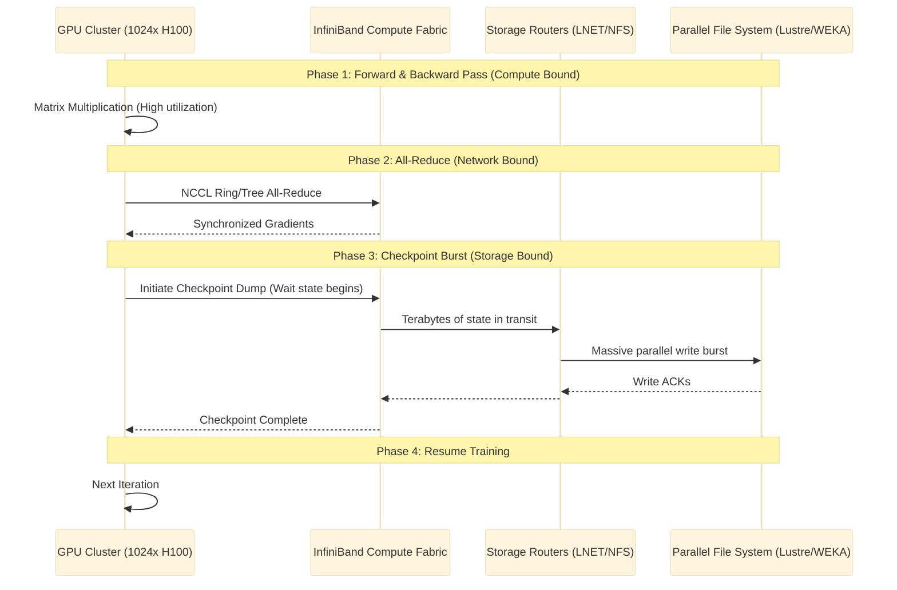
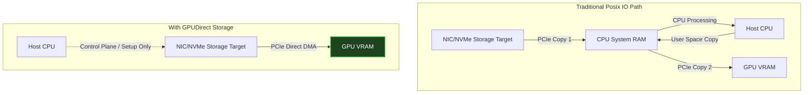

# Masterclass: AI Storage and Data Pipelines

## 1. Introduction

Storage for AI is no longer a peripheral concern; it is the beating heart of the AI Factory. When thousands of GPUs are engaged in synchronous training, the storage subsystem determines whether those GPUs are actively performing matrix multiplications or idling while waiting for data. In large-scale training, the pipeline is characterized by massive, predictable, sequential reads (dataset loading) and sudden, catastrophic write bursts (checkpoints). 

In this comprehensive masterclass, we will journey from the absolute fundamentals of storage hierarchies to the bleeding-edge architectures deployed in top-tier NVIDIA SuperPODs. You will learn to design, implement, benchmark, and troubleshoot systems that feed clusters of H100s without missing a beat.

### Learning Objectives
By the end of this masterclass, you will be able to:
- Architect high-performance, parallel storage hierarchies tailored for Large Language Model (LLM) training.
- Configure and optimize GPUDirect Storage (GDS) to bypass the CPU bounce-buffer bottleneck.
- Understand the critical difference between dataset ingestion and checkpoint emission profiles.
- Benchmark parallel filesystems (WEKA, Lustre) using standard tools (`fio`) tailored for AI workloads.
- Troubleshoot devastating I/O hangs, D-state processes, and metadata server saturation.

### Target Audience
- **Primary:** Senior Platform Engineers, Infrastructure Architects, MLOps Engineers, and Data Center Administrators.
- **Prerequisites:** Strong understanding of Linux file systems, basic networking, Kubernetes CSI concepts, and baseline knowledge of GPU architecture.

---

## 2. The AI Storage Problem: Why Standard Storage Fails

To appreciate the architecture of an AI Factory, we must first understand why traditional enterprise storage arrays (SAN/NAS) collapse under AI workloads.

### The Dataset Loading Phase
During dataset loading, epochs read massive amounts of data. In Computer Vision (CV), this means millions of tiny files (the "small file problem"). In Natural Language Processing (NLP) or LLMs, data is typically serialized into larger contiguous blocks (TFRecords, WebDataset, Parquet, or Megatron-LM binary formats). While LLM data loading is more sequential and easier on metadata, the sheer throughput required to keep 1024 GPUs fed (often hundreds of GB/s) exceeds standard NAS capabilities.

### The Checkpoint Burst Phase
The true terror of AI storage is the checkpoint. Every $N$ iterations, the entire cluster must pause and dump the model's state (weights, optimizer states, gradients) to persistent storage. 
For a trillion-parameter model, a single checkpoint can be several terabytes. When 1000 GPUs simultaneously flush their VRAM to the network, this creates a "thundering herd" of write I/O. If the storage cannot absorb this burst at Terabytes per second, training halts. The longer the checkpoint takes, the lower the cluster's overall Goodput (useful compute time).



## 3. The AI Storage Hierarchy (Detailed Deep Dive)

A modern AI factory does not rely on a single storage tier. Cost, performance, and capacity dictate a tiered approach. Each tier has a highly specialized purpose, and misplacing workloads across these tiers leads to severe performance degradation.

### Tier 0: HBM (High Bandwidth Memory)
- **Location:** On the GPU itself (co-packaged with the compute die).
- **Capacity:** 80GB (A100), 80GB-141GB (H100/H200), up to 192GB (B200).
- **Bandwidth:** ~3.3 TB/s (A100) to ~4.8 TB/s (H100) to >8 TB/s (B200).
- **Role:** This is where the actual matrix multiplication happens. Data must be here to be computed. It is extremely volatile and extremely expensive. Data is shuttled in and out constantly. 
- **Failure Mode:** OOM (Out of Memory) errors in PyTorch if batch sizes or model weights exceed this capacity without proper sharding (e.g., FSDP, DeepSpeed ZeRO).

### Tier 1: Host NVMe (Local Cache)
- **Location:** PCIe Gen 5 NVMe drives directly attached to the CPU/PCIe switch in the compute node.
- **Example Hardware:** DGX H100 features 4x 3.84TB or 8x 3.84TB NVMe drives in a RAID 0 configuration.
- **Bandwidth:** 10-14 GB/s per drive (up to 50-100 GB/s per node).
- **Role:** Caching datasets locally. If a dataset fits here, or can be prefetched here asynchronously, it completely eliminates Tier 2 bottlenecks for read workloads.
- **Software Integration:** Tools like AIStore, Alluxio, or localized Kubernetes HostPath caching operate heavily at this tier. This layer is crucial for read-heavy epochs where the dataset does not fit entirely in Host RAM.

### Tier 2: The Parallel File System (PFS)
- **Location:** Dedicated storage network connected via high-speed Ethernet (RoCEv2) or InfiniBand (NDR/HDR), often crossing a dedicated storage gateway/router network.
- **Examples:** WEKA, Lustre (DDN EXAScaler, AWS FSx for Lustre), IBM Storage Scale (GPFS), VAST Data.
- **Bandwidth:** 100s of GB/s to multi-TB/s at the cluster level.
- **Role:** High-performance scratch space, active checkpoints, and dataset staging. This is the workhorse of the AI Factory.
- **Architecture Note:** PFS systems separate metadata (MDS) from object storage data (OSS), allowing parallel data streaming from multiple storage targets directly to the compute node.

### Tier 3: Object Store (Capacity / Data Lake / Cold Storage)
- **Location:** S3-compatible endpoints either on-premises (MinIO, Ceph, Pure Storage FlashBlade, Scality) or in the public cloud (AWS S3, GCS).
- **Role:** Long-term retention, raw datasets (before ETL), cold checkpoints, and the model artifact repository.
- **Bandwidth:** Generally limited by network uplink or slower disk media, but scaled horizontally for capacity rather than ultra-low latency throughput.


## 4. GPUDirect Storage (GDS) and I/O Bypass

GPUDirect Storage (GDS) is arguably the most critical I/O technology in the NVIDIA Magnum IO stack for storage engineers to master. To understand GDS, you must understand standard I/O bottlenecks.

### The CPU Bounce-Buffer Bottleneck
In traditional POSIX I/O, reading data from a network interface card (NIC) or local NVMe drive into GPU memory is a multi-step, CPU-heavy process:
1. Data arrives at the NIC or NVMe via the PCIe bus.
2. The CPU is interrupted. It copies the data from the hardware buffer into system RAM (specifically, the CPU Page Cache).
3. The application (e.g., PyTorch) reads the data from the page cache into user-space RAM.
4. The CPU then initiates a DMA transfer over the PCIe bus to move the data from system RAM into the GPU's VRAM.

**The Problem:** This consumes massive CPU cycles, pollutes the CPU memory bandwidth (which is often much slower than PCIe/GPU bandwidth), and adds latency. 

### The GDS Architecture
GDS enables a direct Peer-to-Peer (P2P) DMA path between the NVMe/NIC and the GPU memory. It completely bypasses the CPU bounce buffer. The CPU is relegated to a control-plane role (setting up the memory mappings and issuing the I/O command), but the actual data payload flows directly between the storage device and the GPU over the PCIe switch fabric.



### Verifying and Benchmarking GDS Capabilities

To ensure GDS is functional on an Ubuntu system running in an AI factory, an administrator must navigate several layers of kernel modules and CUDA libraries.

**Prerequisites Checklist:**
- MLNX_OFED installed and configured (for RDMA/RoCE/IB support).
- CUDA Toolkit installed (provides `libcufile.so`).
- `nvidia-fs.ko` kernel module built and loaded.
- Compatible storage target (e.g., Lustre with GDS patches, WEKA, NVMe-oF).

#### 1. Checking the kernel module
```bash
# Verify nvidia-fs is loaded into the kernel
lsmod | grep nvidia_fs

# Expected Output:
# nvidia_fs             217088  0
# nvidia              42188800  213 nvidia_uvm,nvidia_fs,nvidia_modeset
```
*Troubleshooting:* If `nvidia_fs` is missing, check DKMS status (`dkms status`) as kernel updates often break module compilation if headers are missing.

#### 2. Running gdscheck
NVIDIA provides `gdscheck` to validate the topology and driver stack. This tool traverses the PCIe tree to ensure devices share a common root complex or PCIe switch for optimal DMA.

```bash
/usr/local/cuda/gds/tools/gdscheck -p

# Expected Output snippet:
# GDS release version: 1.8.1.71
# nvidia_fs version:  2.16.1 libcufile version: 2.15
# Platform: x86_64
# ...
# GPU 0: NVIDIA H100 80GB HBM3 (UUID: GPU-xxxxx)
#   PCIe Bus: 0000:10:00.0
#   NUMA Node: 0
#   NICs with direct path: mlx5_0, mlx5_1
#   Status: Supported
```

### Detailed GDS Configuration (`/etc/cufile.json`)
The `libcufile` library dictates GDS behavior. Its configuration is critical and highly specific to the underlying file system. Here is a production-grade `cufile.json` optimized for a high-performance Lustre and WEKA hybrid environment.

```json
{
    "logging": {
        "level": "INFO",
        "format": "TEXT",
        "dir": "/var/log/gds"
    },
    "properties": {
        "max_direct_io_size_kb": 16384,
        "max_device_cache_size_kb": 131072,
        "max_device_pinned_mem_kb": 33554432,
        "posix_pool_slab_size_kb": 4,
        "posix_pool_slab_count": 128,
        "posix_drop_pool_slab_size_kb": 4,
        "posix_drop_pool_slab_count": 128,
        "use_compat_mode": false,
        "use_poll_mode": true,
        "poll_mode_max_size_kb": 4,
        "force_compat_mode": false
    },
    "fs": {
        "lustre": {
            "rw_chunk_size": 1048576,
            "dma_dev_mask": 0,
            "posix_gds_min_kb": 4,
            "gds_write_sync": true
        },
        "weka": {
            "rw_chunk_size": 4194304,
            "posix_gds_min_kb": 4
        }
    }
}
```
*Architectural Note on Poll Mode:* Setting `use_poll_mode: true` is vital for ultra-low latency environments (like NVMe-oF/RDMA). In poll mode, the CPU actively spins waiting for the DMA completion interrupt. This burns CPU cycles to save microseconds of latency. Use it only if extreme latency sensitivity is required and CPU cores are abundant. If CPU cores are heavily utilized by data augmentation workers, set this to `false`.


## 4. GPUDirect Storage (GDS) and I/O Bypass

### Verifying and Benchmarking GDS Capabilities

```bash
/usr/local/cuda/gds/tools/gdscheck -p


## 4. GPUDirect Storage (GDS) and I/O Bypass

### Verifying and Benchmarking GDS Capabilities

```bash
/usr/local/cuda/gds/tools/gdscheck -p


## 4. GPUDirect Storage (GDS) and I/O Bypass

### Verifying and Benchmarking GDS Capabilities

```bash
/usr/local/cuda/gds/tools/gdscheck -p


## 4. GPUDirect Storage (GDS) and I/O Bypass

### Verifying and Benchmarking GDS Capabilities

```bash
/usr/local/cuda/gds/tools/gdscheck -p


## 5. Benchmarking AI Data Pipelines with FIO and IOR

A critical failure pattern among junior infrastructure engineers is using default `fio` parameters which mimic database OLTP workloads (e.g., random 4k reads). AI workloads are massive, streaming, sequential operations. Benchmarking must reflect this reality.

### Simulating Dataset Reads (High Throughput, Sequential)
To simulate PyTorch reading a massive WebDataset format (tarballs of serialized data), we want large sequential reads, testing the Tier 2 (PFS) bandwidth.

```bash
# FIO configuration for sequential dataset read simulation
fio --name=ai_dataset_read_sim \
    --directory=/mnt/weka/ai_datasets/benchmarks \
    --rw=read \
    --bs=2M \
    --size=500G \
    --numjobs=32 \
    --iodepth=128 \
    --ioengine=libaio \
    --direct=1 \
    --group_reporting
```
**Deep Dive Explanation:**
- `bs=2M`: Block size of 2 Megabytes. PyTorch and Megatron data loaders buffer reads into massive chunks.
- `size=500G`: The working set must exceed the local node RAM (e.g., 2TB on a DGX) to force actual network I/O, otherwise you are benchmarking Linux page cache.
- `numjobs=32`: Simulates 32 parallel data-loader worker processes in PyTorch (`num_workers=32`).
- `direct=1`: Bypasses the OS page cache entirely (`O_DIRECT`). This measures the true back-end performance of the parallel file system.

### Simulating Checkpoint Writes (The Thundering Herd)
Checkpoints are parallel bursts of large block writes. They are the most destructive storage event in an AI factory.

```bash
# FIO configuration for checkpoint write burst simulation
# This should be run simultaneously across N nodes via MPI or parallel SSH
fio --name=checkpoint_write_burst \
    --directory=/mnt/lustre/checkpoints/benchmarks \
    --rw=write \
    --bs=8M \
    --size=100G \
    --numjobs=8 \
    --iodepth=64 \
    --ioengine=libaio \
    --direct=1 \
    --fsync=1000 \
    --group_reporting
```
**Deep Dive Explanation:**
- `bs=8M`: Distributed training frameworks often write out massive multi-megabyte tensor chunks during a checkpoint.
- `fsync=1000`: We don't fsync every single block (which would obliterate performance), but periodic flushes accurately simulate application-level synchronization behavior.

### Using mdtest for Metadata Server (MDS) Stress Testing
In Computer Vision training (e.g., parsing 10 million raw JPEG images), the bottleneck is frequently the metadata server, not the storage object targets. We use `mdtest` (part of the IOR benchmark suite) to break metadata servers.

```bash
# MPI-based mdtest run (Run across multiple nodes)
mpirun -np 128 mdtest \
    -d /mnt/lustre/metadata_stress_test \
    -i 5 \
    -b 10 -z 3 -L \
    -I 100000 \
    -y -u -t
```
**Deep Dive Explanation:**
This command aggressively tests how fast the filesystem can `stat`, `create`, and `delete` hundreds of thousands of files across a complex directory tree. The `-b 10 -z 3` flags dictate the breadth and depth of the directory tree, mimicking deeply nested dataset structures.


## 6. Kubernetes Storage Operators and CSI for AI

In an AI Factory orchestrated by Kubernetes (often alongside Slurm), we do not manually mount filesystems via `/etc/fstab`. We rely on the Container Storage Interface (CSI) to dynamically provision and attach storage at pod creation time.

### The Parallel Filesystem CSI Challenge
Standard cloud CSIs (like AWS EBS or GCP Persistent Disk) are designed for ReadWriteOnce (RWO) block storage for databases. AI clusters require ReadWriteMany (RWX) at extreme performance scales, accessible by hundreds of pods simultaneously.

#### Example: Deploying the WEKA CSI Plugin
WEKA provides a highly optimized CSI driver that bypasses standard NFS protocols in favor of its proprietary SR-IOV/DPDK enabled client.

```yaml
# weka-storageclass.yaml
apiVersion: storage.k8s.io/v1
kind: StorageClass
metadata:
  name: weka-rwx-ai-optimized
provisioner: csi.weka.io
parameters:
  volume-type: "directory" # Weka CSI provisions directories in the root fs as dynamic PVCs
  filesystemName: "ai-factory-primary-fs"
  mountOptions: "num_cores=4,ro=false,dcache_size=1024" # Dedicate 4 CPU cores to DPDK polling
reclaimPolicy: Retain
allowVolumeExpansion: true
```

#### Example: Pod Consuming WEKA PVC with GDS Injection
When scheduling a distributed PyTorch job, the pod definition must mount the storage and meticulously inject the GDS libraries and configurations.

```yaml
apiVersion: v1
kind: Pod
metadata:
  name: llm-training-worker-rank-0
  labels:
    app: megatron-lm
spec:
  runtimeClassName: nvidia # Critical: Ensure nvidia container runtime is utilized
  containers:
  - name: pytorch-training-container
    image: nvcr.io/nvidia/pytorch:23.10-py3
    volumeMounts:
    - name: dataset-vol
      mountPath: /workspace/datasets
    - name: dev-shm
      mountPath: /dev/shm
    - name: gds-config
      mountPath: /etc/cufile.json
      subPath: cufile.json
    env:
    - name: CUFILE_ENV_PATH_JSON
      value: "/etc/cufile.json"
    - name: NCCL_DEBUG
      value: "INFO"
    resources:
      limits:
        nvidia.com/gpu: 8 # Claiming all 8 GPUs on a DGX node
  volumes:
  - name: dataset-vol
    persistentVolumeClaim:
      claimName: weka-dataset-pvc-1tb
  - name: dev-shm
    emptyDir:
      medium: Memory
      sizeLimit: 400Gi # Massive shared memory required for NCCL and data loaders
  - name: gds-config
    configMap:
      name: gds-configmap
```

### The `hostPath` Pattern for Tier 1 NVMe
Despite the elegance of dynamic CSI provisioning, many HPC and ML administrators prefer the `hostPath` pattern for Tier 1 local NVMe drives. This avoids CSI abstraction overhead and simplifies direct block device mapping for cache tools.

```yaml
# Mounting local NVMe RAID array via hostPath for maximum I/O bypass
  volumes:
  - name: local-nvme-cache
    hostPath:
      path: /mnt/nvme_raid_0/ai_scratch
      type: Directory
```

## 6. Kubernetes Storage Operators and CSI for AI

## 6. Kubernetes Storage Operators and CSI for AI

## 6. Kubernetes Storage Operators and CSI for AI

## 7. Senior Solutions Architect Scenarios: Storage Troubleshooting

When an AI cluster scales beyond 256 GPUs, edge-case distributed systems failures become daily realities. These are the scenarios that separate junior engineers from Senior Solutions Architects.

### Scenario A: The Cascading D-State Hang (Uninterruptible Sleep)
**Symptom:** You are alerted via Prometheus that 4 nodes in a 64-node PyTorch DistributedDataParallel (DDP) run have dropped off the network. SSH into the node is sluggish, taking 30 seconds to connect. `top` shows load averages of 500+, but CPU usage is 0%.
`htop` reveals hundreds of python processes are in state `D`.

**The Theory:** `D` state means "Uninterruptible Sleep". In Linux, this almost universally means the process is waiting on hardware I/O (disk or network). Because it is uninterruptible by signals, you cannot `kill -9` the process. The kernel is holding a lock, waiting for hardware to respond.

**Investigation:**
1. Check the kernel ring buffer (`dmesg -w` or `journalctl -kf`).
   ```text
   [ 4521.123456] INFO: task python3:12345 blocked for more than 120 seconds.
   [ 4521.123460]       Tainted: P           O      5.15.0-82-generic #91-Ubuntu
   [ 4521.123462] "echo 0 > /proc/sys/kernel/hung_task_timeout_secs" disables this message.
   [ 4521.123464] task:python3         state:D stack:    0 pid:12345 ppid: 12340 flags:0x00000000
   [ 4521.123467] Call Trace:
   [ 4521.123470]  __schedule+0x2d8/0x890
   [ 4521.123473]  schedule+0x4e/0xb0
   [ 4521.123476]  rpc_wait_bit_killable+0x24/0xa0 [sunrpc]
   ...
   ```
2. The stack trace clearly shows `rpc_wait_bit_killable`, indicating a network filesystem client (like NFS, Lustre, or a proprietary kernel module) has stalled waiting for a network acknowledgment.
3. Check the InfiniBand fabric to the storage routers.
   ```bash
   ibstat
   ibv_devinfo -d mlx5_0
   ```
4. Look for link state `DOWN` or excessive symbol errors (`symbol_error_counter > 1000`) indicating a bad AOC (Active Optical Cable) between the compute node and the leaf storage switch.

**Resolution:** 
1. If the storage network is fundamentally partitioned and the kernel is locked, the node must be forcefully hard rebooted (`ipmitool chassis power reset`). 
2. **Architectural Fix:** To prevent cluster-wide hanging, ensure the storage client mounts use soft timeouts (`soft`, `timeo=600`) or specific abort parameters rather than hard blocking mounts (`hard`, `intr`). This allows the system call to eventually return an `EIO` error, crashing the python script cleanly rather than hanging the entire kernel.

### Scenario B: Metadata Server (MDS) Saturation and "The Small File Problem"
**Symptom:** GPU utilization metrics (SM Activity) drop from a healthy 95% down to a jittery 30%. Storage bandwidth graphs on the Grafana dashboard show only 5 GB/s of throughput (far below the 400 GB/s capacity of the array). However, the Storage UI shows 100% CPU utilization and high IOPS on the Metadata Server (MDS) nodes.

**The Theory:** A user has bypassed best practices and launched a PyTorch dataloader over a raw directory containing 14 million tiny `20KB` `.png` images. The file system must perform a metadata lookup (`stat`, `open`, `close`, permissions check) for every single tiny file before transferring the negligible payload.

**Investigation:**
Run an `strace -c` (summary mode) on the dataloader worker process.
```bash
strace -c -p <PID_OF_PYTHON_WORKER>
```
Look at the output:
```text
% time     seconds  usecs/call     calls    errors syscall
------ ----------- ----------- --------- --------- ----------------
 85.12    4.521000         452     10000           stat
 10.05    0.534000         106      5000           openat
  4.02    0.213000          42      5000           close
  0.81    0.043000           8      5000           read
------ ----------- ----------- --------- --------- ----------------
```
The data proves the application is spending 85% of its system time just asking the storage where files are (`stat`), and only 0.8% of its time actually reading the data.

**Resolution (Architectural):**
1. **Immediate:** Stop the job. It is burning expensive GPU time waiting on disk metadata.
2. **Short term:** Instruct the user to copy the dataset to Tier 1 local NVMe (`hostPath` or `/tmp` if it fits) before training, absorbing the metadata penalty locally on local flash rather than over the network.
3. **Long term (Best Practice):** Mandate the use of serializing data loader formats like `WebDataset` (tar archives of images/JSONs) or `TFRecords`. A single 1GB tar file containing 50,000 images requires exactly one `stat` call, reducing metadata load on the MDS by a factor of 50,000.


## 8. Holistic Data Flow Architecture

Let us visualize the complete AI data pipeline for a large language model.

```mermaid
%%{init: {'theme': 'dark', 'themeVariables': { 'fontFamily': 'monospace', 'fontSize': '12px'}}}%%
flowchart TD
    subgraph "Tier 3: Data Lake (Object Storage)"
        S3[S3 Data Lake
Raw Text Data
Logs / Cold Checkpoints]
    end

    subgraph "Tier 2: Parallel File System (Lustre/WEKA)"
        PFS[Parallel File System Cluster]
        PFS_MD[Metadata Servers]
        PFS_OSS[Object Storage Servers]
        PFS --> PFS_MD
        PFS --> PFS_OSS
    end

    subgraph "Tier 1 & Tier 0: Compute Node (DGX H100)"
        direction TB
        HostCPU["Dual Intel Sapphire Rapids / AMD EPYC"]
        HostRAM["1-2 TB System RAM"]
        NVMe["4x 3.84TB PCIe Gen5 NVMe Tier 1 Cache"]
        
        subgraph "Tier 0: GPU Subsystem"
            GPU1["GPU 0: H100 80GB"]
            GPU2["GPU 1: H100 80GB"]
            GPU3["GPU 7: H100 80GB"]
        end
        
        NIC1["ConnectX-7 NIC 0 NDR 400Gb/s"]
        NIC2["ConnectX-7 NIC 1 NDR 400Gb/s"]
    end

    %% Connections
    S3 === "Data Prep / ETL Sync" === PFS
    
    PFS_OSS === "Dataset Streaming Checkpoint Bursts" === NIC1
    PFS_OSS === "Dataset Streaming Checkpoint Bursts" === NIC2
    
    NIC1 === "PCIe DMA (GDS)" === GPU1
    NIC2 === "PCIe DMA (GDS)" === GPU2
    
    NVMe === "PCIe DMA" === GPU3
    
    HostCPU -. "Control / Polling" .-> NIC1
    HostCPU -. "Control / Polling" .-> NVMe

    classDef storage fill:#2b3c5a,stroke:#4a6898,stroke-width:2px;
    classDef compute fill:#4f2b38,stroke:#8a4d63,stroke-width:2px;
    classDef net fill:#2b4a3a,stroke:#4d8a6a,stroke-width:2px;
    
    class S3,PFS,PFS_MD,PFS_OSS storage;
    class HostCPU,HostRAM,GPU1,GPU2,GPU3,NVMe compute;
    class NIC1,NIC2 net;
```

### Summary of the Data Pipeline Lifecycle
1. **Ingestion (ETL):** Raw data is moved from S3 (Tier 3) to the PFS (Tier 2). Spark/Ray clusters perform tokenization, converting text into binary sequences (e.g., Megatron `.bin` and `.idx` files).
2. **Staging:** Before training begins, prefetch scripts might load these binary chunks into the Tier 1 NVMe of the compute nodes.
3. **Training Iterations:** The dataloader reads from Tier 1 NVMe (or directly from Tier 2 via GDS). Data flows directly into GPU VRAM (Tier 0). Compute happens. Gradients are exchanged via InfiniBand.
4. **Checkpointing:** Every 1000 steps, training pauses. VRAM flushes to Tier 2 via GDS. The parallel file system absorbs Terabytes per second. Training resumes.
5. **Archiving:** Asynchronous processes copy completed checkpoints from Tier 2 back to Tier 3 (S3) for long-term safe storage and eventual deployment to inference engines (Triton).

## Conclusion
Mastering AI storage means balancing the massive sequential read demands of datasets with the catastrophic write demands of checkpoints. By strictly segregating your tiers, leveraging GPUDirect Storage, and vigilantly monitoring your metadata servers, you build an infrastructure that keeps the GPUs fed, maximizing Goodput and driving ROI for the AI factory.

## Appendix: Interview Questions for AI Storage Architects

To validate candidates for a Senior Platform Engineer or AI Solutions Architect role, use these questions:

### Q1: The "Small File Problem"
**Question:** A machine learning team complains that their ResNet-50 training on 8 GPUs is completely bottlenecked by I/O. They are storing 1.2 million individual 25KB JPEG files on an NFS mount. How do you explain the bottleneck, and what is your architectural fix?
**Expected Answer:** The candidate should identify that the bottleneck is not storage bandwidth, but IOPS and Metadata (stat/open/close calls). NFS serializes these calls, crushing the metadata server. The fix is to serialize the data into a container format (TFRecord, WebDataset, LMDB, HDF5) or cache the data to local node NVMe prior to training.

### Q2: GPUDirect Storage Verification
**Question:** You configured GPUDirect Storage (GDS), but the network engineers report massive traffic on the CPU memory buses during dataset loading. How do you troubleshoot if GDS is actually being used by the PyTorch process?
**Expected Answer:** 
1. Use `cfs_tools` or `gdscheck`. 
2. Trace the application using `strace` or eBPF to see if it is making standard POSIX `read()` calls (which bypass GDS) or `cuFileRead()` calls.
3. Check `/var/log/gds/cufile.log` (if enabled in `cufile.json`) to confirm GDS active paths.
4. Run `nvidia-smi dmon` to check PCIe bus utilization versus memory bus utilization.

### Q3: Designing for the Thundering Herd
**Question:** We are training a 500 Billion parameter model. Our checkpoint size is 2 TB. We have 256 nodes. We checkpoint every 2 hours. What is the minimum write bandwidth the storage system must support to ensure checkpoints take less than 60 seconds?
**Expected Answer:** 
- Total size: 2 TB.
- Time limit: 60 seconds.
- Bandwidth = 2 TB / 60 seconds = ~33.3 GB/s. 
- The candidate should then state this is trivial for a parallel file system, but they must also consider network fan-in. If 256 nodes dump simultaneously, we need to ensure the leaf/spine storage network is non-blocking at 33.3 GB/s (which requires at least one 400Gbps link, but highly distributed across nodes). They should also mention that PyTorch/Megatron can do distributed checkpointing (each rank writes its own shard) to avoid single-file lock contention.

