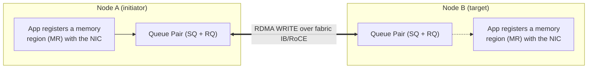
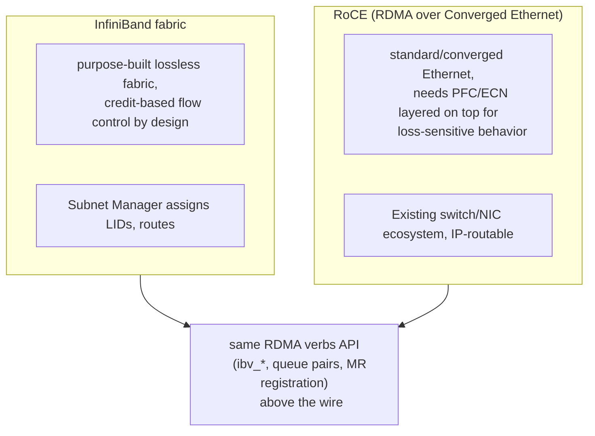

**Learning outcome:** Explain remote memory operations, queue pairs and why loss/congestion configuration matters.


Figure 1. GPUDirect RDMA can shorten the GPU-to-network data path on supported systems.

RDMA enables direct access to registered memory with reduced CPU-copy overhead. InfiniBand is a purpose-built fabric supporting RDMA. RoCE carries RDMA semantics over Ethernet. RoCE deployments require careful fabric design because packet loss/congestion characteristics affect transport behavior; modern designs may use ECN/congestion control and, in some environments, PFC depending on architecture.

Do not memorize "RoCE needs lossless Ethernet" as a sufficient design answer. Ask which RoCE generation/transport, congestion control, switch/NIC design, oversubscription and vendor reference architecture are in use.

```
rdma link
ibv_devinfo
ibstat
# Perftest tools such as ib_write_bw / ib_read_bw may be used in controlled labs.
```

➕ **What "remote memory operations" and "queue pairs" actually mean, mechanically — the chapter names them, this is the model:**

An RDMA **memory region (MR)** is an application buffer that has been registered with the NIC. Registration pins the pages and gives the NIC permission and addressing information to access them. During an RDMA WRITE, node A's NIC transfers data into node B's registered MR without waking node B's CPU to copy that payload.

Compare this with a normal TCP path. Data commonly moves from a user buffer into kernel socket buffers and then to the NIC; receive processing also involves kernel networking work and a CPU wake-up through an interrupt or softirq. RDMA removes those target-side payload copies from the steady-state data path. Control-plane setup still uses the CPUs, but the data movement itself does not require node B's application thread to execute.

This matters for collectives such as AllReduce because every rank exchanges data at every training step. Without the direct path, CPU cycles and memory bandwidth are consumed by copying precisely when the CPU should be preparing the next GPU batch. That extra delay appears as increased `data_load_wait_time` and can stall all ranks at the collective boundary.

➕ **Diagram: InfiniBand vs RoCE — same RDMA semantics, different loss model underneath**

Both give the application the same RDMA programming model from `queue pairs / registered memory` up — the difference this chapter cares about is entirely below that line: InfiniBand's flow control is native to the fabric, while RoCE inherits Ethernet's original best-effort delivery and has to have losslessness (PFC) and/or congestion avoidance (ECN) explicitly engineered back in.

➕ **Sample `ibstat` output, annotated:**
```bash
$ ibstat
CA 'mlx5_0'
CA type: MT4123
Number of ports: 1
Port 1
State: Active ← link is up AND the fabric subnet manager has it joined
Physical state: LinkUp
Rate: 200 ← 200 Gb/s — check this matches the expected NIC generation
Base lid: 12
LMC: 0
SM lid: 1 ← subnet manager's LID — 0 here would mean no SM found
Capability mask: 0x2651e848
Port GUID: 0x946dae0300aabbcc
```
`State: Active` is necessary but not sufficient — it means the physical link and subnet manager join succeeded, it says nothing about error rates, congestion, or whether the *rate* matches what you provisioned for. Always cross-check `Rate` against the NIC's rated speed; a link stuck negotiating at half rate (e.g. 100 instead of 200) will pass every "is it up" check while quietly halving your fabric bandwidth.

➕ **Sample `ib_write_bw` output, annotated (the actual bandwidth-proving command referenced in the original block):**
```
$ ib_write_bw -d mlx5_0 -a --report_gbits <remote_ip>
---------------------------------------------------------------------------------------
 #bytes  #iterations  BW peak[Gb/sec]  BW average[Gb/sec]  MsgRate[Mpps]
 65536      1000         196.42           195.88            0.373683
---------------------------------------------------------------------------------------
```
195.88 Gb/s average against a 200Gb/s rated link is ~98% efficiency — this is your baseline "the fabric itself is healthy" number, measured *before* any collective library or application code enters the picture. Run this pairwise between suspect nodes whenever a distributed job underperforms — it isolates "is the wire fast" from every other layer in Chapter 4's stack.

➕ **Shortcut — the one-line mnemonic for RDMA's whole value proposition, worth saying verbatim in an interview:** *"RDMA moves the copy out of the CPU's software path and into the NIC's hardware path — same data, same network, but the CPU stops being a mandatory stop along the way."*

➕ **Worked scenario — the trap the original text explicitly warns about, worked through:**
> **Situation:** A customer says "our RoCE fabric intermittently drops throughput to near zero under load, but only sometimes — we've confirmed the switches support lossless Ethernet." They ask if enabling PFC everywhere will fix it.
> 1. Push back on the framing exactly as the chapter instructs: "lossless Ethernet supported" is a switch capability claim, not a live configuration fact. Ask: is PFC actually *enabled* on the relevant priority/traffic class end-to-end (every hop, not just the two edge switches)? Is ECN configured, and at what thresholds?
> 2. Blanket-enabling PFC everywhere without ECN is a known anti-pattern: PFC alone (no ECN) reacts only at buffer-full, is per-priority and per-hop (not end-to-end aware), and can cascade into head-of-line blocking / PFC storms across the whole fabric — often the actual cause of "intermittent drop to near-zero," not the absence of PFC.
> 3. Correct diagnostic order: confirm RoCE version (v1 vs v2) and transport in use, confirm ECN marking thresholds are tuned for the actual traffic pattern (not switch defaults built for generic Ethernet), check `ethtool -S`'s pause/ECN counters (Chapter 2) for storm-like patterns (pause counters spiking in bursts correlated with the throughput collapse), then check vendor reference architecture for this specific switch/NIC combination.
> 4. The "fix" is very likely to be *tuning* PFC+ECN interaction (or fixing an asymmetric configuration where one direction has ECN and the other doesn't), not simply "turn PFC on."
> **Interview-ready line:** "'Enable PFC' is not a fabric design — PFC without correctly tuned ECN is a documented cause of the exact congestion collapse it's meant to prevent."

## Practice
➕ 1. A link shows `State: Active` in `ibstat` but the customer reports half the expected bandwidth. List the three fields/tools you'd check next, in order.
➕ 2. Explain to a Kubernetes engineer, using the queue-pair diagram above, why an AllReduce over RDMA doesn't consume target-node CPU the way an equivalent TCP-based AllReduce would.
