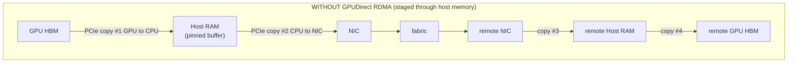
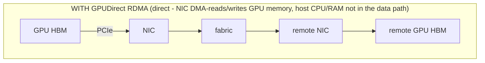
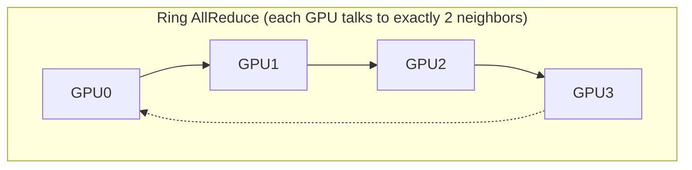
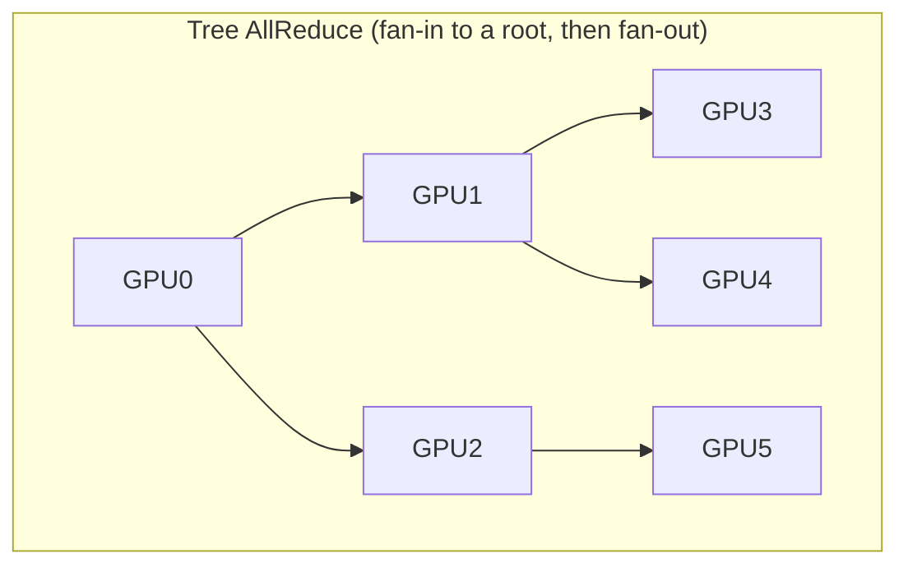

**Learning outcome:** Connect GPU collectives to host topology and fabric evidence.

GPUDirect RDMA allows supported NICs to transfer data directly to/from GPU memory, reducing staging through host memory/CPU. The effective path depends on GPU/NIC PCIe topology and system configuration. NCCL implements GPU collective communication patterns and selects transports/topology based on environment.

```
nvidia-smi topo -m
env | grep -E '^NCCL_'
# NCCL debug is powerful but verbose; enable deliberately in a test/incident window.
export NCCL_DEBUG=INFO
```

➕ **The full data path, with and without GPUDirect RDMA — this is Figure 1's caption made explicit as two diagrams:**


Every eliminated copy in the top diagram is CPU cycles and PCIe bandwidth *not* spent — at collective-communication data rates (hundreds of GB/s aggregate across 8 GPUs), those staging copies would otherwise compete with the exact same PCIe root complex the GPUs use for compute traffic.

➕ **Diagram: NCCL ring vs tree — the two collective topologies NCCL picks between**

bandwidth-optimal at scale, but latency grows with GPU count (N-1 steps to fully reduce-scatter, N-1 more to all-gather)

latency-optimal (O(log N) depth), less aggregate bandwidth per link
NCCL chooses ring vs tree (or a hybrid) automatically based on topology, message size and GPU count — the `nvidia-smi topo -m` table below is exactly the input NCCL uses to decide which links a ring or tree should route over, and why a NUMA-crossing (`SYS`) link showing up in the chosen path is a red flag worth checking with `NCCL_DEBUG=INFO NCCL_DEBUG_SUBSYS=GRAPH`.

➕ **Sample `nvidia-smi topo -m` output, annotated — this is the single most important diagnostic table in this chapter:**
```
$ nvidia-smi topo -m
        GPU0  GPU1  GPU2  GPU3  mlx5_0  mlx5_1  CPU Affinity  NUMA Affinity
GPU0     X    NV12  NV12  NV12   PXB     SYS      0-31            0
GPU1    NV12   X    NV12  NV12   PXB     SYS      0-31            0
GPU2    NV12  NV12   X    NV12   SYS     PXB      32-63           1
GPU3    NV12  NV12  NV12   X     SYS     PXB      32-63           1
mlx5_0   PXB   PXB   SYS   SYS    X       SYS
mlx5_1   SYS   SYS   PXB   PXB   SYS       X

Legend: NV12=NVLink(12 links), PXB=PCIe through host bridge (same NUMA), SYS=crosses NUMA/QPI/UPI
```
Read one NIC column at a time. **GPU0/GPU1 to `mlx5_0` is `PXB`**: their traffic stays beneath the same PCIe host bridge and inside the same NUMA domain. **GPU2/GPU3 to `mlx5_0` is `SYS`**: their traffic crosses the CPU/NUMA interconnect, which is a longer and more expensive path.

Why this matters: each distributed-process **rank** drives a particular GPU. NCCL also chooses a NIC for cross-node traffic. If GPU2 is paired with `mlx5_0`, or if the container's CPU affinity forces work into the wrong NUMA domain, that rank can become slower than its peers. A collective waits for every rank, so one poor GPU–NIC pairing can stretch the whole operation. The matrix tells you what the correct local pairing should look like before you interpret NCCL logs.

➕ **Sample `NCCL_DEBUG=INFO` excerpt, annotated (what "compare NCCL logs" in the worked scenario below actually means in practice):**
```bash
$ NCCL_DEBUG=INFO NCCL_DEBUG_SUBSYS=INIT,NET,GRAPH python train.py
node07:1234:1234 [0] NCCL INFO NET/IB : Using [0]mlx5_0:1/RoCE [RO]; OOB eth0:10.0.4.7<0>
node07:1234:1234 [0] NCCL INFO Channel 00/04 : 0[0] -> 1[1] via P2P/CUMEM
node07:1234:1234 [0] NCCL INFO Channel 00/04 : 0[0] -> 4[0] via NET/IB/0/GDRDMA ← cross-node, GPUDirect RDMA active
node11:5678:5678 [0] NCCL INFO NET/IB : Using [0]mlx5_0:1/RoCE [RO]; OOB eth0:10.0.4.11<0>
node11:5678:5678 [0] NCCL INFO Channel 00/04 : 0[0] -> 4[0] via NET/IB/0/IB ← notice: no GDRDMA suffix here!
```
The second node's channel log is missing the `GDRDMA` marker that the first node has — this single log-line difference means GPUDirect RDMA silently fell back to a staged (host-memory-copy) path on `node11` for that channel, even though both nodes are running identical code. Common causes: a `nv_peer_mem`/`nvidia-peermem` kernel module mismatch, an IOMMU/ACS setting difference on that host, or a BIOS/PCIe topology difference introduced by a hardware swap — exactly the kind of node-level asymmetry the Chapter 4 worked scenario below is built around, and precisely why "compare NCCL logs node-by-node" is step 3, not step 1 (you need the topology table first to know what a *correct* log should say for that node).

➕ **Shortcut — grep for the one thing that tells you GPUDirect RDMA actually engaged, without reading the whole log:**
```bash
NCCL_DEBUG=INFO NCCL_DEBUG_SUBSYS=NET python train.py 2>&1 | grep -o 'via [A-Z/]*' | sort | uniq -c
#   48 via NET/IB/0/GDRDMA   ← healthy — most cross-node channels using GPUDirect RDMA
#    2 via NET/IB/0/IB       ← these 2 fell back to staged path — investigate these specific channels/nodes
```

## Worked scenario
**Situation:** A 32-GPU distributed training job slows after one node replacement.

1. Compare the replacement node hardware, NIC/GPU topology, driver/firmware and link speed with peers.
2. Check RDMA link/counters and switch-side errors/drops/congestion for paths involving that node.
3. Compare NCCL logs/collective benchmark performance node-by-node.
4. Check CPU/NUMA affinity and PCIe link width/speed.
5. Remove/replace the node in a controlled test to verify causal impact.

**Conclusion:** A single topology/fabric outlier can slow synchronized distributed work.

➕ **Extended version, with the exact commands for each of the five steps:**
> 1. `nvidia-smi topo -m` on the replacement node **and** a healthy peer, diffed side by side — a hardware swap that changed PCIe slot assignment will show up here as a different NV-link/PXB/SYS pattern immediately, before touching the network at all.
> 2. `ibstat` + `ethtool -S <iface> | egrep -i 'drop|pause|ecn|error'` on the replacement node specifically, compared against the same on two healthy peers — asymmetric error counters localize a bad cable/transceiver/port that "the link is up" alone would hide.
> 3. `NCCL_DEBUG=INFO NCCL_DEBUG_SUBSYS=NET` grep for `GDRDMA` as shown above — a node silently missing GPUDirect RDMA on some channels is a very common outcome of a node replacement (new node, old driver/kernel-module version, or BIOS default reset an IOMMU/ACS setting).
> 4. `numactl --hardware` and `lspci -vvv | grep -A5 <NIC PCI address>` — confirm PCIe link is negotiated at full width/speed (`LnkSta: Speed 16GT/s, Width x16` and not a degraded `x8` or `8GT/s` — a reseated card or dirty slot can silently downgrade this).
> 5. Pull the node from the job (or run `ib_write_bw`/`nccl-tests` pairwise against it in isolation) and re-measure — this converts "we think it's this node" into "removing this node restored throughput," which is the causal proof a customer or postmortem needs.
> **Interview-ready line:** "One straggler node doesn't just run slow itself — at a synchronization barrier, everyone waits for it, so a 5% local slowdown on one of 32 nodes can look like a 100% job-wide slowdown if it's bad enough to blow past a collective timeout."

## Practice
➕ 1. Given the `nvidia-smi topo -m` table above, which NIC (`mlx5_0` or `mlx5_1`) should a process pinned to GPU2 use for cross-node traffic, and why does using the other one matter for latency even though both NICs are technically reachable?
➕ 2. You grep NCCL logs for `GDRDMA` and find zero matches across the *entire* job, not just one node. What does that tell you versus the single-node case in the worked scenario, and what would you check first (hint: this points at something cluster-wide, not node-specific — e.g. a missing kernel module in the base image or container).
