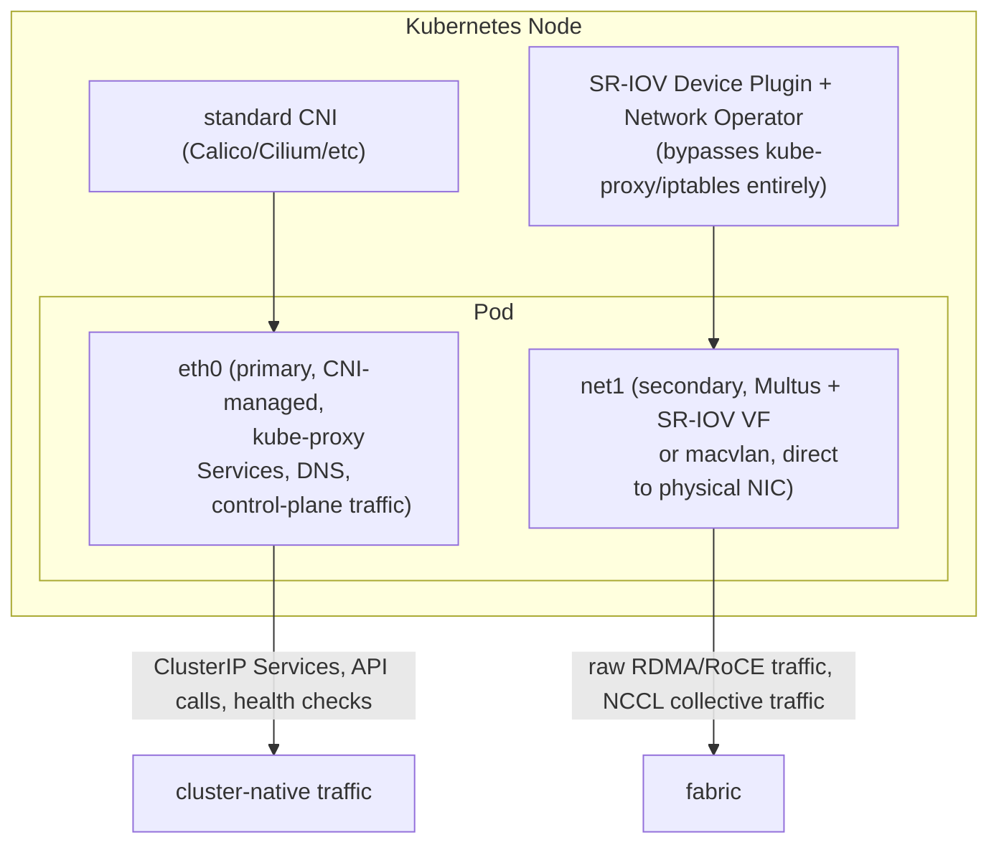
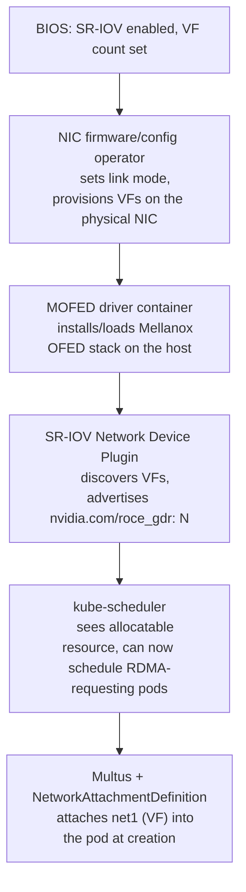

**Learning outcome:** Understand the software automation layer that prepares nodes for high-performance network devices and secondary networks.

Network Operator automates deployment/configuration of networking components such as drivers, device plugins and CNI-related pieces for supported accelerated networking patterns. GPU Operator and Network Operator address different device stacks but may work together for GPU workloads requiring GPUDirect RDMA.

Kubernetes primary Pod networking may remain conventional while workloads receive additional high-performance interfaces via Multus/SR-IOV patterns. The design must define which traffic uses which network and how identity/policy/observability work across both.

➕ **The "two networks per pod" architecture, drawn out — this is the mental model the original two paragraphs are describing:**

This is the concrete answer to "how do RDMA and Kubernetes coexist": they don't share a network — the primary CNI network handles everything Kubernetes-native (Service discovery, policy, observability agents), while the secondary SR-IOV/Multus network gives the training process a near-bare-metal path to the physical NIC, deliberately *outside* the overlay/iptables/kube-proxy path that would otherwise add latency and defeat GPUDirect RDMA entirely.

➕ **What Network Operator actually deploys — the component list the original paragraph names abstractly ("drivers, device plugins, CNI-related pieces"), made concrete:**
| Component | Role |
|---|---|
| MOFED driver container | Installs/manages the Mellanox OFED driver stack on the host, in-cluster, without a host-level package install |
| SR-IOV Network Device Plugin | Discovers NIC virtual functions (VFs) and advertises them as schedulable Kubernetes resources (e.g. `nvidia.com/roce_gdr` style resource names) |
| Multus CNI | Lets a Pod attach more than one network interface — the primary CNI network plus one or more secondary NetworkAttachmentDefinitions |
| RDMA shared/exclusive device plugin | Exposes RDMA devices (`/dev/infiniband/*`) into containers with the correct capability |
| NIC firmware/configuration operator pieces | Ensures link mode, VF count and firmware version match the reference architecture across the fleet |

➕ **Diagram: Network Operator's resource-provisioning flow, bare node to schedulable RDMA resource**

Each stage is a separate failure domain — `nvidia.com/roce_gdr: 0` almost always traces back to the top of this chain (BIOS/firmware) or a crash-looping device plugin, not to Kubernetes scheduling itself, which is why the triage in the Practice question below works top-down.

➕ **Sample evidence a node is correctly prepared — the commands you'd actually run against a Network-Operator-managed node:**
```bash
$ kubectl get node gpu-node-07 -o json | jq '.status.allocatable' | grep -i rdma
'nvidia.com/roce_gdr': '8' ← 8 RDMA-capable VFs advertised as allocatable
$ kubectl describe node gpu-node-07 | grep -A3 'nvidia.com/roce_gdr'
nvidia.com/roce_gdr 8 8
← Allocatable matches Capacity: none already claimed
$ kubectl get network-attachment-definitions -A
NAMESPACE NAME AGE
training roce-net-1 14d
```
If `nvidia.com/roce_gdr` shows `0` allocatable on a node that otherwise looks healthy, the fault is almost always upstream of Kubernetes entirely — SR-IOV not enabled in BIOS, VF count not configured on the physical NIC, or the device plugin DaemonSet crash-looping — checking `kubectl get pods -n network-operator` for the device plugin's pod status is the fastest triage step.

➕ **Worked scenario — the identity/policy/observability gap the original text flags but doesn't resolve:**
> **Situation:** A security team asks "what NetworkPolicies apply to this training job's RDMA traffic?" during a compliance review.
> 1. The honest answer, and the one a Senior SA should give without flinching: **NetworkPolicy (Calico/Cilium-enforced) governs the primary CNI network only.** Traffic over the SR-IOV secondary interface bypasses the CNI's packet path entirely — it goes straight to the physical NIC/VF — so standard `NetworkPolicy` objects do not see or filter it.
> 2. Isolation for the RDMA network instead has to come from a different layer: VLAN/subnet segmentation on the physical fabric, VF-level configuration (trusted VF, spoof-check), or the fabric's own access control (partition keys on InfiniBand) — none of which show up in `kubectl get networkpolicy`.
> 3. Observability has the same gap: a service mesh sidecar or CNI-level flow log sees zero packets of the actual training traffic, because it never enters that path. Utilization/error monitoring for the RDMA network has to come from `ethtool`/`ibstat`/fabric telemetry (Chapters 2-4), not from Kubernetes-native network observability tooling.
> **Interview-ready line:** "Kubernetes NetworkPolicy secures the control-plane and service network — it has no visibility into an SR-IOV/RDMA secondary network by design, because that network is deliberately bypassing the CNI's enforcement path for performance. Compliance and observability for that traffic have to be designed at the fabric layer, not the Kubernetes layer."

➕ **Shortcut — one-liner to check whether GPU Operator and Network Operator are both healthy and actually cooperating on a node:**
```bash
kubectl get pods -n gpu-operator --field-selector=status.phase!=Running 2>/dev/null
kubectl get pods -n network-operator --field-selector=status.phase!=Running 2>/dev/null
# a second -n does not merge namespaces — it just overrides the first, so query each namespace separately
# empty output on both = both operator stacks are fully reconciled on this node; anything listed is your starting point
```

## Practice
➕ 1. Explain to an application team why their `NetworkPolicy` allowing traffic only from a specific namespace does not restrict RDMA traffic between their training pods on the secondary network.
➕ 2. A node shows `nvidia.com/roce_gdr: 0` allocatable. List the three layers (BIOS/firmware, device plugin, Kubernetes scheduling) you'd check, in the order that finds the root cause fastest.

## Targeted references

[NVIDIA Network Operator technical blog](https://developer.nvidia.com/blog/streamlining-kubernetes-networking-in-scale-out-gpu-clusters-with-the-new-nvidia-network-operator-1-0/) - Operator component model, accelerated network modes and GPUDirect context.
