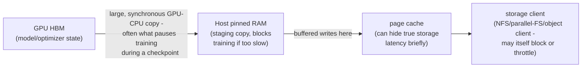
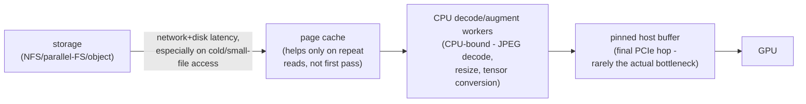
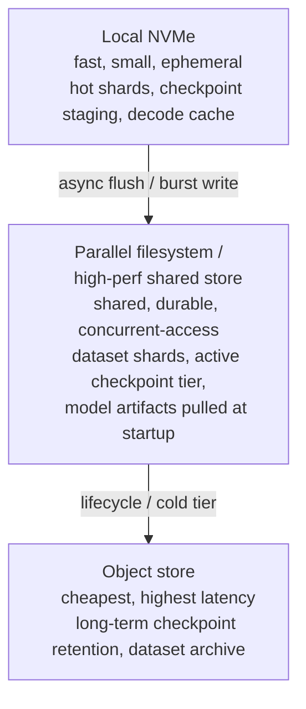

**Learning outcome:** Design storage by access pattern, concurrency, locality and recovery behavior.

| Pattern | Infrastructure concern |
|---|---|
| Millions of small files | metadata operations, directory traversal, client concurrency |
| Large sequential dataset shards | aggregate throughput and client parallelism |
| Frequent checkpoints | write bursts, durability, checkpoint time, restart path |
| Model startup | artifact size, cache locality, parallel pulls, cold-start SLO |
| Vector/RAG stores | query latency, index durability, update pattern |

Parallel filesystems and high-performance object/file layers are common in AI/HPC, but no product name removes the need to measure the workload. Cache/local NVMe can absorb hot artifacts or preprocessing, while durable shared storage provides persistence. Model startup can become a fleet-wide network/storage event during scale-out.

## Worked scenario
**Situation:** GPU utilization oscillates: 100% for a few seconds, then near zero while training continues.

1. Compare GPU duty cycle with data-loader and storage metrics.
2. Measure step timeline: does the idle interval align with batch fetch/preprocessing?
3. Check CPU worker saturation, page cache behavior and storage latency/throughput.
4. Test larger prefetching/local cache or dataset sharding in a controlled run.
5. Only after data supply is ruled out should you focus on GPU kernel inefficiency.

**Conclusion:** Starved GPUs can be a storage/CPU input-pipeline problem.

➕ **The checkpoint-write path, drawn out — this is the "frequent checkpoints" row of the table, as a mechanism:**

The oscillation pattern in the worked scenario's "Situation" (100% then near-zero) has *two* structurally different root causes that share a symptom, and this diagram plus the dataset-loading diagram below are how you tell them apart: a **checkpoint stall** is periodic at a fixed step interval (matches your `--save_every_n_steps` config exactly) and blocks the GPU for the *entire* checkpoint duration; a **dataloader stall** (below) is periodic at the batch/shard boundary and is usually shorter and more frequent. Confusing the two sends you tuning the wrong subsystem.

➕ **The dataset-fetch path — the other half of the oscillation, and the more common root cause per the worked scenario's conclusion:**

The single highest-value diagnostic in this whole chapter: **capture GPU duty cycle on the same time axis as dataloader worker queue depth.** If the queue depth hits zero right before every GPU idle period, workers aren't producing batches fast enough — that's a CPU/storage-throughput problem, not a GPU problem, and matches step 5 of the worked scenario exactly ("only after data supply is ruled out should you focus on GPU kernel inefficiency").

➕ **Sample annotated evidence — the artifacts you'd actually gather for the worked scenario, in order:**

```mermaid
flowchart TD
  %% Converted from the original ASCII diagram; source wording is preserved.
  n0["$ nvidia-smi dmon -s u -c 5"]
  n1["# gpu sm mem enc dec"]
  n2["0 98 91 0 0 ← healthy window"]
  n3["0 3 2 0 0 ← near-zero: this is the 'near zero' half of the oscillation"]
  n4["0 4 1 0 0"]
  n5["0 97 90 0 0 ← back to healthy — total idle span ~2 samples ≈ matches batch-fetch interval"]
  n6["0 98 92 0 0"]
  n7["$ iostat -x 1 3 (during the SAME idle window)"]
  n8["Device r/s rkB/s await %util"]
  n9["nvme0n1 12400 198400 0.31 88% ← storage IS busy — this is doing real work, not sitting idle"]
```

The combination — GPU idle *and* storage busy, on the same timestamp — is the smoking gun for "data supply problem," and it's the specific evidence the worked scenario's step 1 ("compare GPU duty cycle with data-loader and storage metrics") is asking you to produce. GPU idle with storage *also* idle instead points at CPU-side decode/augmentation (check `mpstat`/per-core CPU, not storage) or a dataloader worker-count misconfiguration, not the storage layer at all — this distinction is worth stating explicitly, since "storage" gets blamed by default far more often than the evidence supports.

➕ **Diagram: the storage hierarchy this chapter's table maps onto, with the checkpoint burst path highlighted**

Checkpoint burst path: GPU HBM to local NVMe (fast absorb) to parallel FS (durable) to object store (archive)
The local-NVMe hop is what lets a checkpoint's synchronous GPU-blocking write (top diagram, above) finish fast — the slower parallel-FS/object hops then happen asynchronously in the background, off the training-loop critical path. Skipping the NVMe tier and writing checkpoints straight to the shared/durable tier is a common cause of checkpoint stalls growing as cluster size increases and shared-storage write concurrency rises.

➕ **Model-startup as a fleet-wide event — the row the table names but doesn't quantify:**
> **Situation:** A 512-GPU inference deployment restarts simultaneously (rolling upgrade, or a bad node pool-wide event). Each node pulls the same 40GB model artifact from shared storage/registry at once.
> 512 nodes × 40GB = 20TB of near-simultaneous read demand against one storage backend/registry, in a burst measured in seconds-to-minutes, not the steady-state read pattern that backend was likely benchmarked against. This is structurally identical to a "thundering herd" cache-stampede problem, just at the storage layer instead of the application-cache layer.
> Mitigations, with the tradeoff each one makes explicit: (a) P2P/BitTorrent-style artifact distribution across nodes (e.g. Kraken, Dragonfly) — trades storage-backend load for node-to-node network load and added complexity; (b) staggered/rolling restart with a concurrency cap — trades total rollout time for reduced peak load; (c) local NVMe caching of the artifact with a warm-standby pool — trades storage capacity/cost for eliminated repeat-pull cost, but only helps repeat startups, not the first cold fleet-wide pull.
> **Interview-ready line:** "Model startup at fleet scale isn't a storage-capacity problem, it's a storage-concurrency problem — the artifact easily fits, the simultaneous fan-out of identical reads is what breaks the SLO."

➕ **Named storage technologies: Lustre, GPFS, ZFS and when each actually fits**

The table above deliberately talks in terms of access pattern rather than product name, but a senior interview will still ask you to name real systems and say what's actually different about them — not just that they're "parallel filesystems."

| Technology | What it actually is | The distinguishing mechanism | Where it fits from the table above |
|---|---|---|---|
| **Lustre** | A POSIX parallel filesystem that separates metadata servers (MDS/MDT) from object storage servers (OSS/OST) | Metadata operations (open/create/unlink/stat) and data throughput are served by *physically separate* components — a workload can be metadata-bound (MDS saturated) while OST bandwidth sits nearly idle, or vice versa. This split is the whole reason "Lustre feels slow" needs its own diagnosis discipline: check `lctl get_param mdt.*.md_stats` for metadata-op rate separately from `lfs df -h` for OST bandwidth headroom — they are genuinely different bottlenecks, not two views of one number. | Millions of small files (metadata-bound) and large sequential shards (OST-bound) are Lustre's two classic, opposite-shaped failure modes on the *same* filesystem. |
| **GPFS (IBM Spectrum Scale)** | A POSIX parallel/clustered filesystem with a distributed metadata model and its own quorum/token-management layer for cluster coordination | Unlike Lustre's dedicated MDS, GPFS distributes metadata management across cluster nodes and depends on cluster *quorum* to keep the filesystem coherent — losing quorum during a rolling maintenance window can stall the whole filesystem, not just the node being maintained, which is a fundamentally different failure shape from a Lustre MDS bottleneck. | Frequent checkpoints and large sequential shards both depend on GPFS's token/lock-manager staying healthy across the whole cluster, which is why a GPFS incident often looks cluster-wide even when only one storage node triggered it. |
| **ZFS** | A copy-on-write filesystem with integrated volume management (pools of vdevs), block-level checksumming, and snapshots — usually deployed as *local or NAS-attached* storage, not a distributed parallel filesystem the way Lustre/GPFS are | Copy-on-write means a write never overwrites live data in place — it writes to a new block and atomically repoints, which is what makes cheap, instant snapshots and strong corruption resistance (every block is checksummed, not just metadata) possible. The cost is write amplification and a strong dependency on the ARC (Adaptive Replacement Cache, ZFS's own RAM cache) for read performance — an undersized ARC on a ZFS-backed node-local NVMe cache tier can look like a "slow disk" problem that's actually a cache-sizing problem. `zpool status` shows pool/vdev health; `zpool iostat -v 1` shows per-vdev latency; `arc_summary` (or `/proc/spl/kstat/zfs/arcstats`) shows whether the ARC is actually absorbing reads. | ZFS is the natural fit for the table's "local sequential dataset shards" and "checkpoint staging" rows specifically because of the diagram above — it is exactly the *local NVMe fast-absorb tier* underneath a checkpoint burst, not a replacement for the shared parallel-FS/object tiers above it. |

**Interview-ready line:** "Lustre and GPFS both split or distribute metadata to scale a shared, POSIX-compliant filesystem across many clients — the difference is *how* they coordinate metadata, which is exactly where each one's distinct failure mode lives. ZFS solves a different problem entirely: it's copy-on-write, snapshot-friendly, checksummed local storage, which is why it shows up as the fast local tier underneath a parallel filesystem, not as a competitor to it."

For a deeper look at the local-disk mechanics ZFS sits on top of (block devices, the filesystem layer, mounts, and the local-vs-shared-storage distinction generally), see **Volume 1, Chapter 3**'s Foundations section — this chapter builds on that mental model rather than re-deriving it.

➕ **Shortcut — the one question that separates all five rows of the pattern table, fast, in an interview:** *"Is the bottleneck bytes-per-second, operations-per-second, or simultaneous-clients? Small files = ops/sec (metadata), sequential shards = bytes/sec (throughput), checkpoints = sustained write bytes/sec + durability, model startup = simultaneous-clients (fan-out), vector/RAG = ops/sec at low latency (not throughput)."* Naming which of the three dominates for a given pattern is the fast way to pick the right storage design lever without reciting product names.

➕ **Additional practice for this chapter (the original Fourth Edition Practice section appears once, after Chapter 8):**
➕ 1. Given `nvidia-smi dmon` showing GPU idle and `iostat` showing storage also idle during the same window (not busy), name the two most likely root causes and the single command you'd run next to distinguish between them.
➕ 2. Design the artifact-distribution strategy for a 1,024-node inference fleet restart, given a 60-second cold-start SLO and a 25GB model — state which mitigation from the model-startup scenario above you'd pick first and why.
