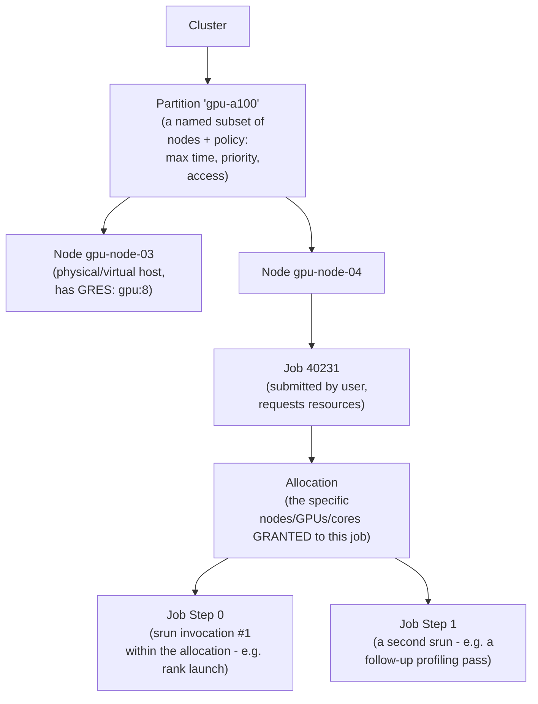
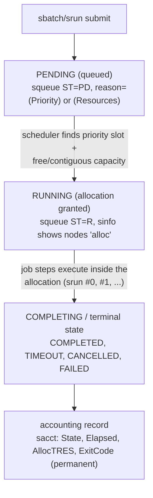

**Learning outcome:** Understand jobs, allocations, partitions, nodes and why HPC schedulers optimize a different operating model from general service orchestration.

Slurm allocates resources to batch/interactive jobs across partitions and nodes, with scheduling priorities, reservations, topology and accounting features suited to HPC. Users submit jobs; the scheduler grants allocations; launch tools start tasks. The natural unit is often a job requiring a coordinated set of resources rather than a long-lived microservice.

```
sinfo
squeue
scontrol show node <node>
scontrol show job <jobid>
sacct -j <jobid> --format=JobID,State,Elapsed,AllocTRES,ExitCode
```

➕ **The Slurm object model, drawn out — "jobs, allocations, partitions, nodes" as a hierarchy:**

The distinction worth being precise about in an interview: a **job** is a request + accounting record; an **allocation** is the concrete resource grant; a **step** is one execution *within* that grant. A single job can run multiple steps sequentially or concurrently inside one allocation — this is how a Slurm job can, e.g., run a short data-staging step and then the main multi-hour training step without releasing and re-requesting the allocation in between.

➕ **Diagram: the Slurm job lifecycle — submit through accounting**

`squeue` only shows the PENDING/RUNNING window — once a job leaves that window it disappears from `squeue` and the only record left is `sacct`, which is why `TIMEOUT` vs `FAILED` vs `CANCELLED` (all invisible to squeue after the fact) has to be read from accounting, not from the live queue.

➕ **Sample `sinfo` output, annotated:**
```bash
$ sinfo
PARTITION AVAIL TIMELIMIT NODES STATE NODELIST
gpu-a100* up 7-00:00:0 6 idle gpu-node-[01-06]
gpu-a100* up 7-00:00:0 2 alloc gpu-node-[07-08]
gpu-a100* up 7-00:00:0 1 drain gpu-node-09 ← taken out of scheduling, NOT down
gpu-h100 up 3-00:00:0 4 idle gpu-node-[10-13]
```
`drain` is the state to know cold: the node is still up and reachable, but Slurm will not schedule new jobs on it — usually set deliberately (pending maintenance, or a prolog script failed and auto-drained it per Deep Dive 5). This is different from `down` (unreachable/failed) and different from `alloc` (fully busy but healthy) — conflating "drain" with "broken" is a common junior-engineer mistake this table should immunize you against.

➕ **Sample `squeue` output, annotated:**
```bash
$ squeue
JOBID PARTITION NAME USER ST TIME NODES NODELIST(REASON)
40231 gpu-a100 llm-pt-8b jdoe R 3:12:08 8 gpu-node-[01-08]
40255 gpu-a100 eval-run asmith PD 0:00 2 (Priority) ← pending, lower priority
40256 gpu-a100 big-sweep bchen PD 0:00 16 (Resources) ← pending, not enough free nodes
```
`ST=PD` with reason `(Priority)` versus `(Resources)` is a genuinely different answer to "why is my job not running yet" — `(Priority)` means capacity exists but a higher fair-share/priority job is ahead of you in queue; `(Resources)` means there is not currently enough free capacity for your request, full stop, regardless of priority. Telling a customer/user the wrong one of these is a common support miss.

➕ **Sample `scontrol show job` and `sacct` output, annotated (the accounting/forensics half of the toolset):**
```bash
$ scontrol show job 40231 | grep -E 'JobState|Reason|NodeList|TRES'
JobState=RUNNING Reason=None
NodeList=gpu-node-[01-08]
TRES=cpu=64,mem=512G,gres/gpu=8,node=8
$ sacct -j 40199 --format=JobID,State,Elapsed,AllocTRES,ExitCode
JobID State Elapsed AllocTRES ExitCode
40199 TIMEOUT 7-00:00:00 cpu=64,gres/gpu=8 0:0 ← ran to its wall-clock limit, was killed — NOT a crash
40199.0 CANCELLED 6-23:58:41 cpu=64,gres/gpu=8 0:0
```
`State=TIMEOUT` with `ExitCode=0:0` is a specific, important pattern: the job's own code never returned a nonzero exit — it was still healthy and running when Slurm's wall-clock limit killed it. This is a scheduling/checkpoint-cadence problem ("your job needs more wall time, or needs to checkpoint more often so a restart doesn't waste 7 days"), not an application-crash problem — and `sacct` is the only place this distinction is visible after the fact, since the live job is already gone by the time anyone investigates.

➕ **Shortcut — the one-line answer for "why is Slurm different from a Kubernetes-style scheduler" worth having ready:** *"Kubernetes schedules independent, restartable units against a continuously-reconciled desired state; Slurm schedules a coordinated, often-gang, often wall-clock-bounded allocation against a queue — the natural unit is 'this job gets these N nodes for this long,' not 'keep this replica count running forever.'"*

➕ **Worked scenario — combining these tools to explain a stuck queue:**
> **Situation:** A researcher asks why their 16-node job (`40256` above) has been `PD` for six hours on a partition that "looks empty in the dashboard."
> 1. `squeue` shows reason `(Resources)` — not priority. So it genuinely is a capacity question, not a fairness one.
> 2. `sinfo` shows only 6 nodes `idle` in that partition, but the job needs 16 — the "looks empty" dashboard was probably showing aggregate GPU utilization percentage, not free *node count*, and 6 idle nodes out of, say, 9 total can look like "mostly idle" while still being short of 16.
> 3. `scontrol show node <one of the alloc nodes>` confirms those 2 nodes are legitimately allocated to job `40231`, which per `squeue` has 3+ hours of an unknown total wall-clock remaining.
> 4. Answer to the researcher: the partition is capacity-constrained for a job of this size specifically, not broken — options are wait, request a smaller node count, or ask whether `40231` has a bounded remaining time you can plan around via `scontrol show job 40231`'s `EndTime` field.
> **Interview-ready line:** "A queue looking 'mostly idle' on a utilization dashboard and a queue having enough *free, contiguous* capacity for a specific job's request are different claims — gang-scheduled HPC jobs need N whole nodes, not N/total percent."

## Practice
➕ 1. Explain the difference between a Slurm job, an allocation, and a job step to someone who only knows Kubernetes Pods and Deployments.
➕ 2. Given `sacct` showing `State=TIMEOUT ExitCode=0:0` for a training job, write the one-sentence diagnosis and the one operational recommendation you'd give the researcher.
