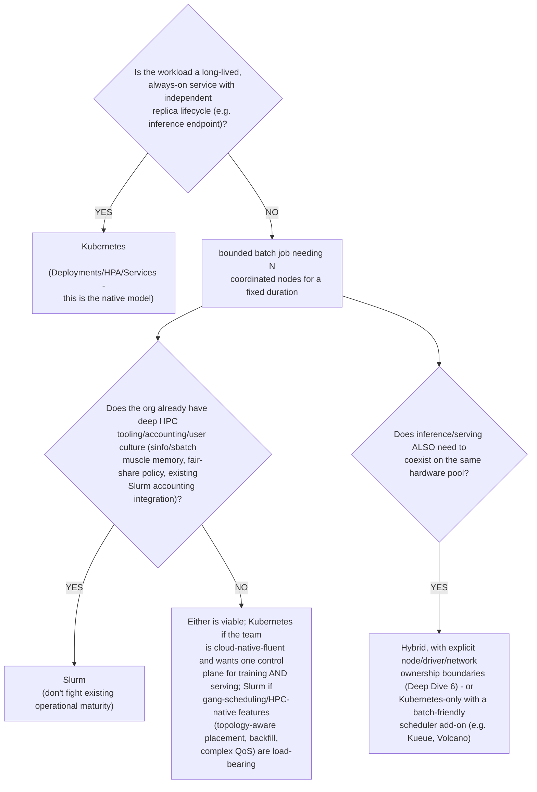
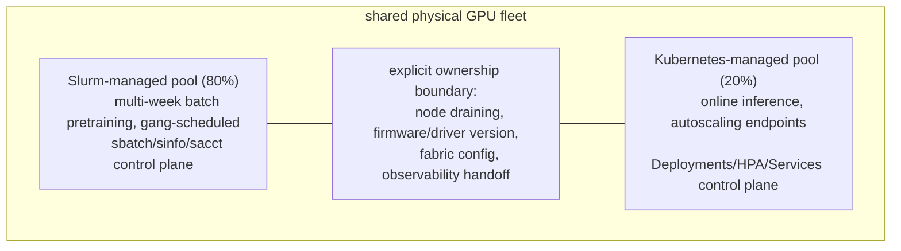

**Learning outcome:** Choose orchestration by workload and operating model, not by platform loyalty.

| Dimension | Kubernetes strength | Slurm strength |
|---|---|---|
| Long-lived services | native Deployments/Services/operators | not primary design center |
| Batch HPC jobs | possible via jobs/operators | core scheduling model |
| Application ecosystem | cloud-native service/platform ecosystem | HPC job ecosystem/tooling |
| GPU gang/coordinated jobs | requires scheduler/operator patterns | native HPC allocation concepts |
| Platform self-service/API extensibility | CRDs/operators/GitOps | HPC workflow/accounting integration |

Hybrid environments can integrate the two, but integration adds lifecycle and ownership questions. A Solutions Architect should discover which workloads, teams and operational processes must be preserved before recommending consolidation.

**The decision table above, converted into a decision tree you can actually walk an interviewer through:**

This tree is the practical version of "choose by workload and operating model, not platform loyalty" — the first branch point is workload *shape* (long-lived vs bounded), the second is organizational *maturity*, not a feature checklist comparison.

**Diagram: the 80/20 hybrid fleet from the worked scenario below, with the ownership boundary drawn**

The boundary in the middle is not a technical detail to skip — it is the thing Deep Dive 6 spends its whole length on: without an explicit answer to "who drains a node, and does it require coordinating both control planes," a shared fleet quietly becomes two teams fighting over the same hardware.

**Worked scenario — the exact question a Senior SA gets asked in a real deal cycle:**
> **Situation:** A customer runs 80% batch LLM pretraining (large, multi-week jobs, dedicated GPU pool) and 20% online inference (many small, latency-sensitive endpoints, needs autoscaling) on the same physical GPU fleet, and asks "should we migrate our Slurm training estate to Kubernetes so we only maintain one platform?"
> 1. Resist the premise that "one platform" is automatically the right goal — ask what operational pain "two platforms" is actually causing today (if the honest answer is "none, we just heard Kubernetes is more modern," that's not a technical requirement).
> 2. Name the real tradeoff precisely: consolidating onto Kubernetes-only means re-implementing gang-scheduling, backfill, fair-share, and topology-aware placement that Slurm already provides natively — via Kueue/Volcano/a custom operator — which is real engineering investment, not a checkbox migration.
> 3. Conversely, staying dual-platform means solving the *hybrid* ownership questions from Deep Dive 6 explicitly: who owns node draining/firmware updates, how does the fabric config differ (if at all) for Slurm-managed vs Kubernetes-managed nodes, and is there a shared node pool or a hard partition between the two.
> 4. A defensible recommendation for this specific 80/20 split: keep Slurm for the 80% batch pretraining (it's the workload Slurm is designed for, and disrupting a working multi-week-job pipeline for platform purity is high risk, low reward), run the 20% inference on Kubernetes (it's the workload Kubernetes is designed for), and invest the migration effort instead in *clean node-pool boundaries and shared observability* between the two — solving the actual pain (if any) without a wholesale platform swap.
> **Interview-ready line:** "Consolidation should follow demonstrated operational pain, not platform preference — and '80% of our workload already runs well on the scheduler built for it' is a strong prior against migrating that 80%."

**Shortcut — mnemonic for the whole chapter, worth saying as an opener to this exact interview question:** *"Kubernetes is a control plane for things that should keep running; Slurm is a control plane for things that should run once, to completion, with a queue. Ask which one your workload is before asking which platform is 'better.'"*

## Practice
1. Explain RDMA to a Kubernetes engineer using the data path rather than protocol jargon.
2. List five checks for a suspected RoCE performance issue.
3. Design a storage benchmark that resembles model startup rather than training reads.
4. Compare Kubernetes and Slurm for an organization with 80% batch training and 20% online inference.

5. A customer with a healthy, working Slurm estate for 100% batch training asks whether they should add Kubernetes purely to get GitOps-style declarative deployment for their (currently manually-scripted) job submission pipeline. Using this chapter's decision tree, explain why this is a different question from "should we migrate off Slurm," and what you'd actually recommend.
6. Using Chapter 7's `sacct State=TIMEOUT` pattern and this chapter's decision tree, explain why a bounded-wall-clock, checkpoint-and-resume batch job is a worse fit for a naive Kubernetes Deployment (which assumes indefinite restart-forever semantics) than for Slurm — and what Kubernetes-native construct (Job, not Deployment) closes most of that gap.

## Targeted references

[NVIDIA Kubernetes technical blog](https://developer.nvidia.com/blog/tag/kubernetes/) - Includes recent 2026 Slurm/Kubernetes and GPU cluster validation material.

[NVIDIA Network Operator](https://docs.nvidia.com/networking/display/cokan10) - Use current docs for supported configurations; verify release/version in your environment.
